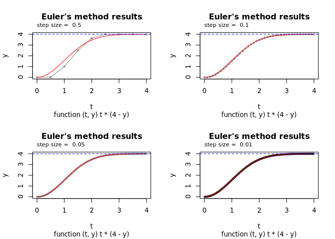
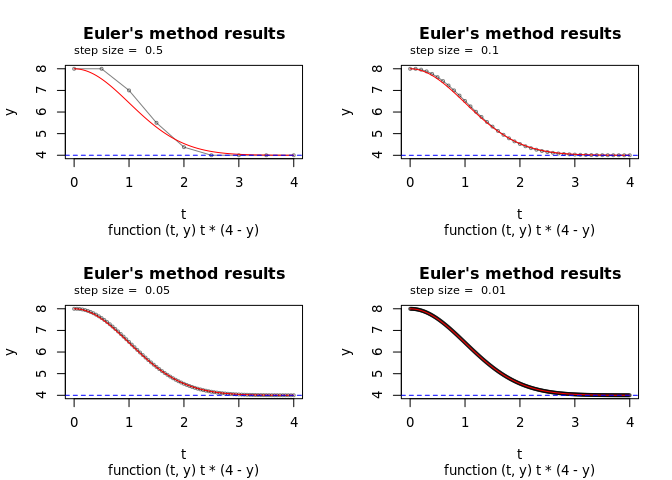
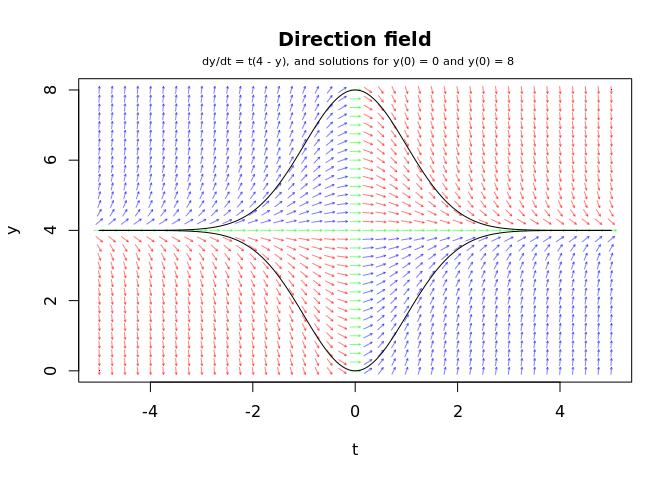
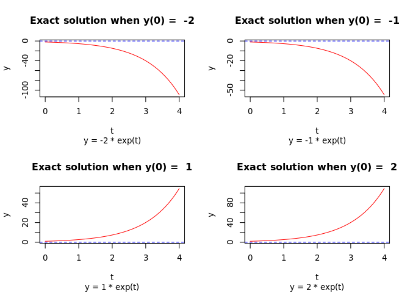
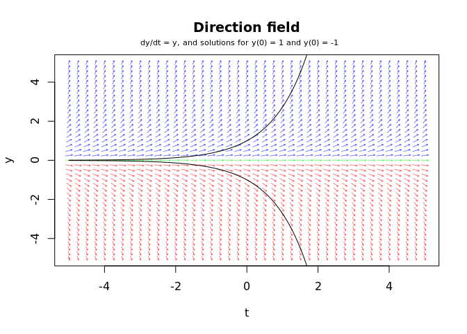
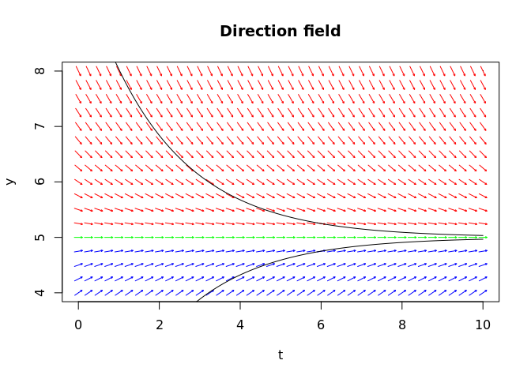
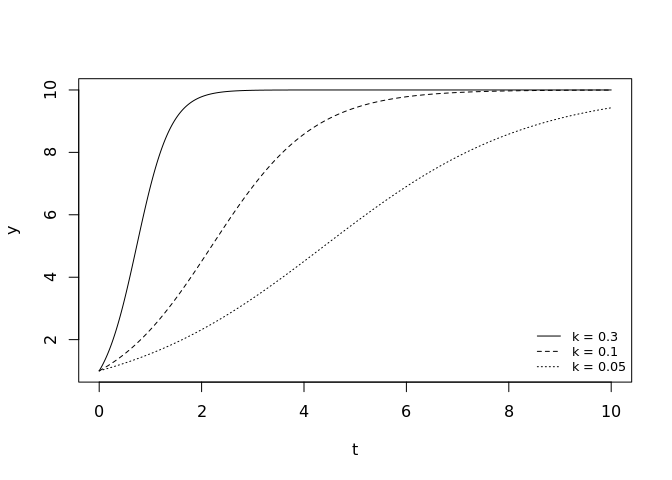
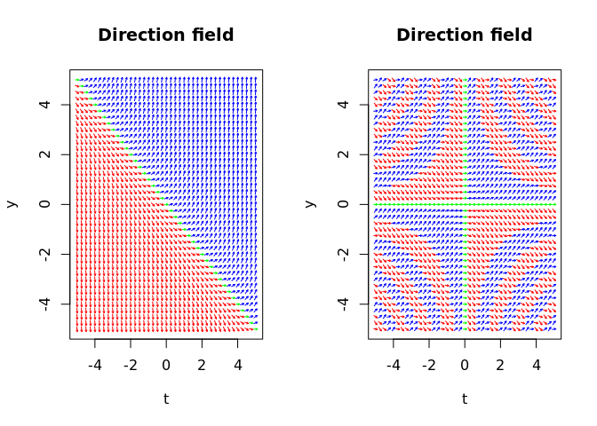
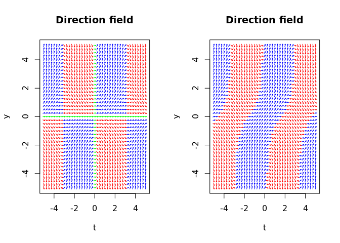
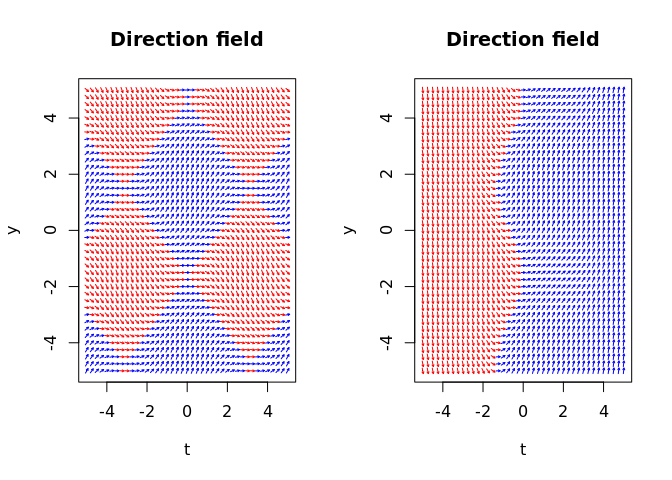

# Intro to Differential Equations
H Elliott

- [Intro to Differential Equations](#intro-to-differential-equations)
  - [Separable equations, Euler’s method, and direction
    fields](#separable-equations-eulers-method-and-direction-fields)
- [Euler’s method function](#eulers-method-function)
- [Example 1](#example-1)
- [Example 2](#example-2)
- [Some first-order ODEs and their direction fields from
  applications](#some-first-order-odes-and-their-direction-fields-from-applications)
  - [Newton’s law of cooling or
    heating](#newtons-law-of-cooling-or-heating)
  - [Infection in a population](#infection-in-a-population)
  - [Some random direction fields](#some-random-direction-fields)

# Intro to Differential Equations

## Separable equations, Euler’s method, and direction fields

Some basic examination of differential equations and their solutions.

Also a brief demonstration of Euler’s method for approximation of
solutions.

# Euler’s method function

``` r
#' Perform Euler's method to approximate the solution to an initial value problem
#' 
#' @param f The function defining the differential equation dy/dt = f(t, y), with
#'     signature `function(t, y)`
#' @param y0 The initial value of y at t0
#' @param t0 The initial value of t
#' @param t1 The final value of t
#' @param h The step size to take from t0 to t1
eulers <- function(f, y0, t0, t1, h) {
    t <- seq(t0, t1, by = h)
    y <- numeric(length(t))
    y[1] <- y0
    t[1] <- t0
    for (i in 2:length(t)) {
        y[i] <- y[i - 1] + h * f(t[i - 1], y[i - 1])
    }
    return(list(t = t, y = y, f = f, y0 = y0, t0 = t0, t1 = t1, h = h))
}
```

<details>
<summary>Code</summary>

``` r
# plotting functions
plot_eulers <- function(eulers_result, true_f = NULL, legend_pos = "topleft") {
    plot(eulers_result$t, eulers_result$y,
         type = "p", cex = 0.5, col = rgb(0, 0, 0, 0.5),
         main = "Euler's method results",
         sub = paste(deparse(eulers_result$f), collapse = ""),
         xlab = "t", ylab = "y")
    lines(eulers_result$t, eulers_result$y, col = rgb(0, 0, 0, 0.5))
    if (! is.null(true_f)) {
        tlin <- seq(res$t0, res$t1, by = 0.01)
        lines(tlin, true_f(tlin), col = "red")
    }
    if (legend_pos != "none") {
        legend(legend_pos, legend = c("Euler's method", "Exact solution"),
               col = c("black", "red"),
               lty = 1)
    }
}


#' plot direction field
#' f: differential equation function with signature `function(t, y)`
plot_directionfield <- function(f,
                                t_range = c(-5, 5),
                                y_range = c(-5, 5),
                                radius = 0.1, grid.by = 0.25, alpha = 1){
    # credit:
    # https://stackoverflow.com/questions/47984874/how-to-create-a-slope-field-in-r
    
    # initial plot - ensure large enough
    plot(t_range, y_range,
         main = "Direction field", ylab = "y", xlab = "t",
         pch = ".")
    # plot arrows
    tlin = seq(min(t_range), max(t_range), grid.by)
    ylin = seq(min(y_range), max(y_range), grid.by)
    for(x in tlin) {
        for(y in ylin) {
            slope = f(x, y)
            if(is.na(slope)) {
                col = rgb(0, 0, 0, alpha)
            } else if(slope > 0) {
                col = rgb(0, 0, 1, alpha)
            } else if (slope < 0) {
                col = rgb(1, 0, 0, alpha)
            } else if(slope == 0) {
                col = rgb(0, 1, 0, alpha)
            }
            arrows(radius * cos(atan(slope) + pi) + x,
                   radius * sin(atan(slope) + pi) + y,
                   radius * cos(atan(slope)) + x,
                   radius * sin(atan(slope)) + y, 
                   length = 0.2 * radius, col = col)
        }
    }
}
```

</details>

# Example 1

The differential equation  

")

has general solution


where  is a constant.

Derivation:

-   
-   
-   
-   
-   
-   
-   
- 
  where
  
  is a constant.

One solution to the differential equation is
 so
that

for all . This is
satisfied if
.
Other particular solutions depend on the initial condition.

If
 = 0"),
then

and the solution is


``` r
f <- \(t, y) t * (4 - y)
true_sol <- \(t) 4 - 4 * exp( (-t^2) / 2) # if y(t = 0) = 0

par(mfrow = c(2, 2))
for (stepsize in c(0.5, 0.1, 0.05, 0.01)) {
    res <- eulers(f, y0 = 0, t0 = 0, t1 = 4, h = stepsize)
    plot_eulers(res, true_sol, legend_pos = "none")
    abline(h = 4, col = "blue", lty = 2)
    mtext(side=3, line=0.5, at=-0.01, adj=0, cex=0.7,
          paste("step size = ", res$h))
}
```



Note that the red lines show the exact solution and the black
points/lines show the approximated solution via Euler’s method.

A different initial condition:

If
 = 8"),
then 
and the solution is


``` r
f <- \(t, y) t * (4 - y)
true_sol <- \(t) 4 + 4 * exp( (-t^2) / 2) # if y < 4 and y(t = 0) = 0

par(mfrow = c(2, 2))
for (stepsize in c(0.5, 0.1, 0.05, 0.01)) {
    res <- eulers(f, y0 = 8, t0 = 0, t1 = 4, h = stepsize)
    plot_eulers(res, true_sol, legend_pos = "none")
    abline(h = 4, col = "blue", lty = 2)
    mtext(side=3, line=0.5, at=-0.01, adj=0, cex=0.7,
          paste("step size = ", res$h))
}
```



Notice that in both cases, the solutions seems to converge to
 (the
blue dashed line) as 
increases. This is because
 is a
stable solution to the differential equation.  
This can be seen by plotting the direction field of the differential
equation.  
The black lines plot the particular solutions examined above. Each
solution is tangent to the direction field at every point.

``` r
plot_directionfield(f,
                    t_range = c(-5, 5), y_range = c(0, 8),
                    alpha = 0.5)
mtext(side=3, line=0.5, at=-3, adj=0, cex=0.7,
      "dy/dt = t(4 - y), and solutions for y(0) = 0 and y(0) = 8")

tlin <- seq(-5, 5, 0.01)
lines(tlin, 4 - 4 * exp( (-tlin^2) / 2) , col = "black", lty = 1)
lines(tlin, 4 + 4 * exp( (-tlin^2) / 2) , col = "black", lty = 1)
```



# Example 2

Here is another simple example.  
Differential equation


has general solution


where  is a constant:

-   
-   
-   
- 
-   
- 
  where
  
  is a constant.

Notice that if If
 then

for all , and this is
achieved when
.
Otherwise the particular solution depends on the initial condition.

If
 = 2"),
 and
the particular solution is
.  
Generally, for this simple equation if we start at
,
whatever the value of
") is will be
the value of . Here are
some plots for different initial conditions.

``` r
f <- \(t, y) y
true_sol <- \(t, y0) y0 * exp(t)

par(mfrow = c(2, 2))
tlin <- seq(0, 4, by = 0.01)
for (y0 in c(-2, -1, 1, 2)) {
    plot(tlin, true_sol(tlin, y0), type = "l", col = "red",
         main = paste("Exact solution when y(0) = ", y0),
         sub = paste("y =", y0, "* exp(t)"),
         xlab = "t", ylab = "y")
    abline(h = 0, col = "blue", lty = 2)
}
```



In this case, the solution
 is
unstable because solutions that start near
 will
tend move away from it as
 increases.

``` r
plot_directionfield(f,
                    t_range = c(-5, 5), y_range = c(-5, 5),
                    alpha = 0.5)
mtext(side=3, line=0.5, at=-3, adj=0, cex=0.7,
      "dy/dt = y, and solutions for y(0) = 1 and y(0) = -1")

tlin <- seq(-5, 5, 0.01)
lines(tlin, 1 * exp(tlin) , col = "black", lty = 1)
lines(tlin, -1 * exp(tlin) , col = "black", lty = 1)
```



# Some first-order ODEs and their direction fields from applications

## Newton’s law of cooling or heating

The change in the temperature of an object, which we will denote as
, over time,
 converges to the
temperature of its surroundings, or “room temperature”,
.  
The parameter  is the
“cooling rate”, which depends on the object.

The differential equation is:

")

Solving:

-   
-   
-   
-   
-   
-   
-   
- 
  where
  
  is a constant.

Generally, if the initial condition is that
 = y_0"),
then

and so
.

So if the initial temperature of the object,
, is greater than
the room temperature, the object will cool down. Otherwise, it will heat
up. And when
, the
object has reached the room temperature, and from the differential
equation we can see that
,
so the object will stay at room temp.

``` r
# Newton's law of cooling or heating
# y = temperature of the object
# R = room temperature/temperature of the surroundings
# k = the cooling rate (object-dependent), k > 0
make_diffeq <- \(R, k) return( \(t, y) -k * (y - R) )

# plot direction field
plot_directionfield(f = make_diffeq(R = 5, k = 0.5),
                    t_range = c(0, 10), y_range = c(4, 8))


sol <- \(t, A, R, k) R + A * exp(-k * t)
# y(0) = 10, R = 5 # (object is cooling down to R)
tlin <- seq(0, 10, 0.01)
lines(tlin, sol(tlin, A = 5, R = 5, k = 0.5), col = "black", lty = 1)
# y(0) = 0, R = 5  # (object is warming up to R)
tlin <- seq(0, 10, 0.01)
lines(tlin, sol(tlin, A = -5, R = 5, k = 0.5), col = "black", lty = 1)
```



## Infection in a population

The change in the size of the infected population,
, over time,
, with total population,
, can be modeled by:

")

This can be though of as being proportional to the number of infected
people () times the
number of uninfected people in the population
(),
where  is a constant
that acts like an “infection rate” for the particular disease.

This is a separable equation so it can be solved - you need to use
partial fractions to integrate (steps shown below).  
The solution:


The particular solutions are logistic curves, as you can tell by their
S-shape.

 is a constant that will
depend on the initial condition.

If
 = 1")
(one infected person at time 0), then

so
.

``` r
make_diffeq <- \(P, k) return( \(t, y) k * y * (P - y) )

# solution when y(0) = 1:
sol <- \(t, P, k, C) {
    e_pkt <- exp(P * k * t)
    (P * C * e_pkt) / (1 + C * e_pkt)
} 

# plot direction field
plot_directionfield(f = make_diffeq(P = 10, k = 0.1),
                    t_range = c(0, 10), y_range = c(0, 12))
mtext(side=3, line=0.5, at=0, adj=0, cex=0.7,
      paste("Initial population =", 10))
# plot solution for initial condition y(0) = 1
tlin <- seq(0, 10, 0.01)
lines(tlin, sol(tlin, P = 10, k = 0.1, C = 1/9), col = "black", lty = 1)
```


Solution curves for three different infection rates
() are shown - the
larger the , the faster
the infected population 
grows to the total population
.

<details>
<summary>Code</summary>

``` r
# plot solution for a few different infection rates
tlin <- seq(0, 10, 0.01)
plot(tlin, sol(tlin, P = 10, k = 0.3, C = 1/9),
     type = "l", col = "black", lty = 1,
     xlab = "t", ylab = "y")
lines(tlin, sol(tlin, P = 10, k = 0.1, C = 1/9), col = "black", lty = 2)
lines(tlin, sol(tlin, P = 10, k = 0.05, C = 1/9), col = "black", lty = 3)
legend("bottomright",
       legend = c("k = 0.3", "k = 0.1", "k = 0.05"),
       col = "black", lty = 1:3, cex = 0.8, bty = "n")
```

</details>



Solving the differential equation:

- ")  
- } = k dt")  
- } = \int k dt")
  - } = \frac{A(P -y) + By}{y(P-y)} = \frac{(B-A)y + AP}{y(P-y)}")  
  - so
      
  - and
      
  - so
    } = 1/P \int dy/y + 1/P \int dy/(P-y) dy")  
- | = kt + C_0")  
- | = Pkt + C_0P")  
-  = \pm e^{Pkt + C_0P} = y / (P - y) = Ce^{Pkt}"),
  where
    
- Ce^{Pkt} = PC{e^{Pkt}} - yCe^{Pkt}")  
-   
-  = PC{e^{Pkt}}")  
- 

## Some random direction fields

``` r
par(mfrow = c(1, 2))
plot_directionfield(f = \(y, t) t + y)
plot_directionfield(f = \(t, y) sin(t * y))
```



``` r
par(mfrow = c(1, 2))
plot_directionfield(f = \(t, y) sin(t) * y)
plot_directionfield(f = \(t, y) sin(t) * y + cos(t))
```



``` r
par(mfrow = c(1, 2))
plot_directionfield(f = \(y, t) sin(t) + cos(y))
plot_directionfield(f = \(y, t) sin(t) + cos(y) + y)
```


