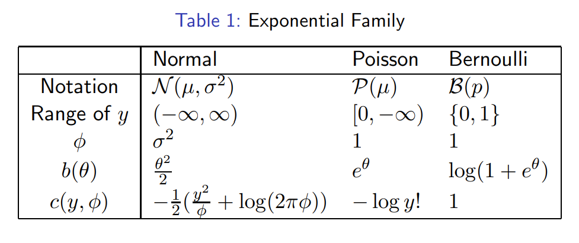
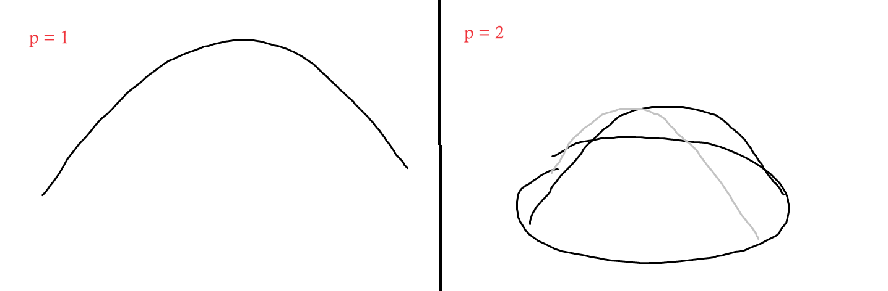

# Generalized Linear Models

- [Original paper by Nelder and Wedderburn, 1972](https://www.medicine.mcgill.ca/epidemiology/hanley/bios601/Likelihood/NelderWedderburn1972.pdf)  
- [Book by Nelder and McCullagh, 1989](https://www.utstat.toronto.edu/~brunner/oldclass/2201s11/readings/glmbook.pdf)

Recall we defined a linear model as modeling the relationship between a random variable $Y$ and a vector of random variables $X$ as $Y = X^\top \beta + \varepsilon$.  
Typically we said $\varepsilon \sim N_n(0, \sigma^2 I_n)$, in which case we can rewrite this as:  

$Y | X \sim N_n(X^\top \beta, \sigma^2 I_n)$
- $Y$ conditional on $X$... given each value of $X$ we say $Y$ is distributed in a way such that its mean depends (linearly) on $X$.  

To generalize slightly, we can rewrite this as $Y|X \sim N(\mu(X), \sigma^2 I_n)$
- i.e., the conditional distribution $Y|X$'s mean is a function of the covariates $X$.
- The linear regression model assumed a very specific $\mu(X)$ function for the mean - specifically, $\mu(X) = X^\top \beta = \Sigma_{j=1}^p \beta_j X^{(j)}$ (a simple linear combination of the covariates with the $\beta$ paramaters).
- but we may want a different / more complicated function $\mu$ to map our $X$'s to the mean parameter. 

The 2 core assumptions here are:
- When I look at conditional distribution of $Y$ given $X$, $X$ affects only the mean.  
- The mean is a linear function of $X$.

Everything else, we can try to relax.

## Components of a linear model

The two components of the original linear regression model (that we are going to relax) are:
1. **Random component:** the response variable $Y|X$ is continuous and normally distributed with mean $\mu = \mu(X) = E[Y|X]$
    - and, $Y|X \sim N(\mu(X), \sigma^2 I)$

2. **Link:** between the random ($\mu$) and covariates:
- $X = (X^{(1)}, X^{(2)}, ..., X^{(p)})^\top ~:~ \mu(X) = X^\top \beta $

Note we won't try to relax the assumption that $\mu(X)$ is a linear function of the $X$'s, because we are talking about generalized *linear* models. The only thing we generalize are the random component (the conditional distribution) and the link function (what maps between $X^\top \beta$ and $\mu$).  

## Generalization
Again, a generalized linear model (GLM) generalizes normal/classic linear regression models in the following directions:  
1. **Random component:**  
$Y|X \sim \text{Some distribution from the exponential family}$
    - In the linear regression case, we say $Y|X$'s distribution belongs to the Gaussian family, which itself is part of the exponential family.

2. **Link** between the random and covariates:  
$g(\mu(X)) = X^\top \beta$  
where $g$ is called the link function and $\mu = E[Y|X]$
    - i.e., $E[Y|X] = \mu(X) = g^{-1}(X^\top \beta)$
    - we pick a link function for *compatibility*.  
    $\mu(X)$ is *always* $E[Y|X]$. But, for example, if $Y \sim Bernoulli$, then $\mu(X)$ is bound between $[0,1]$. We can't just let $\mu(X) = X^\top \beta$, we need a link function $g$ which maps the $\mu$ parameter from $[0,1]$ to the entire real line (said differently, we need $g^{-1}$ to map $X^\top \beta$ from the entire real line to $[0,1]$) 
    - Note, in the linear regression case, $g$ is the identity function.

Note that $g$ does not have to be a linear function of $\mu$, and thus $\mu = g^{-1}(X^\top \beta)$ implies $\mu$ could be a nonlinear function of its linear predictor.  
However, the model is still considered "linear" because $g(\mu)$ is a linear function of the covariates - the covariates $X$ only affect the distribution of $Y$ through the linear combination $X^\top \beta$.  

This implies that we cannot simply use least squares to estimate $\beta$, and we will see that instead we will rely on maximum likelihood estimation explicitly.

## Example 1: Disease Occurring Rate

In the early stages of a disease epidemic, the rate at which new cases occur can often increase exponentially through time. Hence, if $\mu_i$ is the expected number of new cases on day $t_i$, an appropriate model might be of the form:  
$\mu_i = \gamma \exp(\delta t_i)$
- Such a model can be turned into GLM form using a **log link**, since this makes $\mu_i$ linear in its own parameters ($\gamma, \delta, t_i$):  
$\log(\mu_i) = \log(\gamma) + \delta t_i = \beta_0 + \beta_1 t_i$ 
- Since this is a count, the *Poisson distribution* (with expected value $\mu_i$ at time $x_i$) is probably a reasonable distribution to try.  

## Example 2: Prey Capture Rate
The rate capture of preys, $y_i$, by a hunting animal, tends to increase with increasing density of prey, $x_i$, but to eventually level off when the predator is catching as much as it can cope with.  
A suitable model for this situation might be:  
$E[y_i|x_i] = \mu(x_i) = \frac{\alpha x_i}{h + x_i}$,  
where $\alpha$ represents the maximum capture rate and $h$ represents the prey density at which the capture rate is half the maximum rate.  
- We can make $u$ linear in $x$ by using a **reciprocal link**, to make the RHS linear in its paramaters:  
$g(\mu(x_i)) = \frac{1}{\mu(x_i)} = \frac{1}{\alpha} + \frac{h}{\alpha} \frac{1}{x_i} = \beta_0 + \beta_1 \frac{1}{x_i}$
- (domain knowledge suggests) the standard deviation of capture rate might be approximately proportional to the mean rate. Going through the list of distributions in the exponential family, this suggests the use of a Gamma distribution for the repsonse - for which the reciprocal/inverse link is commonly used.

## Example 3: Kyphosis Data
The Kyphosis data consist of measurements on 81 children following corrective spinal injury. The binary response variable, Kyphosis, indicates the presence or absence of postoperative deforming. The three covariates are: Age of the child in month, Number of the vertebrae involved in operation, and the Start of the range of vertebrae involved.  
- The response variable is binary, so there is no choice: $Y|X \sim Bernoulli$ with expected value $\mu(X) \in (0,1)$
- We cannot write $\mu(X) = X^\top \beta$ because the RHS ranges through $\R$, so we want an invertible link function such that $g^{-1}(X^\top \beta) \in (0,1)$  

## GLM: Motivation
- Clearly, a normal linear model is not appropriate for these examples. We need a more general regression framework to account for various types of response data
    - use other distibutions from the Exponential family
- Develop methods for model fitting and inferences in this framework
    - Maximum likelihood estimation

## Exponential Family
A family of distributions $\set{P_\theta : \theta \in \Theta}, \Theta \subset \R^k$ is said to be a **$k$-paramater exponential family** on $\R^q$ if there exist real valued functions:  
- $\eta_1, \eta_2, \cdots, \eta_k$ and $B$ of $\theta$
- $T_1,T_2,\cdots,T_k$ and $h$ of $x \in \R^q$ such that the density function (pmf or pdf) of $P_\theta$ can be written as:  
$$p_\theta(x) = p(\theta, x) = \exp[\Sigma_{i=1}^k ~~ \eta_i(\theta) T_i(x) - B(\theta)] ~ h(x)$$
 - (note, in modeling situations, the $x$ is going to be the response variable, i.e., $y \in \R^1$)

Let's break this down:  
- There are many possible functions $p(\theta, x)$ - many ways $\theta$ and $x$ can be interacted. **The exponential family's form restricts the way $\theta$ and $x$ can interact.**  
- If we think of the case where $\theta, x$ are 1-dimensional: we can see that the way $\theta$ and $x$ interact has to be of the general form $\exp(\theta \times x) f(x) g(\theta)$
- But we want to generalize this to higher dimensions, such that $\theta \in \R^k, x \in \R^q$.  
We cannot take the product or inner product of $\theta$ and $x$ (inside the $\exp$) because they are of incompatible dimensions ($k$ and $q$), but we can first map $\theta$ and $x$ to the same dimensions (i.e., $\eta_i(\theta)T_i(x)$). 
    - We want to interact $\theta$ and $x$,  
    so let $\eta = (\eta_1(\theta), \dots, \eta_k(\theta))^\top$, and $T = (T_1(x), \dots, T_k(x))^\top$
    - Then we can take the inner product $<\eta, T> = \Sigma_{j=1}^k ~ \eta_j(\theta) ~ T_j(x)$
 
- Now we can say that $p_\theta(x) = \exp[\Sigma_{j=1}^k \eta_j(\theta) T_j(x)] ~ c(\theta)h(x)$  
But we can also push $c(\theta)$ into the $\exp$:  
    - $c(\theta) = \exp[-\log(1 / c(\theta))] = \exp[- B(\theta)]$
- Now we have the form written above:  
$p_\theta(x) = \exp[\Sigma_{j=1}^k ~ \eta_j(\theta) T_j(x) - B(\theta)] ~ h(x)$ 
- Why don't we also push $h(x)$ into the $\exp$? $h(x)$ and $B(\theta)$ don't play the same role.  
    - $B(\theta)$ acts as a normalizing constant, since we want the density to integrate to 1. It makes sense than to just remove it from the inner product inside the $\exp$.
    - $h(x)$'s role: it allows us to treat both discrete and continuous variables within the framework of exponential families. $h(x)$ is a ["change of measure"](https://math.nyu.edu/~goodman/teaching/StochCalc2012/notes/Week10.pdf) - instead of looking at the density with respect to the original measure, we look at the density with respect to the distibution that has $h$ as a density... (first we transform $x$, then take the density)

### Normal distribution example
Consider $X \sim N(\mu, \sigma^2)$, s.t. $\theta = (\mu, \sigma^2)$.  
The density is:  
$p_\theta(x) = \exp(\frac{\mu}{\sigma^2}x - \frac{1}{2\sigma^2}x^2 - \frac{\mu^2}{2 \sigma^2}) \frac{1}{\sigma \sqrt{2 \pi}}$  
Which forms the 2-paramater exponential family with:  
- $\eta_1 = \frac{\mu}{\sigma^2}$, $\eta_2 = \frac{-1}{2\sigma^2}$  
- $T_1(x) = x$, $T_2(x) = x^2$,  
- $B(\theta) = \frac{\mu^2}{2\sigma^2} + \log(\sigma \sqrt{2 \pi})$  
- $h(x) = 1$  

(Proof:  
Consider the classical formula of the Normal distribution's pdf)
- $p_\theta(x) = \frac{1}{\sigma \sqrt{2\pi}} \exp(- \frac{(x - \mu)^2}{2\sigma^2})$
    - expand inside of $\exp$:  
    $- \frac{1}{2\sigma^2}x^2 + \frac{2\mu}{2 \sigma^2}x - \frac{\mu^2}{2\sigma^2}$
    - rewrite the fraction outside the $\exp$:  
    $- \log(\sigma \sqrt{2 \pi})$
- $p_\theta(x) = \exp(\frac{\mu}{\sigma^2}x - \frac{1}{2\sigma^2}x^2 - \frac{\mu^2}{2 \sigma^2} - \log(\sigma \sqrt{2 \pi}))$  

When $\sigma^2$ is known, $\theta = \mu$ and $\sigma^2$ can be though of as a constant, so it becomes a 1-paramater exponential family on $\R$:  
- $\eta = \frac{\mu}{\sigma^2}$
- $T(x) = x$
- $B(\theta) = \frac{\mu^2}{2 \sigma^2}$
- $h(x) = \frac{\exp(-\frac{x^2}{2\sigma^2})}{\sigma \sqrt{2 \pi}}$
- $p_\theta(x) = \exp(x \frac{\mu}{\sigma^2} - \frac{\mu^2}{2 \sigma^2}) \frac{\exp(-\frac{x^2}{2\sigma^2})}{\sigma \sqrt{2 \pi}}$

### Examples of discrete distributions
The following distributions form discrete exponential families of distributions with pmf:  
- $Bernoulli(p)$: $p^x (1 - p)^{1-x}, ~~ x \in \set{0,1}$
    - $p^x = \exp(x \log p)$, so:  
    $= \exp(x \log p + (1-x) \log(1-p))$  
    $= \exp(x \log(\frac{p}{1-p}) - \log(\frac{1}{1-p}))$
    - $\eta_1(\theta) = \log(\frac{p}{1-p})$,  
    $T_1(x) = x$,  
    $B(\theta) = \log(\frac{1}{1-p})$,  
    $h(x) = 1$

- $Poisson(\lambda)$: $\frac{\lambda^x}{x!} e^{-\lambda}, ~~ x = 0, 1, \dots$

### Examples of Continuous Distributions
The following distributions form continuous exponential families of distributions with pdf:  
- $\text{Gamma}(a,b)$: $\frac{1}{\Gamma(a)b^a}x^{a-1} e^{-\frac{x}{b}}$
    - $a$: shape paramater, $b$: scale paramater
    - reparamaterize: $\mu = ab$: mean paramater, $\frac{1}{\Gamma(a)} (\frac{a}{\mu})^a x^{a-1} e^{-\frac{ax}{\mu}}$
- Inverse Gamma, Inverse Gaussian, Chi-square, Beta, Binomial, Negative binomial. 

## Components of GLM
1. **Random component:**  
$Y \sim$ some exponential family distribution
2. **Link:** between random and covariates:  
$$
g(\mu(X)) = X^\top \beta \\
\mu(X) = E(Y | X)
$$

## One-paramater Canonical Exponential Family
> The general form we wrote for exponential families above includes a lot of possibilities, since there are still many ways we can interact $\eta(\theta)$ with $T(x)$, due to the many potential functions for $\eta$ and $T$.  
It will be nice to have a distribution that includes just $x$ times $\theta$, instead of these functions of them.   
These distributions are known as the canonical exponential family, which are the subset of the full exponential family where $x, \theta \in \R^1$.

**Canonical exponential family** for $k=1$ ($\theta \in \R$), $y \in \R$ has probability density/mass function of the form:  
$$
f_\theta(y) = \exp(~~ \frac{y \theta - b(\theta)}{\phi} + c(y, \phi) ~~)
$$  
for some known functions $b(\cdot)$, $c(\cdot,\cdot)$.  
- If $\phi$ is known, there is a one-paramater exponential family with $\theta$ being the canonical paramater.  
- If $\phi$ is unkown, this *might* be a two-paramater exponential family (i.e., in some cases). $\phi$ is called a dispersion paramater.  
    - (in these notes we always assume $\phi$ is known)

### Example: Gaussian with known variance
$f_\theta(y) = \frac{1}{\sigma \sqrt{2\pi}} \exp(-\frac{(y - \mu)^2}{2 \sigma^2})$
- $= \exp(y \frac{\mu}{\sigma^2} - \frac{\mu^2}{2 \sigma^2}) \frac{\exp(-\frac{y^2}{2\sigma^2})}{\sigma \sqrt{2 \pi}}$ (as we saw above)
- $= \exp[\frac{y \mu - \frac{1}{2} \mu^2}{\sigma^2} - \frac{1}{2} (\frac{y^2}{\sigma^2} + \log(2 \pi \sigma^2))]$
    - $\theta = \mu$
    - $\phi = \sigma^2$
    - $b(\theta) = \frac{\mu^2}{2} = \frac{\theta^2}{2}$  
    - $c(y, \phi) = -\frac{1}{2} (\frac{y^2}{\phi} + \log(2 \pi \phi))$

### Other distributions:  

Note that $b(\theta)$ is a crucial term in the formula for the canonical exponential family.  
- The first term in the $\exp$, $\frac{y \theta}{\phi}$, is always just the quantile times the paramater (scaled by the known constant). $c(y, \phi)$ does not depend on $\theta$.   
What really makes the difference between the different members of the canonical exponential family (Gaussians, Binomials, Gammas, etc.) is all inside $b(\theta)$.
- $b(\cdot)$ is also known as the cumulant generating function (or log of moment generating function) because if you start taking successive derivatives and evaluating at 0 (as we see below), you get the [cumulants](https://en.wikipedia.org/wiki/Cumulant) of the distribution, which are some transformation of the moments.

## Canonical Exponential: Likelihood, Expectation, Variance
> For the canonical exponential family, once we solve for $b(\theta)$, a simple computation using $b$ produces the mean and variance. The mean and variance are also known as moments, and cumulants are directly related to moments. $b$ is the cumulant generating function, so calculating $b$ gets us close - in fact the first cumulant *is* the mean and the second *is* the variance.

### Log likelihood (Bartlett's) identities
(Also see ["Variance function" on wikipedia](https://en.wikipedia.org/wiki/Variance_function))

Let $l(\theta) = \log f_\theta(y)$ denote the log-likelihood function.  
The mean $E(y)$ and variance $V(y)$ can be derived from **the following 2 identities**:  
1. $E(\frac{\partial }{\partial \theta} l(\theta)) = 0$.  
Proof:
    - $E[\frac{\partial}{\partial \theta} \log f_\theta]$  
    $= E[\frac{\frac{\partial}{\partial \theta} f_\theta(y)}{f_\theta(y)}]$ (derivative of the log of a function, equivalent)  
    - then from the definition of the expectation...
    - $= \int [\frac{\frac{\partial }{\partial \theta} f_\theta(y)}{f_\theta(y)} f_\theta(y)] dy$  
    $= \int [(\frac{\partial }{\partial \theta} f_\theta(y))]dy$  
    - switching the integral of derivative to derivative of integral (Leibniz integral rule)...
    - $= \frac{\partial}{\partial \theta} \int f_\theta(y) dy = \frac{\partial}{\partial \theta} 1 = 0$
        - since $f_\theta$ is a density for any value of $\theta$, its integral is 1!

2. $E(\frac{\partial^2 }{\partial \theta^2} l(\theta)) + E(\frac{\partial }{\partial \theta} l(\theta))^2 = 0$  
- Proof: $E(\frac{\partial^2 }{\partial \theta^2} l(\theta)) + E(\frac{\partial }{\partial \theta} l(\theta))^2 = 0$    
    $\Rightarrow E(\frac{\partial^2 }{\partial \theta^2} l(\theta)) = - E(\frac{\partial }{\partial \theta} l(\theta))^2$  
    Evaluating the LHS:
    - $\frac{\partial^2}{\partial \theta^2} \log f_\theta(y)$  
    $= \frac{[\frac{\partial^2}{\partial \theta^2} f_\theta(y)] f_\theta(y) - \frac{\partial}{\partial \theta} f_\theta(y) \frac{\partial}{\partial \theta} f_\theta(y)}{(f_\theta(y))^2}$   
    - $E[\frac{\cdots}{\cdots}]$  
    $= \int [ \frac{[\frac{\partial^2}{\partial \theta^2} f_\theta(y)] f_\theta(y) - \frac{\partial}{\partial \theta} f_\theta(y) \frac{\partial}{\partial \theta} f_\theta(y)}{(f_\theta(y))^2}]$  
    $= \int [\frac{\partial^2}{\partial \theta^2} f_\theta(y)]  - \int [\frac{\frac{\partial}{\partial \theta} f_\theta(y) \frac{\partial}{\partial \theta} f_\theta(y)}{(f_\theta(y))^2}]$  
    $= \int [\frac{\partial^2}{\partial \theta^2} f_\theta(y)]  - \int [\frac{(\frac{\partial}{\partial \theta} f_\theta(y))^2}{f_\theta(y)}]$  
    - the LHS term must be $0$, since we can write the integral of the derivative = the derivative of the integral, and the integral of a density is 1, the derivative of 1 is 0.  
    - $= 0 - E[\frac{(\frac{\partial}{\partial \theta} f_\theta(y))^2}{f_\theta(y)}]$  
    $= - E[(\frac{\partial}{\partial \theta} \log f_\theta(y))^2]$  
- Note that the left term,   
$E(\frac{\partial^2 }{\partial \theta^2} l(\theta))$  
is the **Fisher information** - expectation of the second derivative of the log likelihood. This identity tells us the log likelihood function is concave, since it is $< 0$ 

### Expected Value
Note that:  
- $\log f_\theta(y) = \frac{y \theta - b(\theta)}{\phi} + c(y, \phi)$  
    - (logging just gets rid of the exponential)

Therefore:  
- $\frac{\partial }{\partial \theta} \log f_\theta(y) = \frac{y - b'(\theta)}{\phi}$  

Which yields, from the first identity:  
- $0 = E[\frac{\partial }{\partial \theta} \log f_\theta(y)] = \frac{E[y] - b'(\theta)}{\phi}$  
    - (since $b'(\theta)$ does not depend on $y$, its expectation is itself)
    - Since $\phi \ne 0$, this leads to $E[y] = b'(\theta)$...

which implies:  
- $E[y] = \mu = b'(\theta)$

### Variance
On the other hand we have from the second identity that:  
- $\frac{\partial^2 }{\partial \theta^2} \log f_\theta(y) + (\frac{\partial }{\partial \theta} \log f_\theta(y))^2$  
$= -\frac{b''(\theta)}{\phi} + (\frac{y - b'(\theta)}{\phi})^2$  
    - (just plugging in derivatives from above)

and from the previous result,  
- $\frac{y - b'(\theta)}{\phi} = \frac{y - E(y)}{\phi}$  

Together with the second identity, this yields:  
- $0 = -\frac{b''(\theta)}{\phi} + (\frac{y - E[y]}{\phi})^2$  
$\Rightarrow 0 = -\frac{b''(\theta)}{\phi} + \frac{var(y)}{\phi^2}$,  
- Thus:  
$\frac{b''(\theta)}{\phi} = \frac{var(y)}{\phi^2}$  
$\Rightarrow var(y) = b''(\theta)\frac{\phi^2}{\phi}$

which leads to:  
$var(y) = V(y) = b''(\theta) \phi$
- Note that since the variance is positive, $b''(\theta)$ must be positive, so $b$ is convex.
- Said differntly - the variance must be positive, so $b(\theta)$ is limited to be a strictly convex function (so that its second derivative is always positive).

### Example: Poisson distribution  
Consider a Poisson likelihood, for $y \sim Pois(\mu)$:  
- $f_\mu(y) = \frac{\mu^y}{y!} e^{- \mu}$  

We want to rewrite this in the form of the canonical exponential family (by squeezing all terms into the exponential):  
- $f_\mu(y) = \exp(-\mu + y \log \mu - \log(y!))$  
$= \exp(y \log \mu - \mu - \log(y!))$

Since the canonical exponential takes form: $f_\theta(y) = \exp(\frac{y \theta - b(\theta)}{\phi} + c(y, \phi))$,  
this implies:
- $\theta = \log \mu$, so $\mu = e^\theta$
- $b(\theta) = \mu = e^\theta$
- $\phi = 1$
- $c(y, \phi) = - \log(y!)$

Plugging this in:
- $f_\mu(y) = \exp(y \theta - e^\theta - \log(y!))$

So if $b(\theta) = e^\theta$, then:  
- $E[y] = b'(\theta) = e^\theta ~~(= \mu)$
- $Var(y) = b''(\theta) = e^\theta ~~(= \mu)$

## Link Function
> We want to be able to say that $E[Y|X] = \mu(X)$, while allowing the conditional distribution $Y|X$ to belong to one of any members of the exponential family.  
For linear models, we say $\mu(X) = X^\top \beta$.  
But if $\mu(x)$ is the paramater of a non-Gaussian distribution, it may be that it is restricted to take values in some range other than $\R$.  
For example, for a Poisson r.v., the expectation has to be a positive number. If we just use $\mu(X) = X^\top \beta$, we might end up with values that are negative (sinced $X^\top \beta \in \R$).  
With GLMs, the **link** function maps $\mu$ to the real line so that it *can* be expressed by $X^\top \beta$. Now we assume $g(\mu(X)) = X^\top \beta$, and $E[Y|X] = \mu(X) = g^{-1}(X^\top \beta)$ 

$\beta$ is the paramater of interest and needs to appear somehow.  
A **link function** $g$ relates the linear predictor $X^\top \beta$ to the mean paramater $\mu$:  
$$
X^\top \beta = g(\mu(X))
$$  

$g$ is required to be monotone increasing and continuously differentiable, and the range of $g$ must span $\R$.  
This imples $g^{-1}$ exists and is increasing.  
$$
\mu = g^{-1}(X^\top \beta)
$$

### Examples of link functions
- For linear models, $g$ = identity.
- Poisson data. Suppose $Y|X \sim Pois(\mu(X))$  
    - $\mu(X) > 0$
    - $\log(\mu(X)) = X^\top \beta$
    - In general, a link function for count data should map $(0, + \infty)$ to $\R$, so $\log$ is a natural link.
- Bernoulli/Binomial data:
    - $0 < \mu < 1$
    - $g$ should map $(0,1)$ to $\R$.
    - 3 choices:
        1. logit: $\log(\frac{\mu(X)}{1 - \mu(X)}) = X^\top \beta$
        2. probit: $\Phi^{-1}(\mu(X)) = X^\top \beta$, where $\Phi(\cdot)$ is the normal cdf  
        3. complementary log-log: $\log(-\log(1 - \mu(X))) = X^\top \beta$
    - The logit link is a natural choice. The probit is preffered in some communities, but really comes down to "taste".

## Canonical Link Function
Recall the form for the canonical exponential family:  
$$
f_\theta(y) = \exp(~~ \frac{y \theta - b(\theta)}{\phi} + c(y, \phi) ~~)
$$  
- Also recall that we defined $\theta \in \R$.

The function $g$ that links the mean $\mu$ to the canonical paramater $\theta$ is called the **Canonical Link**:  
$$
g(\mu(X)) = \theta
$$ 
- If we want to map $\mu$ to $\theta$, we are going to map $\mu$ to $\R$ since $\theta \in \R$.  
- In particular, we can take $\theta = X^\top \beta$, and find the link $g$ such that $\theta = g(\mu) = X^\top \beta$

Since $\mu = b'(\theta)$, the canonical link is given by:  
$g(\mu) = (b')^{-1} (\mu)$
- $g(\mu) = \theta \Leftrightarrow \mu = g^{-1}(\theta)$  
$\mu = b'(\theta)$, so, $b'(\theta) = g^{-1}(\theta)$,  
Thus, $b' \equiv g^{-1}$, so $g = (b')^{-1}$

This gives a function with the right properties (as long as $\phi > 0$) - since it is strictly increasing and invertible, it is a valid link.
- We know that $b'$ is the derivative of a strictly convex function. A strictly convex function has a strictly positive second derivative ($b''>0$).

### Example: Bernoulli distribution
PMF of Bernoulli:  
$f_\theta(y) = p^y (1 - p)^{1 - y}$  
$= \exp(y \log p + (1 - y) \log (1 -p))$  
$= \exp(y \log \frac{p}{1-p} + \log(1-p))$

Thus, we can define:  
- $\theta = \log \frac{p}{1-p}$.  
- $p = \frac{e^\theta}{1 + e^\theta}$ (inverting, i.e., solve above for p)
- $\log (1 - p) = \log(\frac{1}{1 + e^\theta}) = -\log(1 + e^\theta)$  

Giving us the PMF in canonical exponential form:  
$f_\theta(y) = \exp(y\theta - \log(1 + e^\theta))$  

Thus, $b(\theta) = -\log(1 + e^\theta)$  
And $b'(\theta) = \frac{e^\theta}{1 + e^\theta}$
- note that this is equivalent to $p$, which is good since $b'$ gives us the expected value!

Thus, the canonical link $g$ is $(b')^{-1}$, which should give us the logit function:  
- $b'(\theta) = \frac{e^\theta}{1 + e^\theta}$  
$(b')^{-1}(p) = \log \frac{p}{1 - p} = \text{logit}(p)$

### Other examples
Normal
- $b(\theta) = \theta^2 / 2$
- so $g(\mu) = \mu$

Poisson
- $b(\theta) = \exp(\theta)$
- so $g(\mu) = \log(\mu)$

Bernoulli
- $b(\theta) = \log(1 + e^\theta)$
- so $g(\mu) = \log \frac{\mu}{1 - \mu}$

Gamma
- $b(\theta) = -\log(-\theta)$
- so $g(\mu) = - \frac{1}{\mu}$

## Statistical Model and Notation
> Up to now, we have considered the theoretical/probabilistic motivation for GLMs, given a single observation. Now we are going to conisder the statistics - given data, what can we infer about a GLM.  
There are 3 paramaters we have discussed in GLMs: $\theta, \mu, \beta$, and we can move between each of them.  
We saw that $E[Y|X] = \mu(X) \to \theta(X)$, since $\mu = b'(\theta), \theta = (b')^{-1}(\mu)$.  
And we have that $g(\mu(X)) = X^\top \beta$.  
When it comes to modeling, $\beta$ will be the most important paramater. Once we have calculated $X^\top \beta$, we have set everything else ($\mu$ and $\theta$) through this chain.  
To fit a GLM, we are going to want to express the likelihood function not in terms of $\mu$ or $\theta$, but in terms of $\beta$, and then maximize it. 

- Let $(X_i,Y_i) \in \R^p \times \R$, for $i = 1, \dots, n$ be independent random pairs such that the conditional distribution of $Y_i$ given $X_i = x_i$ (i.e., $Y_i | X_i = x_i$) has density in the canonical exponential family:  
$f_{\theta_i}(y_i) = \exp(\frac{y_i \theta_i - b(\theta_i)}{\phi} + c(y_i, \phi))$
    - We write $\theta_i$ since it represents $\theta_i(X_i)$

- $\bold{Y} = (Y_1, \dots, Y_n)^\top$  
$\bold{X} = (X_1^\top, \dots, Y_n^\top)^\top$
- Here the mean $\mu_i$ is related to the canonical paramater $\theta_i$ via:  
$$
\mu_i = b'(\theta_i)
$$
- And $\mu_i$ depends linearly on the covariates through a link function $g$:  
$$
g(\mu_i) = X_i^\top \beta
$$

Note:
- We model the conditional distribution $Y_i|X_i = x_i$.  
Note that $\theta_i = \theta_i(x_i) = \theta_i(X_i \beta)$  
$\beta$ does not depend on the individual $i$, so if we collect more and more $X$ $Y$ pairs of this form - where there is always some paramaters $\beta$ that maps $X_i$ to $Y_i$, then I should have a better and better estimate.  
- If we let $\beta$ vary as well, then we would not be able to do any *statistics*, there would be no repeated observations to average out

Conditional Expectation:  
- We model $\mu_i = E[Y_i | X_i = x] = f(x_i)$ ("the regression function")
- Since we are using the canonical exponential family, we know that $\mu_i = b'(\theta_i)$
- We assume that $\mu_i$ depends on $X_i$ as follows:  
$g(\mu_i) = X_i^\top \beta$

### Back to $\beta$ - ML estimation in the GLM context
Given a link function $g$, note the following relationship between $\beta$ and $\theta$ (as shown above):  
- $\theta_i = (b')^{-1}(\mu_i)$  
$~~~~ = (b')^{-1} (g^{-1}(X_i^\top \beta)) \equiv h(X^\top \beta)$  
    - Because $\theta_i(X_i) = (b')^{-1}(\mu_i(X_i)) = (b')^{-1}(g^{-1}(X_i^\top \beta))$

where $h$ can be defined as:  
- $h = (b')^{-1} \circ g^{-1} = (g \circ b')^{-1}$
    - Note: when we use the canonical link for $g$, $(b')^{-1}$ and $g^{-1}$ cancel so $h$ is the identity (since $g = (b')^{-1}$)

### Log-likelihood in terms of $\beta$
The log-likelihood (for the exponential family) is given by (up to a constant term):  
$$
l_n(\beta; \bold{Y}, \bold{X}) = \log f_\beta(Y, X) = \Sigma_i \frac{Y_i \theta_i - b_i(\theta)}{\phi} \\
$$
$$
= \Sigma_i \frac{Y_i h(X_i^\top \beta) - b(h(X_i^\top \beta))}{\phi}
$$
- recall, the likelhiood is the sum of the densities (i.e., joint distribution). 
- We can drop $c(y_i, \phi)$ because it does not depend on $\beta$, and thus is effectively a (normalizing) constant. 

Note that when we use the *canonical link*, we obtain the following simpler expression since $h$ is identity:  
$$
l_n(\beta, \phi; \bold{Y}, \bold{X}) = \Sigma_i \frac{Y_i X_i^\top \beta - b(X_i^\top \beta)}{\phi}
$$
- We can think about this fairly simple function and deduce that it is **strictly concave** (as long as $\phi$ > 0)
- The first term, $Y_i X_i^\top \beta$, is a linear funcion of $\beta$ (thus, both convex and concave). It will not affect the convexity/concavity of the function.  
To really understand the function, we need to look at $b(\cdot)$  
We know $b''(\theta) = Var(Y) / \phi$, which implies that $b''$ has to be strictly positive ($b'' > 0$). If $b''$ is positive, then $b'$ is increasing and so $b$ is strictly convex.
- So we have a linear function minus a strictly convex function, i.e., a linear function plus a strictly concave function = strictly concave. If we saw $l_n$ in $\R^1$ (a single parameter to optimize over) it would look like the left picture, $\R^2$ like the right picutre, etc.  

-  And since it's strictly concave, we know there is a unique maximum likelihood estimator.
- *If another parameterization is used other than the canonical, the likelihood may not be strictly concave leading to several local maxima.*

## Extra

Nice notes on applied GLM from Professor Chris Adolph ("Maximum Likelihood Methods for the Social Sciences"):
- https://faculty.washington.edu/cadolph/index.php?page=21  
(first 2 lectures are review, could be skipped)

GLM Inference Chapter
- https://bookdown.org/egarpor/PM-UC3M/glm-inference.html

Deviance:
- See: https://bookdown.org/egarpor/PM-UC3M/glm-deviance.html
