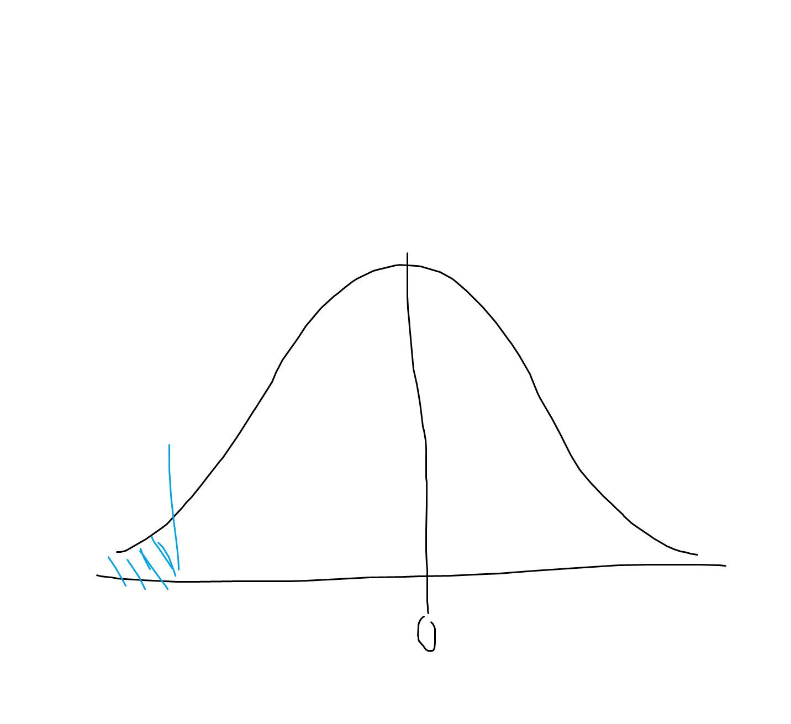
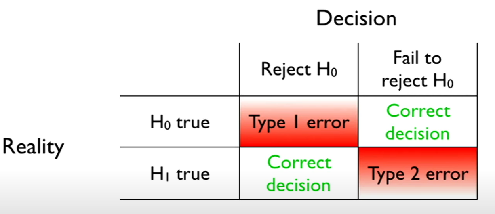
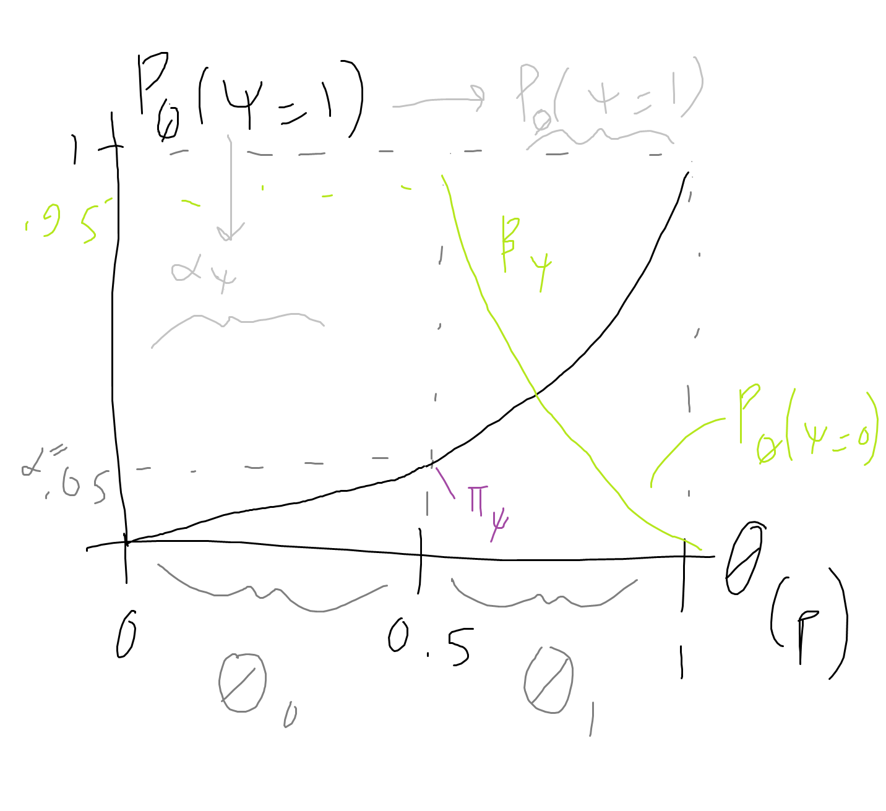
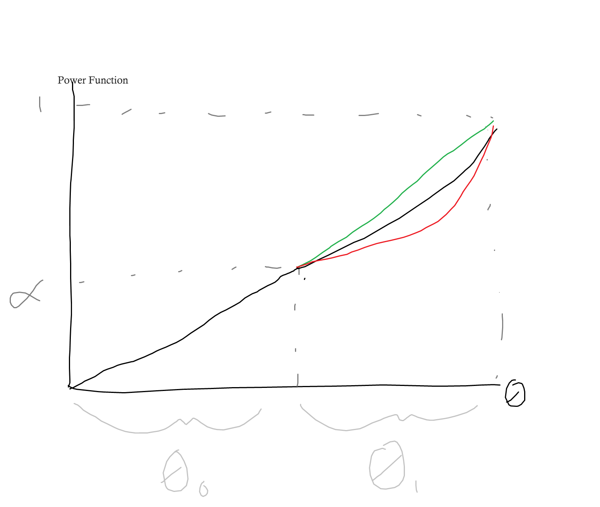
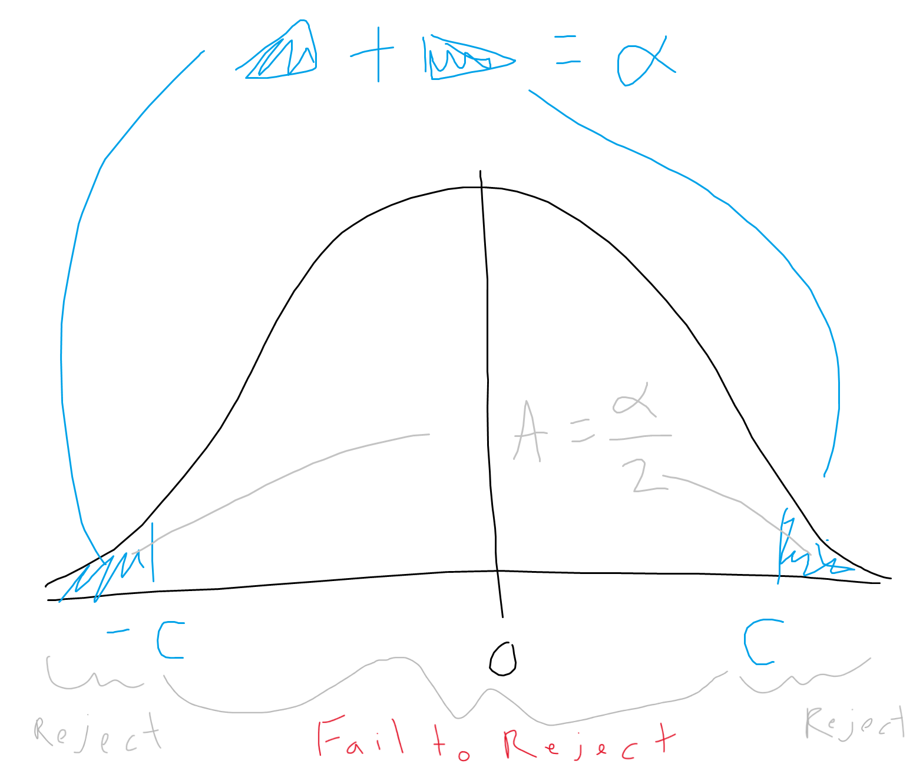
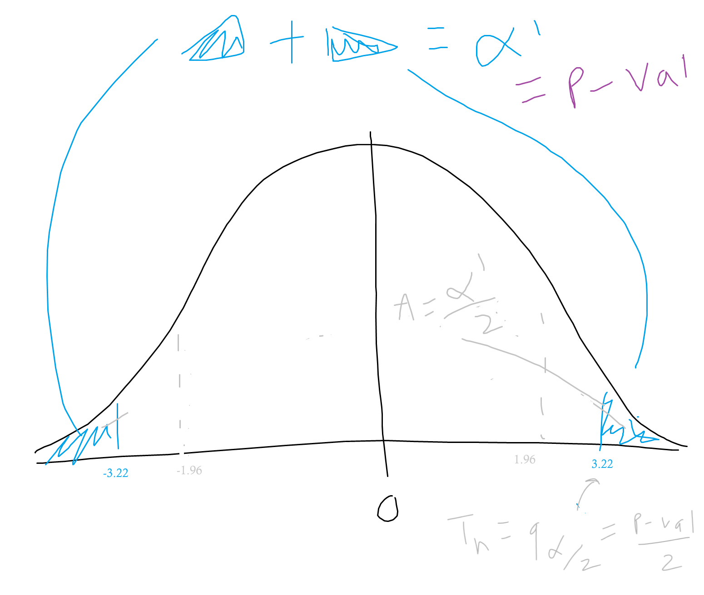

# Lecture 5a: Parametric Hypothesis Testing

So far we have discussed builiding statistical models of random variables with an emphasis on estimating the parameters of a random variable's distribution, so that we might model or predict the variable.  
But what if we want to ask more specific questions about a random variable? Perhaps we'd like to compare random variables or evaluate how our observed data compares with our expectations about the world. In doing so, we'd also want to measure how accurate our test result is and how much evidence we really have.

Hypothesis testing provides a framework for asking and answering such statistical questions.

## Motivating Example
For example, say we have data about some running race. In 2009 there were 14,974 participants.  
We can ask - were runners faster in 2012?  
To answer, we can select $n$ runners from the 2012 race at random and denote $X_1, ..., X_n$, so we have a random variable which measures running time.  
Next we have to make some assumptions.  
From past data (say 2009), we can see that running time appears to have a Gaussian distribution, that bell-shaped curve, so we will assume it is a Gaussian, and we can estimate its parametrs $\mu$ and $\sigma^2$ - which we know from MLE are the mean and variance of the 2009 data (say this gives us mean 103 and variance 373).  

### Defining Hypothesis / Making Assumptions
So we are given an i.i.d. r.v. $X_1, ..., X_n$ and we want to know if our random variable from 2012, $X_1$, has the same distribution. That is, is $X_1 \sim N(103, 373)$?  
- This yes/no question is a **hypothesis testing** problem.  
- The hypothesis that our 2012 running time distribution is the same as in 2009 could be false for many reasons:  
    - $E[X_1] \ne 103$ (expectation has changed)
    - $var[X_1] \ne 373$ (variance has changed)
    - $X_1$ is not even Gaussian (distribution has changed)

What we can do is make more assumptions by asking a more specific question - *are the runners running faster?* - which means we only have to consider if the expectation has changed, and we can assume all else remains the same.  
In other words, we can ask specifically: is $E[X_1] < 103$ or is $E[X_1] = 103$?
- Let $\mu = E[X_1]$ be our only varying parameter. 

Thus - we fix the rest as part of our modeling assumptions:
- Assume $var[X_1] = 373$, Assume $X_1$ is Gaussian.
- This reduces the number of ways the hypothesis can be rejected - Now, it is only rejected if $X_1 \sim N(\mu, 373)$ for some $\mu < 103$, ie if $X_1$ belongs to a very specific family of distributions. 
- Making assumptions allows us to "carve out" a small portion of the space of all possible probability distributions, so that it is easier to test a hypothesis.

### Naive Test
Making these assumptions lets us compare an expected value ($\mu$) to a fixed reference number ($103$, the $\mu$ for the 2009 distribution).  
We could say, "If $\bar{X}_n < 103$, then $\mu < 103$".
- But this could go wrong if our random sample is not representative - for ex, if we randomly pick only very fast runners.
- For example, consider if the true (hidden/unkown) $\mu$ for 2012 is $102.9$, thus runners are faster in 2012. Say our sample size is only 10. Then the CLT tells us that the difference between the sample average and its limit $|\bar{X}_n - 102.9|$ is about of the order of $1/\sqrt{n} = 1/\sqrt{10} = 0.3$.  
Thus it is possible that our $\bar{X}_n = 102.9 + 0.3 = 103.2$, meaning we would conclude that runners were not faster ($\mu > 103$) when in fact they were truly faster ($\mu < 103$). 
- We need a buffer to account for the fact that $\bar{X}_n$ is not a precise estimate for $\mu$.

### Improved Test
A better heuristic:  
"If $\bar{X}_n < 103 -$(something that $\to$ 0 as $n \to \infty$), then $\mu < 103$"
- This will let us take the size of the random fluctuations of the sample (of the order of $\sqrt{n}$, according to CLT) into account.

## Motivating Example 2 - Clinical Trials
Lets consider an example where we must compare 2 random variables, rather than just comparing a random variable with a fixed value.  

Pharmaceutical companies use hypothesis testing to test if a new drug is efficient. They give the drug to a treatment/test group and a placebo to the control group. Let $\mu_{c}$ and $\mu_{t}$ be the expected outcomes (some measure of poor health) of patients in the control and treatment groups respectively.  
We really want to know if $\mu_{t} < \mu_{c}$ (if the treatment group have a lower average poor health score).  
- But, we don't have access to the population parameters, and so we need to make decisions based on imprecise sample estimates.  

Thus, we want to compare 2 expected values - we have no reference number.  
- (we can't say that there will be no effect on the control group since we assume some placebo effect, thus $\mu_c$ cannot be thought of as a fixed reference number)

Let $X_1,...,X_{n_{t}}$ denote $n_{treatment}$ iid rv with distribution $Poiss(\mu_t)$.  
Let $Y_1,...,Y_{n_{c}}$ denote $n_{control}$ iid rv with distribution $Poiss(\mu_c)$.  
To test if $\mu_t < \mu_c$, we use heuristic:  
- "If $\bar{X}_t < \bar{X}_c - $(something that $\to 0$ as $n_c \to \infty$ and as $n_t \to \infty$), then conclude that $\mu_t < \mu_c$. In other words, if $\bar{X}_t - \bar{X}_c <$ (small negative value)  
    - $\bar{X}_t - \bar{X}_c$ is going to be normally distributed $N(\mu_t - \mu_c, \sigma^2)$ (variance unkown.)  
    - Say $\mu_t = \mu_c$, so there is no actual effect of the drug. Then this difference will converge to a normal distribution centered around 0, but still half of the time we will predict a $\mu_t > \mu_c$ and half of the the time less. Thus, we add a buffer by subtracting by "the quantity that converges to 0" so that it becomes unlikely that $\mu_t < \mu_c$ happens by chance. (In the image below, imagine that the buffer makes it so we have to be left of the blue line to find an effect of the drug - much less likely)  
    

## Motivating Example 3 - Coins
### Example 1
A coin is tossed 80 times and Heads are obtainded 54 times. Can we conclude that the coin is significantly unfair? How do we know if this can be due to chance alone?   
1. n = 80, $X_1,...,X_n \sim_{iid} Ber(p)$
2. $\bar{X}_n = 54/80 = 0.68$
3. By CLT:
    - $\sqrt{n}\frac{\bar{X}_n - p}{\sqrt{p(1-p)}} \xrightarrow{n \to \infty} N(0,1)$ (or we can use $\bar{X}_n$ to calculate variance in the denominator thanks to Slutsky)
    - Since we are testing specifically whether this is fair coin, we can say that **under the null** $p=0.5$, and the above will converge to a normal dist as long as the null is the *truth* (the coin really is fair).
    - Plugging in 0.68 for $\bar{X}_n$ and 0.5 for $p$ we get 3.22, which is a fairly high value for a standard normal distribution, and thus rather unlikely to occur.  
    - But recall that for a continuous random variable the probability of any given outcome is 0, and so we have to say the probability that we *get anything worse than 3.22* is very small.
- Conclusion: It seems reasonable to reject the hypothesis p=0.5.

### Example 2
A coin is tossed 30 times, Heads obtained 13 times. Can we conclude the coin is significantly unfair?  
- n = 30, $X_1,...,X_n \sim_{iid} Ber(p)$
- $\bar{X}_n = 13/30 = 0.43$
- This time CLT+Slutsky's theorem from step 3 in example 1 gives us a value of $-0.77$, which is a much more plausible realization of a random variable $\sim N(0,1)$.  
- Conclusion: Our data does not suggest the coin is unfair.  

What we are doing here really is deciding whether the empirical probability that heads occurred in our expirement seems unlikely given what we know about a fair coin. Thanks to the CLT, we can map this empirical probability into a standard Gaussian, which gives us a common scale across experiments, methods, etc.
*All we need to know is what a large/unusual value is for a Gaussian.*

So what is a value large enugh for something to become unlikely for a standard Gaussian?? Often we say "1.96"... the quantile $q_{\alpha/2}$ for $\alpha = 5\%$ for the standard Gaussian.  
What we are doing here is mapping this result again from the standard Gaussian to some probability - the probability of being farther than some quantile.  
This is great since probability is something that quantifies the randomness in our error, and our question really *is* - what percetage of error am I willing to tolerate?  
If we say "5%", it's something we can actually envision - if I were to repeat this test 100 times, then 5 of the times I would expose myself to making a mistake.  
If you want a lower probability of making an error, you can use a higher quantile.  

Also note that our "default" hypothesis (formally, the null hypothesis) is that the coin *is* fair, rather than unfair. We make it harder to conclude that the coin is biased, because "fair" is the status quo and the goal of our analysis is to see if their is evidence against this status quo.

So now lets put this process into a mathematical formulation.

## Statistical Formulation
Consider a sample $X_1, ..., X_n$ of i.i.d. r.v. and a statistical model $(E, (P_\theta)_{\theta \in \Theta})$.  
- Let $\Theta_0$ and $\Theta_1$ be disjoint subsets of $\Theta$.  
- Consider the 2 hypotheses:
    - $H_0: \theta \in \Theta_0$
        - the null hypothesis
    - $H_1: \theta \in \Theta_1$
        - the alternative hypothesis
- If we believe that the true $\theta$ is in $\Theta_0$ or $\Theta_1$, we may want to test $H_0$ against $H_1$.
- **$H_0$ and $H_1$ do not play a symmetric role.** The data is only used to try to *disprove $H_0$.*
    - In particular, lack of evidence does not mean that $H_0$ is true ("innocent until proven guilty")
- A **test** is a statistic (measurable function of the data) $\psi \in \{0,1\}$ that maps the data to {0,1}, such that:
    - If $\psi = 0$, $H_0$ is not rejected.
    - If $\psi = 1$, $H_0$ is rejected.
        - in some sense, the test statistic plays the role of the estimator, but it takes only the value 0 or 1 - reject or not reject

- Coin example: $H_0: p = 1/2$ vs. $H_1: p \ne 1/2$
    - $\psi = 1\{| \sqrt{n} \frac{\bar{X}_n - .5}{\sqrt{\bar{X}_n (1 - \bar{X}_n)}} | > C\} $, for some $C > 0$.
        - where $1(\cdot)$ (the indicator function) splits the values of $\bar{X}$ into 2 groups - a group which leads to value 1 when $\bar{X}$ is too small or too large (so that the fluctuations around the mean are greater than C), and a group which leads to value 0 when the fluctuations are less than C. 
        - Remember, C is the threshold where a value greater than C means we believe the value is unlikely to come from a standard Gaussian, and a value less than C is likely to come from a standard Gaussian.
    - How do we choose the threshold $C$? Based on how often we are willing to be wrong...

### Characterizing a Good Test
- *Rejection region* of a test $\psi$:  
$R_\psi = \{x \in E^n : \psi(x) = 1\}$
    - the set of values of the sample space such that our test $\psi$ evaluates to 1, meaning the null is rejected

- **Type 1 Error** of a test $\psi$ (rejecting $H_0$ when it is actually true):  
$\alpha_\psi : \Theta_0 \to \R$  
$\ \ \ \ \ \ \ \ \ \theta \mapsto P_\theta[\psi = 1]$
    - $\alpha_\psi$ is a map "from $\Theta_0$ to $\R$" ([0, 1] really) which maps $\theta$ to the probability of Type 1 Error - the probability of saying $\psi = 1$ when $\theta \in \Theta_0$.
    - (the probability is not the same for all $\theta$ - consider the probability of an error in the coin flip experiment when the true $\theta$ is 1 - so we only see heads - vs when the true $\theta$ is 0.5)

- **Type 2 Error** of a test $\psi$ (not rejecting $H_0$ although $H_1$ is actually true):  
$\beta_\psi : \Theta_1 \to \R$  
$\ \ \ \ \ \ \ \ \ \theta \mapsto P_\theta[\psi = 0]$
    - $\beta_\psi$ maps $\theta$ to the probability of Type 2 errors - saying $\psi = 0$ when $\theta \in \Theta_1$

-     

    - A jury makes a type 1 error when an innocent person is declared to be guilty. A type 2 error occurs when a guilty person goes free. The constitution indicates that type 1 is worse (innocent until proven guilty implies that "innoncent" is the null hypothesis.) We could minimize type 1 error by letting everyone go, but this maximizes type 2 error.

- The **power** of a test $\psi$ is a number:  
$\pi_\psi = \inf_{\theta \in \Theta_1}(1 - \beta_\psi(\theta))$
    - Basically (1 - probability of making a type 2 error)
        - So, the probability of making a correct decision under $H_1$. We want this to be large, since we want a high probability of correctly detecting an alternative hypothesis (think, this is the probability that I measure a significant effect - and get my paper published - when their really is one). 
    - But $1 - \beta_\psi(\theta)$ could be a function, since there are many ways to be in $H_1$ if it is an entire set of numbers.
        - Thus, we look at the smallest possible of those values - the most conservative choice. (That's what the infimum $\inf$ is doing here.)  
    - In other words, we define the power of test $\psi$ as the smallest possible value that $1 - \beta_\psi(\theta)$ can take.
    - Thus, we can also think of power as $\pi_\psi = \min_{\theta \in \Theta_1} P_\theta(\psi = 1)$ - the minimum probability across all thetas in the alternative parameter set such that we reject the null hypothesis.

Power visualization:  
- Below the plot shows the parameter $\theta$ (here we use $p$ from our coin flip example) on the x axis and $P_\theta(\psi = 1)$, the probability of rejecting the null, on the y axis - this curve is also called the **power function**.
    - Left of 0.5, it is equivalent to $\alpha_\psi$, the probability of type 1 error, since it is the probability of rejecting the null for the parameters in $\Theta_0$ - where the null should not actually be rejected.
    - Right of 0.5, it is just the probability of rejection, $P_\theta(\psi = 1)$ (no error). But also consider $1 - P_\theta(\psi=1) = P_\theta(\psi=0)$, shown in green, which is the probability of a type 2 error $\beta_\psi$, since it is the probability of failing to reject the null for the parameters in $\Theta_1$.
- Recall test $\psi = 1\{| \sqrt{n} \frac{\bar{X}_n - p}{\sqrt{\bar{X}_n (1 - \bar{X}_n)}} | > C\} $, for some $C > 0$, for our Bernoulli coin flip example. 
    - We want Type 1 Error $\alpha_\psi(\theta) \le \alpha$, where alpha is the level of the test given in advance (say it is 5%), for all $\theta \in \Theta_0$. 
- $P_\theta(\psi = 1)$ starts at 0 - if $\theta$ is 0 then $\bar{X}_n$ is 0 and the inside of $\psi$ is never going to be greater than C (function above is not well defined, but imagine we set it to 0 if $\bar{X}_n$ is 0), so $P_\theta(\psi = 1)$ is going to be 0, since we always fail to reject the null. Likewise, this means the probability of making a type 1 error is 0.
- Since we want to minimize both Type 1 and Type 2 error, we are going to take advantage of this wiggle room given to us and max out $P_\theta(\psi = 1)$ at $\alpha$ where p = 0.5, the threshold between $\Theta_0$ and $\Theta_1$.
- Next, we know the **power** is a number - specifically the smallest value for $\theta \in \Theta_1$ of the probability of correctly rejecting, $P_\theta(\psi = 1)$. From the graph we can see that this is (about) exactly where $\theta = 0.5$, and so the power $\pi_\psi = 5 \%$
- Thus we can see that whenever the probability of rejection is increasing - the case for most tests - than the **level** of the test $\alpha$ is equal to the **power** of the test.  

    - We can summarize the above by thinking of the black line as showing the probability of Type I error to the left of the threshold at 0.5, where all we care about is that the probability remains below our desired level - $\alpha$. To the right of the threshold, we really want to minimize the probability of a type 2 error, so we want a green curve that decreases quickly (or, we want the black curve to the right of the threshold to be as high as possible - high probability of rejecting when we should reject). Also, note the probability of either error is highest at our chosen threshold - said differently, the worst Type 1 error is obtained at the $\theta$ closest to the alternative.

- Below, we can imagine hypothetical power functions of different tests. We can see that all tests have the same **power**, since the minimum value of $P_\theta(\psi = 1)$ is always $\alpha$ for these increasing functions. However, the green curve is the best test for *all other values of $\theta$*, since it tends to reject more often for $\theta$ in $\Theta_1$. We say it is **uniformly more powerful**. Likewise, the red curve is worse for all other $\theta$'s.
- Often, the tests we will use in practice are known to be the uniformly most powerful.  

- A test $\psi$ has *level* $\alpha$ if:  
$\alpha_\psi(\theta) \le \alpha, \ \forall \theta \in \Theta_0$
    - This is also the **largest probability of a Type I error**, as we could see in the plot above, or $\alpha = \max_{\theta \in \Theta_0} \alpha_\psi(\theta)$
    - Given a desired level $\alpha$, say 5%, we go back and pick $C$ so that this formula equals 5%.
    - But often we don't know how to compute the probability of a type 1 error... so we can compute the asymptotic level:
- A test $\psi$ has asymptotic level $\alpha$ if:  
$\lim_{n \to \infty} \alpha_\psi(\theta) \le \alpha, \ \forall \theta \in \Theta_0$
- In general, a test has the form:  
$\psi = 1\{T_n < C\}$  
for some statistic $T_n$ and threshold $C \in \R$.  
- $T_n$ is called the test statistic
    - In the example above, $\sqrt{n} \frac{\bar{X}_n - 0.5}{\sqrt{\bar{X}_n (1 - \bar{X}_n)}}$ was our test statistic.
- The rejection region is $R_\psi \{T_n(X_1, ..., X_n) > C\}$

### Example
- Let $X_1, ..., X_n \sim_{iid} Ber(p)$ for some unkown $p \in (0,1)$.  
- We want to test:  
$H_0: p = 1/2$ vs. $H_1: p \ne 1/2$  
with asymptotic level $\alpha \in (0,1) = 0.05$.  
- Let the test statistic be $T_n = |\sqrt{n} \frac{\hat{p}_n - 0.5}{\sqrt{\hat{p}_n (1 - \hat{p_n})}}|$, where $\hat{p}_n$ is the Maximum Likelihood Estimator, so that we reject the null if $T_n$ is larger than some number $C$ (absolute value means we reject when the inner equation is either too large or too small).  
    - Recall, we want a test statistic which, under the null, does not depend on the parameters, so that we can actually compute quantiles of it. This test statistic above works well since we know that, under the null, it will converge to a standard Gaussian, which is a distribution for which we know the PDF and can easily calculate quantiles.
        - If for some reason this converged to a different distribution for which we could also calculate probabilities at different quantiles, that would also be fine. 
    - Any distribution that does *not depend on something we don't know* is called **pivotal**.  
- Need to compute a $C$ such that $P_p[T_n > C] \le \alpha$ (in the limit as $n \to \infty$) for some asymptotic level $\alpha$.
- So, **if $H_0$ is true,** then by CLT and Slutsky's theorem,  
$P[T_n > q_{\alpha/2}] \xrightarrow{n \to \infty} 0.05$
    - So, we wanted $P_p[|\sqrt{n} \frac{\hat{p}_n - 0.5}{\sqrt{\hat{p}_n (1 - \hat{p_n})}}| > C] \le \alpha$
    - We know, **for $\Theta_0$ specifically,** that in the limit $\sqrt{n} \frac{\hat{p}_n - 0.5}{\sqrt{\hat{p}_n (1 - \hat{p_n})}} \xrightarrow{D} N(0, 1)$, and so this probability will be equivalent to the probability that the absolute value of a Gaussian exceeds $C$, **but only when $p=0.5$.**
    - So we can set this probability equal to $\alpha$ (since that is the level error we "are okay with") and **solve for $C$**. (Solve $P_p[T_n > C] = \alpha$ for $C$, given $\alpha$)
    - Looking at the figure below, we can see that we want the sum of the 2 areas above and below $|C|$ to equal $\alpha$, thus each area is $\alpha/2$. Thus, we need the $C$ such that the $P(N(0,1) > C) = \alpha/2$, which by definition occurs at $q_{\alpha/2}$.  
    

- This tells us that we can plug in $q_{\alpha/2}$ for $C$, giving us the following test:  
$\psi_\alpha = 1\{T_n > q_{\alpha/2}\}$, which returns 1 if the test statistic is larger than (outside, more extreme, etc) than $|q_{\alpha/2}|$.  
    - In other words, if our test statistic falls in the "fail to reject region" of the standard Gaussian, then we fail to reject. We only reject if our test statistic is *"extreme"* enough that it is in the rejection area.

- Thinking back to our coin flip examples above, if $\alpha = 5\%$, then $q_{\alpha/2} = 1.96$, so:  
    - In Example 1, the test statistic we calculated from the sample was 3.22 (> 1.96), so the null hypothesis $H_0$ (that the coin is unbiased) is rejected at the 5% level.
    - In Example 2, the test statistic was |-0.77|, so we fail to reject the null at the 5% level.

## p-value
- What is the *smallest* value of $C$ for which we would *fail to reject* the null in example 1?
    - We could set $C = 3.22$ (the test statistic) exactly - effectively decreasing the level $\alpha$ and the areas $\alpha/2$ outside of $|C|$
    - We might also try to understand these areas outside the threshold - call them each $\alpha'/2$
    - If we actually fixed the level $\alpha'$, that would be the exact tipping point / threshold at which our test goes from failing to reject the null to rejecting the null
    - Now we can map this back to determine what level $\alpha' \in [0,1]$ would have given us this particular threshold.
    - The smaller $\alpha'$ is, the larger the threshold $C$ is (think, $\alpha'$ is the total area outside |C| and if that shrinks, |C| is increasing). The larger $C$ is, the more evidence there is in the data against $H_0$
    - By mapping back to $\alpha'$, we can produce a number between 0 and 1 where we know that a small number means lots of evidence against $H_0$ and a big number means little evidence against $H_0$.
    

**Definition**  
The (asymptotic) p-value of a test $\psi_\alpha$ is the smallest (asymptotic) level $\alpha$ at which $\psi_\alpha$ rejects $H_0$.  
- If $\alpha$ were any smaller (think, |C| is pushed a little further into the tails), we would start failing to reject (our test statistic wouldn't be considered so extreme). 
- It is a random number - depends on the actual sample.

**Golden Rule**  
**p-value $\le \alpha$ $\Leftrightarrow H_0$ is rejected by $\psi_\alpha$ at the (asymptotic) level $\alpha$.**  

- ie, if the p-value is below the level of the test, reject the null. If the p-value is greater than the level of the test, fail to reject the null.  
- The smaller the p-value, the more confidently one can reject the null.  

The p-value is often defined as "the probability under the null hypothesis of obtaining a test statistic at least as extreme as the one actually obtained". Putting this in terms of our discussion:
- the p-value corresponds to the area $\alpha'$ under the standard Guassian (thus, it is a probability). Visually, consider that as a p-values get smaller, the area $\alpha'$ shrinks - so it becomes less and less probable for a test statistic to take a value within that area. Intuitively, there is strong evidence against the null hypothesis if you are getting values that should be *very* unlikely if the null were true. 
- In other words, if the null is true, the probability that you get an extreme test statistic in the rejection area ($\alpha'$) becomes smaller and smaller as the area (and correspondingly, the p-value) shrinks. So when we set the threshold $|C|$ equal to the test statistic $T_n$, the p-value gives us that very probability of getting a test statistic as extreme as we did.
- We can interpret this probability very directly - if the p-value is very low it is very unlikely that we could get a test statistic with a value as extreme as we did, if the null is actuall true. Thus, it seems unlikely that the null is true!
If it is high, we are not that surprised since it is rather likely that we could get a test statistic with the value we observe if the null is indeed true. Thus, we fail to reject the null, since we haven't found enough evidence against it.

Thus, the p-value **is not the probability of making an error**, which is a common misconception.

Since the p-value corresponds to the area outside of $|q_{\alpha/2}|$ when $q_{\alpha/2} = T_n$, we can also think of it as 1 minus the Gaussian cumulative distribution function evaluated at the test statistics: $1 - \Phi(T_n)$

## Neyman-Pearson's Paradigm
**Idea:**  
For given hypotheses, among all tests of level/asymptotic level $\alpha$, is it possible to find one that has maximal **power**?  
- Motivation: "If I am not going to be able to optimize both my Type 1 and Type 2 error simultaneously, then I am going to lock in my Type 1 error below some level and minimize Type 2 error under this constraint."

**Example:**  
The trivial test $\psi = 0$ that never rejects $H_0$ has a perfect level ($\alpha = 0$) but poor power $\pi_\psi = 0$.
- For example - court always concluding a person is innocent, there is no Type 1 error but maximal Type 2 error.

**Neyman-Pearson's theory** provides (the most) powerful tests with given level.

