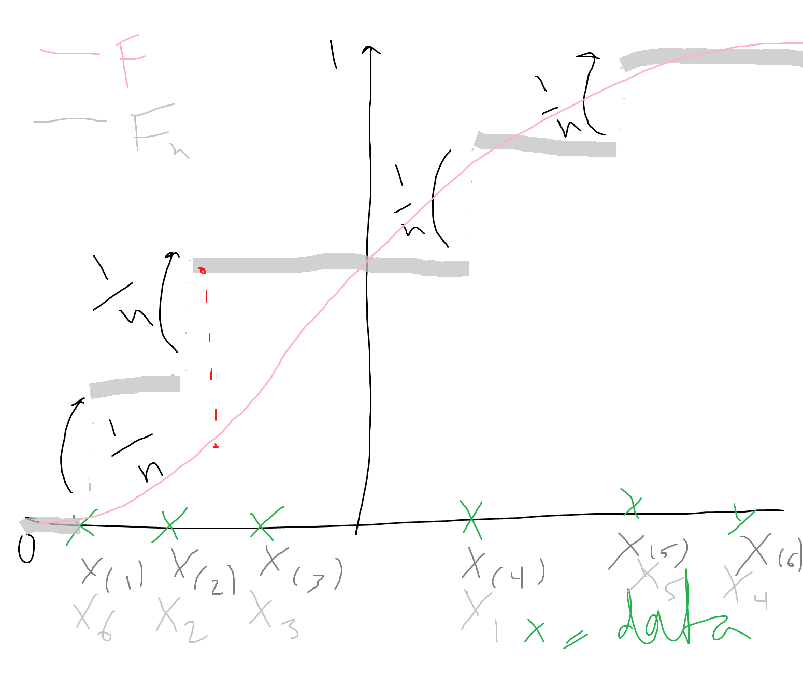
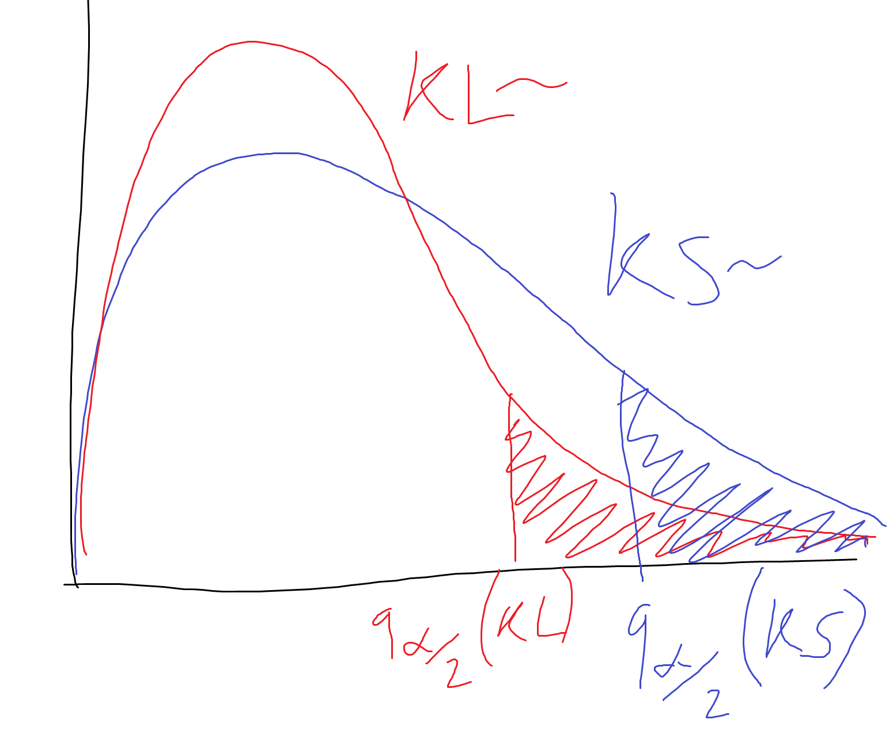
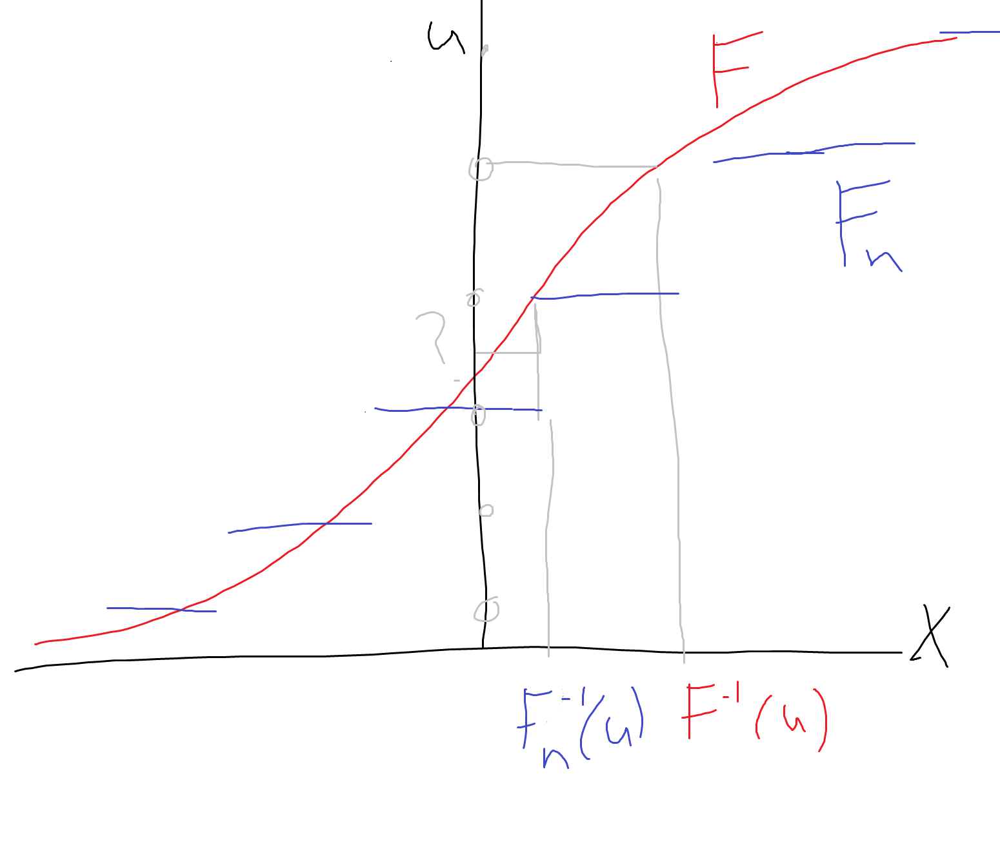
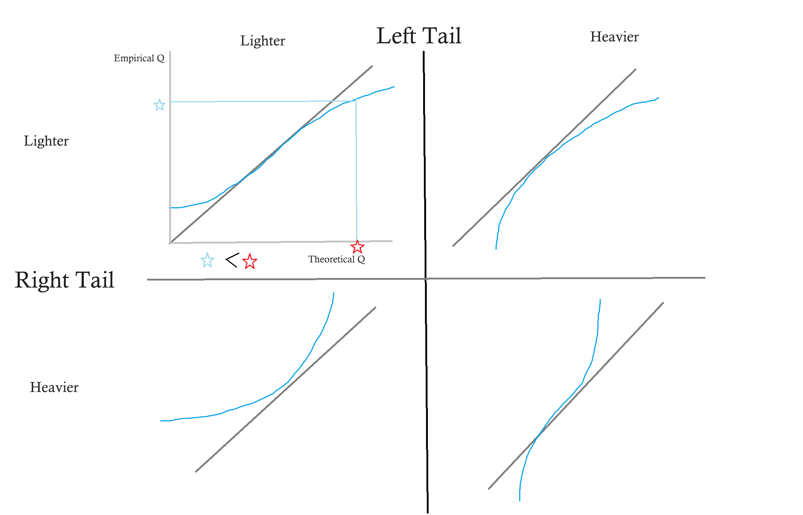
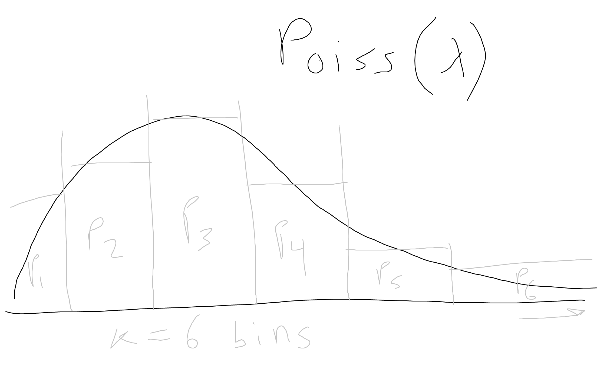
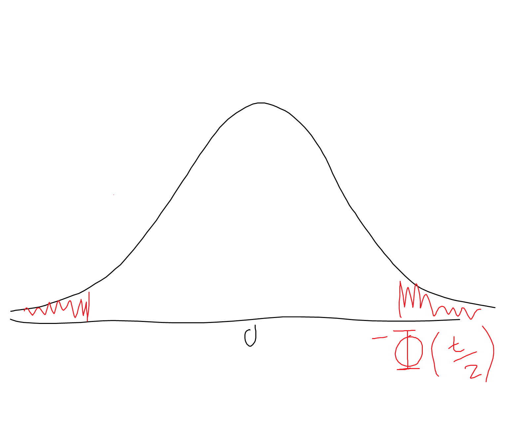
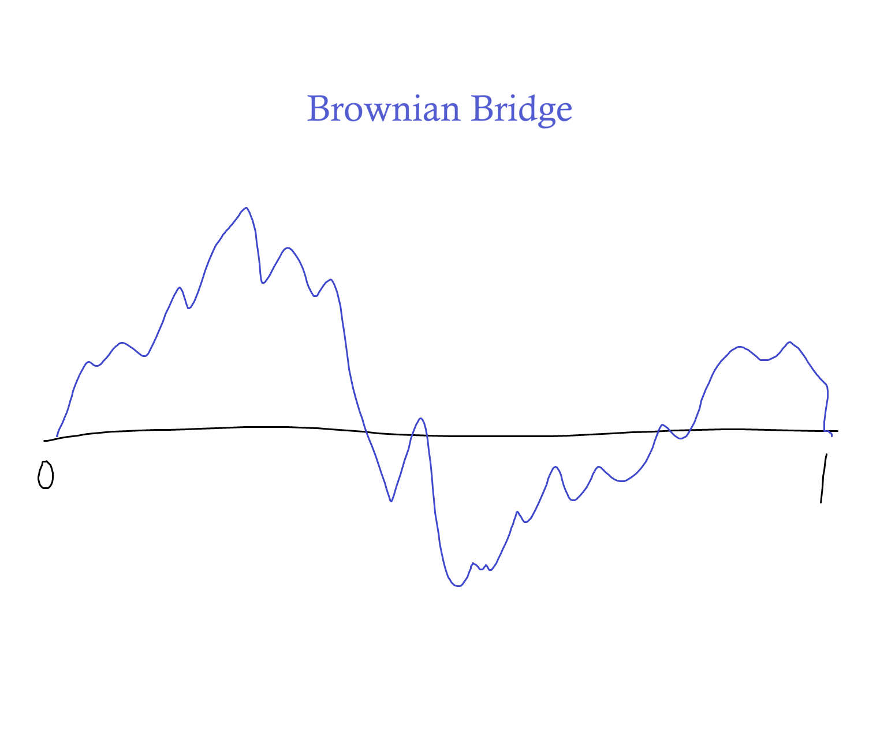

# Lecture 6: Goodness of Fit


Previously we studied hypothesis testing, ending with Student's T test for Gaussian data. Since this test requires the assumption that the data is Gaussian, we raised the point that it would be useful to have a test that quantifies whether a random variable is Gaussian. This idea of testing whether data (a random variable) comes from a particular distribution is known as "goodness of fit".  
Is this distribution a good fit for my data?  
- One example we have already seen - the $\chi^2$ test (for multinomial variables): given a candidate PMF we test whether or not our data has evidence to reject the hypothesis that the candidate PMF is true.  
- But, more often we will be interested in testing whether data is Gaussian.  

## Goodnes of Fit Tests
Let $X$ be a r.v. Given i.i.d. copies of $X$, we want to answer the following types of questions:
- Does $X$ have distribution $N(0,1)$? (Cf. Student's T distribution)  
- Does $X$ have a uniform distribution $U([0,1])$?
    - See example at the end.
- Does $X$ have PMF $p_1=0.3, p_2=0.5, p_3=0.2$?

These are all goodness of fit tests: we want to know if the hypothesized distribution is a good fit for the data.  
Key characteristic of GoF tests: *no* parametric modeling.
- We aren't asking questions about the parameters of a statistical model - not asking is mean equal to $\mu$ or not, for example - we are specifically asking whether our distribution is "this" dsitribution or not.

## CDF and empirical CDF
So without parameteric modeling, we need something that is non-parametric - something that goes beyond computing the mean and standard deviation. Something that computes some other intrinsic aspect of our data. The CDF characterizes the entire distribution of a random variable - it captures everything you need to know about the distribution - so that is a good place to start. We have an empirical, data-driven way to compute an estimate for the CDF, which boils down to replacing expectations with averages...


Let $X_1, ..., X_n$ be i.i.d. r.v. Recall the CDF of $X_1$ is defined as:  
- CDF = $F(t) = P[X_1 \le t], \ \forall t \in \R$  
- By definition of probability, this is equal to $E[1\{X \le t\}]$

**The CDF completely characterizes the distribution of $X_1$.** But it does not require us to compute any parameters.  

**Definition**  
The *empirical CDF* of the sample $X_1, ..., X_n$ is defined as:  
$F_n(t) = \frac{1}{n} \Sigma_{i=1}^n 1\{X_i \le t\}$ = $\frac{\#\{i = 1, ..., n : X_i \le t\}}{n}, \ \forall t \in \R$
- Really just the proportion of all observations that are less than or equal to t
- LLN lets us replace the expectation with an average

By the (strong) LLN, for all $t \in \R$,
- $F_n(t) \xrightarrow[n \to \infty]{a.s.} F(t)$

So this is a good idea point-wise (for each t), but we also want this to hold uniformly, for all t at the same time (not just each t individually). This is given by:

**Glivenko-Catelli Theorem** (fundamental theorem of statistics)
- $\sup_{t \in \R} |F_n(t) - F(t)| \xrightarrow[n \to \infty]{a.s.} 0$
    - For all t's at once $F_n(t)$ converges to $F(t)$. (sup is the max over an infinite set)
    - We know by LLN $F_n(t) \xrightarrow[n \to \infty]{a.s.} F(t)$
    - This is *equivalent* to saying $F_n(t) - F(t) \xrightarrow[n \to \infty]{a.s.} 0$
    - To make this happen for all t's at once, we can show that this second statement (only) is equivalent to $\sup_{t \in \R} |F_n(t) - F(t)| \xrightarrow[n \to \infty]{a.s.} 0$
    - This is strictly stronger than the LLN result:
        - Consider the convergence in probability: $P(|F_n(t) - F(t)| > \delta) \xrightarrow[n \to \infty]{p} 0, \ \forall \delta,t$.
        - Now we want to add the $\sup$ into the equation. But it is possible that the probability that the $\sup$ is larger than $\epsilon$ never goes to 0. For example, if $n$ depends on $t$, $n(t)$
        - We can reqrite the probability limit statement, saying it is equivalent $\Rightarrow \forall \epsilon, \forall t, \forall \delta \text{(there exists)}\exists n > n(\epsilon, t)$, such that:  
        $P(|F_n(t) - F(t)| > \delta) < \epsilon$  
        (this is what the convergence in probability limit statement actually means)
        - But it could be the case that when take $\sup$ over all t, maybe $n(t) = t / \epsilon$. So then if we want this statement to hold for all $t$ at once, we have use the $n$ that works for all $t$'s at once. But there is no such $n$.  
        - What Glivenko-Catelli tells us is that this does not happen. That there is one largest $n$ which works for all $t$ at once. 

Thus, the empirical CDF is a good estimator of the true CDF.  

Inside the CDF estimator $1\{X_i \le t\}$ follows a *Bernoulli* distribution - with parameter $p = F(t)$.  
In particular, the variance = $var(1\{X_i \le t\}) = F(t)(1 - F(t))$.

By the CLT, $\forall t \in \R$,  
- $\sqrt{n} (F_n(t) - F(t)) \xrightarrow[n \to \infty]{(d)} N(0, F(t)(1- F(t)))$

- $\sqrt{n} \frac{(F_n(t) - F(t))}{\sqrt{F(t)(1-F(t))}} \xrightarrow[n \to \infty]{(d)} N(0,1)$

Again, we wonder if this result holds uniformly over t (for all t at once). But it is unlikely that the supremum over all t of these random variables is also going to be Gaussian.  
The reason - this is actually a stochastic process indexed by $t$. Donsker's Theorem below shows we actually converge to the supremum of a Brownian bride (see extension 2 at the end).
- The advantage of this is that **given a Brownian Bridge, we can compute the properties of this stochastic process, and determine the probability it takes any value at any point.**  

**Donsker's Theorem**  
If $F$ is continuous,  
$\sqrt{n} \sup_{t \in \R} |F_n(t) - F(t)| \xrightarrow[n \to \infty]{(d)} \sup_{0 \le \tilde{t} \le 1} |B(t)|$  
where $B$ is a Brownian bridge on $[0,1]$.
- Note that, on the RHS, $\tilde{t} \in [0,1]$, while on the LHS, $t \in \R$. Thus, $\tilde{t} = F(t)$, or  
$\sqrt{n} \sup_{t \in \R} |F_n(t) - F(t)| \xrightarrow[n \to \infty]{(d)} \sup_{t \in R} |B(F(t))|$  
- As discussed above, $B$ is convenient - if we want to compute probabilities on the $\sup$ over all t of $B|(t)|$ (which is basically the maximum value the random process can ever take over all $t$), we can do it. Thus, we can use it as a pivotal distribution and build a test!

## Kolmogorov-Smirnov test
Let $X_1, ..., X_n$ be i.i.d. real random variables with unkown cdf $F$ and let $F^0$ be a **continuous CDF**.  
Consder the two hypotheses:  
- $H_0: F = F^0$ vs $H_1: F \ne F^0$
    - Test if some variable $X$ has particular CDF $F^0$ (which implictly tests if $X$ follows the particular distribution or not)

Let $F_n$ be the empirical CDF of the sample $X_1, ..., X_n$.  
- If $F = F^0$, then $F_n(t) \approx F^0(t)$, $\ \forall t \in [0,1]$
    - Now our strategy is to use the Donsker's theorem result as a test statistic so that under the null it should have about the same distribution as $|B(t)|$ - otherwise we should reject the null.

Let the test statistic be:  
- $T_n = \sup_{t \in \R} \sqrt{n} \ |F_n(t) - F^0(t)|$
- By Donsker's theorem, if $H_0$ is true, then $T_n \xrightarrow[n \to \infty]{(d)} Z$, where $Z$ has a known distribution (the supremum of the absolute value of a Brownian bridge).

This gives us the **KS Test with asymptotic level $\alpha$:** 
- $\delta_\alpha^{KS} = 1\{T_n > q_\alpha\}$,  
where $q_\alpha$ is the $(1 - \alpha)$-quantile of $Z$ (look it up in the table)  
- p-value of KS test:  $P[Z > T_n | T_n]$

Computing the KS Test Statistic in Practice:  
- In practice, the test statistic relies on computing the supremum over all t, which is not really possible.
- $F^0$ is non decreasing (it is a CDF), $F_n$ is piecewise constant (with jumps at each $t_i = X_i, \ i = 1, ..., n$).  
- Let $X_{(1)} \le X_{(2)} \le ... \le X_{(n)}$ be the reordered sample. (indices in parentheses since we are just re-indexing) 
- **The expression for $T_n$ reduces to the following practical formula:**  
$T_n = \max_{i = 1, ..., n} \{ \max \ (F^0(X_{(i)}) - \frac{i - 1}{n}), \frac{i}{n} - F^0(X_{(i)}) \ \}$
    - basically we compare our emprical CDF with the true CDF (in the example below, it is for a Gaussian)  
    - The KS test is telling us how far these 2 curves get in the *worst possible case* (for example, they are farthest at the point marked by the red dashed line)
    - Since the emprical CDF does not change between 2 data points (piecewise) and the null CDF is only increasing, it is enough to just consider the $F_n(X_i)$ points. The point at which these 2 curves are farthest apart has to be at one of the observations. So instead of looking at tjhe $\sup$ across all $t$, we just need to find the maximum across all our observations.  
    - Also note that $F_n(X_i)$ is just the number of jumps i've had ($i$) divided by the total number of observations $n$ (as long as we only have unique values in $X$), thus the above formula shows we are comparing the difference just before the jump with the difference at the jump, and finding the largest.
    


$T_n$ is called a *pivotal test statistic* - if $H_0$ is true, the distribution of $T_n$ does not depend on the distribution of the $X_i$'s and it is easy to reproduce it in simulations.  
Indeed,  
- let $U_i = F^0 (X_i), \ i=1, ..., n$ and let $G_n$ be the empirical CDF of $U_1, ..., U_n$.  
- if $H_0$ is true, then $U_1, ..., U_n \sim_{iid} U([0,1])$  
and $T_n = \sup_{0 \le x \le 1} \sqrt{n} |G_n(x) - x|$  

For some large integer $M$:  
- Simulate $M$ i.i.d. copies $T_n^1, ..., T_n^M$ of $T_n$.
- Estimate the $(1 - \alpha)$-quantile of $q_\alpha^{(n)}$ of $T_n$ by taking the sample $(1-\alpha)$-quantile $\hat{q}_\alpha^{(n,M)}$ of $T_n^1,..., T_n^M$  
- Approximate p-value of the test:  
$p-value \approx \frac{\# \{j = 1,...,M: T_n^j > T_n\}}{M}$
- These quantities are often pre-computed in a table.


One reason we might want to use the KS test:  
- We often hope our data is Gaussian, since this allows us to use a whole arsenal of statistical techniques that rely on the assumption of Gaussian data (for example, we can test if our data is Gaussian before running a T test, which relies on Gaussian assumption).  
- Imagine if we used a parametric hypothesis test, which tests whether our data follows a Gaussian distribution, with some mean $\mu_0$ and variance $\sigma^2_0$.
- But this deprives our test of the possibility to reject the Gaussian hypothesis just based on the fact that the mean or variance is wrong. We want a test with low power, where we can use the null hypothesis that our data is Gaussian and have a low probability of rejecting.  
- The KS test makes no assumptions about the parameters. 


## Other goodness of fit tests
We want to measure the distance between two functions: the emprical CDF $F_n(t)$ and the hypothetical true CDF $F(t)$. Really we just want to know whether they are close, or not.  
- Kolmogorov-Smirnov:  
$d(F_n, F) = \sup_{t \in \R} |F_n(t) - F(t)|$
    - "the sup norm" over all t
- Cramer-Von Mises:  
$d^2(F_n, F) = \int_\R [F_n(t) - F(t)]^2 \ dt$ 
    - the squared L2 norm, integrated
- Anderson-Darling:  
$d^2(F_n, F) = \int_\R \frac{[F_n(t) - F(t)]^2}{F(t)(1-F(t))} dt$
    - the squared L2 norm, integrated, with weights accounting for variance

The KS test is most widely used. Whichever test has the most power depends on the alternative hypothesis, but often we are going to mostly care about the null hypothesis so it doesn't really matter which we choose.  


## Kolmogorov-Lilliefors Test
### Composite Goodness of Fit Tests  
    As stated before, a key motivation for goodness of fit tests is determining if our data is Gaussian so that we can run a T test. We don't care about the parameters of the distribution yet, we just need the data to be any Gaussian in the Gaussian family. Thus, it makes sense to compare the data with the Gaussian that seems most natural for our data - the one with parameters, mean $\mu$ and variance $\sigma^2$, equivalent to the mean and variance of our data...

What if I want to test: "Does $X$ have a Gaussian distribution?" but I don't know the parameters?  
Simple idea: plug-in the empirical parameters from the data and use the following test statistic:  
- $\sup_{t \in \R} |F_n(t) - \Phi_{\hat{\mu}, \hat{\sigma}^2}(t)|$  
    - where $\hat{\mu} = \bar{X}_n$ and $\hat{\sigma}^2 = S^2_n$
    - and $\Phi_{\hat{\mu}, \hat{\sigma}^2}(t)$ is the CDF of $N(\hat{\mu}, \hat{\sigma^2})$
        - Thus $\Phi_{\hat{\mu}, \hat{\sigma}^2}(t) = P(X \le t), X \sim N(\hat{\mu}, \hat{\sigma}^2)$

In this case, Donsker's theorem is *no longer valid.*  
- The distribution of the test statistic is still valid, but since $\hat{\mu}$ and $\hat{\sigma}^2$ are now random variables instead of fixed, the distribution becomes distorted. We must adjust for this. 

### Kolmogorov-Lilliefors Test
So we compute the quantiles of the test statistic:  
- $\sup_{t \in \R} |F_n(t) - \Phi_{\hat{\mu}, \hat{\sigma}^2}(t)|$  

slightly differently.

The statistic does not actually depend on unkown parameters, as shown below, so it is a pivotal statistic with a pivotal distribution.  

Proof that KL test statistic does not depend on unkown parameters:
- Since CDF $\Phi_{\hat{\mu}, \hat{\sigma}^2}(t) = P(Y \le t), Y \sim N(\hat{\mu}, \hat{\sigma}^2)$
- There exists $\exists Z \sim N(0,1)$ s.t. $Y = \hat{\sigma} Z + \hat{\mu}$
    - Since $Z = \frac{Y - \hat{\mu}}{\hat{\sigma}}$
- $\Rightarrow \Phi_{\hat{\mu}, \hat{\sigma}^2}(t) = P(\hat{\sigma}Z + \hat{\mu} \le t)$
- $\Rightarrow P(Z \le \frac{t - \hat{\mu}}{\hat{\sigma}})$
    - Now since $Z$ is standard normal, this is really just the CDF of the standard guassian but not compute at point $t$, but rather at point $\frac{t - \hat{\mu}}{\hat{\sigma}}$
- Thus, we can say:  
$\Phi_{\hat{\mu}, \hat{\sigma^2}}(t) = \Phi_{0, 1}(\frac{t - \hat{\mu}}{\hat{\sigma}})$
- Using what we've just learned, re-write the statistic:  
$\sup_{t \in \R} |\frac{1}{n} \Sigma_{i=1}^n 1\{X_i \le t\} \ - \ \Phi_{0,1}(\frac{t - \hat{\mu}}{\hat{\sigma}^2})|$
    - empirical CDF minus our hypothesized CDF
- $\Rightarrow \sup_{t \in \R} |\frac{1}{n} \Sigma_{i=1}^n 1 \{ \frac{X_i - \hat{\mu}}{\hat{\sigma}} \le \frac{t - \hat{\mu}}{\hat{\sigma}} \} \ - \ \Phi_{0,1}(\frac{t - \hat{\mu}}{\hat{\sigma}^2})|$  
and let's write $u = \frac{t - \hat{\mu}}{\hat{\sigma}}$
- Thus, when taking the supremum over $t$, which ranges across all real numbers from $(-\infty, \infty)$, $u$ also ranges from $(-\infty, \infty)$
- So we can write the $\sup$ over $t$ as $\sup$ over $u$:  
$\Rightarrow \sup_{u \in \R} |\frac{1}{n} \Sigma_{i=1}^n 1 \{ \frac{X_i - \hat{\mu}}{\hat{\sigma}} \le u \} \ - \ \Phi_{0,1}(u)|$  
- Observe that, **under the null ($H_0: X \sim N(\mu, \sigma^2)$)**, there does exist a $\mu$ and $\sigma$ (though they are unkown), so:   
$\Sigma_{i=1}^n 1 \{ \frac{X_i - \hat{\mu}}{\hat{\sigma}} \le u \} = \frac{1}{n} \Sigma_{i=1}^n 1\{ \frac{\sigma Z_i + \mu - \hat{\mu}}{\hat{\sigma}} \le u \}$  
(divide by $\sigma$) $\Rightarrow \frac{1}{n} \Sigma_{i=1}^n 1\{ \frac{\frac{\sigma Z_i + \mu - \hat{\mu}}{\sigma}}{\frac{\hat{\sigma}}{\sigma}} \le u \}$  
- Now we need to check whether the distribution of this quantity depends on the unkown parameters. The distribution of this indicator function itself is Bernoulli - it takes 1 with some probability or else 0 - and so all we need to compute is its expectation, the probability $p$ that this indicator function returns 1. It turns out that this probability does *not* depend on $\mu$ or $\sigma$:  
    - Since $\hat{\mu} = \bar{X}_n \sim N(\mu, \sigma^2 / n)$, then $\frac{\hat{\mu} - \mu}{\sigma} \sim N(0,1/n)$, which does not depend on the unkown parameters, so the numerator is clear - The marginal distribution of the numerator does not depend on $\mu$ or $\sigma$.  
    - Also, since $n \frac{\hat{\sigma}^2}{\sigma^2} \sim \chi^2_{n-1}$, the denominator has distribution $\sqrt{\chi^2_{n-1} / n}$, which does not depend on the unkown parameters - so the marginal distribution of the denominator does not depend on $\mu$ or $\sigma$.  
    - We also need to check the independence of $\hat{\mu}$ and $\hat{\sigma}$, since their correlation could depend on $\mu$ and $\sigma$. But since $\hat{\mu} \perp \hat{\sigma}$ (independent), the joint distribution of $(\frac{\hat{\mu} - \mu}{\sigma}, \frac{\hat{\sigma}}{\sigma})$ does not depend on $\mu$ or $\sigma$.


Using the KL test, it will be harder to fail to reject the null relative to using the KS test - thus, people tend to use the KS test.
- Consider the KS test stat $\sup_{t \in \R} \sqrt{n} \ |F_n(t) - F^0(t)|$
 and KL test stat $\sup_{t \in \R} |F_n(t) - \Phi_{\hat{\mu}, \hat{\sigma}^2}(t)|$  
- Consider that in the KS test, our empirical CDF $F_n(t)$ is an indicator which relies on the "true" (under the null) population parameters $\mu$ and $\sigma$. Since it is an indicator, the function itself has a Bernoulli distribution, just as we discussed in the KL test. But in the KL test, the indicator function incorporates random variables - $\hat{\mu}$ and $\hat{\sigma}$ - so the fluctuations in the resulting Bernoulli distribution will be larger. For both functions, the expectation of the Bernoulli indicator function will be the same as that of the null CDF, but the larger fluctuations make it harder to fail to reject the test that the empirical CDF is equal to the null CDF.



## Quantile-Quantile Plots
So far we have seen numerical ways to test whether a distribution is a good fit for our data.  
We can also use visual checks to evaluate the distribution of our data.  

Quantile-Quantile plots provide a visual way to perform goodness of fit tests.  
Not as a formal test, but a quick and easy check to see if the distribution is plausible. All we really do is compare the empirical quantiles of our data to the quantiles of the theoretical distribution.  

Main idea:  
- we want to check visually if the plot of $F_n$ is close to that of $F$ - or equivalently if the plot of $F_n^{-1}$ is close to that of $F^{-1}$
- If the functions are close, our points will fall in a straight line, y = x.
- We tend to be most interested in how the tails of our 2 distributions compare. When $F$ and $F_n$ are quite different, you will notice the more extreme quantiles do not match up.

It is most convenient to check if the following set of points are close to the line $y = x$:  
- $(F^{-1}(\frac{1}{n}), \ F_n^{-1} (\frac{1}{n}))$,  
$(F^{-1}(\frac{2}{n}), \ F_n^{-1} (\frac{2}{n}))$,  
...  
$(F^{-1}(\frac{n-1}{n}), \ F_n^{-1} (\frac{n-1}{n}))$
    - So the inverse functions map a probability ($P[X \le t]$) between 0 and 1 back to $\R$

Note that the empirical CDF $F_n$ is not actually invertible, but we define:  
- $F_n^{-1} (i / n) = X_{(i)}$, the $i$'th largest observation  
($(i)$ being the reordered indices)
    - recall that our empirical CDF can be constructed as the piecewise linear function, as seen below. $F$ and $F^{-1}$ map between $u$ and the $X$, for any value. But imagine we try to plot an $X$ value such that $F_n(X) = u$ lies between one of the jumps in $F_n$ - then we don't really know what the value of $F_n$ will be (we would have to pick either the value on the upper bound of the jump or the lower bound), but we always *do* know what $F_n^{-1}$ will be, since it is the same for both sides of the jump.
    - Thus, we are just going to use the data points we have to compute $F_n^{-1}$ - since the jumps in the eCDF occur exactly at our observations. If we reorder our X values from smallest to largest, we know that the $F_n^{-1}(u)$ is computable and is just the $X_{(i)}$ values. Those are our empirical quantiles.
    - The $F^{-1}$ is just the inverse of the CDF, for the distribution that represents our null hypothesis. These are computable or estimatable given the formula for $F$ - look up in a table somewhere. (Note that the CDF gives us $P(X \le t)$ for some quantile $t$ so the inverse of a CDF evaluated at some probability is the quantile which would have produced that probability.)
    

We can interpret QQ plots as providing information especially about the tails of our 2 distributions. For example, consider the table below. Imagine that each plot is a Normal QQ Plot, such that the x-axes are the quantiles from the (theoretical) standard Gaussian. When a right tail curls up from the 45 degree line, this indicates that the data (empirical distribution) has a larger value at this quantile relative to the standard Gaussian, and so it has a heavier tail. When the right tail curls down, this indicates that the data has a smaller relative value at this quantile. Similairly, when a left tail curls up from the 45, this indicates the empirical distribution has a smaller value than the theoretical, so the tail is lighter. If the left tail curls down, it has a larger relative value.   


    Note: Software might not follow the precise method given here for making QQ plots. In general, software follows methods to keep 45 degree line the reference line - so a practitioner really just needs to consider how well the QQ plot follows the 45 deg line and consider these patterns to interpret the tails.

## $\chi^2$ goodness of fit test (finite case)
    We have seen a $\chi^2$ test previously, used to check if a sample from some multinomial distribution is equivalent to a hypothesized multinomial distribution, for example, a uniform ($\chi^2$ test of proportions - for example, is the distirbution of CEO zodiac signs uniform?).  
    In one example we compared the distribution of races in a juror sample to the true distribution of races in the juror population. To do so, *we had to assume that we really knew the true population distribution*, but typically this is not the case.  
    One thing we can do is test more generally if our data comes from the Binomial distribution family.  

Let $X_1, ..., X_n$ be i.i.d. random variables on some finite space $E = \{a_1, ..., a_K\}$ for some probability measure $P$.  
Let $(P_\theta)_{\theta \in \Theta}$ be a paramteric family of probability distributions on $E$.  

For $j = 1, ..., K$ and $\theta \in \Theta$, set
- $p_j(\theta) = P_\theta[Y = a_j]$, where $Y \sim P_\theta$  

and
- $p_j = P[X_1 = a_j]$

Consider the two hypotheses:  
- $H_0: P \in (P_\theta)_{\theta \in \Theta}$ vs $H_1: P \notin (P_\theta)_{\theta \in \Theta}$
- In other words, we want to test if our data's probability distribution is in the null family of distributions or not.

Testing $H_0$ means testing whether the statistical model $(E, (P_\theta)_{\theta \in \Theta})$ **fits** the data.  
Thus, $H_0$ is equivalent to:  
- $p_j = p_j(\theta)$, $\ \forall j = 1,...,K$, for some $\theta \in \Theta$
    - The $p_j$'s are the probabilities calculated from the sample (e.g., simple proportions in the Binomial case), and the $p_j(\theta)$'s are the theoretical probabilities for the given $j$ under the null distribution $P_\theta$ (e.g., probabilities from Binomial probability mass function as detailed below).

Let $\hat{\theta}$ be the MLE of $\theta$ **when assuming $H_0$ is true.**  
Let:  
- $\hat{p}_j = \frac{1}{n} \Sigma_{n=1}^n 1\{X_i = a_j\} = \frac{\# \{i: X_i = a_j\}}{n}$, $~~ j = 1, ..., K$

**Idea:** If $H_0$ is true, then $p_j = p_j(\theta)$, so both $\hat{p}_j$ and $p_j(\hat{\theta})$ are *good* estimators of $p_j$.  
Hence, $\hat{p}_j \approx p_j(\hat{\theta}), ~~ \forall j = 1, ..., K$  

So, define the test statistic:  
- $T_n = n \Sigma_{j = 1}^K \frac{(\hat{p}_j - p_j(\hat{\theta}))^2}{p_j(\hat{\theta})}$
    - This is the $\chi^2$ test statistic

If $H_0$ is true, then (under some technical assumptions):  
- $T_n \xrightarrow[n \to \infty]{(d)} \chi^2_{K - d - 1}$  
where $d$ is the size of the parameter vector $\theta$
- Technical assumptions: $\Theta \in \R^d$ and $d < K - 1$
- Comparison to $\chi^2$ test of propotions:
    - Previously we saw $n \Sigma_{j=1}^K \frac{(\hat{p}_j - p_j^0)^2}{p_j^0} \ \xrightarrow{(d)}_{n \to \infty} \ \chi^2_{K-1}$
    - Now the degrees of freedom is different. Cosnider that d.o.f. are really quantifying the number of ways our sample probabilities could be different from the null. Before we had a more general test - testing if our sample probabilities were equal to a vector of population probabilities, or to anything else, and there were many ways they could be equal to anything else (a large set of alternative possibilities, essentially all possible PMFs). Now we are testing something more specific - testing if our sample probabilities come from the parametric family $P_\theta$. So now the d.o.f. represent the number of ways we can move along this family - a much smaller subset. And now the bigger the dimension of $\theta$, the smaller the d.o.f., because moving away from the parametric family is harder and harder.

This gives us the test with asymptotic level $\alpha \in (0,1)$:  
- $\delta_\alpha = 1\{T_n > q_\alpha\}$ where $q_\alpha$ is the $(1-\alpha)$-quantile of $\chi^2_{K-d-1}$
- p-value: $P[Z > T_n | T_n]$, where $Z \sim \chi^2_{K - d - 1}$ and $Z \perp T_n$ (independent).

We don't need to claim that $T_n$ has a pivotal distribution for finite $n$ (which is not true, it will depend on what the actual distribution is) but asymptotically we have a $\chi^2$ which does not depend on any parameters. (So this test relies on asymptotic assumptions.)

Example:
- On $E = \{1, ..., K\}$ consider the family of binomial distributions $(Bin(n, p))_{p \in (0,1)}$ ($n$ trials, $p$ probability of success)
- We don't know $p$, but we might estimate it from the data, and we can think of it as the true $p$ since we will use asymptotics.
- Thus, for a given $n$ (trials) and the estimated $p$ (probability of success), we can compute a probability ($P = \binom{n}{k} p^k (1 - p)^{n-k}$) for all $k$ (number of successes), and can use these probabilities as our null hypothesis probabilities (whereas previously we assumed we just knew them)
```
-----------------------------------------------------------------------------
| j :        | 0                | 1                | ... | K                |
-----------------------------------------------------------------------------
| "true" P   | P[Bin(n, p) = 0] | P[Bin(n, p) = 1] | ... | P[Bin(n, p) = K] |
|                ($p_0(n,p)$)        ($p_1(n,p)$)             ($p_K(n,p)$)
-----------------------------------------------------------------------------
| observed P | proportion of 0s | proportion of 1s | ... | Proportion of n  |
|                  ($p_0$)            ($p_1$)        ...      ($p_K$)       |
|---------------------------------------------------------------------------|

```
- And now we essentially want to check if these two sets of probabilities (the "true probabilities" for a Binomial and the observed probabilities) are close or not.  
- More formally, our null hypothesis is that our data's distribution belongs to the Binomial family, our alternative is that id does not. This is equivalent to testing if the $p_j$'s are the $p_j(\theta)$'s that come from the Binomial (probabikity of $j$ successes in $n$ trials with $p$ prob. of success).
- We use MLE to find $\hat{\theta}$ - estimate the parameters from the data, in this case we estimate $p$ for the Binomial - and we use the sample proportions for $\hat{p}$, then compute the test statistic and compare it with $1 - q_\alpha$ quantile $\chi^2_{K - d - 1}$ where $d = 1$ for the Binomial case.


## $\chi^2$ goodness of fit test (infinite case)
> If our sample space is infinite, we can proceed by binning the sample space and running our test just as before, with just a slight, straight-forward tweak to how we define $p_j(\theta)$ and $\hat{p}_j$.


if $E$ is infinite (e.g., $E = \N, E = \R$):  
Partition $E$ into $K$ disjoint bins:  
- $E = A_1 \cup  ... \cup A_K$  

Define, for $\theta \in \Theta$ and $j = 1,...,K$:
- $p_j(\theta) = P_\theta[Y \in A_j]$, for $Y \sim P_\theta$
    - true proportion of observations in bin $A_j$ under the parametric (null) distribution
- $p_j = P[X_1 \in A_j]$
    - the "true" proportion of observations in bin $A_j$, regardless of if the null distribution is true
- $\hat{p}_j = \frac{1}{n} \Sigma_{i=1}^n 1\{X_i \in A_j\} = \frac{\#\{i: ~ X_i \in A_j\}}{n}$
    - the proportion of sample observations in bin $A_j$
- $\hat{\theta}$: same as in previous case - assume $H_0$ is true, estimate from data using MLE

As previously, let the test statistic be:
- $T_n = n \Sigma_{j = 1}^K \frac{(\hat{p}_j - p_j(\hat{\theta}))^2}{p_j(\hat{\theta})}$

Under some technical assumptions, if $H_0$ is true then:  
- $T_n \xrightarrow[n \to \infty]{(d)} \chi^2_{K - d - 1}$,  
where $d$ is the dimension of the parameter vector $\theta$
- (assumptions - $\Theta \in \R^d$ and $d < K - 1$)

And we have test with asymptotic level $\alpha \in (0,1)$:  
- $\delta_\alpha = 1\{T_n > q_\alpha\}$, for $q_\alpha$ the $(1 - q_\alpha)$-quantile of $\chi^2_{K-d-1}$


Drawbacks:
- If our test tells us to reject the null, all we can say is - "my distribution does not look like it can be binned in this way", so binning has consequences on what we can really conclude
- When it comes to testing for normality, this test is slightly weaker than the Kolmogorov tests because, while those tests are valid for finite samples, the $\chi^2$ is only valid asymptotically - we use $\hat{\theta}$ and pretend (hope) $n$ is large enough for parameters to have converged.  
- [StackExchange: Considerations for when to use $\chi^2$ vs Kolmogorov and co.](https://physics.stackexchange.com/questions/107682/kolmogorov-smirnov-test-vs-chi-squared-test)

Practical Issues:  
- Choice of K?
    - Consider your problem at hand, but truly we can pick our bins arbitrarily - they don't have to be consistent sizes or adjacent. But remember it has consequences for how we interpet the test
- Choice of the bins $A_1, ..., A_K$ ?
    - Don't use just 1 bin, and should have at least 1 observation per bin
    - Otherwise choose what you want, look up some rule of thumbs, whatever
- Computation of $p_j(\theta)$ ?
    - Can get complicated to compute integrals

Example: Let $E = \N$ and $H_0: P \in (Poiss(\lambda))_{\lambda > 0}$
- If one expects $\lambda$ to be no larger than some $\lambda_{max}$, one can choose $A_1 = \{0\}, A_2 = \{1\}, ..., A_{K-1} = \{K - 2\}, A_K = \{K-1, K, K+1, ...\}$ with $K$ large enough such that $p_K(\lambda_{max}) \approx 0$
- (ie, because Poisson has infinite tail, we just make one bin the group of all values to the right of some likely maximum value)




\
\
\
\
\
\
\
\
---
## Extension 1 - Uniform Distribution of p-values
One goodness of fit question is: does some random variable have a uniform distribution? A specific example: given some test, do the p-values under the null have a uniform distribution? Shown below is the proof that they should.
- Consider the distribution of the p-value under $H_0$  
- Imagine test $H_0: \mu =0$ vs $H_1: \mu \ne 0$, and let $p-value = P[|\sqrt{n}\frac{\bar{X}_n - 0}{\sigma}| > |\sqrt{n} \frac{\bar{x}_n - 0}{\sigma}|]$, where $\bar{x}_n$ is the observation, so the RHS is the realized test statistic (also assume we know $\sigma$ for simplicity). So the p-value is the probability that we exceed this observed quantity.
- Now if $\Phi = \text{CDF of } N(0,1)$, then $p-value = 2 \Phi(-|\sqrt{n}\frac{\bar{X}_n}{\sigma}|)$, so we can view our p-value as a function of a r.v., making it a r.v. too.
- Now under the null $H_0$, $\sqrt{n}\frac{\bar{X}_n}{\sigma} \sim N(0,1)$. So our r.v. p-value is $2\Phi(-|N(0,1)|)$
- Now we need to try and figure out the distribution of this r.v., which we can do by trying to compute the CDF - $P(2\Phi(-|N(0,1)|) \le t)$
    - Note, $t \in [0,1]$ because CDF $\Phi \in [0,1]$, $2\Phi \in [0,2]$, but since we look at $-|N(0,1)|$ we are only looking at half of the Gaussian (that < 0), so t ranges from 0 to 1.
- This is equal to $P(|N(0,1)| > -\Phi^{-1}(t/2))$, which is the probability of being outside of this RHS number, as shown below:  

- This probability is equal to $2 \Phi \circ \Phi^{-1}(t/2) = 2 I(t/2) = t$.
- Thus for all values of the r.v., p-value, the probability that the p-value is less than or equal to t is t. Thus it is uniformly distributed. $2\Phi(-|N(0,1)|) \sim U([0,1])$.  
- For *any* test we can show that the distribution of the p-value under the null is uniform. Thus, if we used a test on a bunch of different datasets, we could collect the p-values and test whether they have a null distribution.


## Extension 2 - Brownian Bridge
- A stochastic process is just a sequence of random variables, indexed by something (for example, time) - in this case $t$ is the index into the CDF.
- We can think of incrementing from one $t$ to the next as adding another Gaussian r.v. to the process, and so we might expect to see some kind of Brownian motion. We don't quite see this, because in Brownian motion the variance contiuously increases as Gaussian's are added ($t$ increases). In our case, variance equals 0 at $t = -\infty$ and $t = \infty$, so we must have a process where the variance decreases back to 0 as $t$ gets large or small. This is called a Brownian Bridge.
- The advantage of this is that **given a Brownian Bridge, we can compute the properties of this stochastic process, and determine the probability it takes any value at any point.**  


Another way to think about the stochastic process:  
For all $t$, we have a Gaussian distribution.  
A Brownian motion for a random variable indexed by $t$, $X_t$, is such that, $E[X_t] = 0, \forall t$, and the increments between $X_t$'s follow a certain distribution, so that $E[X_t - X_s] \sim N(0, t-s)$ (so the increments have bigger variance as we go farther into the process), and we have some covariance structure between $X_t$ and $X_s$: $Cov(X_s, X_t) = \min(s, t)$  
If we say $s = 0$, then we can see that the $t$'th $X$ has distribution $N(0, t)$ - so the variance just blows up as $t \to \infty$.  
In Donsker's theorem, we know that the variance should not blow up forever - since it is forced back to 0.  
Thus in Donsker's theorem, we have some process that always has mean 0 and whose variance has to be 0 at $t = +/- \infty$.   
This is not a Brownian Motion but rather is known as a Brownian Bridge.