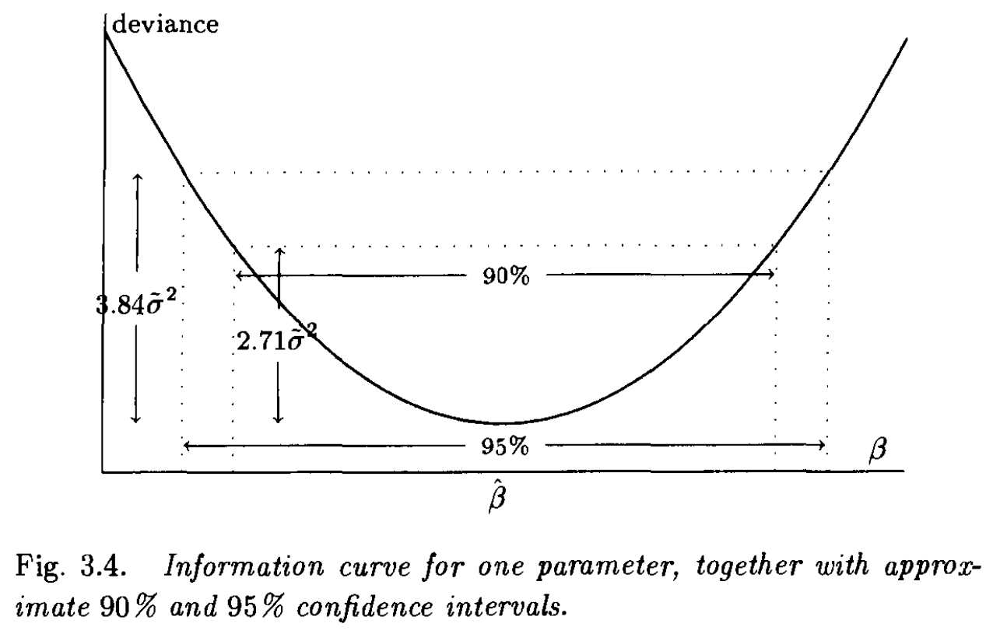
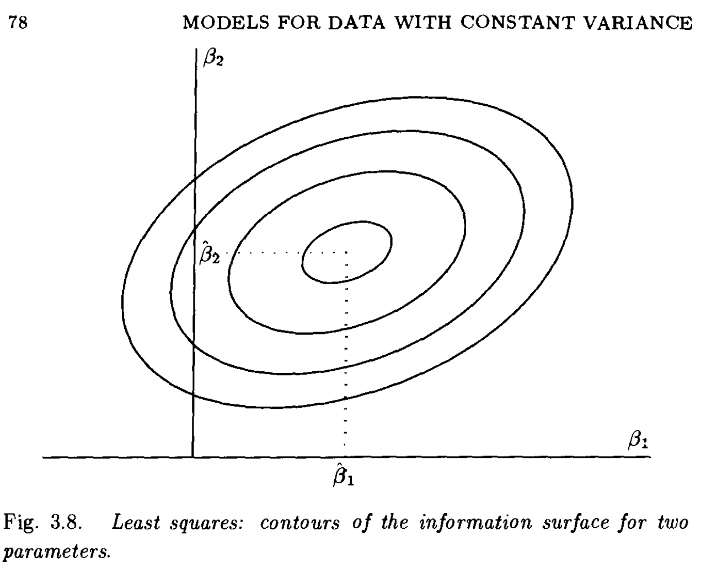

# Generalized Linear Models, continued

Notes based on [the book by Nelder and McCullagh, 1989](https://www.utstat.toronto.edu/~brunner/oldclass/2201s11/readings/glmbook.pdf).

# Normal/Gaussian GLM with constant variance

When our outcome is continuous and its possible values span the whole real line, we can use the Normal distribution to model $Y$.  
In particular, if we assume a constant variance across observations, we can build a model like:  
- Random Component: $Y \sim N_n(\mu, \sigma^2 I_n)$
- Systematic Component / Linear predictor: $\eta = X \beta$
- Identity Link: $\mu = \eta$  

Thus, $E[Y] = \mu = X \beta$.  

In classical linear models we assume the vector of observations $y$ are realizations of a random variable $Y$, which is Normally distributed with moments $E[Y] = \mu$ and $cov(Y) = \sigma^2 I$, which indicates the obs have equal variances and are independent.  
- Typically, we motivate them with least squares rather than likelihood theory, but it can be shown that they are equivalent.  
- In that case, we say that $Y = X \beta + \epsilon$, where $\epsilon \sim N(0, \sigma^2 I)$ is the "error" term, and we minimize the sum of squared residuals to estimate the elements of $\beta$.
- Basic theory of linear transformations of random variables tells us that $X \beta + \epsilon \sim N(X \beta, \sigma^2 I)$.

Arguably, the most important assumption here is that of constant variance across observations, since "the theory of least squares can be developed using only first- and second-moment assumptions in addition to independence, without requiring the additional assumption of Normality"
- This should be checked, for example graphically by examining the residuals.

## When to use it

Obviously we can/should use this case of the GLM if we have an outcome variable that matches the assumptions of a Normal r.v. - e.g., if the outcome is continuous and can take any value on the real line.  

M&N expand this a bit though, saying:
- It can also be used as an approximation for discrete measurements
- It can be used to model continuous data that is strictly postiive (e.g., height or weight) as long as the data are sufficiently far from zero. For example if data have a mean of 100 and s.d. of 10, the part of the Normal distribution covering the negative half of the real line is is negligible for most practical purposes
    - If the data are or could be close to zero, then this would be a bad idea, and the gamma distribution might be used instead
    - *I find this was interesting since GLMs are often mentioned as a required alternative to classic linear regression specifically to model data that isn't continuous or spanning all of $\mathbb{R}$. It gives some more strength to the approach, in econometrics for example, where linear regression is used almost exclusively for causal inference-type modeling since it is relatively interpretable. If data is sufficiently far from 0, it very well may be worth modeling it as Normal, as opposed to something else. All models are wrong after all.*     

## Information matrix

*M&N pg. 72*  

Fitting by OLS has a simple geometric interpretation - the fitted values are the orthogonal projections of the observed values onto the column space of $X$.  

As described by M&N, data vector $y$ can be thought of as a point or vector in $n$-dim Euclidean space.  
For any given value of parameter vector $\beta$, the vector of fitted values $\mu = X \beta$ is a vector in the same space.  
As $\beta$ varies over all possible values, $\mu$ traces out a linear subspace - a hyperplane - called the *solution locus*.

If $\mu$ represents a point on the solution locus, then $\sum (y_i - \mu_i)^2$ (sum of squared residuals) is just the squared Euclidean distance between the two vectors.  

Thus, maximizing the likelihood is equivalent to choosing point $\hat{\mu} = X \beta$ that is nearest to the observed $y$ - i.e., has minimum Euclidean distance.  

The distance between the data and any arbitrary point on the solution locus is given by $(y - x \beta)^\top (y - x \beta)$ (for arbitrary $\beta$).  
Thus, if we plot this as a function of $\beta$ we get a curve like the one shown below, where the minimum is at the maximum likelihood estimate $\hat{\beta}$:

The second derivative of this parabola, which characterizes its curvature, is $x^\top x$. If we now restore the dispersion parameter $\sigma^2$, which divided the sum of squares, the second derivative becomes $x^\top x / \sigma^2$, which is the **Fisher information** for $\beta$.  

If the Fisher information, or curvature, is large, the parabola is steep-sided so that small changes in $\beta$ away from $\hat{\beta}$ lead to large changes in the discrepancy or deviance. Thus we say $\beta$ is "well-determined by the data" - there is a large amount of "information" in the data that indicates the value of $\hat{\beta}$.   

If the Figher information is small, the parabola is relatively flat and small changes away from $\hat{\beta}$ lead to only small changes in the discrepancy. Thus $\beta$ is "poorly determined by the data" - there is little information in the data that indicates the value of $\hat{\beta}$, and more uncertainty.  

Note that the Fisher information for $\beta$ depends on 2 quantities:  
- The numerator depends only on the model matrix $x$.
- The denominator depends on the error variance of the response.  

The inverse of the Fisher information gives the theoretical sampling variance ("sampling distribution variance") of the estimate $\hat{\beta}$:  
$var(\hat{\beta}) = \sigma^2 / (x^\top x)$.  
- note that if the information is large, then its inverse - and thus this variance - is small. So more information is related to less variance in the estimate.

For a model with 2 covariates, the solution locus is a plane in $\mathbb{R}^n$ defined by $x_1 \beta_1 + x_2 \beta_2$, for varying values of $\beta_1$ and $\beta_2$.  
In this case, the discrepancy function is $(y - x_1 \beta_1 - x_2 \beta_2)^\top (y - x_1 \beta_1 - x_2 \beta_2)$.

The Fisher information is now a 2x2 matrix and can be thought of as a surface like below:  

### Estimating $\sigma^2$

Ordinarily, $\sigma^2$ is unknown and an estimate is required. 

The usual unbiased estimate is:  
$$
\hat{\sigma}^2 = s^2 = D_{min} / (n - p)
$$
where $D_{min}$ is the minimized discrepancy/deviance and $p$ is the number of covariates in the model.  

