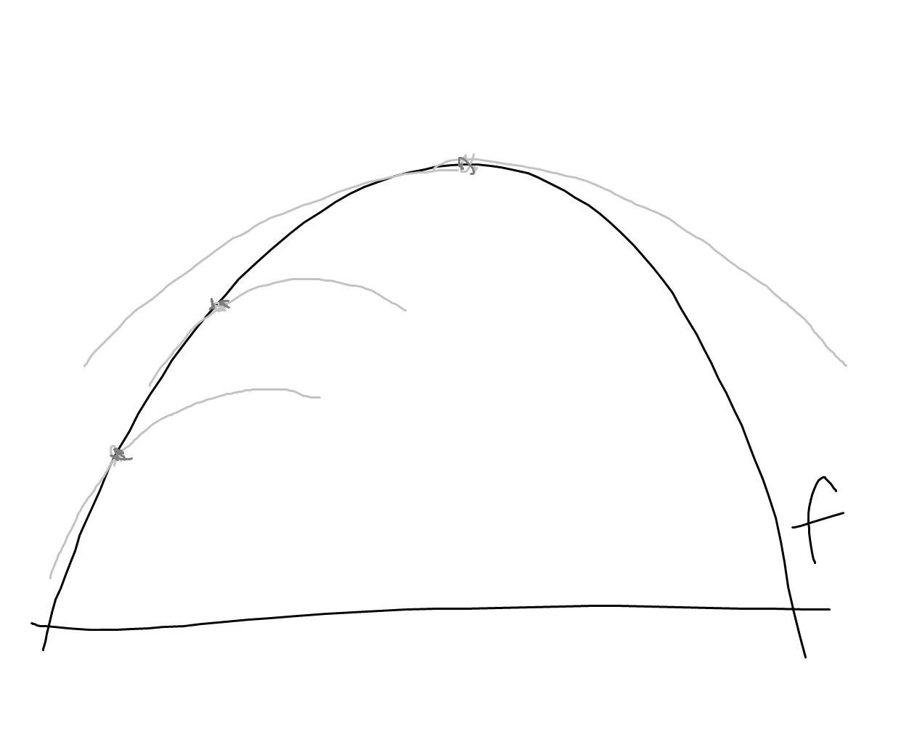
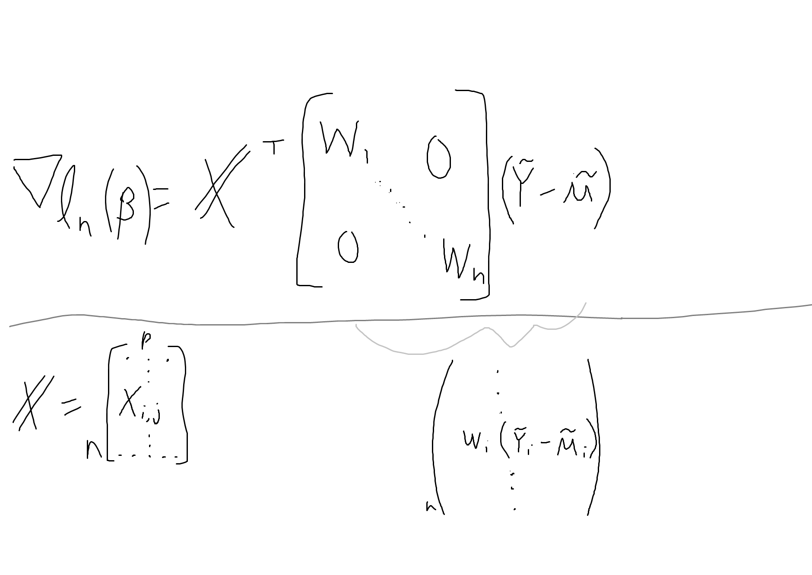

# Generalized Linear Models - Optimization Methods

## Optimization Methods
In order to fit a GLM in practice, we need to maximize the likelihood function with respect to $\beta$.  

Given a function $f(x)$ defined on $X \subset \R^m$, find $x^*$ such that $f(x^*) > f(x)$ for all $x \in X$.  

Below:  
- Newton-Raphson Method
- Fisher-scoring Method
- Iteratively Re-Weighted Least Squares
    - This section culminates in demonstrating that we can actually fit GLMs using (iterative, weighted) least squares

But first:

## Gradient and Hessian Review
Suppose $f : \R^m \to \R$ has two continuous derivatives.  
- Define the **Gradient of $f$** at point $x_0$, $\nabla_f = \nabla_f (x_0)$, as:  
$$(\nabla_f) = (\partial f / \partial x_1, ..., \partial f / \partial x_m)^\top$$ 
- Define the **Hessian (matrix) of $f$** at point $x_0$, $H_f = H_f(x_0)$ as:  
$$(H_f)_{ij} = \frac{\partial^2 f}{\partial x_i \partial x_j}$$
- For smooth functions, the Hessian is symmetric. If $f$ is strictly concave, then $H_f(x)$ is negative definite.
    - i.e., for any $x \in \R^m$, $x^\top H_f(x_0) < 0$
- The continuous function $x \mapsto H_f(x)$ is called the **Hessian map** (e.g., $f''$)

## Quadratic Approximation
- Suppose $f$ has a continuous Hessian map at $x_0$. Then we can approximate $f$ quadratically in a neighborhood of $x_0$ using the second order taylor expansion:  $$f(x) \approx f(x_0) + \nabla_f^\top(x_0)(x - x_0) + \frac{1}{2} (x - x_0)^\top H_f(x_0) (x - x_0)$$
    - This notation is confusing, but consider the single variable definition:  
    $f(x) \approx f(x_0) + f'(x_0)(x - x_0) + \frac{f''(x_0)}{2}(x - x_0)^2$
- This leads to the following approximation to the gradient:  $$\nabla_f(x) \approx \nabla_f(x_0) + H_f(x_0)(x - x_0)$$
    - to maximize we want $\nabla = 0$, so take derivative wrt $x - x_0$ and set equal to $0$:  
    $0 + \nabla_f(x_0) + (H_f(x_0))(x - x_0) = 0$
    - Now to find the maximum, we just need to find the $x^*$ which we can plug in as $x^* - x_0$ that satisfies the above.  

- If $x^*$ is maximum, we have  
$\nabla_f(x^*) = 0$
- We can solve for $x^*$ by plugging in $x^*$ for $x$, which gives us:   $$x^* = x_0 - H_f(x_0)^{-1} \nabla_f (x_0)$$
    - $H_f(x^*) = H_f(x_0) - \nabla_f(x_0)$,  
    which is just a system of linear equations... many possible ways to solve algorithmically, or via linear algebra...  
    - $x^* = H_f^{-1}(H_f(x_0) - \nabla_f(x_0))$  
    $~~~~~ = x_0 - H_f(x_0)^{-1} \nabla_f(x_0)$

These are known as Newton's iterations. We start at some $x_0$, where we decide to make our approximation, and in order to fully optimize the quadratic approximation we just need to calculate $x^*$. Then we make $x^*$ our new $x_0$ and repeate again and again.  

The value of $x^*$ itself is intuitive. It is reminiscent of gradient descent, where we would simply calculate the gradient and move from the initial position ($x_0$) in the direction of the gradient ($\nabla_f(x_0)$).  
Now, instead of just stepping in the direction of the gradient, we are "changing the coordinates" of the gradient  based on what the Hessian looks like.  
- This method is known as a second-order method since it relies on the second derivative. More complicated to compute in modern machine learning cases (inverting a large $H$ is painful), but much more powerful than gradient descent since it utilizes the "local geometry" of the function, which is encoded in the Hessian.

Intuition:
- If we have some function $f$, we can identify a quadratic function at each point which approximates $f$ well, at that point.  

- The quadratic functions are actually optimizable.

QA Example: quadratic approximation of $f(x) = e^{x + x^2}$ near $x = 0$.  
- Using formula $Q(f) = f(0) + f'(0) x + \frac{f''(0)}{2}x^2$  
    - $f'(x) = (1 + 2x)e^{x+x^2}$
    - $f''(x) = (1 + 2x)^2 e^{x+x^2} + 2e^{x + x^2} = (4x^2 + 4x + 3) e^{x + x^2}$
    - $Q(f(0)) = 1 + 1x + \frac{3}{2} x^2$

## Newton-Raphson Method
The Newton-Raphson method for multidimensional optimization uses quadratic aprroximations sequentially.  
- We can define a sequence of iterations starting at an arbitrary value $x_0$ and update using the rule, $$x^{(k + 1)} = x^{(k)} - H_f(x^{(k)})^{-1} \nabla_f (x^{(k)})$$
- The Newton-Raphson algorithm is globally convergent at quadratic rate whenever $f$ is concave and has two continuous derivatives.

## Fisher-Scoring Method
The GLM gives arise to functions of a specific structure, which can be taken advantage of for optimization.  

Newton-Raphson works for a deterministic case which does not have to involve random data.  
Sometimes, calculation of the Hessian matrix is complicated.  
Goal: use directly the fact that we are minimizing the KL divergence: 

- Recall the likelihood arises from trying to replace an expectation with an average:  
- Our initial goal of parameter estimation is to minimize the KL divergence (as a proxy for total variation distance) between the estimated and true probability distributions (*see MLE notes*), but the KL divergence is actually an expectation so we have to estimate it using an average. Maximizing its empirical form leads directly to the likelihood function.    

Thus, we can use the fact that the KL divergence:  
$KL ~~\text{ "="} - E[\text{log likelihood}]$  
- Note: $E[H_{l_n}] = H_{E[l_n]}$
- From MLE notes: given iid observations $x_1, ..., x_n$ with density $f_\theta$
    - $\frac{1}{n} \sum_{i = 1}^{n} \log f_\theta(x_i)$ is equal in expectation to $- KL + \text{constant}$, because:
    - $KL(P_\theta, P_{\theta'}) =  E_\theta[\log \frac{f_\theta}{f_{\theta'}}] = E_\theta[\log f_\theta] + \text{constant}$

**Idea**: replace the Hessian with its expected value:  
$E_\theta[H_{l_n}(\theta)] = - I(\theta)$
- $I(\theta)$ is the **Fisher information**
- (the expected value wrt theta of the log-likelihood's hessian evaluated at theta is equal to the negative of the Fisher information)

*We can think of this as seeking to replace the task of maximizing the log-likelihood with the ("original") task of minimizing the KL divergence.*  

Since we are trying to compute this at a given $x^{(k)}$, we can always pretend that the $x^{(k)}$ in the current iteration is the true $\theta$ ($\theta = x^{(k)}$) and take the above expectation wrt to it.  
And we know that this expectation will be equivalent to the negative Fisher information also evaluated at $\theta = x^{(k)}$
- Pretending that the current $x^{(k)}$ is the true one is a "leap of faith", but it often makes life easier.

Fisher-scoring Algorithm:
- The Fisher information matrix is positive definite and can serve as stand-in for the Hessian in the Newton-Raphson algorithm, giving update:  
$$\theta^{(k + 1)} = \theta^{(k)} + I(\theta^{(k)})^{-1} ~ \nabla_{l_n}(\theta^{(k)})$$
- It has essentially the same convergence properties as Newton-Raphson but is often easier to compute $I$ than $H_{l_n}$

## Example: Logistic Regression
Suppose $Y \sim Bernoulli(p_i), i = 1, \dots, n$, are indepenent $0/1$ indicator responses and $X_i$ is a $p \times 1$ vector of predictors for individual $i$.

The log-likelihood:  
$l_n(\theta | \bold{Y}, \bold{X}) = \sum_{i = 1}^n (Y_i \theta_i - \log(1 + e^{\theta_i}))$
- ($b(\theta) = \log(1 + e^\theta)$)

Under the canonical link:  
$\theta_i = \log(\frac{p_i}{1 - p_i}) = X_i^\top \beta$

Thus we have:  
$l_n(\beta | \bold{Y}, \bold{X}) = \sum_{i = 1}^n (Y_i X_i^\top \beta - \log(1 + e^{X_i^\top \beta}))$

The gradient is:  
$$
\nabla_{l_n}(\beta) = \sum_{i=1}^n(Y_i X_i - \frac{e^{X_i^\top \beta}}{1 + e^{X_i^\top \beta}} X_i)
$$
- Which can be rewritten as $X^\top (\frac{e^{X \beta}}{1 + e^{X \beta}} - Y)$, 
    - or $X^\top (\mu(X\beta) - Y)$ (see [these slides](https://www.cs.cmu.edu/~mgormley/courses/10701-f16/slides/lecture5.pdf), pg 57)

And the Hessian is:  
$$
H_{l_n}(\beta) = - \sum_{i=1}^n \frac{e^{X_i^\top \beta}}{(1 + e^{X_i^\top \beta})^2} X_i X_i^\top
$$
- Which simplifies to $- X^\top diag(\frac{e^{X \beta}}{(1 + e^{X \beta})^2}) X$
    - or $- X^\top diag(\mu(1 - \mu)) X$  
    ...since $\frac{z}{1 + z}(1 - \frac{z}{1+z}) = \frac{z}{1+ z} - \frac{z^2}{(1 + z)^2} =\frac{1+z}{1+z}(\frac{z}{1+ z} - \frac{z^2}{(1 + z)^2}) =  \frac{z + z^2 - z^2}{(1 + z)^2}$

The *Newton-Raphson* updating rule is:  
$$\beta^{(k + 1)} = \beta^{(k)} - H_{l_n}(\beta^{(k)})^{-1} ~ \nabla_{l_n}(\beta^{(k)})$$

Fisher scoring method:  
- The score function is a linear combination of the $X_i$, and the Hessian or Information matrix is a linear combination of $X_iX_i^\top$ (as typical in exponential family regression models, i.e., GLM).  
- The Hessian is negative definitie so there is a unique local maximizer, which is also the global maximizer.  
- Finally, note that $Y_i$ does not appear in $H_{l_n}(\beta)$. In terms of the conditonal distribution of $Y_i|X_i$, $H_{l_n}(\beta)$ is deterministic. Thus: $$H_{l_n(\beta)} = E[H_{l_n(\beta)}] = - I(\beta)$$
- So there is **no difference** between the NR and Fisher scoring because the Hessian does not depend on $Y_i$

## Iteratively Re-Weighted Least Squares
IRLS is an algorith for fitting GLMs obtained by Newton-Raphson/Fisher-scoring

Suppose $Y_i | X_i$ has a distribution from an exponential family with the following log-likelihood function, 
$$l_n = \sum_{i=1}^n \frac{Y_i \theta_i - b(\theta_i)}{\phi} + c(Y_i, \phi)$$

Recall that:  
- $\mu_i = b'(\theta_i)$ (b is cumulant generating fn)
- $X_i^\top \beta = g(\mu_i)$
- $\frac{d \mu_i}{d \theta_i} = b''(\theta_i) \equiv Var_i$
- $\theta_i = (b')^{-1} \circ g^{-1}(X_i^\top \beta) := h(X_i^\top \beta)$ 

### Gradient
According to the chain rule we have (since $\theta$ depends on $\beta$):
$$
(\nabla l_n)_j =  \frac{\partial l_n}{\beta_j} = \sum_{i=1}^n \frac{\partial l_i}{\partial \theta_i} \frac{\partial \theta_i}{\partial \beta_j} \\
= \sum_i \frac{Y_i - \mu_i}{\phi} h'(X_i^\top \beta)X_i^j \\
$$
- (using $b'(\theta_i) = \mu_i$ and $\theta_i' = h'(X_i^\top \beta)$)

Also note that if we multiply by $g'(\mu_i) / g'(\mu_i)$:  
$$\sum_{i} \frac{g'(\mu_i)(Y_i - \mu_i)}{\phi} \cdot \frac{h'(X_i^\top \beta)}{g'(\mu_i)} X_i^j
$$

we can rewrite so that:
$$
(\nabla l_n)_j= \sum_i (\tilde{\bold{Y}} - \tilde{\mu}_i ) W_iX_i^j \\
\text{} \\
\text{and} \\
\text{} \\
\nabla l_n = \bold{X}^\top \bold{W} (\tilde{\bold{Y}} - \tilde{\mu}_i ) \\
$$
where
$$
W_i \equiv \frac{h'(X_i^\top \beta)}{g'(\mu_i) \phi} ~~\text{ and }~~ W = diag(W_1, ..., W_n)\\
\text{and} \\
\tilde{\bold{Y}} = (g'(\mu_1) Y_1, \dots, g'(\mu_n)Y_n)^\top \\
\tilde{\mu} = (g'(\mu_1) \mu_1, \dots, g'(\mu_n)\mu_n)
$$
- i.e., $\tilde{Y}_i = Y_i ~ g'(\mu_i)$ and $\tilde{\mu}_i = \mu_i ~ g'(\mu_i)$

- We can see that this becomes a weigted sum of the rows of $\bold{X}$ (i.e., the columns in $\bold{X}^\top$) with the $i$-th row's weight equivalent to $W_i(\tilde{Y}_i - \tilde{\mu}_i)$.  

So why do we introduce $g'(\mu_i)$?
- We will see that it changes the expectation of the Hessian and the there is a convenient way to calculate this new expectation/Fisher information before using the Fisher-scoring algorithm. Further, the Fisher-scoring algorithm itself becomes equivalent to a weighted least squares problem.

### Hessian
For the Hessian we have:  
$$
\frac{\partial^2 l}{\partial \beta_j \partial \beta_k} = \sum_{i = 1}^n \frac{Y_i - \mu_i}{\phi} h''(X_i^\top \beta) X_i^j X_i^k - \frac{1}{\phi} \sum_i (\frac{\partial \mu_i}{\partial \beta_k})h'(X_i^\top \beta) X_i^j \\
$$
- i.e., taking the second derivative of $l_n$ or the derivative of $\partial l_n / \partial \beta_j$ as solved above

- Note that we can rewrite the following term (by the chain rule): $$\frac{\partial \mu_i}{\partial \beta_k} = \frac{\partial b'(\theta_i)}{\partial \beta_k} = \frac{\partial b'(h(X_i^\top \beta))}{\partial \beta_k} = b''(\theta_i) h'(X_i^\top \beta)X_i^k$$
    - (recall that $\mu_i = b'(\theta_i) = b'(h(X_i^\top \beta))$)

This yields:
$$
E[H_{l_n}(\beta)] = -\frac{1}{\phi} \sum_{i=1}^n b''(\theta_i) [h'(X_i^\top \beta)]^2 X_i X_i^\top
$$
- note that the conditional expectation of $(Y_i - \mu_i)$ conditional on $X_i$ is $0$ ($E[(Y_i - \mu_i) | X_i = x_i] = 0$), so the first term drops off.

### Fisher Information
Note that $g^{-1}(\cdot) = (b' \circ h)(\cdot)$ yields:  
$$
b'' \circ h \cdot h' = \frac{1}{g' \circ g^{-1}}
$$

And recall that $\theta_i = h(X_i^\top \beta)$ and $\mu_i = g^{-1}(X_i^\top \beta)$.  
Combining these identities we can obtain:  
$$
b''(\theta_i)h'(X_i^\top \beta) \\
= b''(h(X_i^\top \beta))h'(X_i^\top \beta) = \frac{1}{g'(g^{-1}(X_i^\top \beta))} \\
= \frac{1}{g'(\mu_i)}
$$

As a result, we can rewrite the expectation of the Hessian:  
$$
E[H_{l_n}(\beta)] = - \sum_{i=1}^n \frac{h'(X_i^\top \beta)}{g'(\mu_i) \phi} X_i X_i^\top
$$
- recall that above we defined $W_i \equiv \frac{h'(X_i^\top \beta)}{g'(\mu_i) \phi}$

Therefore,
$$
I(\beta) = -E[H_{l_n}(\beta)] = \bold{X}^\top \bold{W} \bold{X} 
$$
where $W = diag(\frac{h'(X_i^\top \beta)}{g'(\mu_i)\phi})$
- Note that in this case we didn't have to "force" $g'(\mu_i)$ into the equation like we did in the gradient. It showed up naturally.

### Fisher-Scoring Updates
Thus we have the following:  
$$\nabla_{l_n}(\beta) = \bold{X}^\top \bold{W} (\tilde{\bold{Y}} - \tilde{\mu})$$
$$I(\beta) = - E[H_{l_n}(\beta)] = \bold{X}^\top \bold{W} \bold{X}$$

According to Fisher-scoring method, we can update an initial estimate $\beta^{(k)}$ to $\beta^{(k + 1)}$ using:  
$$\beta^{(k + 1)} = \beta^{(k)} + I(\beta^{(k)})^{-1} ~ \nabla_{l_n}(\beta^{(k)})$$

This is equivalent to:
$$\beta^{(k + 1)} = \beta^{(k)} + (\bold{X}^\top \bold{W} \bold{X})^{-1} \bold{X}^\top \bold{W}(\tilde{\bold{Y}} - \tilde{\mu})$$
$$ = (\bold{X}^\top \bold{W} \bold{X})^{-1} \bold{X}^\top\bold{W}(\tilde{\bold{Y}} - \tilde{\mu} + \bold{X} \beta^{(k)})$$
- (where $\bold{W}$ depdends $\beta^{(k)}$)

(Computation components):
- $W = diag(\frac{h'(X_i^\top \beta)}{g'(\mu_i)\phi})$
    - $\mu_i = b'(\theta_i) = b'(h(X_i^\top \beta))$
        - $b$ is cumulant generating fn for the exponential family-member
    - $h(X_i^\top \beta) := (b')^{-1} \circ g^{-1}(X_i^\top \beta)$
        - $h$ is identity under a canonical link
    -  $g'(\mu_i)$ is the first derivative of the link fn, where $g(\mu_i) = X_i^\top \beta$
        - $g'(\mu_i) = g'(b'(h(X_i^\top \beta)))$
    - $\phi$ is dependent on the exponential family 
- $\tilde{Y}_i = Y_i ~ g'(\mu_i)$ and $\tilde{\mu}_i = \mu_i ~ g'(\mu_i)$
    -  Again, $g'(\mu_i)$ is the first derivative of the link fn

---
### Weighted least squares
Let us open a parenthesis to talk about Weighted Least Squares.
- Assume the linear model $Y = \bold{X}\beta + \varepsilon$,  
where $\varepsilon \sim N_n(0, \bold{W}^{-1})$,  
where $\bold{W}$ is a $n \times n$ diagonal matrix.  
- When variances are different but observations are still indepenent (the covariance matrix is not identity but is diagonal), the regression is said to be **heteroskedastic**.
- The maximum likelihood estimator is given by the **Weighted Least Squares problem**: $$\min_\beta (Y - \bold{X}\beta)^\top \bold{W} (Y - \bold{X}\beta)$$
    - density of $Y \sim N_p(\bold{X}\beta, \bold{W}^{-1})$ is  
    $\frac{1}{(\det(\bold{W}^{-1})2 \pi)^{1/p}} \exp(\frac{(Y - \bold{X}\beta)^\top \bold{W} (Y - \bold{X}\beta)}{2})$
        - (if $p=1$ and $\bold{W}^{-1} = \sigma^2$ then you have classic formula)
    - the log likelihood is thus:  
    $l_n(\beta) = -\frac{np}{2} \log(\det(\bold{W}^{-1})) - \frac{1}{2} (Y - \bold{X}\beta)^\top \bold{W} (Y - \bold{X}\beta)$ 
    - The first term is a constant so to maximize the log likelihood we need to minimize the right hand term, hence the above.
- The solution is given by: $$\hat{\beta} = (\bold{X}^\top \bold{W} \bold{X})^{-1} \bold{X}^\top \bold{W} Y$$
    - We want $\min_\beta (Y - \bold{X}\beta)^\top \bold{W} (Y - \bold{X}\beta)$
    - assume $\bold{W}^{-1}$ is diagonal and that no variance is equal to 0 or infinity so that $\bold{W}$ and $\bold{W}^{-1}$ have only positive entries on the diagonal, and thus the matrix is [positive-semidefinite](https://en.wikipedia.org/wiki/Definite_matrix).
    - Then we can write $\bold{W} = \sqrt{\bold{W}} \sqrt{\bold{W}}$
    - So we have $\min_\beta (\sqrt{\bold{W}} Y - \sqrt{\bold{W}}\bold{X}\beta)^\top (\sqrt{\bold{W}} Y - \sqrt{\bold{W}}\bold{X}\beta)$
    - We can think of this as $\min_\beta (Y' - \bold{X'}\beta)^{\top}(Y' - \bold{X'} \beta)$, which is the same setup for the classic least squares problem.  
    - thus we know the solution is  $\hat{\beta} = (\bold{X'}^\top \bold{X'})^{-1} \bold{X'}^\top Y'$
    - converting back to using $\bold{W}$ we have:  
    $\hat{\beta} = (\bold{X}^\top \sqrt{\bold{W}} \sqrt{\bold{W}}\bold{X})^{-1} \bold{X}^\top \sqrt{\bold{W}} \sqrt{\bold{W}}Y$  
    which simplifies to the above solution.

---
Back to our IRLS problem:
$$\beta^{(k + 1)} = (\bold{X}^\top \bold{W} \bold{X})^{-1} \bold{X}^\top\bold{W}(\tilde{\bold{Y}} - \tilde{\mu} + \bold{X} \beta^{(k)})$$

reminds us of  **Weighed Least Squares** with
1. $\bold{W} = \bold{W}(\beta^{(k)})$ being the weight matrix
2. $\tilde{\bold{Y}} - \tilde{\mu} + \bold{X}\beta^{(k)}$ being the response

So we can obtain $\beta^{(k +1)}$ using any system for WLS.

### IRLS procedure
IRLS is an iterative procedure to compute the MLE in GLMs using weighted least sqaures.  
How to go from $\beta^{(k)}$ to $\beta^{(k + 1)}$:
1. Fix $\beta^{(k)}$ and set $\mu_i^{(k)} = g^{-1}(X_i^\top \beta^{(k)})$
2. Calculate the adjusted dependent responses: $$Z_i^{(k)} = X_i^\top \beta + g'(\mu_i^{(k)})(Y_i - \mu_i^{(k)})$$
    - (i.e.,  $\tilde{\bold{Y}} - \tilde{\mu} + \bold{X}\beta^{(k)}$, to use previous notation)
3. Compute the weights $\bold{W}^{(k)} = \bold{W}(\beta^{(k)})$:  
$$\bold{W}^{(k)} = diag \frac{h'(X_i^\top \beta^{(k)})}{g'(\mu_i^{(k)}) \phi}$$
4. Regress (WLS) $\bold{Z}^{(k)}$ on the design matrix $\bold{X}$ with weight $\bold{W}^{(k)}$ to derive a new estimate:  
$$\beta^{(k + 1)} = (\bold{X}^\top \bold{W}^{(k)} \bold{X})^{-1} \bold{X}^\top \bold{W^{(k)}} Z^{(k)}$$

5. Repeat until convergence.
    - Until the change in consectuive $\beta$'s is below some threshold
    - Good rule of thumb: if you have $n$ observations, you want the $l2$ distance between $\beta^{(k)}$ and $\beta^{(k - 1)}$ to be less than $1/n$

For this procedure we only need:
- $\bold{X}$ and $\bold{Y}$ (the data)
- For the weight matrix we need:
    - the link function $g(\cdot)$
    - under the canonical link $h$ is identity, otherwise we also need the cumulant generator $b(\cdot)$ since $h = (b')^{-1} \circ g^{-1}$
- $\phi$, the dispersion paramater.

A possible starting value is to let $\mu^{(0)} = \bold{Y}$:
- Since $g(\mu) = \bold{X} \beta$, but we don't know $\beta$, it makes sense to compute $g(\bold{Y}) = \bold{X} \beta$ and use least squares to solve for $\beta^{(0)}$
    - (recall $\mu_i = E[Y_i | X_i = x_i]$, so the actual observations of $Y$ are a good starting estimate for the expected values)
    - I found this doesn't always work very well (non-convergence) relative to just starting at 0.

If the canonical link is used, then Fisher-scoring is the same as Newton-Raphson:
- $E[H_{l_n}] = H_{l_n}$
- (There is no random component in the Hessian matrix) 

In some sense, IRLS is just a numerical trick to rewrite Netwon-Raphson/Fisher-scoring methods in terms of the "familiar" least squares. But in practice IRLS is used because least-squares is typically implemented very efficiently in statistical software.

## IRLS: Alternative specification:
Common implementations of the IRLS algorithm for GLMs (for example, R's `stats::glm.fit`) use a slightly different looking formula to compute the weight matrix ($W$) and the working response vector ($Z$).  
We can rearrange some terms to match this formulation, the advantage being that it requires less functions to be tracked for each exponential family member that we wish to estimate a GLM for.

Define $\eta = X \beta$ and recall:
- $\theta_i = (b')^{-1} \circ g^{-1}(\eta) := h(\eta)$ 
- i.e., $\theta_i = (b')^{-1}((g^{-1})(\eta))$  
$= (b')^{-1}(\mu)$, since $g(\mu) = \eta$
- So $\theta_i = h(\eta) = (b')^{-1}(\mu)$

We also know that $E[Y|X] = \mu(X)$ can be mapped to $\theta$, since $\mu = b'(\theta), \theta = (b')^{-1}(\mu)$.  

Given the IRLS update procedure:
$$\beta^{(k + 1)} = \beta^{(k)} + (\bold{X}^\top \bold{W} \bold{X})^{-1} \bold{X}^\top \bold{W}(\tilde{\bold{Y}} - \tilde{\mu})$$
$$ = (\bold{X}^\top \bold{W} \bold{X})^{-1} \bold{X}^\top\bold{W}(\tilde{\bold{Y}} - \tilde{\mu} + \bold{X} \beta^{(k)})$$

Recall, we wrote
$$W = diag \frac{h'(\eta)}{g'(\mu_i) \phi}$$

We can rewrite this as $W = diag \frac{1}{b''(\theta)g'(\mu)^2 \phi}$:
- $h' = \frac{\partial \theta}{\partial \eta} = \frac{\partial \theta}{\partial \mu} \frac{\partial g^{-1}(\eta)}{\partial \eta}$  
- Rewrite $\frac{\partial \theta}{\partial \mu}$ as $\frac{1}{\partial \mu / \partial \theta}$  
Since $\mu = b'(\theta)$, rewrite as $\frac{1}{\partial b'(\theta) / \theta}$  
$= \frac{1}{b''(\theta)}$
- Thus, $h'(\eta) = \frac{\partial g^{-1} /\partial \eta}{b''(\theta)}$  
- But, due to the [inverse function rule](https://en.wikipedia.org/wiki/Inverse_function_rule) ($[f^{-1}]'(a) = \frac{1}{f'(f^{-1}(a))}$ ), we can write:
    - $(g^{-1})'(\eta) = 1/g'(g^{-1}(\eta)) = 1 / g'(\mu)$
- So finally, $h'(\eta) = \frac{1}{b''(\theta) g'(\mu)}$
- And we get the result: $W = diag \frac{1}{b''(\theta)g'(\mu)^2 \phi}$

Now note that
$(g^{-1})'(\eta) = 1 / g'(g^{-1}(\eta)) = 1 / g'(\mu)$ (again, by the inverse function rule), and thus we can rewrite $g'(\mu)^2$ and move it to the numerator, finally giving us a new weight matrix formula:  
$$
W = diag \frac{[(g^{-1})'(\eta)]^2}{b''(\theta) \phi} = diag \frac{\mu'(\eta)^2}{Var(\mu) \phi}
$$
- Recall that $b''(\theta) = Var(\mu)$ ($b$ is the cumulant generating function)

We can now rearrange the modified/working response $Z_i$ too.
Recall we wrote:  
$Z_i^{(k)} = X_i^\top \beta + g'(\mu_i^{(k)})(Y_i - \mu_i^{(k)})$  
Using what we just showed above, we can say $g'(\mu) = 1 / (g^{-1})'(\eta)$, and thus:  
$$
Z_i^{(k)} = \eta + \frac{(Y_i - \mu_i^{(k)})}{\mu'(\eta)}
$$

**Updated Algorithm** 

Now we can perform the iterative procedure using the alternative weight matrix and respone:
1. Fix $\beta^{(k)}$ and set $\mu_i^{(k)} = g^{-1}(X_i^\top \beta^{(k)})$
2. Calculate the adjusted dependent responses: $$Z_i^{(k)} = \eta + \frac{(Y_i - \mu_i^{(k)})}{\mu'(\eta)}$$
3. Compute the weights $\bold{W}^{(k)} = \bold{W}(\beta^{(k)})$:  
$$\bold{W}^{(k)}= diag \frac{\mu'(\eta)^2}{Var(\mu) \phi}$$
4. Regress (i.e., WLS) $\bold{Z}^{(k)}$ on the design matrix $\bold{X}$ with weight $\bold{W}^{(k)}$ to derive a new estimate:  
$$\beta^{(k + 1)} = (\bold{X}^\top \bold{W}^{(k)} \bold{X})^{-1} \bold{X}^\top \bold{W^{(k)}} Z^{(k)}$$

5. Repeat until convergence.

To perform this algorithm we just need:
- Data ($X$ and $Y$) and initial values for $\beta$
- $\mu'(\eta)$, i.e., $d(g^{-1})/d \eta$ - so the derivative of the link function.
    - This is the function known as `mu.eta` in a `stats::family`
- $Var(\mu)$ - the variance as a function of the mean for the exponential family
- $\phi$ - the dispersion parameter

Notes:  
These linked [notes](https://sethah.github.io/glm-part-three.html) from Seth Hendrickson were helpful in translating the [R algo](https://github.com/SurajGupta/r-source/blob/master/src/library/stats/R/glm.R#L74) into more familiar notation.  
And this [stackoverflow](https://stats.stackexchange.com/questions/252652/why-not-fitting-glms-with-least-squares#:~:text=GLMs%20ARE%20usually%20fit%20using,a%20variant%20of%20Newton%2DRaphson.).

## Extra

### Standard Errors
From [Heather Turner GLM course](https://statmath.wu.ac.at/courses/heather_turner/glmCourse_001.pdf):  

**Covariance Matrix and SEs**  
The estimates $\hat{\beta}$ have the usual properties of maximum likelihood estimators, particularly they are asymptotically normal with covariance matrix equal to the inverse of the Fisher information matrix:  
$\hat{\beta} \sim N(\beta, \phi(X^\top W X)^{-1})$  
$\equiv \hat{\beta} \sim N(\beta, I^{-1})$  
Where $I(\beta) = \phi (X^\top W X)^{-1}$ and we can use $\hat{W} = W^{(k_{last})}$, the final weights from the IRLS procedure, to estimate $W$.

So, $\hat{cov}(\hat{\beta}) = \phi(X^\top W X)^{-1}$

Thus, standard errors for for the $\beta_j$ coefficient may be calculated as the square root of the diagonal elements of $\hat{cov}(\hat{\beta})$.  

**Dispersion**  
Note that $Var(Y) = \phi b''(\theta) = \phi V(\mu)$, so $\phi = \frac{Var(Y)}{V(\mu)}$, where we see $V$ is the variance function that describes how $Y$'s variance depends on the mean.  
(For a Gaussian model, $\phi = \sigma^2$ and $V(\mu) = 1$)

We assume that $\phi_i$ (dispersion for subject $i$) is $\phi_i = \phi / w_i$, where $w_i$ are known *prior weights* (often 1).  
Therefore, $\phi_i = \frac{w_i Var(Y)}{V(\mu_i)}$

If $\phi$ is unknown, an estimate is required.
There are practical difficulties in estimating the dispersion $\phi$ by maximum likelihood and it is usually estimated by method of moments. If $\beta$ was known an unbiased estimate would be:   
$\phi_i = \frac{1}{n} \sum_{i=1}^n \frac{w_i (y_i - \mu_i)^2}{V(\mu_i)}$

Since $\beta$ must be estimated we obtain:  
$$
\hat{\phi_i} = \frac{1}{n - p} \sum_{i=1}^n \frac{w_i (y_i - \mu_i)^2}{V(\mu_i)}
$$
- where $w$ is the vector of prior weights, $\mu = g^{-1}(X\beta)$ corresponds to the final fitted values, and $n -p$ is the residual degrees of freedom.

Note that in the Gaussian case (with weights = 1) this simplifies to:  
$\hat{\phi} = \frac{1}{n-p} \sum_{i=1}^n (y_i - \mu_i)^2$, which is equivalent to the $\hat{\sigma}^2$ formula solved for in linear regression.

But this is how R does it for all families:  
$\hat{\phi} = \frac{\sum_{i=1}^n w_i (y_i - \mu_i)^2}{n - p}$

(ie, it just ignores the $V(\mu)$ term from the above derivation...)

Need to read more.  
- These slides: https://statmath.wu.ac.at/courses/heather_turner/glmCourse_001.pdf
- https://stats.stackexchange.com/questions/224302/how-does-r-function-summary-glm-calculate-the-covariance-matrix-for-glm-model