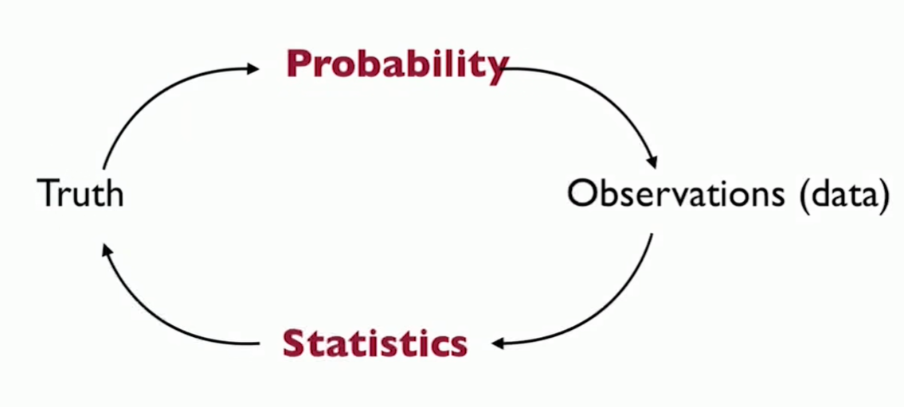
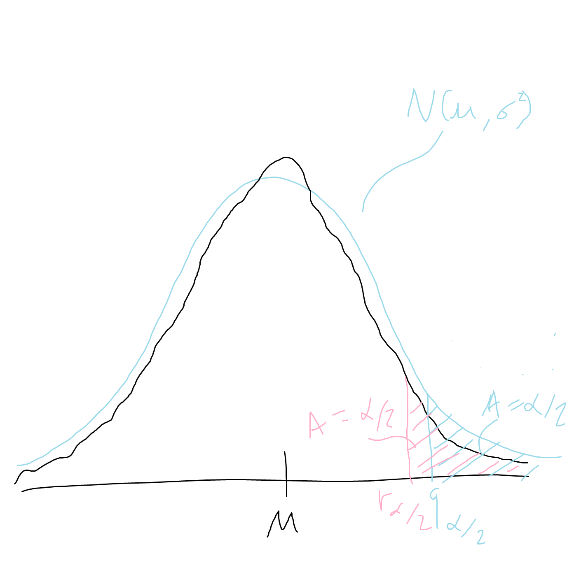

# Introduction

[MIT 18.650 Statistics for Applications](https://ocw.mit.edu/courses/18-650-statistics-for-applications-fall-2016/)  
Prof. Philippe Rigollet  

## Probability
- Probability is the study of randomness
- Sometimes the physical process is is completely known: dice, cards, roulette, fair coins, etc.
    - Example: Rolling 2 dice - choose a number between 2 and 12 and win $100 if you choose the correct sum of the 2 dice.
    - This is a well known process from physics: 1/6 chance of each side, dice are independent. We can deduce the probability of outcomes and expected $ amounts. This is **probability**.

## Statistics and modeling
- How aboute a more complicated process? Then we need to estimate parameters from some data. This is **statistics**. 
- Sometimes the process is complicated due to real randomness (random student, biased coin, measurement error)
- Sometime the process is actually *deterministic*, but is too complex to study directly
    - In this case, we can model the complex phenomenon as: $\text{Complicated process} \text{ "=" } \text{Simple process} + \text{random noise}$
    - (where we know the simple process well)
    - (good) modeling consists in choosing a (plausible) simple process **and** noise distribution

## Stats vs. Probability
- **Probability**: Previous studies show the drug was 80% effective, so we can anticipate that for a study on 100 patients, then on average 80 will be cured and at least 65% will be cured with 99.99% chances.
- **Statistics**: Observing that 78/100 patients were cured, we will (be able to) conclude that we are 95% confident that for other studies the drug will be effective for between 69.88% and 86.11% of patients  

## Heuristics
Let $p$ denote the (population) propotion of couples that turn their head to the right when kissing.  
Let us design a statistical experiment and analyze its outcome.  
- Observe $n$ kissing couples and collect the value of each outcome (say 1 for RIGHT and 0 for LEFT)
- *Estimate* $p$ with the proportion $\hat{p}$ of RIGHT.

(Real study: "Human behavior: Adult persistence of head-turning asymmetry"):  
$n = 124$, 80 to the RIGHT, so:  
$\hat{p} = \frac{80}{124} = 64.5\%$
- 64.5% is much larger than 50%, so there seems to be a preference for the right.
- But what if our data was RIGHT, RIGHT, LEFT ($n=3$) - that is 66.7% to the right. Even better?
- Intuitively, we need a large enough sample size $n$ to make a call. But how large? The truth is - it depends (on the true but unkown value of $p$). This is where we need mathematical modeling to understand the accuracy of this procedure.

Formally, this procedure consists of doing the following:
- For $i = 1,...,n$, define $R_i = 1$ if the $i$-th couple turns to the RIGHT, $R_i = 0$ otherwise
- The estimator of $p$ is the sample average:  
$\hat{p} = \bar{R}_n = \frac{1}{n} \Sigma_{i=1}^n R_i$ 

**What is the accuracy of this estimator?**  
In order to answer, we propose a statistical model that describes/approximates well the experiment.

Coming up with a model consists of making assumptions on the observations $R_i, i = 1,...,n$ in order to draw statistical conclusions. Here are the assumptions we make:
1. Each $R_i$ is a random variable.
    - which takes value 0 or 1, hence...
2. Each of the r.v. $R_i$ is a Bernoulli with parameter $p$.
    - We assume $p$ is the same for the whole population, which allows repeated observations to inform us about the population.
3. $R_1, ..., R_n$ are mutually independent.
    - observations don't influence each other

Validity of these assumptions:  
1. Randomness is a way of modeling lack of information - with perfect information about the conditions of kissing (including what goes on in the particpants' minds), physics or sociology would allow us to perfectly predict the outcome.
2. The $R_i$'s are necessarily Bernoulli r.v. since $R_i \in \set{0,1}$. They could still have a different parameter for each couple - $R_i \sim Ber(p_i)$ - but we don't have enough info with the data to estimate the $p_i$'s accurately, so we assume the observations come from the same process.
3. Independence is reasonable here (couples observed at different times and locations)

### Another Example
Say there are 15 students and we record their grades, $X_1, ..., X_{15}$  
We assume (*model*) the grades as a Gaussian r.v., $X_i \sim N(\mu, \sigma^2)$  
Find an estimator ($\hat{\mu}$) for $\mu$:
- A good estimator could be the sample average:  
$\hat{\mu} = \frac{1}{n} \Sigma_{i=1}^n X_i$  

Find an estimator ($\hat{\sigma}$) for $\sigma$:
- Well $\sigma^2 = E[(X - E[X])]^2$, but we dont' know $E[X]$ so we replace expectations with averages:  
$\hat{\sigma}^2 = \frac{1}{n} \Sigma_{i=1}^n (X_i - \hat{\mu})^2$
- How? 

## Two Important Tools - LLN and CLT
Let $X_1, ..., X_n$ be i.i.d. r.v., let $\mu = E[X]$ and $\sigma^2 = V[X]$.

- **Laws of Large Numbers (weak and strong)**:  
$\bar{X}_n := \frac{1}{n}\Sigma_{i=1}^n X_i ~~ \xrightarrow[n \to \infty]{P, a.s.} ~~ \mu$
    - Converges in probability, and almost surely
    - *Interpretation* - as sample size increases, the sample average converges to the expected value.

- **Central Limit Theorem**
$\sqrt{n} \frac{\bar{X}_n - \mu}{\sigma} ~~ \xrightarrow[n \to \infty]{(d)} ~~ N(0, 1)$
    - Equivalently, $\sqrt{n} (\bar{X}_n - \mu) ~~ \xrightarrow[n \to \infty]{(d)} ~~ N(0, \sigma^2)$
    - (Converges in distribution)
    - *Interpretation:* If we collect a bunch of samples of $X$, the sampling distribution of the sample mean ($\bar{X}_n$) will converge to some normal distribution at the rate of $\sqrt{n}$, regardless of the distribution of $X$.
    - Note - why $\sqrt{n}$ appears:  
    We can think of the CLT formula above as being rewritten from $\frac{\bar{X}_n - \mu}{\sqrt{\frac{\sigma^2}{n}}}$, where $\sqrt{\frac{\sigma^2}{n}}$ is actually the standard deviation of $\bar{X}_n$ - the $n$ enters the picture because it is the std. dev. of an average.
    - [Proofs of the CLT](https://www.cs.toronto.edu/~yuvalf/CLT.pdf)

### Consequences for Example
- The LLN's tell us that $\bar{R}_n \xrightarrow[n \to \infty]{P, a.s.} p$
- Hence, when the size $n$ of the experiment becomes large, $\hat{R}_n$ is a good (say, "consistent") estimator of $p$.
    - $\hat{p} = \bar{R}_n = \frac{1}{n} \Sigma_{i=1}^n R_i$
- The CLT refines this by saying *how good* the estimate is:  
    - If we calculate $\sqrt{n} \frac{(\bar{R}_n - p)}{\sqrt{p(1-p)}} \xrightarrow[n \to \infty]{(d)} N(0,1)$, where $\sigma^2 = p(1-p)$
    - Thus, if $n$ is large enough, we perfectly understand this r.v. and its fluctuations.
    - For example, we can do things like compute the probability $P[|N(0,1)| > q_{\alpha/2}] = \alpha$ -- we can find the quantile $q_{\alpha/2}$ such that the probability the r.v. takes a more extreme value is $\alpha$:  
    $P[|\sqrt{n} \frac{(\bar{R}_n - p)}{\sqrt{p(1-p)}}| > q_{\alpha/2}] \approx \alpha$, by the CLT.
    - We can use this idea to compute a confidence interval, the standardized sample average converged to the standard normal distirbution, which does **not dependent on any of the unkown parameters - it is a pivotal distribution**
- Let $\phi(x)$ be the cdf of $N(0,1)$
- Let $\phi_n(x)$ be the cdf of $\sqrt{n} \frac{\bar{R}_n - p}{\sqrt{p(1-p)}}$
- CLT: $\phi_n(x) \approx \phi(x)$ when $n$ becomes large.  
Hence, for all $x > 0$,  
$P[|\bar{R}_n - p| \ge x] \approx 2(1 - \phi(\frac{x \sqrt{n}}{\sqrt{p(1-p)}}))$  
- Consequence (if $n$ is large enough!!):  
For a fixed $\alpha \in (0,1)$, if $q_{\alpha/2}$ is the $(1- \alpha/2)$-quantile of $N(0,1)$, then with probability $\approx 1 - \alpha$:  
$\bar{R}_n \in [p - \frac{q_{\alpha/2} \sqrt{p(1-p)}}{\sqrt{n}}, ~~ p + \frac{q_{\alpha/2} \sqrt{p(1-p)}}{\sqrt{n}}]$
    - Which reflects the classic formula, $ \bar{x} \pm z \frac{s}{\sqrt{n}}$, where $z$ is the "confidence level" or the quantile $q_{\alpha/2}$, $s$ is the (sample) standard deviation, and $\bar{x}$ is the sample mean (so - replacing unkown expected values with averages)

But what if $n$ is not large...

## Another useful tool: Hoeffding's inequality

What if $n$ is not so large?

**Hoeffding's inequality (i.i.d. case):**  
Let $n$ be a positive integer and $X_1, ..., X_n$ be i.i.d. r.v. such that $X \in [a,b]$ a.s. ($a < b$ are given numbers) - thus, applies to bounded r.v.  
Let $\mu = E[X]$.  

Then, for all $\varepsilon > 0$:  
$P[|\bar{X}_n - \mu| \ge \varepsilon] ~~ \le ~~ 2 \exp(\frac{-2n\varepsilon^2}{(b-a)^2}) $
- This is telling us, for any given $\varepsilon$, the probability that $\bar{X}_n$ fluctuates away from its expectation in a way that looks roughly like a Gaussian.
- Hoeffding's inequality tells us that if we take the average of some bounded r.v.'s, then their PDF or PMF will be something that looks like the wavy curve below, which closesly resembles a Gaussian, but generally stays below the Gaussian (it may have to "escape" to integrate to 1), so the probability that $\bar{X}_n$ exceeds $\mu$ is bounded by something that decays like the tail of a Gaussian.

- Further, if we were to compute the prob. that $\bar{X}_n$ exceeds some number, then we know that the probability (i.e., the area) is bounded by the area in the gaussian.
- We do not take any limits to do this, so we can do it for any $n$ - but, we pick up this $\frac{2}{(b-a)^2}$ term, which is the variance, and is larger than what we'd get from the corresponding Gaussian

Consequence:
- Since Bernoulli's are bounded r.v. ($a = 0, b = 1$), Hoeffding's inequality applies.  
- Recall we said, $P[|\sqrt{n} \frac{(\bar{R}_n - p)}{\sqrt{p(1-p)}}| > q_{\alpha/2}] \approx \alpha$, by the CLT, when $n$ is large.
- If $n$ is small, then using Hoeffding's:  
$P[|\bar{X}_n - p| > \varepsilon] \le 2\exp(\frac{-2n\varepsilon^2}{1}) = \alpha$
    - we set the probability equal to $\alpha$ and solve for, so that we can solve for $\varepsilon$, which plays the role of $q_{\alpha/2}$
    - $2\exp(-2n\varepsilon^2) = \alpha$  
    $\Rightarrow \log(\exp(-2n\varepsilon^2)) = \log(\alpha/2)$  
    $\Rightarrow -2n\varepsilon^2 = log(\alpha/2)$  
    $\Rightarrow \varepsilon = \sqrt{\frac{\log(2/\alpha)}{2n}}$

- So, for $\alpha \in (0,1)$, with probability $\ge 1-\alpha$,  
$\bar{R}_n - \sqrt{\frac{\log(2/\alpha)}{2n}} ~~ \le p \le ~~ \bar{R}_n + \sqrt{\frac{\log(2/\alpha)}{2n}}$

## Review of convergence and probability
In probability, we talk about many types of convergence. In statistics, we primarily ("only") care about convergence in distribution.

Let $(T_n)_{n \ge 1}$ be a sequence of r.v. and $T$ a r.v. ($T$ may be deterministic)
- Almost surely (a.s) convergence:  
$T_n \xrightarrow[n \to \infty]{a.s.}T ~~\text{iff}~~ P[\set{\omega: T_n(\omega) \xrightarrow[n \to \infty]{} T(\omega)}] = 1$
    - A r.v. is something you measure on something that's random, and in stats notation $\omega$ is the thing on which we make our measurements (e.g., leave a ball of snow in the sun, come back and it has a random shape, but we can still take measurements like its volume, inner temp, etc. The ball of snow is $\omega$. The r.v. is just a function of the $\omega$.)
    - Almost surely tells us that, for all possible $\omega$'s, this convergence occurs. It essentially says that randomness doesn't matter. This is the strongest convergence statement.

- Convergence in Probability:  
$T_n \xrightarrow[n \to \infty]{a.s.}T ~~\text{iff}~~ P[|T_n - T| \ge \varepsilon] \xrightarrow[n \to \infty]{} 0, ~~ \forall \varepsilon > 0$
    - Now we squeeze in a little bit of probability. We want convergence to hold, but allow for a small difference between $T_n$ and $T$ 

- Convergence in $L^p$ ($p \ge 1$):  
$T_n \xrightarrow[n \to \infty]{a.s.}T ~~\text{iff}~~ E[|T_n - T|^p] \xrightarrow[n \to \infty]{} 0$
    - If we have a r.v. with mean $\mu$, whose variance is converging to 0, then this r.v. converges to (a spike at) $\mu$. To achieve this convergence, all we needed to check is that the variance is going to 0. Which is what convergence in $L^2$ tells us. But we don't have to limit ourselves to the square, we can consider other $p$. 

- Convergence in distribution:  
$T_n \xrightarrow[n \to \infty]{a.s.}T ~~\text{iff}~~ P[T_n \le x] \xrightarrow[n \to \infty]{} P[T \le x]$, for all $x \in \R$ at which the cdf of $T$ is continuous
    - In the limit, computing probabilities on $T_n$ will yield results very close to computing probabilities on $T$. Weakest form of convergence.
    - We like convergence in distribution in stats because it lets us say, **calculating a probability on the r.v. $T_n$ will start looking like calculating a probability on the r.v. $T$, as $n$ gets big.** And that's all we really need.
    - Comes from the CLT, and is considered weakest convergence.  
    - Alternatively: the cdf of the sequence of random variables $T_n$ converges to the cdf of $T$.

Note: these definitions extend to random vectors (i.e., r.v. in $\R^d$ for some $d \ge 2$)

### Important Characterizations of Convergence in Distribution
The following proportions are equivalent:  

1. $T_n \xrightarrow[n \to \infty]{(d)} T$

2. $E[f(T_n)] \xrightarrow[n \to \infty]{} E[f(T)]$, for all continuous bounded functions $f$

3. $E[e^{ixT_n}] \xrightarrow[n \to \infty]{} E[e^{ixT}]$, for all $x \in \R$
    - this expectation is known as *the characteristic function*, and it essentially tells us - rather than looking at all continuous bounded functions, we can look at one specific family of complex functions (the family that maps $T$ to $e^{ixT}, \forall x \in \R$) - a much smaller family - and this is sufficient.

### Important Properties
- If $(T_n)_{n \ge 1}$ converges a.s., then it also converges in probability, and the two limits (of the r.v.'s $T_n$ and $T$) are equal a.s. (hence, a.s. convergence is stronger than convergence in probability)
- If $(T_n)_{n \ge 1}$ converges in $L^p$, then it also converges in $L^q$ for all $q \le p$ *and* in probability, and the limits (of $T_n$ and $T$) are equal a.s.
- If $(T_n)_{n \ge 1}$ converges in probability, then it also converges in distribution
    - limits don't converge, since the convergence is not about r.v.'s converging, but about their distributions (so it converges to *any* r.v. *that has this limiting distribution*)
- If $f$ is a continuous function - continuous mapping theorem:  
$T_n \xrightarrow[n \to \infty]{a.s., P, (d)} T ~~~ \Rightarrow ~~~ f(T_n) \xrightarrow[n \to \infty]{a.s., P, (d)} f(T) $ 

So, almost sure implies probability, $L^p$ implies probability, probability implies distribution (everything implies convergence in distribution).  

### Limits and operations
One can add, multiply, ... limits almost surely and in probability. But this is not always true for convergence in distribution.  
If $U_n \xrightarrow[n \to \infty]{a.s., P} U$ and $V_n \xrightarrow[n \to \infty]{a.s., P} V$, then:
- $U_n + V_n \xrightarrow[]{a.s., P} U + V$
- $U_nV_n \xrightarrow[]{a.s., P} UV$
- If in addition $V \ne 0$ a.s., then  
$\frac{U_n}{V_n} \xrightarrow[]{a.s., P} \frac{U}{V}$ 

In general, these rules do not apply to convergence in distribution unless the pair itself $(U_n, V_n)$ converges in distribution to $(U, V)$ (we need to the vector to converge to the limiting vector).

## Example - Exponential random variable, delta method motivation
You observe inter-arrival times at a bus station: $T_1,...,T_n$  
You **assume** that these times are:
- mutually independent
    - plausible, not completely justified - often the case with independence
- exponential r.v.'s with common parmater $\lambda > 0$
    - lack of memory of the exponential distribution:  
    $P[T_1 > t + s | T_1 > t] = P[T_1 > s], ~~ \forall s,t \ge 0$
        - "memoryless" - idea: conditionally on the fact that we have waited for the first bus for $t$ minutes already, the probability that I wait $s$ additional minutes is equal to the probability I wait $s$ minutes total - the distribution "doesn't remember" how long you have been waiting.
    - also, $T_i > 0$ almost surely
    - The distributions of $T_i$ have the same parameter: in average, they all have the same inter-arrival time (this assumption is probably only true for a limited period of time... 11pm distribution != rush hour distribution)

You want to estimate the value of $\lambda$ based on observed arrival times.  

Density of $T_1$:  
$~~~~ f(t) = \lambda e^{- \lambda t}, ~~ \forall t \ge 0$  
$E[T_1] = \frac{1}{\lambda}$  

- $E[T]=\int_0^\infty t f(t) dt = t \lambda e^{- \lambda t}$  
$~~~~~~~~~~ = \lambda[|\frac{-te^{-\lambda t}}{\lambda}|_0^\infty+ \frac{1}{\lambda}\int_0^\infty e^{-\lambda t}dt]$  
$~~~~~~~~~~ = \lambda[0 + \frac{1}{\lambda} \frac{-e^{-\lambda t}}{\lambda}]_0^\infty = \lambda[\frac{1}{\lambda} (0 + \frac{1}{\lambda})]$  
$~~~~~~~~~~ = \lambda \frac{1}{\lambda^2} = \frac{1}{\lambda}$  

Hence, a natural estimate of $\frac{1}{\lambda}$ is:  
$~~~~ \hat{T}_n := \frac{1}{n} \Sigma_{i=1}^n T_i$  
(Replace expectations w averages)

And a natural estimator of $\lambda$ is  
$~~~~ \hat{\lambda} := \frac{1}{\bar{T}_n}$

By the LLN's,
- $\bar{T}_n \xrightarrow[n \to \infty]{a.s., P} \frac{1}{\lambda}$
- Hence, thanks to continuous mapping theorem:  
$\hat{\lambda} \xrightarrow[n \to \infty]{a.s., P} \lambda$

By the CLT,  
- $\sqrt{n} (\bar{T}_n - \frac{1}{\lambda}) \xrightarrow[n \to \infty]{(d)} N(0, \lambda^{-2})$

    - $E[T] = \frac{1}{\lambda}$,  
    $E[T^2] = \int_{0}^\infty t^2 \lambda e^{-\lambda t} = \frac{2}{\lambda^2}$,  
    $V[T] = E[T^2] - E[T]^2 = \frac{2}{\lambda^2} - \frac{1}{\lambda^2} = \frac{1}{\lambda^2}$
- Which allows us to say:  
$P[|\sqrt{n}\frac{(\bar{T}_n - \frac{1}{\lambda})}{\sqrt{1 / \lambda^2}}| > q_{\alpha/2}] \approx \alpha$, where $q$ is the ($1-\alpha/2$)-quantile of the standard Gaussian
    - Rewriting, we can calculate a confidence interval:  
    $P[|\sqrt{n} \lambda (\bar{T}_n - \frac{1}{\lambda})| > q_{\alpha/2}]$
    - $|\sqrt{n} (\lambda \bar{T}_n - 1)| \le q_{\alpha/2}$  
    - $\frac{-q_{\alpha/2}}{\sqrt{n}} \le \lambda \bar{T}_n \le \frac{q_{\alpha/2}}{\sqrt{n}}$
    - $1 - \frac{1}{\bar{T}_n}\frac{q_{\alpha/2}}{\sqrt{n}} \le \lambda \le 1 + \frac{1}{\bar{T}_n}\frac{q_{\alpha/2}}{\sqrt{n}}$

But how does the CLT transfer to $\hat{\lambda}$ ($\frac{1}{\bar{T}_n}$ - the CLT is about convergence in distribution of averages, and this is 1 over an average)? How could we compute an asymptotic confidence interval for $\lambda$?
- The delta method

## The Delta Method
> Tells us that we can take a function of an average and let it go to the function of the limit, such that the CLT still holds, but we pay a price in the variance, which itself depends on the derivative of the function.

Let $(Z_n)_{n \ge 1}$ be a squence of r.v. that satisfies:  
$\sqrt{n} (Z_n - \theta) \xrightarrow[n \to \infty]{(d)} N(0, \sigma^2)$  
for some $\theta \in \R$ and $\sigma^2 > 0$  
(the sequence is said to be asymptotically normal around $\theta$) 

Let $g: \R \to \R$ be continuously differentiable at the point $\theta$. Then,  
- $(g(Z_n))_{n \ge 1}$ is also asymptotically normal
- More precisely:  
$\sqrt{n} (g(Z_n) - g(\theta)) \xrightarrow[n \to \infty]{(d)} N(0, g'(\theta)^2\sigma^2)$  

Proof:  
- Do a first order taylor expansion...
- $g(Z_n) - g(\theta) = (Z_n - \theta) \cdot g'(\bar{\theta})$, for some $\bar{\theta} \in (Z_n, \theta)$ (or reversed)
    - Taylor expanson tells us there exists some $\bar{\theta}$ between $Z_n$ and $\theta$ such that this equality holds
- Multiply by root n:  
$\sqrt{n} (g(Z_n) - g(\theta)) = \sqrt{n} (Z_n - \theta) \cdot g'(\bar{\theta})$
- By the CLT, the LHS converges in distribution to $N(0, \sigma^2)$
- What about the RHS?
    - We know $Z_n \to \theta$, by LLN, so $\bar{\theta}$ is sandwiched between two values which converge to $\theta$. Thus, $\bar{\theta} \to \theta$ also (squeeze theorem). 
    - If $g'$ is continuous (which we assume), then $g'(\bar{\theta}) \xrightarrow[]{P} g'(\theta)$, by the continuous mapping theorem
    - But we have an issue - $g'(\theta)$ converges in probability, while $\sqrt{n}(Z_n - \theta)$ converges in distribution by CLT, and we cannot usually apply the rules of limits and operations to convergences in distribution. *Except* in special cases, thanks to **Slutsky's theorem** (see below). $g'(\theta)$, while unkown, is a deterministic number, so Slutsky's applies and allows us to combine the r.v.
    - Thus, we can combine the distributions so the RHS has distribution $N(0, \sigma^2) \cdot g'(\theta) = N(0, g'(\theta)^2\sigma^2)$

### Slutsky's theorem:
> In very specific cases we *can* operate on limits in distribution. Specifically, if $X_n$ is the r.v. that converges in distribution, and $Y_n$ is a r.v. that converges to a fixed number (not a r.v.), then we can combine them. 

Let $(X_n),(Y_n)$ be two sequences of r.v., such that:  
- $X_n \xrightarrow[n \to \infty]{(d)} X$ (converges in distribution to a r.v.)

- $Y_n \xrightarrow[n \to \infty]{P} c$ (converges in probability to a fixed number)

where $X$ is a r.v. and $c$ is a given real number. Then,  
- $(X_n, Y_n) \xrightarrow[n \to \infty]{(d)} (X, c)$

In particular,  
$X_n + Y_n ~\xrightarrow[n \to \infty]{(d)}~ X +c$,  
$X_nY_n ~\xrightarrow[n \to \infty]{(d)}~ cX$  
$...$
- We can do any operation because the *vector* converges

### Consequences for the above example:
We want the CLT to apply to $\hat{\lambda} = \frac{1}{\bar{T}_n}$, so we use the delta method where our continuous function $g$ is $g(x) = 1/x$, so $g'(x) = -1/x^2$

By the delta method:  
$\sqrt{n}(\hat{\lambda} - \lambda) \xrightarrow[]{(d)} N(0,g'(\frac{1}{\lambda})^2 \frac{1}{\lambda^2})$  
$\Rightarrow \sqrt{n}(\hat{\lambda} - \lambda) \xrightarrow[]{(d)} N(0, \frac{\lambda^4}{\lambda^2})$  
$\Rightarrow \sqrt{n}(\hat{\lambda} - \lambda) \xrightarrow[]{(d)} N(0, \lambda^2)$  

Then we could compute a confidence interval:  
- For $\alpha \in (0,1)$ and when $n$ is large enough:  
$|\hat{\lambda} - \lambda| \le \frac{q_{\alpha/2} \lambda}{\sqrt{n}}$

But $[\hat{\lambda} - \frac{q_{\alpha/2} \lambda}{\sqrt{n}}, ~~ \hat{\lambda} + \frac{q_{\alpha/2} \lambda}{\sqrt{n}}]$ *cannot be used as an asymptotic CI* for $\lambda$, because it depends on $\lambda$ (the true, unkown parameter)

We can 'simply' replace $\lambda$ with $\hat{\lambda}$, which Slutsky lets us do:  
- We could have started by writing:  
$\sqrt{n}\frac{\hat{\lambda} - \lambda}{\lambda} \xrightarrow[]{(d)} N(0,1)$  
- We want to add in $\hat{\lambda}$ in the denominator:  
$(\sqrt{n}\frac{\hat{\lambda} - \lambda}{\hat{\lambda}}) \frac{\hat{\lambda}}{\lambda} \xrightarrow[]{(d)} N(0,1)$  
    - The left part converges to $N(0,1)$, and the right part $\frac{\hat{\lambda}}{\lambda}$ converges to $1$ by the LLN, so we have a r.v. converging in distribution times a r.v. converging to a fixed number - perfect for *Slutsky*: we can take the product and still maintain the convergence in distribution to a standard Gaussian.

So an asymptotic confidence interval for $\lambda$ is:  
$[\hat{\lambda} - \frac{q_{\alpha/2} \hat{\lambda}}{\sqrt{n}}, ~~ \hat{\lambda} + \frac{q_{\alpha/2} \hat{\lambda}}{\sqrt{n}}]$

(The alternative method would be to solve directly for $\lambda$):  
- $|\hat{\lambda} - \lambda| \le \frac{q_{\alpha/2}\lambda}{\sqrt{n}}$  
$\iff \lambda(1 - \frac{q_{\alpha/2}}{\sqrt{n}}) \le \hat{\lambda} \le \lambda(1 + \frac{q_{\alpha/2}}{\sqrt{n}}) $  
$\iff \hat{\lambda}(1 - \frac{q_{\alpha/2}}{\sqrt{n}})^{-1} \le \lambda \le \hat{\lambda}(1 + \frac{q_{\alpha/2}}{\sqrt{n}})^{-1} $  

But Slutsky's is a systematic way.
