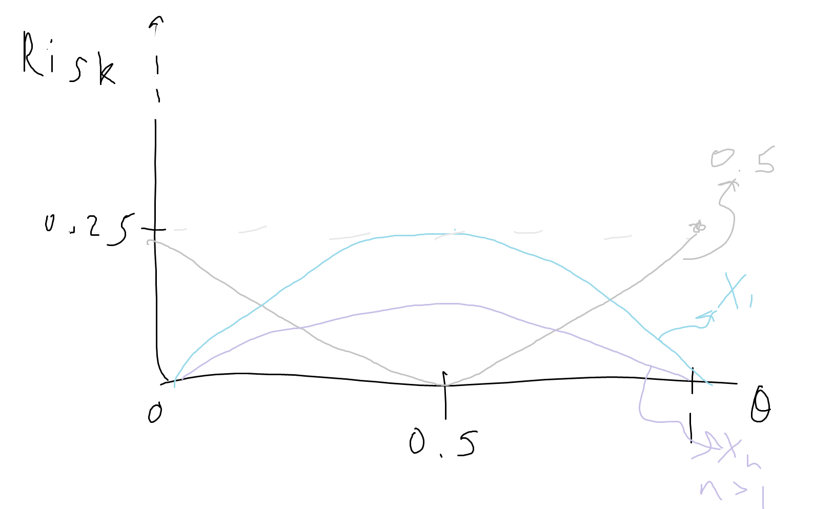

$\newcommand{\indicator}{1\!\!1}$

# Lecture 2 - Parametric Inference
Let $X_1, ..., X_n$ be $n$ independent copies of $X$. Our goal is to learn the distribution of $X$.  
- We can make this process simple/possible by defining parameters or choosing families of distributions (Normal, Poisson, etc) which we believe match our data, and then estimating the parameters that index these distributions ($\mu$ and $\sigma^2$, $\lambda$, etc.). 
- In doing so we reduce the dimensions of the parameter space relative to estimating the probability of any possible outcome - we compress the information. For example, to estimate the probability of having N siblings, we could consider the individual probabilities for all cases, N = 0 to Infinity, but this would be infinite parameters to estimate. We might look at N = 1,2,...,6,7+, calculating the proportions of observations in each category, but this is still 7 parameters to estimate.    
- We want to distill the problem/information down so that we reduce the degrees of freedom of the space in which we are searching for the distribution. For example, we could model number of siblings with a Poisson distribution, which takes just one paramater ($\lambda$).

## Statistical Model
- Let the observed outcome of an experiment be a sample $X_1, ..., X_n$ of $n$ independently and identically distributed (i.i.d.) random variables (r.v.) in some measurable space $E$, denoted by their common distribution $P$. A statistical model associated with this experiment is a pair $(E, (P_{\theta})_{\theta \in \Theta})$  
    - $E$ is a sample space (collection of all possible experiment outcomes/the possible values the r.v. can take), the domain of the random variable (usually $E \subseteq R$).    
    - $(P_{\theta})_{\theta \in \Theta}$ is a *family* of probability measures on $E$  
        - each $P_{\theta}$ is a probability distribution, indexed by $\theta$
    - $\Theta$ is a parameter set.  

Usually we assume the model is **well-specified**: the model is defined such that $P = P_{\theta}$, i.e., we assume there really does exist a $\theta$ in $\Theta$ such that our data $X \sim P_{\theta}$.
- A *strong assumption* to believe that our data is truly distributed according to our chosen model - all models are wrong, but some are useful!  

This particular $\theta$ is called the "true parameter", and our goal is to estimate it, or check its properties.  

In parametric statistics/modeling, we assume that $\theta$ is a vector which is a subset of $R^d$, so the model has a *finite* number of parameters.  
- In non-parametric statistics/modeling we do not have to assume that our data follows a specific distribution, so we don't limit ourselves to a finite number of parameters. For example, a histogram is non-parametric in that we model the distribution of our data with out making assumptions that limit the number of parameters.

### Examples
In a previous example we modeled inter-arrival times at a bus stop using an exponential distribution, so our model was $([0, \infty], (Exp(\lambda))_{\lambda > 0})$.

Now imagine that instead of observing the actual inter-arrival times we just observe whether or not the bus was more or less than 5 minutes late.  
This is a binary outcome, so we can model the probability the bus is 5 minutes late with a Bernoulli distribution: $(\set{0, 1}, (Ber(p))_{p \in (0, 1)})$.  

However, we can develop a more interesting model. We know $X \sim Exp(\lambda)$, but we observe $Y = \text{Indicator}(X > 5)$. What we are really interested in is the probability that the exponential r.v. $X$ with paramater $\lambda$ takes a value greater than 5.  
Thus, we can incorporate $\lambda$ into the model:
- $P(X > 5) = \int_{5}^\infty \lambda e^{-\lambda x} dx = e^{-5 \lambda}$  (integrate exponential pdf from 5 to inf)
- Model = $(\set{0,1}, Ber(e^{-5 \lambda})_{\lambda > 0})$

## Identification  
The parameter $\theta$ is **identified** iff the map $\theta \in \Theta \rightarrow P_{\theta}$ is injective (i.e., it maps distinct elements of the domain - parameter space - to distinct elements of the range - probabilities):  
- If $\theta = \theta' \Rightarrow P_{\theta} = P_{\theta'}$  
    - "If $\theta$ and $\theta'$ index the same probability distribution, then $\theta$ must equal $\theta'$"
- If $\theta \ne \theta' \Rightarrow P_{\theta} \ne P_{\theta'}$  

If 2 different parameters were to index different probability distributions that yielded the same probabilities, then the parameter would be *not identifiable* - because even with an infinite amount of data, we could not recover the parameter.
 
**Example**  
Say $Y_1, ..., Y_n \sim_{iid} N(\mu, \sigma^2)$ for some unkown $\mu \in \R$ and $\sigma^2 > 0$,  
but we only observe $X_i = \text{Indicator}(Y_i > 0)$,  
then $X \sim Ber(p)$, where $p = P(Y > 0) = P(\frac{Y - \mu}{\sigma} > \frac{-\mu}{\sigma})$.  
If $\phi$ is the CDF of $N(0,1)$, then $p = 1 - \phi(\frac{\mu}{\sigma})$.  
Thus, $p$ depends only on the ratio $\mu / \sigma$.  
$1 - \phi(\frac{\mu}{\sigma}) = 1 - \phi(\frac{2\mu}{2\sigma}) = ...$ - so no way to extract $p$ from observing $X$.  
$\mu$ and $\sigma$ are **not** identifiable,  
*but* the parameter ($\mu / \sigma$) **is** identifiable.  
So if we wanted to write a statistical model, we could use:  
$(\set{0,1}, Ber(1 - \phi(\frac{\mu}{\sigma}))_{\frac{\mu}{\sigma} \in \R})$

## Parameter Estimation
So, given an observed sample $X_1, ..., X_n$ and a statistical model $(E, (P_\theta)_{\theta \in \Theta})$, we want to estimate the paramater $\theta$.  
Definitions:  
- Statistic: any measurable function of the sample 
    - E.g., $\bar{X}_n$, $X_1 + \log(1 + |X_n|)$, $\max_i X_i$, sample variance, etc.
    - Rule of thumb - if you can compute it exactly once given some data, it is measurable
- Estimator of $\theta$: any statistic whose expression does **not** depend on $\theta$ (which is an unkown parameter, and that would make the statistic impossible to compute) 
    - We typically use notation $\hat{\theta}$, or more correctly $\hat{\theta}(X_1,...,X_n)$ to emphasize it is a function of the observed data, or $\hat{\theta}_n$.

- An estimator $\hat{\theta}$ is a weakly consistent estimator iff $\hat{\theta}_n$ converges in probability to $\theta$: $~~ \hat{\theta}_n \xrightarrow[n \to \infty]{P} \theta$
    - It is strongly consistent if it converges almost surely.   
- Bias of an estimator: $E[\hat{\theta}_n] - \theta$  
    - on average, is this estimator close to the value we hope it takes?
    - if this = 0, the estimator is unbiased.
    - ubiased: if we repeated this experiment many times and averaged all of the estimators, then the average would equal the true paramater
    - the bias tells us about where we fall on average but not about the fluctuations in our estimators, and thus is only so useful. to consider fluctuations:
- Quadratic Risk of an estimator: $E[|\hat{\theta}_n - \theta|^2]$ 
    - Note, if $E[|\hat{\theta}_n - \theta|] \to 0$ then $\hat{\theta}_n \xrightarrow[n \to \infty]{L^2} \theta$. Convergence in $L^2$ implies convergence in $P$, and thus $\hat{\theta}_n$ is weakly consistent
    - If $\Theta$ is a subset of $R$,  
    $\text{Quadratic Risk = Bias}^2 + \text{Variance}$:  
        - $E[|\hat{\theta} - \theta|^2] =  (E[\hat{\theta}] - \theta)^2 + E[|\hat{\theta} - E(\hat{\theta})|^2]$
            - $E[(\hat{\theta} - \theta)^2]$  
            $= E[(\hat{\theta} - E[\hat{\theta}] + E[\hat{\theta}] - \theta)^2]$ (add and subtract same term)  
            $= E[(\hat{\theta} - E[\hat{\theta}])^2] + 2(E[\hat{\theta} - E[\hat{\theta}])(E[\hat{\theta}] - \theta) + (E[\hat{\theta}] - \theta)^2$  
            (the middle term equals 0 because $E[\hat{\theta} - E[\hat{\theta}]] = E[\hat{\theta}] - E[\hat{\theta}]$)  
            $= E[(\hat{\theta} - E[\hat{\theta}])^2] + (E[\hat{\theta}] - \theta)^2$  
            $= Var(\hat{\theta}) + Bias(\hat{\theta})^2$
        - Bias measures the distance between our estimator and the true parameter (even w/ infinite observations, am I using the right model?), variance tells us about the squared fluctuations of the estimator around the its expectation, in expecatation - the tendency for our estimator to vary when we repeatedly sample our data.
        - Thus the quadratic risk accounts for both the bias and the variance
        - Usually we have a tradeoff between the 2, want both to be small!
        - **Example**: Estimators for $\theta$ for $X_1, ..., X_n \sim Ber(\theta)$:  
            - $\bar{X}_n$: bias = $0$, var = $\frac{\theta(1 - \theta)}{n}$
            - $0.5$: bias = $0.5 - \theta$, var = $0$
                - If $\theta = 0.5$, this is the strictly better estimator
            - $X_1$: bias = $0$, var = $\theta(1 - \theta)$
            

## Confidence Intervals
Given an observed sample $X_1, ..., X_n$ and a statistical model $(E, (P_\theta)_{\theta \in \Theta})$, where $\Theta \subset \R$:  

Definitions:  
let $\alpha \in (0,1)$  

Confidence Interval (CI) of *level* $1 - \alpha$ for $\theta$:  
- Any random (ie, depending on $X_1 ... X_n$) interval $I$ whose boundaries do not depend on $\theta$ such that:  
$P_\theta [I \ni \theta] \ge 1 - \alpha; \forall \theta \in \Theta$  
- (The probability that "I contains theta" is at least 1 minus alpha - since the randomness is in I).  
- "Were this procedure to be repeated on numerous samples, the proportion of calculated 95% confidence intervals that encompassed the true value of the population parameter would tend toward 95%."  
- Want this to be close to 1, since we want it to be true. Since we don't know what the true theta is, we also want this to be true for all possible values of theta.

Confidence Interval (CI) of *asymptotic level* $1-\alpha$ for $\theta$:
- Any random (ie, depending on $X_1 ... X_n$) interval $I$ whose boundaries do not depend on $\theta$ such that:  
$\lim_{n \to \infty} P_\theta [I \ni \theta] \ge 1 - \alpha; \forall \theta \in \Theta$  
    - Not guaranteed that this is true for every n, *but is true in the limit.*  

### Example

For example, let $R_i$ be a random variable where each observation is mutually independent. $R_i$ is Bernoulli distributed with parameter p (thus p is the probability of a success in each observation of $R_n$). We can estimate p using the sample average of $R_n$, $\bar{R_n}$, which is a strongly consistent estimator of $p$.  
Using the LLNs and CLT, we can calculate an approximation of how our estimator $\bar{R_n}$ concentrates around the true parameter, p. In fact, this leads us to (asymptotic) confidence intervals:  

For a fixed $\alpha \in (0, 1)$, if $q_{\alpha/2}$ is the $(1-\alpha/2)$ quantile of $N(0, 1)$, then with probability about = $1 - \alpha$ (for a large enough n),  
$\bar{R_n} \in [ p - \frac{q_{\alpha/2}\sqrt(p(1-p))}{\sqrt(n)}, p + \frac{q_{\alpha/2}\sqrt(p(1-p))}{\sqrt(n)} ]$ 

We can't use this as a CI since it depends on the unkown parameter, p.
Since $p(1-p) \le 1/4$, we can use the maximum possible value of $p$ to make the CI as wide as possible, and then we say that with probability *at least* $1 - \alpha$:  

$\bar{R_n} \in [ \bar{R_n} - \frac{q_{\alpha/2}}{2\sqrt(n)}, \bar{R_n} + \frac{q_{\alpha/2}}{2\sqrt(n)} ]$  

This confidence interval works for our specific problem thanks the 1/4 trick above. We could, instead, lean on Slutsky's theorem to replace p with our estimator, since it converges to the true parameter in large numbers:  
$\bar{R_n} \in [ \bar{R_n} - \frac{q_{\alpha/2}\sqrt(\bar{R_n}(1- \bar{R_n}))}{\sqrt(n)}, \bar{R_n} + \frac{q_{\alpha/2}\sqrt(\bar{R_n}(1 - \bar{R_n}))}{\sqrt(n)} ]$  
- See Lecture 1 

Note that $\sqrt{p(1 - p)}$ is the std. dev. of a Bernoulli r.v. When we use $\bar{R}_n$ in place of p, we are using the sample to estimate the std. dev. 