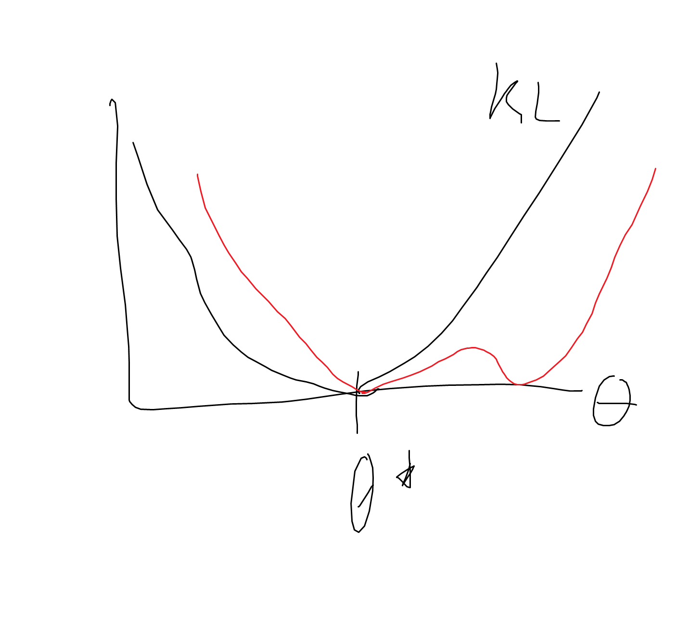
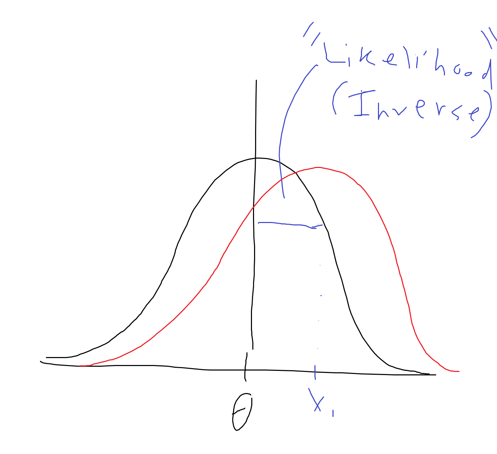
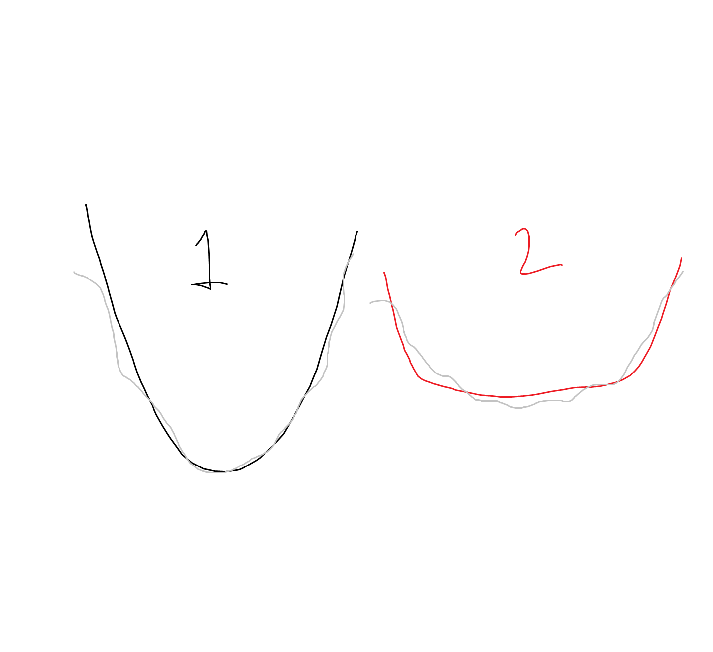

# Lecture 3 - Maximum Likelihood Estimation

Given a sample of iid r.v. $X_1, ..., X_n$, let $(E, (P_\theta)_{\theta \in \Theta})$, be our statistical model, where $\Theta \subset \R$.  
Assume there exists a $\theta^* \in \Theta$ such that $X_1 \sim P_{\theta^*}: \theta^*$ is the **true** paramater (this is the dist that generated the data we sampled).  

**Statistician's goal:**  
- use the sample to find an estimator $\hat{\theta} = \hat{\theta}(X_1...X_n)$ such that $P_{\hat{\theta}}$ is close to $P_{\theta^*}$ for the true parameter $\theta^*$  
    - out of all possible parameters in $\Theta$, we are going to have to optimize to find the *best* $\hat{\theta}$
- ie, we want $|P_{\hat{\theta}}(A) - P_{\theta^*}(A)|$ to be small for all $A \subset E$ (for all outcomes A in the sample space).
- to start, we need some way to measure the distance between our true distribution and our estimated distribution...

## Total Variation Distance:
- The total variation distance between 2 probability measures is defined by:  
$TV(P_\theta, P_{\theta'}) = \max_{\{A \subset E\}} |P_{\hat{\theta}}(A) - P_{\theta^*}(A)|$
    - the TV is the max, across all outcomes A in sample space E, of the distance between the 2 candidate probability measures
    - this is useful since we want our candidate distribution to close to the true distribution for *all* possible outcomes

Problem: computing the max over all possible outcomes - usually infinite - is going to be hard, but we can compress the problem by just looking at the vector/function distance between PMFs/PDFs:  

If E is **discrete** (like Binomial, Poisson, etc) then $X$ has prob. mass function (PMF):  
$P_\theta(X = x) = p_\theta(x) \ \ \forall x \subset E$  
- $p_\theta(x) \ge 0; \ \ \ \Sigma_{\{x \in E\}} p_\theta = 1$  
    - (probability is non-negative, and sum across sample space is 1!)
- Then $TV(P_\theta, P_{\theta'}) = \frac{1}{2} \Sigma_{\{x \in E\}} p_\theta(x) - p_{\theta'}(x)$

If E is **continuous** (Gaussian, Exponential, etc) then we need to replace summations with integrals, but the story is the same:  
$X$ has prob. density function (PDF) $P_\theta(X \in A) = \int_E f_\theta(x) dx$ for all $A \in E$:  
- $f_\theta(x) \ge 0; \ \ \ \int_E f_\theta(x)dx = 1$  
- $TV(P_\theta, P_{\theta'}) = \frac{1}{2} \int_E f_\theta(x) - f_{\theta'}(x)$
    - Say you have 2 gaussians, TV is computing the area "between" the curves. We can also see why we scale by 1/2:  

Properties:  
- TV(P1, P2) = TV(P2, P1) (symmetric)
- TV(P1, P2) >= 0
- TV(P1, P2) = 0 then P1=P2 (definite)
- $TV(P_\theta, P_{\theta'}) \le TV(P_\theta, P_{\theta^{''}}) + TV(P_{\theta^{''}}, P_{\theta^{'}})$ (triangle inequality)

These properties imply TV is a *distance* (in the mathematically defined sense) between 2 prob. distributions.  

### TV -> Estimation Strategy
An estimation strategy:
- Build an estimator $\hat{TV}(P_\theta, P_{\theta^*})$ for all $\theta \in \Theta$.  
- Find the $\hat{\theta}$ that *minimizes* the function $\theta \to \hat{TV}(P_\theta, P_{\theta^*})$ (the fn that maps theta to the TV with the true theta)
- **Problem** - unclear how to build such an estimator!
    - No simple way of expressing TV as an expectation or average
- **Solution** - move to a different but related measure of distance that we can express in terms of expectation, which will allow us to replace expectations with averages.  

(note - we would use TV if we could, but often we can't or it's too difficult)

## Kullback-Leibler (KL) divergence
The KL divergence between 2 probabilities is:  
(if E is Discrete)  
$KL(P_\theta, P_{\theta'}) = \Sigma_{\{x \in E\}} \ p_\theta(x) log(\frac{p_\theta(x)}{p_{\theta'}(x)})$

(if E is continuous)  
$KL(P_\theta, P_{\theta'}) = \int_E \ f_\theta(x) log(\frac{f_\theta(x)}{f_{\theta'}(x)}) dx$

Properties:  
- KL(P1, P2) != KL(P2, P1) in general (not symmetric)
- KL(P1, P2) >= 0
- KL(P1, P2) = 0, then P1 = P2 (definite)
- $KL(P_\theta, P_{\theta'}) not \le KL(P_\theta, P_{\theta^{''}}) + KL(P_{\theta^{''}}, P_{\theta^{'}})$ in general (doesn't necessarily satisfy triangle inequality)

Thus, KL is **not a distance**, hence divergence. But its asymmetry is key to our ability to estimate it! Also, KL=0 when the distributions are the same - which is really what we care about (in some sense, all we care about).

KL Divergence is actually an expectation:  
- because it is the integral (or sum) of some function against a density (mass) 
    - recall, expectation is a weighted average of all possible outcomes! - the weights coming from the pdf (cdf) here 
- which means now we have an expectation that we can replace w an avg, but we still have a $p_{\theta^*}$ - which we do not know - preventing us from optimizing  
- we use Jensen's inequality to plug in a concave function - log, since we know log of the ratio == ratio of the logs

$KL(P_{\theta^*}, P_{\theta}) = E_{\theta^*}[log(\frac{p_{\theta^*}(X)}{p_\theta(X)})]$  
$\ \ \ \ \ \ \ = E_{\theta^*}[log(p_{\theta^*}(X))] - E_{\theta^*}[log(p_{\theta}(X))]$

- This *function* does not actually depend on $\theta^*$, since $p_{\theta^*}$ does not vary, as it is assumed to be the true distribution. (Yes, we don't know $\theta^*$, but we won't care about it when we try to minimize!)
- So the function $\theta \to KL(P_{\theta^*}, P_{\theta})$ (ie, looking at the above as a fn of theta) is really of the form "constant" $\to E_{\theta^*}[log(p_{\theta}(X))]$

Finally, $E_{\theta^*}[h(X)]$ can be estimated by $\frac{1}{n} \Sigma_{i=1}^n h(X_i)$ by LLN, giving us:  
**  
$\hat{KL}(P_{\theta^*}, P_{\theta}) = "constant" - \frac{1}{n} \Sigma_i^n log (p_\theta(X_i))$  
**  
(swap in integral for pdf)

### Estimation strategy
So now we want to minimize this KL divergence with respect to parameter theta - $\argmin_{\theta \in \Theta} KL(P_{\theta^*}, P_\theta)$ - searching over the full parameter set: 

    

- Aside: red line - what if we have 2 minimizers where KL == 0? We eliminate this possibility: *definiteness* implies that $p_{\theta^*}$ is the unique minimizer of $P_\theta \to KL$ (the probability distribution is uniquely identified), and *identifiability* implies that $\theta^*$ is the unique minimizer of $\theta \to KL$ (we assumed identifiability back when we defined a statistical model)

So minimize the function:  
$\min KL == \min \ \ -\frac{1}{n} \Sigma log (p_\theta(X_i))$  
$ == \max \frac{1}{n} \Sigma log (p_\theta(X_i))$  
$ == \max \Sigma log (p_\theta(X_i))$  
$ == \max log \Pi p_\theta(X_i)$  
$ == \max \Pi p_\theta(X_i)$  
- first we can drop the constant, then drop the negative and switch to maximizing, then drop the 1/n constant which doesn't affect argmax, then convert the sum of logs to the log of theproduct, then drop the log since it is an increasing fn so argmax of log(f(x)) is the same as argmax of f(x) 
- this last function is the "likelihood", telling us some measure of how likely it is that our data was generated by this distribution.  

This is the **maximum likelihood** principle.  

Example:  
model = $(\R, N(\theta, 1))_{\theta \in \Theta}$  
sample = $X_1, ..., X_n$  
$\Pi p_\theta(X_i)$ is the joint density of $X_1 ... X_n$ - because the joint density of iid rv is the product of their individual densities

For example, assume n = 1:  
    

- We know what our candidate $f_\theta$ looks like (since we've assumed a distribution and could index it with any $\theta$). Now we collect some data (1 sample here) and we look at the value of $f_\theta(X_1)$, the probability under $f_\theta$ of $X_1$. The maximum likelihood principle says to find the $\theta$ which makes this $X_1$ most likely - the likelihood being the value of the function which estimates the divergence between the true theta and the given theta (graphically, just showing that the "inverse likelihood" is the "distance" between our estimate $f_{\hat{\theta^*}}$ and the candidate $f_\theta$, suggesting to minimize the "inverse likelihood"). To get the *most likely* theta which could have generated $X_1$, we would shift our $f_\theta$ over to $X_1$, by changing the $\theta$ to = $X_1$.
- If we add more observations, we need to maximize the likelihood of $\theta$ given all the data we have and so we multiply their densities together to get the joint density.  

## Likelihood: Discrete Case
Let $(E, (P_\theta)_{\theta \in \Theta})$ be a statistical model with sample of iid rv $X_1 ... X_n$. Assume $E$ is discrete - finite, countable.  
**Definition**  
The *likelihood* of the model is the map $L_n$ (or $L$) defined as:  
- $L_n : \ \ E^n \times \Theta \ \ \to \R$  
  $(x_1,...,x_n, \theta) \longmapsto P_\theta[X_1 = x_1,...,X_n = x_n]$
    - recall the joint PMF of X and Y is P(X = x, Y = y)

Example - Bernoulli trials:  
$E = \{0, 1\}$, $\Theta = (0,1)$, then $\forall p \in (0,1)$,  
$L(x_1, ..., x_n, p) = \Pi_{i=1}^n \ P_p[Xi=x]$  
$ = \Pi_{i=1}^n \ p^{x_i}(1 - p)^{1-x_i}$  
$ = p^{\Sigma_{i=1}^n x_i} \ (1-p)^{n - \Sigma_{i=1}^n x_i}$  
$ = (\frac{p}{1-p})^{\Sigma x_i} (1-p)^n$
- set equal to 0 and maximize wrt p! (given your sample)

## Likelihood: Continuous Case
Let $(E, (P_\theta)_{\theta \in \Theta})$ be a statistical model with sample of iid rv $X_1 ... X_n$. Assume that all $P_\theta$ have density $f_\theta$.  
**Definition**  
The *likelihood* of the model is the map $L$ defined as:  
- $L_n : \ \ E^n \times \Theta \ \ \to \R$  
  $(x_1,...,x_n, \theta) \longmapsto \Pi_{i=1}^n  f_\theta(x_i)$

Example - Gaussian: $X_1...X_n \sim_{iid} N(\mu, \sigma^2)$ for some $\mu \in R$, $\sigma^2 > 0$:  
$E = \R$, $\Theta = \R \times (0, \infty)$,  
(Take the product of the n guassian densities, simplify):    
$L(x_1,...,x_n,\mu,\sigma^2) = \frac{1}{(\sigma \sqrt{2\pi})} \exp(- \frac{1}{2\sigma^2} \Sigma_{i=1}^n (x_i - \mu)^2)$

## Maximum Likelihood Estimator
  
- The likelihood estimator and the likelihood are formally a function of the paramters **and** the data. When we are optimizing, it is helpful to consider that our data sample is fixed and so then the likelihood function is essentially just a function of the paramaters, which we are optimizing over.  
But still it is important to remember that we are maximizing theta **given** our data. 
We design our estimator as a function of random variables, and then once we get data we plug it in. But we want to think of them as random variables for as long as we can so we can consider their fluctuation.   
- The exact strategy we take to perform MLE is as follows: we assume a distribution for our data, for which we will want to find the optimal $\theta$ - that which maximizes the likelihood of our data. Then we compute the joint probability density/mass function. The likelihood and the joint PDF/PMF are mathematically identical, but we interpret them differently - when solving the likelihood, we think of our data almost as if it were fixed, while $\theta$ varies. Next we log the likelihood function which makes it easier to derive the $\argmax$. Finally, we  have to compute this $\argmax$ by taking the derivative, setting it equal to 0 and solving for $\theta$.   

Formally:  
Let $X_i ... X_n$ be an iid sample associated with a statistical model $(E, (P_\theta)_{\theta \in \Theta})$ and let $L$ be the corresponding likelihood.  

**Definition:**  
The *likelihood estimator* of $\theta$ is defined as:  
$\hat{\theta}_n^{MLE} = \argmax_{\theta \in \Theta} \ L(X_1, ..., X_n, \theta)$  

In practice we use the **log-likelihood estimator**, since the argmax of the logged and unlogged likelihood is the same (since log is increasing):  
$\hat{\theta}_n^{MLE} = \argmax_{\theta \in \Theta} \ \log L(X_1, ..., X_n, \theta)$  
- logging simplifies the maximization quite a bit, especally since a lot of distributions utilize $\exp$.

In the discrete case:  
- $\log L = \Sigma_{i=1}^n \log p_\theta(X_i)$  
    - Where $L = \text{Joint PMF} = \Pi_{i=1}^n P_\theta[X_i = x]$ (since they are i.i.d.)

In the continuous case:  
- $\log L = \Sigma_{i=1}^n \log f_\theta(X_i)$
    - Where $L = \text{Joint PDF} = \Pi_{i=1}^n f_\theta(X_i)$ (since i.i.d.)

**EXAMPLES**  
- Bernoulli trials: $\hat{p}_n^{MLE} = \bar{X_n}$ 
    - $L = p^{\Sigma_{i=1}^n x_i} \ (1-p)^{n - \Sigma_{i=1}^n x_i}$  
    - $\log L = (\Sigma x_i)\log(p) + (n - \Sigma x_i) \log(1-p)$
    - $\frac{d \log L}{d \hat{p}} = \frac{\Sigma x_i}{\hat{p}} - \frac{n - \Sigma x_i}{1-\hat{p}} = 0$
    - solve for p: $\hat{p} = \frac{\Sigma {x_i}}{n}$

- Poisson model: $\hat{\lambda}_n^{MLE} = \bar{X_n}$  

- Gaussian model: $(\hat{\mu_n}, \hat{\sigma^2}) = (\bar{X}, \bar{S})$ 
    - (proof shown at bottom of page) the ML estimator for $\mu$ is the mean of the sample $1/n \Sigma_{i=1}^n x_i$ and the ML estimator for $\sigma^2$ is the average of the squared deviation from the mean $\Sigma_{i=1}^n \frac{(x_i - \mu)^2}{n}$ 

## Fisher Information
Define the log likelihood for one observation as $l(\theta) = \log L_1(X, \theta), \ \theta \in \R^d$.  
Assume $l$ is twice differentiable. Under some regularity conditions*, the **Fisher information** of the statistical model is defined as:
- $I(\theta) = E[\nabla l(\theta) \nabla l(\theta)^\top] - E[\nabla l(\theta)]E[\nabla l(\theta)]^\top = -E[\nabla^2 l(\theta)]$  
- "The expectation of the outer product of the first-derivative/graident minus the product of the expectations".  
- Actually solves to be the second derivative/hessian of the likelihood function, evaluated at some $\theta$.    

(*regularity conditions: that we _can_ permute derivatives and integrals. See: [when can we interchange differentiation and integration?](https://math.stackexchange.com/questions/2530213/when-can-we-interchange-integration-and-differentiation))  

If $\Theta \subset \R$, we get:  
- $I(\theta) = var[l'(\theta)] = -E[l''(\theta)]$ 
- "The Fisher information is the variance of the 'score' - the likelihood's partial derivative wrt theta - and the variance of the derivative is equal in expecation to the negative of the second derivative"  
- Since $l(\theta)$ is the likelihood of one sample, and since it is a random variable (as it is a function of a random variable), we can take the variance of its derivative, or the (negative) expectation of its second derivate.  
    - Proof is long. Use the following:
    - Assume $X$ has density $f_\theta$, and thus $\int f_\theta = 1$, and so the $\frac{\partial}{\partial\theta} (\int f_\theta(X) dX) = 0$, and thus $\frac{\partial}{\partial\theta} (\int f_\theta(X) dX) = \int (\frac{\partial}{\partial \theta}f_\theta(X))dx$. Also, $\int (\frac{\partial^2}{\partial \theta^2} f_\theta(X)) dX = 0$  
- Reveals that $I(\theta) = \int \frac{(\frac{\partial}{\partial \theta} f_\theta(X))^2}{f_\theta(x)} dX$

### Interpretation:  
The second derivative of a function at a maximum is telling you how "curved" the function is at the maximum - low second derivative, very flat; high, very curved.  
If very curved, this indicates the estimator is very robust to estimation errors and the maximum won't move much when subjected to different samples. The flatter the curve, the more sensitive the log likelihood is to fluctuation.  
Thus, **a good model has a large value for the Fisher information.**  
We can think of the Information as telling us how much information about $\theta$ is in our model. A well parameterized model will have a larger Information.  
Recall that the MLE is an empirical version of minimizing the KL divergence. The more data we have, the closer our "estimated KL" is to the true KL, and the closer our "empirical minimum" is to the real minimum.  
If we were to plot our KL curve and it looked like curve 1, we know that our estimated KL (grey curve) will always be somewhat close to the true, and thus, so will $\theta$. If it is flatter, like curve 2, fluctuations will have more of an impact.  

Again, the second derivative/hessian is what measures the curvature of the function. So the **Fisher information**, (negative [since in MLE we maximize, which is like maximizing the negative KL or minimizing KL]), is just telling me how curved my likelihood is around the maximum, and therefore is telling me how robust and close our MLE is to the true parameter.  
Thus, there must be something in it that helps us assess the precision of the estimator - there must be some statement that lets us say "the bias, or the variance, or the quadratic risk will be worse if my KL is flatter/my Fisher information is small".  
This leads us to the following theorem:  

### Thoerem
Let $\theta^* \in \Theta$ (the true paramater). Assume the following:  
1. The model is identified
    - (must be, since we are estimating $\theta$ and not $P_\theta$)  
2. For all $\theta \in \Theta$, the support of $P_\theta$ does not depend on $\theta$
    - (because the KL divergence has the log of the ratio of 2 densities, and if one of the support is changing with $\theta$ then we might end up with a log of 0)  
3. $\theta^*$ is not on the boundary of $\Theta$  
    - (so we can take our derivatives)
4. $I(\theta)$ is invertible in the neighborhood of $\theta^*$ ()  
    - (ie, the determinant is not 0. if we consider the 1d case, the determinant of a 1x1 matrix is the number itself. so we're checking if curvature 0, since if it is we're totally flat.)
5. A few more technical conditions (integral of derivative = 0, etc)...  

Then $\hat{\theta}_n^{MLE}$ satisfies:
- $\hat{\theta}_n^{MLE}$ converges in probability to $\theta^*$
    - ie, it is a consistent estimator
- $\sqrt(n)(\hat{\theta}_n^{MLE} - \theta^*)$ converges in distribution to $N(0, I(\theta)^{-1})$ w.r.t. $P_\theta$
    - The central limit theorem tells us more or less than if we remove the expectation from average and multiply by $\sqrt{n}$ we get a normal distribution. This is telling us that even if $\theta$ is not an average, it still converges to a normal distribution (often, $\theta$ will be an average, but it doesn't have to be!)
    - Further, that distribution has asymptotic variance of 1/Information, or 1/Curvature - which means if curvature is high, variance is really low, and if curvature is low, variance is really high! Which is exactly what we concluded intuitively by thinking about the plot of the KL divergence.
- $Var(\theta) = \frac{1}{I(\theta)}$

---
## Aside: minimizing & maximizing functions
- Concavity: a function twice differentiable is said to be **concave** if its second derivatives satisfy $h''(\theta) \le 0; \ \ \forall \theta \in \Theta$  
    - strictly concave if $h'' < 0$
- Convexity: just the reverse ($h'' \ge 0$, strong $h'' > 0$)  

If strictly concave (convex) a maximum (minimium) is guaranteed to be global / unique (including for multivariate functions).  

For a multivariate function $h: \Theta \in \R^d \to \R$, $d \ge 2$, define:  
- gradient vector - $\nabla h(\theta)$ - the vector of first derivatives with respect to all parameters in $\Theta$  
- hessian metrix - $\nabla^2 h(\theta)$ - the matrix of second derivatives with respect to all parameters in $\Theta$  (each entry is the second derivative of $h$ with respect to $\theta_i \theta_j$)  

To check concavity (convexity), must check that the "matrix is negative", which we do by comparing it to 0, by pre and post multiplying by the same vector $x$:  
- Concavity: $x^T (\nabla^2 h(\theta)) x \le 0 ; \ \ \forall x \in \R^d$  
    - less than 0 for strict concavity
- Convexity: $x^T (\nabla^2 h(\theta)) x \ge 0 ; \ \ \forall x \in \R^d$  
    - greater than 0 for strict convexity

Maximizing/minimizing functions is then just a matter of setting derivatives/gradients to 0 and solving.  

## Aside: Gaussian Maximum Likelihood Estimators
- Joint PDF for Gaussians = $f(x_1, ..., x_n | \mu, \sigma^2)$ = $\Pi_{i=1}^n (\frac{1}{2 \pi \sigma^2})^{n/2} \exp(\frac{- \Sigma_{i=1}^n (x_i - \mu)^2}{2 \sigma^2})$ 
- Then the likelihood $L = f(\mu, \sigma^2 | x_1, ..., x_n)$ takes the same mathematical form.  
- Log likelihood = $LL = \log[ \Pi_{i=1}^n (\frac{1}{2 \pi \sigma^2})^{n/2} \exp(\frac{- \Sigma_{i=1}^n (x_i - \mu)^2}{2 \sigma^2}) ]$
- $LL = \Sigma_{i=1}^n \log f(\mu, \sigma^2 | x_1, ..., x_n)$ (log of product is sum of log)
- $LL = \Sigma_{i=1}^n ( \ \log(1) - \frac{1}{2}\log(2 \pi \sigma^2) - \frac{1}{2 \sigma^2} (x_i - \mu)^2 \ )$  
- simplifies via log rules to: $LL = \Sigma_{i=1}^N(\ \frac{-1}{2} \log(2 \pi \sigma^2) - \frac{1}{2 \sigma^2} (x_i - \mu)^2 \ )$  
- simplifies via algebra to: $LL = \frac{-N}{2} \log(2 \pi \sigma^2) - \frac{1}{2 \sigma^2} \Sigma_{i=1}{N} (x_i - \mu)$
- Take derivatives and set equal to 0:

