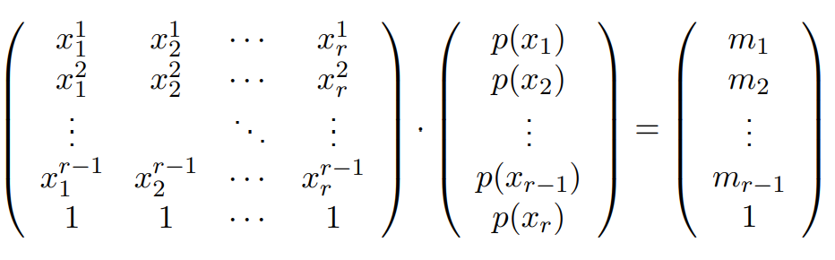
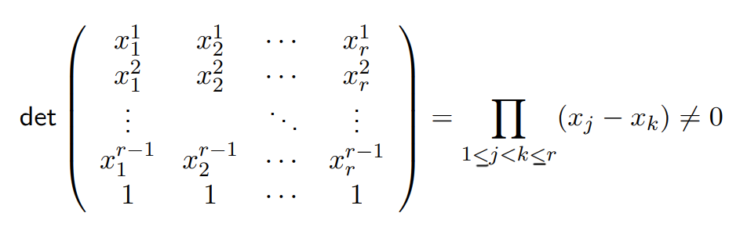
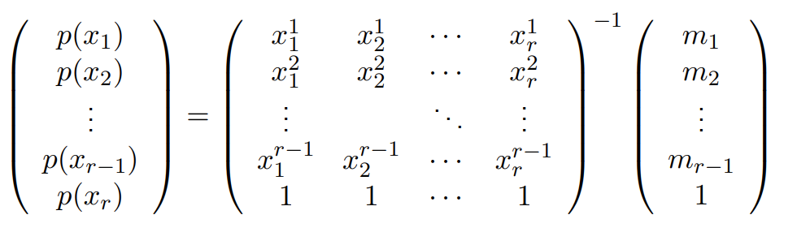

# Lecture 4: Method of Moments

The Method of Moments represents an alternative method (to MLE) of estimating the parameters of an identified distribution. It is motivated by the Weierstrauss Approximation Theorem and the Gaussian quadrature result.  
The theoretical strategy is to express the population moments (a kth moment being the expectation of the kth power of the random variable) as functions of the parameters of interest, allowing us to then estimate the parameters using these moments. The empirical strategy is to replace the population moments with empirical or sample moments. In general, we will need k moments for k parameters.

## Weierstrauss Approximation Theorem (WAT)
**Theorem**  
Let $f$ be a continuous function on the interval $[a,b]$, then, for any $\epsilon < 0$ there exists $a_0,...,a_d \in \R$ such that:  
$ \ \max_{x \in [a,b]} |f(x) - \Sigma_{k = 0}^d a_k x^k| < \epsilon$
- "continuous functions (on an intetval) can be arbitrarily approximated by polynomials" (as long as the polynomial is large enough), which theoretically gives us a finite number of paramters to estimate.

**Statistical Application for WAT**  
- Let $X_1, ..., X_n$ be an iid sample associated with an identified statistical model, $(E, (P_\theta)_{\theta \in \Theta})$. $\theta^*$ is the true parameter.   
- Assume that for all $\theta$ the distribution $P_\theta$ has a density $f_\theta$.  
    - We want to find the distribution, so we want to find $\theta$. Since it is identified, that is the same as finding $P_\theta$, which is the same as finding $f_\theta$, and knowing a density is the same as knowing a density against any test function $h$ (if I want to check if 2 densities are the same, all I have to do is check that their integral against all bounded continuous functions is the same). Thus....  
- **If we find $\theta$ such that $\int h(x)f_{\theta^*}(x) dx = \int h(x)f_{\theta}(x) dx $  for all (bounded continuous) functions $h$, then $\theta = \theta^*$.**  
    - Of course, we don't know $\theta^*$, so we will rewrite it as the expectation (recall, an integral times a density is the expectation) and...
- Replace expectations by averages, find estimator $\hat{\theta}$ such that, by the LLN:  
$\frac{1}{n} \Sigma_{i=1}^n h(X_i) = \int h(x)f_{\hat{\theta}}(x) dx$
    - **Meaning, if I can actually find a function $f_\theta$, such that when I integrate it against $h$ it gives me the average of $h$ evaluated at my data points, for all $h$, then that function $f_\theta$ should be a good candidate for my distribution.**  
    - **Problem**: that's a lot of functions to try for $h$ (all bounded and continuous functions, infinite, not possible...)
    - But WAT tells us that we don't need to consider all $h$, just polynomials...

- So by WAT, it is enough to consider just polynomials (of degree $d$), ie functions $h$ of the form $h(x) = \Sigma_{k=0}^d a_k x^k$:  
$\frac{1}{n} \Sigma_{i=1}^n \Sigma_{k=0}^d a_k X_i^k = \int \Sigma_{k=0}^d a_k x^k f_{\hat{\theta}}(x) dx$, $\forall a_0,...,a_d \in \R$  
    - check that the average of the values of $h(x_i)$ is the same as when I integrate.
    - want this to hold for all polynomials of degree $d$, which is still an inifinte number of polynomials. But since these are polynomials...
- It is enough to consider:  
$\frac{1}{n} \Sigma_{i=1}^n X_i^k = \int \Sigma_{k=0}^d a_k x^k f_{\hat{\theta}}(x) dx$, $\forall a_0,...,a_d \in \R$  
    - in other words, enough to only look at $h(X)$ which is equal to $X^k$ for some k in 0 to d.
    - only (d + 1) equations! much easier to solve.  
### Moments
- The quantity $m_k(\theta) := \int x^k f_\theta(x)dx$ is the $k\th$ **moment** of $P_\theta$, which can also be written as:  
$m_k(\theta) = E_\theta[X^k]$
    - a kth moment is just the expectation of the kth power.  

WAT doesn't tell us what $d$ we should use. But it is telling us that if we go to $d$ large enough, technically we should be able to identify exactly our distribution, up to $\epsilon$.  

## Guassian Quadrature
- WAT has limitations:
    - works only for continuous functions (not really a problem)
    - works only on intervals $[a,b]$
    - does not tell us what the number of monets $d$ should be
- What if $E$ is discrete, so we have PMF $p(\cdot)$?
- Assume $E = \{x_1, ..., x_r\}$ is finite with $r$ possible values (the number of successes out of $r$ trials, for a Binomial example).
- Then the PMF has $r-1$ parameters: $p(x_1) ... p(x_{r-1})$
    - since the last one: $p(x_r) = 1 - \Sigma_{j=1}^{r-1} p(x_j)$ is given by the first $r-1$
- So, hopefully we do not need much more than $d = r - 1$ moments to recover the PMF... can we use only $r - 1$ moments to describe this distribution?    

Gaussian Quadrature tells us yes:  

- Note that for any moment $k = 1, ..., r_1$,  
$m_k = E[X^k] = \Sigma_{j=1}^r p(x_j)x_j^k$  
and $\Sigma_{j=1}^r p(x_j) = 1$  
Which is a system of linear equations with $r$ unkowns $p(x_1),...,p(x_r)$ (where $p(x_r)$ expresses the condition that the sum of the moments = 1)  

- We can write in compact form:  

    - LHS matrix: each row is our random variable (all possible values $r$ in $E$ that it can take) raised to a power.
    - We want to recover the probability mass - the vector $p(x_1), ..., p(x_r)$ - so given the moments can we go backwards and recover the PMF?

Check if matrix is invertible: **Vandermonde Determinant:**
- To go backwards, we need to be able to invert the matrix on the LHS. Then if it is, we have a one to one mapping between the moments and the matrix and we can solve for P = inverse of LHS matrix * moments.  
- We determine if a matrix is invertible by computing its determinant. 
- The Vandermonde matrix is a type of matrix where the first row is such that each entry is to the power 1, the second row is such that each entry is to the power 2, and so on. Just like we have here, plus our rows of 1 (which are like to the power of 0, or the 0th moment). Its determinant has a specific solution shown below - the product of the difference of $x_j$ and $x_k$. If it is nonzero, it is invertible.  

    - For this to be nonzero, all the terms must be nonzero and no $x_j$ and $x_k$ can be identical. We know these termas are going to be different numbers since these are the $r$ possible values that the random variable takes, and we aren't going to repeat a value when defining a probability distribution. 

- So given moments $m_1, ..., m_{r-1}$, there is a **unique** PMF that has these moments, given by:      


This is improvement from WAT, since now we know we only need to consider $r-1$ moments at most - for *any* distribution.  
In general, if we have a distribution with only 1 or a few parameters, we are going to need much less than $r-1$ moments.  

## Conclusion from WAT and Gaussian Qaudrature
- Moments contain important information to recover the PDF or PMF.  
- If we can estimate these moments accurately, we may be able to recover the distribution.  
- In a parametric setting, where knowing $P_\theta$ amounts to knowing $\theta$ (identifiability), it is often the case that even less moments are needed to recover $\theta$ (case-by-case).
    - theoretically, we could have a family of ditributions where the only thing that changes from distribution to distribution is the "27th" moment, which means we will have to go and estimate that moment.
- Rule of thumb: if $\theta \in \Theta \subset \R^d$, we need $d$ moments.  


## Method of Moments

Since the moments are just expectations, we can replace the expectations with averages. 

Let $X_1, ..., X_n$ be an iid sample associated with a statistical model $(E, (P_\theta)_{\theta \in \Theta})$. Assume that $\Theta \subseteq \R^d$, for some $d \ge 1$.
- **Population moments**: Let $m_k(\theta) = E_{\theta}[X_1^k]$, $\ \ \ \ \ \ \ \ \ \ 1 \le k \le d$
    - Using the true / population distribution - expectation.
- **Empirical moments**: Let $\ \ \ \hat{m_k} = \bar{X_n^k} = \frac{1}{n} \Sigma_{i=1}^n X_i^k$, $\ 1 \le k \le d$. 
    - Replace expectation with average.
- Let: 
$\psi : \Theta \in \R^d \to \R^d$  
$\theta \mapsto (m_1(\theta), ..., m_d(\theta))$
    - psi is the function that maps the parameters to the set of the first $d$ moments
    - we are going to want to be able to use psi to come back to $\theta$ from the moments, so we need it to be invertible.

Assume $\psi$ is one to one (otherwise, not invertible):  
$\theta = \psi^{-1} (m_1(\theta), ..., m_d(\theta))$  

**Moments Estimator** of $\theta$ (if it exists):  
$\hat{\theta_n^{MM} = \psi^{-1} (\hat{m}_1, ..., \hat{m}_d)}$  
- we use the empirical moments in place of the population moments

Note:  
This method depends on the stability of the function    q$\psi$. If $\psi$ is flat, $\psi^{-1}$ is going to be very steep, meaning that small fluctuations in the moments will have large effects on the output of $\psi^{-1}$.  
- Going back to the inverse matrix shown in the Gaussian Quadrature section above - what we're seeing is that if the inverse matrix blows up the moments a lot, then we are going to have bad estimates of $\theta$ (in other words, we want that matrix to have a small *condition number* - the ratio of the largest and smallest eigenvalues).  
- So the numerical stability of the moments (level of measurment error) translates into statistical stability.  
- This implies, and we will see below, that the derivatives of $\psi^{-1}$ should play a key role in the MOM, since they can give us a sense of that function's curvature.  

### Analysis of the Moments Estimator: $\hat{\theta}_n^{MM}$
- Let $M(\theta) = (m_1(\theta), ...,  m_d(\theta))$
    - assemble our population moments into a vector
- Let $\hat{M} = (\hat{m_1}, ..., \hat{m_d})$  
    - also put our empirical moments into a vector
- Let $\Sigma(\theta) = V_\theta(X, X^2, ..., X^d)$ be the covariance matrix of the random vector $(X, X^2, ..., X^d)$, where $X \sim P_\theta$
    - Each element is giving us the covariance between the pair of elements in this random vector (or variance on the diagonal)
    - The expectation of the random vector times the random vector transposed which equals the expectation of the random vector time the expectation of the random vector transposed, so $\Sigma_{j,k}(\theta) = E[X^j X^k] - E[X^j]E[X^k]$ = $m_{j + k}(\theta) - m_j(\theta) m_k(\theta)$
- Assume $\psi^{-1}$ is continuously differentiable at $M(\theta)$. Write $\nabla \psi^{-1} \vert_{M(\theta)}$ for the $d \times d$ gradient matrix at this point.  
    - we want to compute the derivative of a vector of functions computed at the value $M(\theta)$, the population moments.   
    - so $\psi^-1$ goes from the set of moments to the set of parameters.  
- Laws of Large Numbers: $\hat{\theta}_n^{MM}$ is weakly/stongly consistent.
    - each empirical moment will converge to the population moment since they are averages, and due to the continuous mapping theorem $\psi^{-1}$ of the empirical moments also converges to $\psi^{-1}$ of the population moments.  
- Central Limit Theorem: $\sqrt{n} (\hat{M} - M(\theta))$ converges in distribution to $N(0, \Sigma(\theta))$, wrt $P_\theta$  
    - Multivariate CLT tells us that, when scaled, this will converge to the multivariate gaussian with mean 0 and with the variance-covariance matrix  $\Sigma$.   

Hence, by the Multivariate Delta Method:  
- Univariate allowed us to say that $\sqrt{n}(\hat{\theta}_n - \theta )\to_{(d)} N(0, \sigma^2)$ is equivalent to $\sqrt{n} (g(\hat{\theta}_n) - g(\theta)) \to_{(d)} N(0, \sigma^2 g'(\theta)^2)$, or $N(0, g'(\theta) \cdot \sigma^2 \cdot g'(\theta))$ 
- Multivariate Delta Method genralizes via gradients

**THEOREM**:  
$\sqrt{n} (\hat{\theta_n^{MM}} - \theta)$ converges in distribution to $N(0, \Gamma(\theta))$, wrt $P_\theta$  
- where $\Gamma(\theta) = [\nabla \psi^{-1} \vert_{M(\theta)}]^\top \Sigma(\theta) [\nabla \psi^{-1} \vert_{M(\theta)}]$  
- (the multivariate version of $g'(\theta) \cdot \sigma^2 \cdot g'(\theta)$)


## MLE vs Method of Moments
- Quadratic risk: MLE is generally more accurate
    - If you have a non-convace likelihood function, you can start with MOM as initialization and then run an MLE algorithm to improve upon it
- Sometimes MLE is intractable or can't be computed. MOM can replace it.  


## Example
```r


```