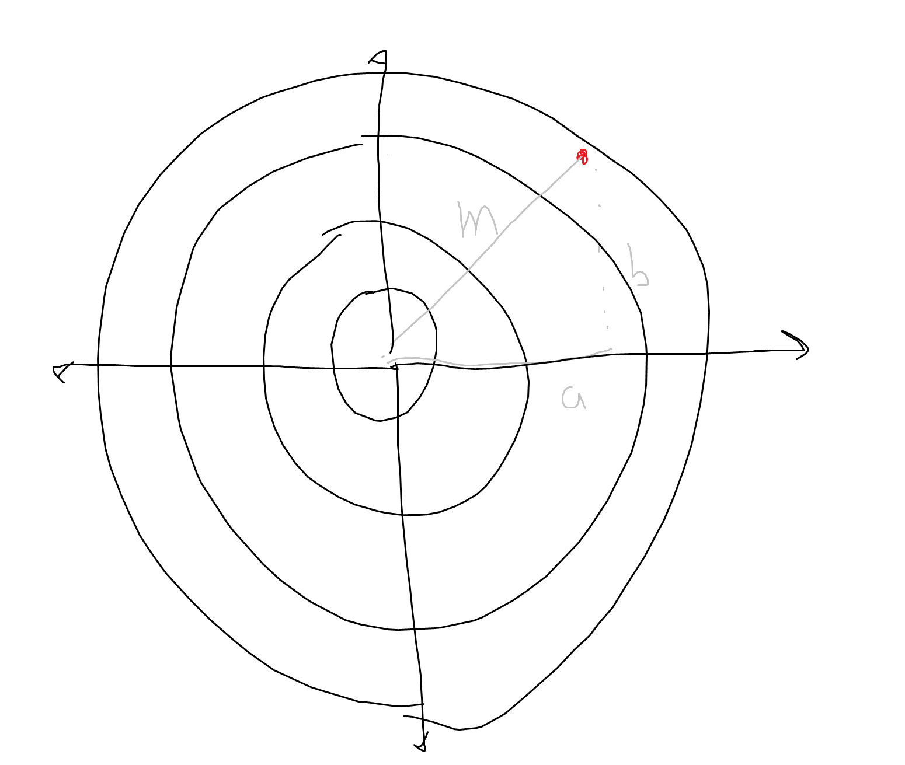
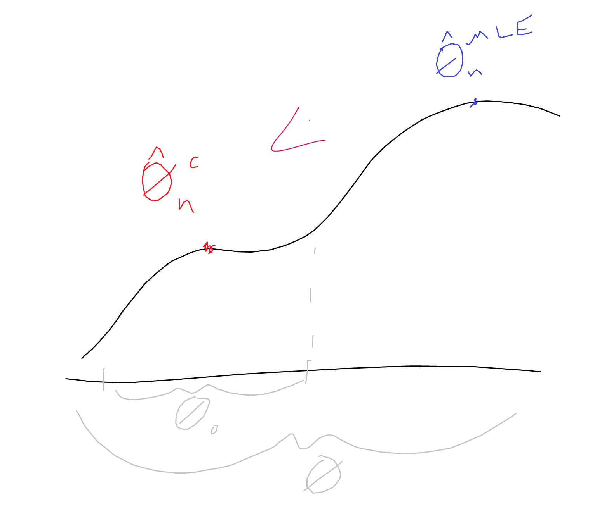
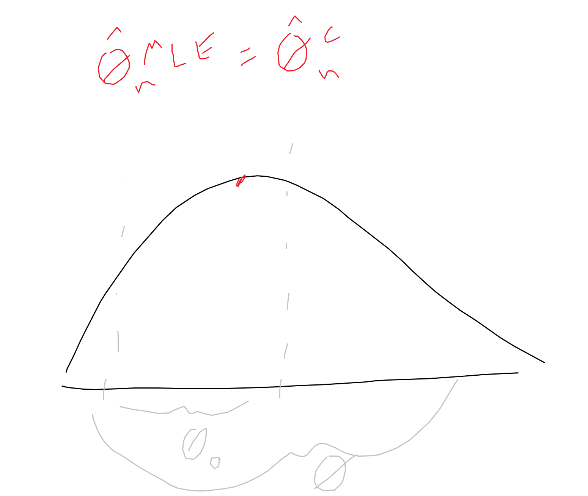

# Lecture 5b: Parametric Hypothesis Testing - Continued

Previously we discussed the motivations for hypothesis testing and generalized methods for performing tests. In general, we want to calculate a test statistic that maps a comparison of our data and the null hypothesis to a pivotal distribution, which can be used to measure how extreme the test statistic is (for example, via a p-value).  

In previous examples, we relied on the CLT to map our test statistic to a pivotal standard Gaussian.  
But regardless of which *pivotal* distribution we use to evaluate our test, this methodology can still work. Here we will consider some other important distributions and famous/common tests.

## The $\chi^2$ distribution
**Definition**:  
For a positive integer $d$ (its single parameter), the $\chi^2$ distribution with $d$ degrees of freedom is the law of the random variable $Z_1^2 + Z_2^2 + ... + Z_d^2$, where $Z_1, ..., Z_d \sim_{iid} N(0,1)$
- So the random variable obtained by summing the squares of $d$ independent standard Gaussian random variables.
- Imagine you are throwing darts and trying to hit the center of a dart board, and you throw with error distributed as a standard guassians running vertically and horizontally. Then the squared distance $m^2$ from your last throw - the red point - to the center of the board is $m^2 = a^2 + b^2$, and since horizontal error $a$ and vertical error $b$ are distributed normally, $m^2$ is the sum of 2 independent squared Gaussians, giving it distribution $\chi^2_2$ (2 degrees of freedom).  

- It is actually a special case of the gamma distribution, but it gets its own name since it is very useful and commonly used - we often utilize sums of squared independent Gaussians, thanks to Pythagoreas, since the sum of squares is really the euclidean norm squared.  

The mean is $d$ and the variance is $2d$.  

**Important Example:**
- **The sample variance has a $\chi^2$ distribution**. It is a function of random variables and is thus itself a random variable with a distribution.  
- If $X_i$ are independent observations from a normal distribution, Cochran's theorem shows that the sample variance follows a scaled chi-squared distribution...
- Recall that the sample variance is given by:  
$S_n = \frac{1}{n} \Sigma_{i=1}^n (X_i - \bar{X}_n)^2 = \frac{1}{n} \Sigma_{i=1}^n X_i^2 - (\bar{X}_n)^2$
    - Cochran's theorem implies that for $X_1, ..., X_d \sim_{iid} N(\mu, \sigma^2)$, if $S_n$ is the sample variance, then:  
    $\frac{nS_n}{\sigma^2} \sim \chi^2_{n-1}$ 

**Other Examples**:  
- If $Z \sim N_d(0, I_d)$, then $||Z||_2^2 \sim \chi_d^2$  
    - the squared (to ignore the square root) of the L2 norm of iid random normal vector $Z$ follows the chi-squared distribution.  
- $\chi^2_2 = Exp(1/2)$ (which follows from solving out the PDF of the $\chi^2$ with $d=2$)

The $\chi^2$

## Student's T Distribution
**Definition**
- For positive integer $d$, the Student's T distribution with $d$ degrees of freedom (denoted $t_d$) is the law of the random variable $\frac{Z}{\sqrt{V/d}}$, where $Z \sim N(0,1)$, $V \sim \chi^2_d$, and $Z \perp V$ (Z is indepentent of V)  
    - So we take a standard Gaussian $Z$ and divide it by something... (root of chi-squared r.v. over d...)

- We choose this denominator because this is exactly what happens when we divide a Gaussian *not* by its *true* variance, but by its *empirical* variance:  
    -  Given $X \sim N(\mu,\sigma^2)$, we can standardize it to $Z = \frac{X - \mu}{\sigma} \sim N(0,1)$
    - But that requires knowing parameters $\mu$ and $\sigma$, and even if we might know $\mu$ (for example, in a testing scenario we might assume it is the null $\mu$), we will generally not know $\sigma$
    - But, we can consistently estimate $\sigma^2$ with the sample variance estimator $S_n = \frac{1}{n} \Sigma_{i=1}^n (X_i - \bar{X})^2$ (converges as $n \to \infty$). (At this point we could use Slutsky to say that this converges to normal, but since this is a common procedure we want to compute its distribution more accurately, especially for small $n$)
    - So we consider (via CLT) $\sqrt{n} \frac{\bar{X}_n - \mu}{\sqrt{S_n}} = \sqrt{n} \frac{\bar{X}_n - \mu}{\sigma} \times \frac{\sigma}{\sqrt{S_n}} = \sqrt{n} \frac{\bar{X}_n - \mu}{\sigma} \times \sqrt{n} / \sqrt{\frac{n S_n}{\sigma^2}}$  
    - We know from CLT that ($Z$ =) $\sqrt{n}\frac{\bar{X}_n - \mu}{\sigma} \sim N(0,1)$ and, from $\chi^2$ above we know that ($V =) \frac{nS_n}{\sigma^2} \sim \chi^2_{n-1}$

    - So: $\sqrt{n}\frac{\bar{X_n} - \mu}{\sqrt{S_n}} = Z \frac{\sqrt{n}}{\sqrt{V}} = \frac{Z}{\sqrt{V / n}}$, which looks quite close to Student's T...
        - $Z$ and $V$ are indpendent, according to Cochran's theorem ($S_n$ is independent of $\bar{X}_n$)
        - **BUT**, $V$ has $d = n-1$ degrees of freedom, while the denominator under $V$ is $n$ (so the denominator under $V$ is essentially $d + 1$ rather than $d$).  
        - **SO**, instead of using $S_n = \frac{1}{n} \Sigma (X_i - \bar{X}_n)^2$, which is actually a biased estimator (its expectation is $\frac{n-1}{n}\sigma^2$), we can use the unbiased estimator (Bessel's correction) $\tilde{S}_n = \frac{1}{n-1} \Sigma (X_i - \bar{X}_n)^2$ 
        - Thus,  
        $\sqrt{n} \frac{\bar{X}_n - \mu}{\sqrt{\tilde{S}_n}} = \sqrt{n} \frac{\bar{X}_n - \mu}{\sigma} \times \sqrt{n - 1} / \sqrt{\frac{(n - 1) \tilde{S}_n}{\sigma^2}} = \frac{Z}{\sqrt{\frac{\tilde{V}}{n - 1}}}$
            - where $Z \sim N(0,1)$ and $\tilde{V} \sim \chi^2_{n-1}$

**In Summary**  
- Cochran's theorem implies that for $X_1, ..., X_n \sim_{iid} N(\mu, \sigma^2)$, if $S_n$ is the sample variance, then:  
$\sqrt{n -1} \frac{\bar{X}_n - \mu}{\sqrt{S_n}} \sim t_{n-1}$
    - note that this is the test statistic for student's test, which is discussed below

If the sample size is large enough, Student's T will be approximately a normal distribution (denominator $\sqrt{\frac{V}{d}}$ shrinks to 0 as $d \to \infty$)  
For lower $d$, Student's T distribution has wider tails since there is extra uncertainty in the denominator.

Important as a pivotal in hypothesis testing, because it resembles the Gaussian but incorporates differing degrees of freedom (ie, your sample size) and thus increased uncertainty for smaller samples.

## Wald's Test
- Wald's test exploits the fact that the MLE (under some technical conditions) has in the limit a distribution which is Gaussian and covariance matrix given by Fisher information.

Consider an i.i.d. sample $X_1,...,X_n$ with statistical model $(E, (P_\theta)_{\theta \in \Theta})$, where $\Theta \subseteq \R^d (d \ge 1)$ and let $\theta_0 \in \Theta$ be fixed and given.  
Consider the following hypotheses:  
- $H_0: \theta = \theta_0$
- $H_1: \theta \ne \theta_0$

Let $\hat{\theta}$ (or $\hat{\theta}^{MLE}$) be the maximum likelihood estimator, and assume MLE technical conditions are satisfied. $I(\cdot)$ is Fisher's information matrix.  
Recall that for MLE our limit theorem was, under the null, $\sqrt{n}(\hat{\theta}_n - \theta_0) \ \ \xrightarrow{(d)}_{n \to \infty} \ \  N_d(0, I(\theta_0)^{-1})$

Now, 
- If $H_0$ is true (ie, "under the null"), then:  
$\sqrt{n} \ I(\hat{\theta})^{1/2} \ (\hat{\theta}_n - \theta_0) \ \ \xrightarrow{(d)}_{n \to \infty} \ \  N_d(0, 1_d) \ $, w.r.t. $P_\theta$
    - (i.e., this converges to a normal distribution with mean 0 and covariance matrix "identity matrix of $\R^d$", like the N(0,1) of $R^d$)
    - Imagine we have $X \sim N(0, \sigma^2)$, we could change this to $\frac{X}{\sqrt{\sigma^2}} \sim N(0, 1)$, where 1 is the identity matrix of $R^1$. We want to apply this to $R^d$, to go from $X \sim N(0, \Sigma)$ to: $\ \ \Sigma^{-1/2} X \sim N(0,1_d)$
    - above, $I(\hat{\theta})^{-1}$ plays the role of $\Sigma$, and $(\hat{\theta} - \theta_0)$ plays the role of $X$. 
    - also note we could use $I(\theta_0)$ instead of $I(\hat{\theta})$ since we might say we know the null under the null

This quantity on the left is a "pivotal quantity", since its distribution does not depend on population parameters. We can actually compute it - since we know $\hat{\theta}$ and $\theta_0$. Thus, this can be our **test statistic**!  
This quantity implies a measure of the distance between two parameter vectors, $\hat{\theta}$ and $\theta_0$, so we want to measure their (euclidean) norm (to reject the test, the $\hat{theta}$ should be "far" in distance from $\theta_0$) 

So, take euclidean norm of this pivotal quantity *(recall $||x||^2 = x^\top x$ = $\Sigma_{i=1}^{l} x_i^2$)*:  
- Thus, Test statistic $T_n = ||\sqrt{n} [I(\hat{\theta})]^{1/2} (\hat{\theta} - \theta_0)||^2$  
- or:  
$T_n = n \ (\hat{\theta} - \theta_0) I(\hat{\theta}) (\hat{\theta} - \theta_0) $  

$T_n$ is large if $\hat{\theta}$ is far from $\theta_0$, so our test is:  
$\psi = 1(T_n > C)$  
To choose $C$ we want to fix our Type 1 error for a given $\alpha$:  
$P_{\Theta_0}[\psi = 1] = \alpha$
- This is equivalent to checking whether $P_{\Theta_0}[T_n > C] = \alpha$ (the probability under the null that the test statistic is larger than C equals the level - think the shaded area to the right of C) 
- And thus to find C we need to know the distribution of $T_n$ when $\theta = \theta_0$ (under the null).  
- But we know its distribution is a chi-squared - $T_n = n \ (\hat{\theta} - \theta_0) I(\hat{\theta})(\hat{\theta} - \theta_0) \xrightarrow{(d)}_{n\to\infty} \chi^2_d$ w.r.t. $P_{\theta_0}$ 
    - this follows because the vector (pivotal quantity) we are taking the norm of is a (multivariate) standard Gaussian distribution, and taking the norm causes us to compute the sums of independent squared Gaussians == chi-squared. (Identity matrix as covariance matrix means no covariance between any r.v.'s and variances exactly equal to 1!)  

**In the end, we just need to find the $C$ such that $P(\chi^2_d > C) = \alpha$**  

So we have some chi-squared distribution, we pick some $\alpha$, and we set $C$ to be $q_\alpha$, the quantile of order $1 - \alpha$ of $\chi^2_d$.  
For each $d$ this is a different underlying distribution and so this quantile takes a different value.  

**In summary**,  
**Wald's test** with asymptotic level $\alpha \in (0,1)$ is:  
- $\psi = 1\{T_n > \alpha\}$
- where $\alpha$ is the $(1 - \alpha)$ quantile of $\chi^2_d$ (which we can just look up in a table)  

Wald's test is also valid if $H_1$ is a one-sided test (ie, has the form of $\theta < \theta_0$, $\theta > \theta_0$, or $\theta = \theta_0$)

**Intuition**  
If we did not know any statistics, given an estimated parameter vector and a null parameter vector, say $\hat{\theta}^{MLE} = (1.2, 0.9, 2.1)$ and $\theta_0 = (1, 1, 2)$, we might compare them by taking the simple euclidean norm ($(1.2 - 1)^2 + (0.9 - 1)^2 + (2.1 - 2)^2$) and deciding based on some heuristic if they sre close or not.  
Wald is telling us this simple average does not work - that when computing the distance between our parameter vectors in some space, we should have some sort of weighted average...  
By incorporating the Fisher information, Wald's test considers all directions of the space at once and weights each direction based on the "variance" in each direction, distorting the "geometry" of the space that we are calculating our distance in to be more tuned to the given statistical model.  
Recall more information means less variance (hence variance is 1 / Fisher), so we are kind of upweighting the parameters for which our data has more information relative to those for which we have less information.   

## Likelihood Ratio Test

This test claims that if I want to test $H_0: \theta = \theta_0$, $H_1: \theta = \theta_1$, all I need to determine is if $\theta_0$ is more or less likely than $\theta_1$.  
We have already seen the likelihood function, which spits out the likelihood of a parameter given some data.  
So it is natural to consider:  
$\frac{L(\Theta_1; X_1, ..., X_n)}{L(\Theta_0; X_1, ..., X_n)} > 1$  
Caveat: when we do hypothesis testing, there is an asymmetry between $H_0$ and $H_1$ and we need a way to control Type 1 error. But with the above proposed test, there is no "knob" - no room for $\alpha$. So we replace $1$ with $C$, and then calibrate $C$ so that Type 1 error is at level $\alpha$:  
$\frac{L(\Theta_1; X_1, ..., X_n)}{L(\Theta_0; X_1, ..., X_n)} > C$  

But we almost never have such a test, where we are comparing two exact hypotheses - typically we have an alternative hypotheses like $\theta_1 > \theta_0$, less than, not equal...  
But we can build on this principle:  

**Formally:**  
Consider an i.i.d. sample $X_1,...,X_n$ with statistical model $(E, (P_\theta)_{\theta \in \Theta})$, where $\Theta \subseteq \R^d (d \ge 1)$.  

Suppose the null hypothesis has form $H_0: (\theta_{r+1}, ..., \theta_d) = (\theta_{r+1}^{(0)}, ..., \theta_{d}^{(0)})$  
- only testing if the last coefficients (from $r+1$ to $d$) are equal
- for example imagine $H_0: (\theta_2 = 1, \theta_3 = 2)$ and we ignore $\theta_1$.

Consider our classic MLE:  
$\hat{\theta}_n^{MLE} = \argmax_{\theta \in \Theta} l_n(\theta)$  

Now consider constrained MLE:  
$\hat{\theta}_n^c = \argmax_{\theta \in \Theta_0} l_n(\theta) \ \ $  
- if we are limiting our null - our "truth" - to just a subset of parameters, we can maximize just over those parameters.  

This implies:  
$l(\hat{\theta}_n^c) \le l(\hat{\theta}_n^{MLE}) $
- think, if the "global" maximum over the parameter space is in the constrained part of the space, then the likelihoods are equal, but if that global maximum is outside of the constrained part then only $\hat{\theta}_n^{MLE}$ will be the global maximum (since that estimator comes from maximizing over the full parameter space)

However, if $H_0$ is true, then $\theta \in \Theta_0$, and then the two maximums should be relatively similair.  
If $H_0$ is not true, then the likelihood of the MLE should be much larger than the likelihood of the constrained MLE.  

**Test Statistic**:  
$T_n = 2(l_n(\hat{\theta}_n) - l_n(\hat{\theta}_n^c))$  
- look at the difference of the (log) likelihoods at the unconstrained and constrained maximums  
- Should be non-negative and should be close to 0 if $H_0$ is true.  

Thus, a natural test is $\psi = 1\{T_n > C\}$  

Need to find $C$ such that for a given $\alpha$ $P(T_n > C) = \alpha$ under the null...  
But we have a whole family of null hypotheses, and we need our Type 1 error to be constrained over the entire space, so we need:  
$\max_{\theta \in \Theta_0} P_\theta(T_n > C) = \alpha$  

That depends on the distribution of $T_n$ under the null, thus:   

**Theroem**  
Assume $H_0$ is true and that MLE technical conditions are satisfied, then:  
$T_n \xrightarrow{(d)}_{n \to \infty} \chi^2_{d-r}$, w.r.t. $P_\theta$.  
- Recall, we pinned down all but $r$ coordinates of the parameter vector - so we have $d - r$ degrees of freedom. 

Then the likelihood ratio test with asymptotic level $\alpha \in (0,1)$ is:  
$\psi = 1\{T_n > q_\alpha\}$

where $q_\alpha$ is the (1 - $\alpha$)-quantile of $\chi^2_{d-r}$

## Testing implicit hypotheses
So far we have tested if a parameter is *explicitly* in some set (e.g, $\Theta_0$) or not - asking questions specifically about the parameter.  
But sometimes we may want to test something about functions of $\theta$.  
For example, is the difference between the first coordinate of $\theta$ and the second coordinate of $\theta$ positive?  
- "Maybe I want to measure drawing ability with right hand and left hand to test early on if kids are going to be right or left handed based on which hand they draw better with. I don't necessarily care about their actual score on the drawing test, just the difference between scores for each hand. But this test implicitly relies on some $\theta_1$ (parameter defining right hand distribution) and $\theta_2$ (parameter defining left hand distribution)." 

Let $X_1, ..., X_n$ be iid random variables and lets $\theta \in \R^d$ be a parameter associated with the distirbution of $X_1$ (e.g., a moment, the parameter of a statistical model, etc.)  

Let $g: \R^d \to \R^k$ be continuously differentiable (with $k < d$)  
Consider the following hypotheses:  
- $H_0: g(\theta) = 0$
- $H_1: g(\theta) \ne 0$

(e.g., $g(\theta) = (\theta_1, \theta_2)$ where $k = 2$, $g(\theta) = \theta_1 - \theta_2$ where $k = 1$, etc.)

How can we do this? As usual, we want to build a test statistic which is *pivotal*, and we can do that using some form of Central Limit Theorem or Asymptotic Normality of an estimator.

Suppose an asymptotically normal estimator $\hat{\theta}_n$ is available:  
$\sqrt{n} (\hat{\theta}_n - \theta) \xrightarrow{(d)}_{n \to \infty} N_d(0, \Sigma(\theta))$  

By (multivariate) Delta method:  
$\sqrt{n} (g(\hat{\theta}_n) - g(\theta)) \xrightarrow{(d)}_{n \to \infty} N_k(0, \Gamma(\theta))$  
- where $\Gamma(\theta) = \nabla g(\theta)^\top \Sigma(\theta) \nabla g(\theta) \in R^{k \times k}$

Assume $\Sigma(\theta)$ is invertible and $\nabla g(\theta)$ has rank $k$, so $\Gamma(\theta)$ is invertible and  
$\sqrt{n} \ \Gamma(\theta)^{-1/2} (g(\hat{\theta}_n - g(\theta))) \ \ \xrightarrow{(d)}_{n \to \infty} \ \ N_k(0, 1_k)$  

Then by Slutsky's theorem, if $\Gamma(\theta)$ is continuous in $\theta$,  
$\sqrt{n} \ \Gamma(\hat{\theta}_n)^{-1/2} (g(\hat{\theta}_n) - g(\theta)) \xrightarrow{(d)}_{n \to \infty} \chi^2_k$
- (replace $\Gamma(\theta)$ with $\Gamma(\hat{\theta}_n)$)

Hence, if $H_0$ is true so $g(\theta) = 0$, and we look at the euclidean norm of the vector since we want to measure distance between $g(\theta)$ and $g(\hat{\theta}_n)$, we get:  

$n \ g(\hat{\theta}_n)^\top \Gamma^{-1} g(\hat{\theta}_n) \ \xrightarrow{(d)}_{n \to \infty} \ \chi^2_k$
- note the similarities to Wald's test, although here we don't use Fisher's information

Thus we have a pivotal test statistic:  
$T_n = n \ g(\hat{\theta}_n)^\top \Gamma^{-1} g(\hat{\theta}_n)$

and a test $\psi = 1\{T_n > q_\alpha\}$, where $q_\alpha$ is the $1 - \alpha$ quantile of $\chi^2_k$.  

## The multinomial case: $\chi^2$ test
This test is used to compare the distributions of categorical random variables.

Our goal: Given some data with a fixed probability mass function (so discrete distribution), test if the PMF is equal to some distribution $p^0$ or not equal to it.  
We want to use Wald's test, which has the $\chi^2$ has the limiting distribution. If we invert the asymptotic covariance matrix, we find the $\chi^2$ distribution.
But the Fisher information matrix does not exist for the multinomial case. So we have to use a trick to remove the part which forbids it to be invertible.   

Let $E = \{a_1, ..., a_K\}$ be a finite space and $(P_p)_{p \in \Delta K}$ be the family of all probability distributions on $E$:

- $\Delta K = \{p = (p_1, ..., p_K) \in (0, 1)^K: \Sigma_{j=1}^K p_j = 1\}$
    - So our parameter set contains $K$ parameters (think, K different categories) and there is an extra constraint that they must add to 1 - hence, we will see $K - 1$ degrees of freedom.

for $p \in \Delta K$ and $X \sim P_p$,  
- $P_p[X = a_j] = p_j, \ \ \ j = 1...K$

Let $X_1, ..., X_n \sim_{iid} P_p$ for some unkown $p \in \Delta K$, and let $p^0 \in \Delta K$ be fixed.  
We want to test:  
$H_0: p = p^0$ vs. $H_1: p \ne p^0$ with asymptotic level $\alpha \in (0,1)$  
- Example, if $p^0 = (1/K, 1/K, ..., 1/K)$, we are testing whether  $P_p$ is the uniform distribution on $E$.

Likelihood of the model:  
- $L_n(X_1, ..., X_n; p) = p_1^{N_1} p_2^{N_2} ...p_k^{N_k}$  
where $N_j = \#\{i = 1, ..., n : X_i = a_j\}$
    - ($N_j$ is the count of category j, the number of observations in your sample that belong to category j)

Let $\hat{p}$ be the MLE:  
- $\hat{p}_j = \frac{N_j}{n}$, $\ j=1,...,K$
    - the simple proportion of the count of category $j$ out of the sample size

So $\hat{p}$ maximizes $\log L_n(X_1,...,X_n; p)$ under the constraint that $\Sigma_{j=1}^{K} \  p_j = 1$

If $H_0$ is true, then $\sqrt{n}(\hat{p} - p^0)$ is asymptotically normal and the following holds:  
**Theorem**  
- $n \Sigma_{j=1}^K \frac{(\hat{p}_j - p_j^0)^2}{p_j^0} \ \xrightarrow{(d)}_{n \to \infty} \ \chi^2_{K-1}$
    - where the LHS is our test stat $T_n$

**Test Statistic**
- $T_n = n \Sigma_{j=1}^K \frac{(\hat{p}_j - p_j^0)^2}{p_j^0}$

Thus we have $\chi^2$ test $\psi = 1\{T_n > q_\alpha\}$, where $q_\alpha$ is the $1 - \alpha$ quantile of $\chi^2_{K-1}$.  
- Asymptotic p-value of the test:  
$p-value = P[Z > T_n | T_n]$,  
where $Z \sim \chi^2_{K-1}$ and $Z \perp T_n$ ($Z$ is independent of $T_n$)

**Example 1.** Imagine you pick a random sample of CEOs and measure their zodiac sign to determine if people with certain signs tend to be more successful.  
Your null hypothesis is that the zodiac signs of CEOs are uniformly distributed - so no specific sign tends to be more successful.  
We can use our data to perform a chi-squared test to determine if we should reject this null.  

**Example 2.** Say we have data on 275 jurors in a county and their racial group is identified. We want to know if the jury is representative of the county population. In other words, does the distribution of juror race equal the distribution of race in the greater county?   
See `R/5_ht.R`

## The Gaussian Case - Student's test
Student's (one-sample) t-test is commonly used to compare means when we believe the data to be normally distributed. Under conditions, the test statistic - which we have seen above - follows Student's T distribution. Discussed below is specifically a one-sample t test, where we compare the mean of the sample with a hypothetical value - $\mu_0$.

Let $X_1, ..., X_n \sim_{iid} N(\mu, \sigma^2)$, for some unkown $\mu \in \R$, $\sigma^2 > 0$, and let $\mu_0 \in R$ be fixed/given.  
We want to test:  
- $H_0: \mu = \mu_0$ vs. $H_1: \mu \ne \mu_0$ with asymptotic level $\alpha \in (0,1)$ 

**If $\sigma^2$ is known (Z test)**  
Let $T_n = \sqrt{n} \frac{\bar{X}_n - \mu_0}{\sigma}$
- then $T_n \sim N(0, 1)$ (by CLT, **and** because the data is normally dist.)
- $\psi_\alpha = 1\{|T_n| > q_{\alpha/2}\}$ is the test, with (non asymptotic) level alpha

But, if $\sigma^2$ is unkown, we need to estimate it with the sample variance, and then this $T_n$ is **not** going to be normally distributed, but rather it will have a Student T distribution with $n-1$ degrees of freedom, $t_{n-1}$.  

Formally, **if $\sigma^2$ is unkown:**  
Let $T_n = \sqrt{n - 1} \frac{\bar{X}_n - \mu_0}{\sqrt{S_n}}$, where $S_n$ is the sample variance.  
Cochran's theorem implies:  
- $\bar{X}_n \perp S_n$ (they are independent)  
- $\frac{n S_n}{\sigma^2} \sim \chi^2_{n-1}$  

Hence, $T_n \sim t_{n-1}$

Proof:  

  

- Recall a "Student T" random variable has the form $\frac{N(0, 1)}{\sqrt{\chi^2_d / d}}$  
- Lets check if $T_n = \sqrt{n} \frac{\bar{X}_n - \mu}{\hat{\sigma}}$ is of this same form as the Student T r.v.
    - where $\hat{\sigma} = \sqrt{S_n}$
    - because $\hat{\sigma}^2 = S_n = \frac{1}{n} \Sigma_{i=1}^n (X_i - \bar{X})^2$
- Well we know $\sqrt{n} \frac{\bar{X}_n - \mu}{\sigma} \sim N(0,1)$, by the CLT.
- So we can use that as our numerator: $\frac{\sqrt{n} \frac{\bar{X}_n - \mu}{\sigma}}{\hat{\sigma}}$.  
- But then we need to divide both parts of the test statistic by $\sigma$:  $\frac{\sqrt{n} \bar{X}_n - \mu}{\frac{\hat{\sigma}}{\sigma}}$
- And now this denominator is distributed $\sim \sqrt{\frac{\chi^2_{n-1}}{n}}$
    - This denominator can be rewritten as $\sqrt{\frac{S_n}{\sigma^2}}$
    - And recall from the example in the $\chi^2$ section, that for sample variance $S_n$ Cochran's theorem gives us $\frac{nS_n}{\sigma^2} \sim \chi^2_{n-1}$ (the presence of the $\bar{X}$ in the sample variance calculation removes a degree of freedom)
    - So $\frac{S_n}{\sigma^2} \sim \frac{\chi^2_{n-1}}{n}$
- This is close to what we want, but the denominator under $\chi^2$ should be equivalent to $d$ - currently, $d = n - 1$ and that denominator is $n$.
- So instead we try the test statistic $T_n = \sqrt{n} \frac{\bar{X}_n - \mu}{\sqrt{S_n}}$, and use the *unbiased* sample variance estimator $S_n = \frac{1}{n-1} \Sigma(X_i - \bar{X})^2$
    - Multiply the denominator by $\frac{\sigma}{\sigma}$ and rewrite to get: $\sqrt{n} \frac{\bar{X}_n - \mu}{\sigma} \cdot \frac{1}{\frac{\sqrt{S_n}}{\sigma}}$
    - The left fraction is standard normally distributed by the CLT, so we have part of our fraction.
    - Looking the remaining denominator $\frac{\sqrt{S_n}}{\sigma} = \sqrt{\frac{S_n}{\sigma^2}} = \sqrt{\frac{\Sigma(X_i - \bar{X})^2}{(n - 1) \sigma^2}}$ (last step plugs in $S_n$)
    - As seen before (Cochran's), $\frac{\Sigma(X_i - \bar{X})^2}{\sigma^2} \sim \chi^2_{n-1}$, so $\sqrt{S_n} / \sigma \sim \frac{\chi^2_{n-1}}{n -1}$
    - now the degrees of freedom match this quantities denominator, $d = n-1$
    - https://math.stackexchange.com/questions/474733/derivation-of-the-density-function-of-student-t-distribution-from-this-big-integ
- This was proof that the test statistic is distributed $t_{n-1}$

Now we have a pivotal distribution ($t_{n-1}$).  
Thus, Student's test with (non asymptotic) level $\alpha \in (0,1)$ is:  
$\psi_\alpha = 1\{|\tilde{T_n}| > q_{\alpha/2}\}$
- where $q_{\alpha/2}$ is the $(1-\alpha)$ quantile of $t_{n-1}$
- So rejection region is $R_\psi = \{|\frac{\sqrt{n-1}(\bar{X}_n - \mu_0)}{\sqrt{S_n}}| > q_{\alpha/2}(t_{n-1})\}$

If $H_1$ is $\mu > \mu_0$ (one-tailed test), Student's test with level $\alpha \in (0,1)$ is:
- $\psi_\alpha' = 1\{\tilde{T_n} > q_\alpha\}$, with $q_\alpha$ being the $(1-\alpha)$-quantile of $t_{n-1}$  

Advantages of Student's T:
- Non asymptotic
    - It doesn't technically require the CLT to kick in, **since we assume our data is normally distributed.**
- Can be run on small samples - for smaller samples, smaller degrees of freedom, fatter tails - which means, relative to a simple Gaussian test (when $\sigma^2$ is known), we need a bit more evidence in our data to get a test statistic greater than $q_{\alpha/2}$ (or $q_\alpha$)
- For larger samples, the test statistic is essentially normally distributed.

Drawbacks:
- Relies on the assumption that the sample is Gaussian.
    - If the data are substantially non-normal and the sample size is small, the t-test can give misleading results

So if we are given some data and we want to test if its mean is equivalent to some $\mu_0$ or not, the (one sample) T test is very useful. But *first* we have to make the assumption that our data is normally distributed - so we are going to want a test that allows us to quantify the probability that our data is actually Gaussian.
- Such a test should have a null hypothesis of "data is Gaussian", and an alternative hypothesis "data is not Gaussian".
- Which leads us to seek for tests with minimal power (recall, power is probability of rejecting the null when the null should be rejected) - since we want normal data.
- The number of ways that a variable can not be Gaussian is so many, that all tests are bound to have low power.
- Thus, people tend to be happy with the assumption that their data is Gaussian since it is very hard to find a test that will reject this null hypothesis.

## (Student's) Two-sample test
The two sample t test is used to test whether the unkown population means of two random variables are equal or not. Again we assume normality of the data.

Consider two samples: $X_1, ..., X_n$ and $Y_1, ..., Y_n$ of independent ranvom variables such that:
- $E[X_1] = ... = E[X_n] = \mu_Y$
- $E[Y_1] = ... = E[Y_n] = \mu_X$

**If variances are known:**  
Assume that the variances are known, so assume (without loss of generality) that:
- $var(X_1) = ... = var(X_n)$ and $var(Y_1) = ... = var(Y_n)$

We want to test:
- $H_0: \mu_X = \mu_Y$ vs. $H_1: \mu_X \ne \mu_Y$ with asymptotic level $\alpha \in (0,1)$.

From CLT:
- $\sqrt{n}(\bar{X}_n - \mu_X) \xrightarrow[n \to \infty]{(d)} N(0,1)$  

and
- $\sqrt{m}(\bar{Y}_m - \mu_Y) \xrightarrow[n \to \infty]{(d)} N(0,1) \ \Rightarrow \sqrt{n}(\bar{Y}_m - \mu_Y) \xrightarrow[n \to \infty, m \to \infty, \frac{m}{n} \to \gamma]{(d)} N(0, \gamma)$  

Moreover, the two samples are independent so:  
- $\sqrt{n}(\bar{X}_n - \bar{Y}_m) + \sqrt{n}(\mu_X - \mu_Y) \xrightarrow[n \to \infty, m \to \infty, \frac{m}{n} \to \gamma]{(d)} N(0,1 + \gamma)$  

Under $H_0$ $\mu_x = \mu_y$, so:
- $\sqrt{n}\frac{\bar{X}_n - \bar{Y}_m}{\sqrt{1 + m/n}} \xrightarrow[n \to \infty, m \to \infty, \frac{m}{n} \to \gamma]{(d)} N(0,1)$  
- Thus we can use the left quantity as a test statistic, with the standard Gaussian as the pivotal distribution.
- Test: $\psi_\alpha = 1\{\sqrt{n}\frac{\bar{X}_n - \bar{Y}_m}{\sqrt{1 + m/n}} > q_{\alpha/2}\}$

**If the variances are unkown:**  
More commonly, variances are unkown and we will want the t distribution as our pivotal distribution.  

Let variances be unkown, but we know (by assumption) that:
- $X_i \sim N(\mu_X, \sigma^2_X)$ and $Y_i \sim N(\mu_Y, \sigma^2_Y)$  

Then: 
- $\bar{X}_n - \bar{Y}_n \sim N(\mu_X - \mu_Y, \frac{\sigma^2_X}{n} + \frac{\sigma^2_Y}{m})$  

Under $H_0$:  
- $\frac{\bar{X}_n - \bar{Y}_n}{\sqrt{\frac{\sigma^2_X}{n} + \frac{\sigma^2_Y}{m}}} \sim N(0, 1)$

So for unkown variance:  
- $\frac{\bar{X}_n - \bar{Y}_n}{\sqrt{\frac{S^2_X}{n} + \frac{S^2_Y}{m}}} \sim t_N$
- where $S^2$ is the sample variance
- and $N = \frac{(\frac{S^2_X}{n} + \frac{S^2_Y}{m})^2}{\frac{S^4_X}{n^2 (n-1)} + \frac{S^4_Y}{m^2(m-1)}} $ 

This leaves us with a test statistic:  
$T_n = \frac{\bar{X}_n - \bar{Y}_n}{\sqrt{\frac{S^2_X}{n} + \frac{S^2_Y}{m}}}$

and test:  
$\psi_\alpha = 1\{|T_n| > q_{\alpha/2}\}$ for level $\alpha \in (0,1)$ and $q_{\alpha/2}$ the $(1 - \alpha/2)$-quantile of $t_N$.
