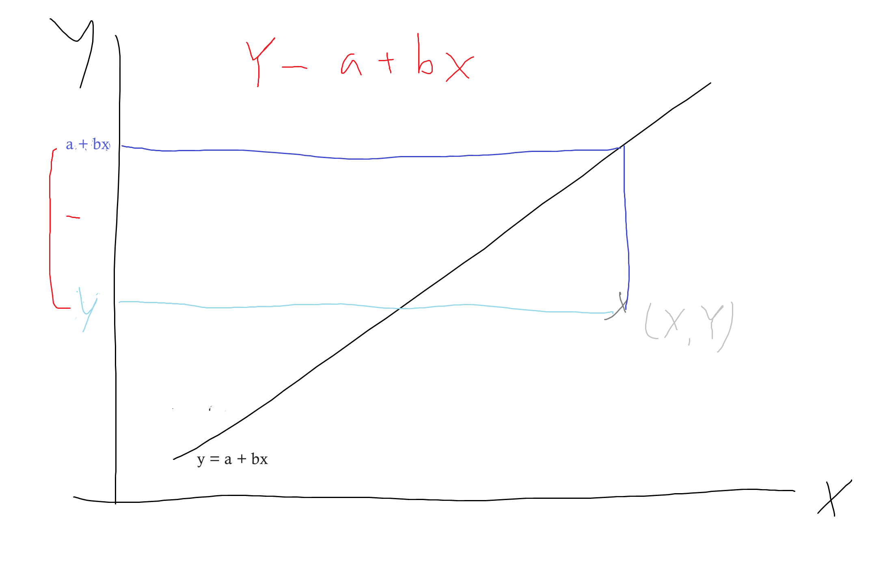
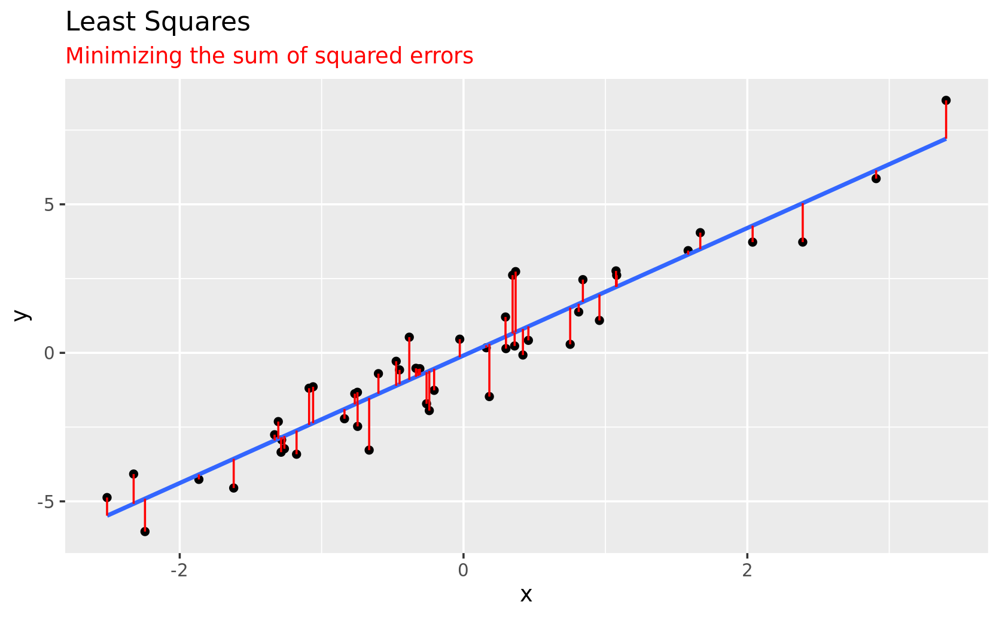
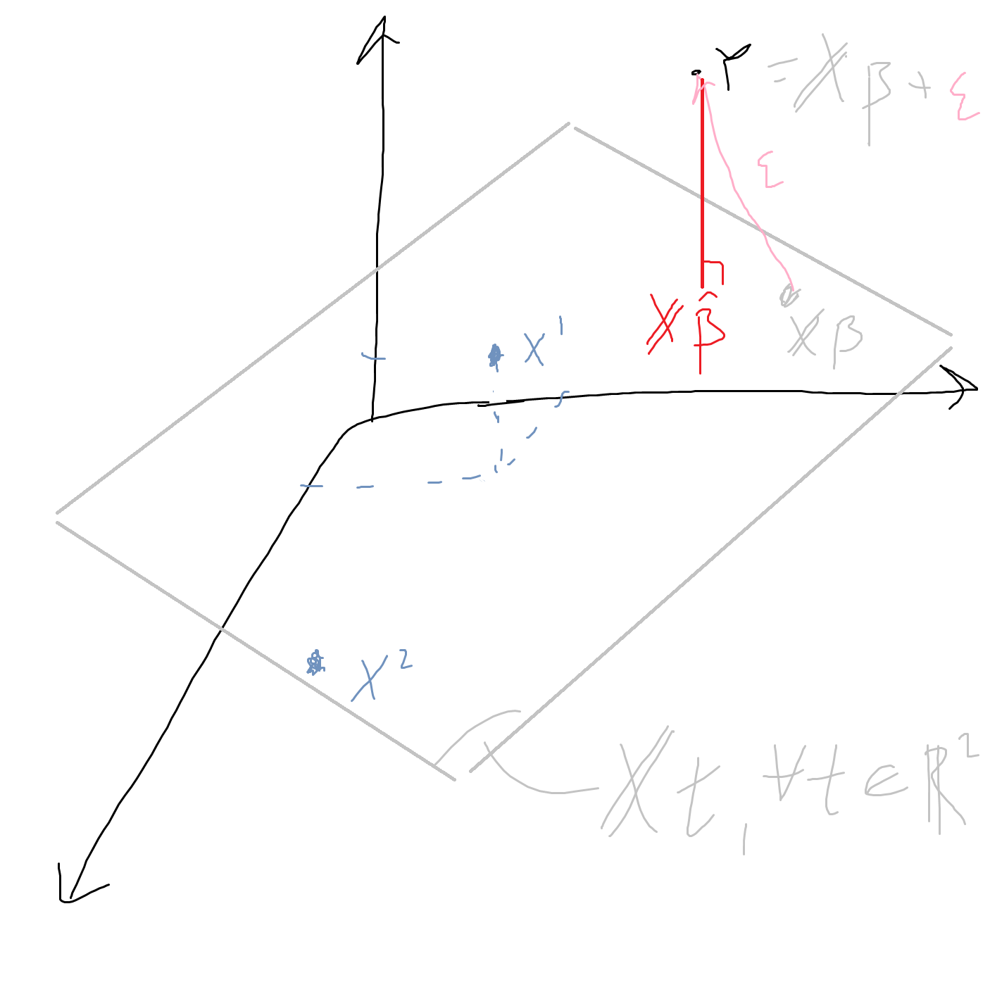
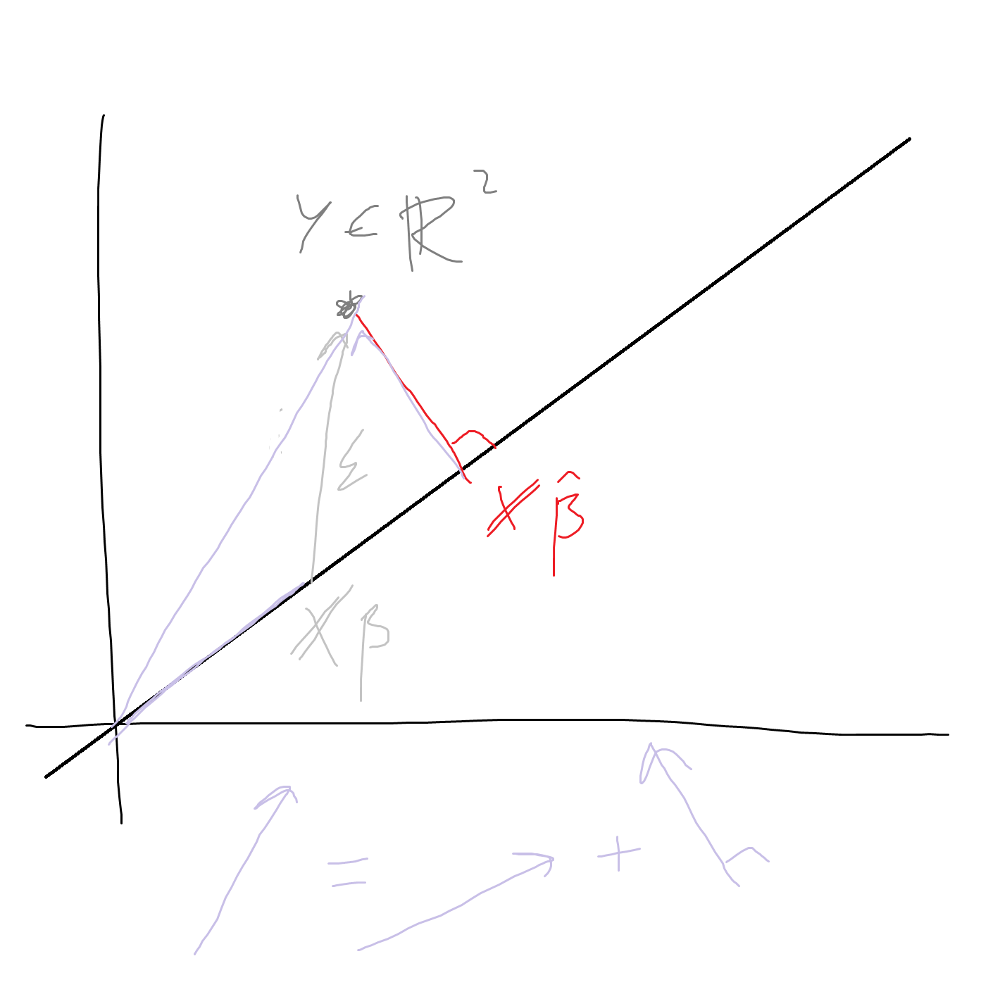
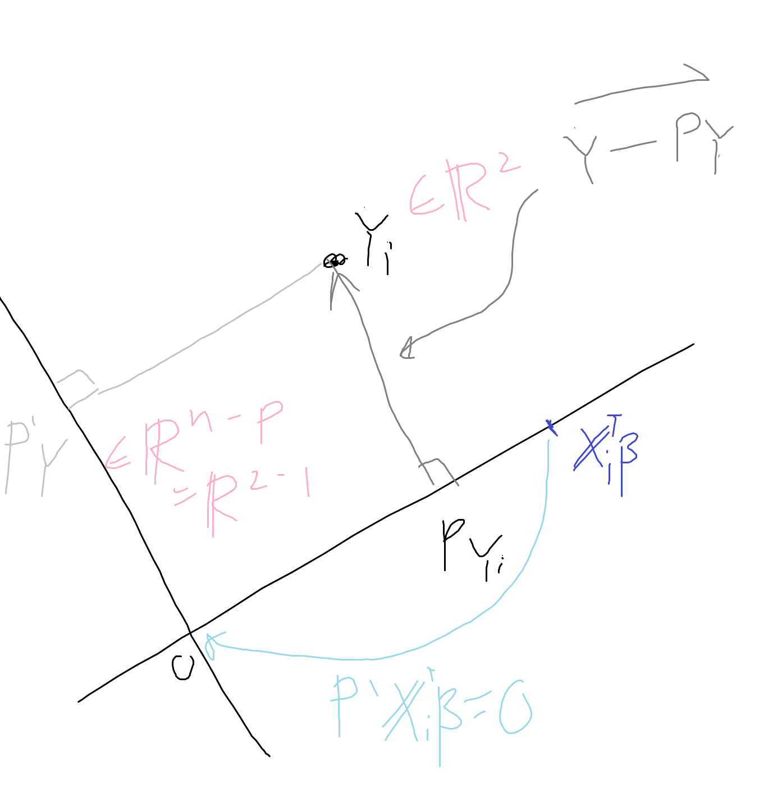

# Lecture 7 - Regression

$\newcommand{\ind}{\perp\!\!\!\!\perp}$
$\newcommand{\indicator}{1\!\!1}$

## Background
Regression is used to predict a response variable (clasically, $Y$) from a set of predictor variables (explanatory variables, independent variables, etc.) $X$. Although prediction of $Y$ is not the only use case for regression, it is the most straightforward.  
Essentially, we want to explain $Y$ as a function of $X$, or $Y = f(X)$, where we need to estimate $f$ using some data which contains examples of inputs and output pairs for $f$.  
Linear regression via least squares arose as a method to solve a system of linear equations $\bold{A}\vec{x} = \vec{b}$ that does not have an exact solution (discovered by Legendre or Gauss). It was then connected to probability (by Gauss). This is a common theme in statistics, as dicussed in *Computer Age Statistical Inference* (Efron and Hastie). We can use an algorithm on data to achieve some mathematical or practical goal. By connecting the algorithm back to statistics - in this case, treating it as a statistical model and adding assumptions to put it into the framework of probability and expectation - allows us to perform inferences, quantifying uncertainty and testing hypotheses. 


## Heuristics of linear regression
Consider a cloud of i.i.d. random points, $(X_i, Y_i), ~ i = 1,...,n$  


**Idea**: Find *best* line fitting the data.  
- Approximation: $Y_i \approx a + b X_i, ~ i = 1,...,n$ for some unkown $a,b \in \R$  
    - We don't really believe that $Y$ is exactly explained by $ax + b$, but we believe it may be true up to some noise ($Y = ax + b + \varepsilon$, where $\varepsilon$ represents all the information we don't have, but we won't go there yet).
- Find $\hat{a}, \hat{b}$ that appraoch $a$ and $b$.  
    - Given data, estimate the paramaters of the line such that the line is the most likely - the best fit
- More generally: $Y_i \in \R, ~ X_i \in \R^p$,  
$~~~~~~~~~~~~~~~~~~~~~~~Y_i \approx a + X_i^\top b, ~~~ a \in \R, b \in \R^p$  
    - if $X \in \R$: univariate regression.  
    if $X \in R^p, ~ p > 1$: multiple regression ($Y = a + b_1X_1 + ... + b_pX_p + \varepsilon$)

**Goal:** write a rigorous model and estimate $a$ and $b$

**Why we use linear regression:**
- Linear regression is a very simple way to statistically model relationships between variables, but often it works well / is hard to beat with other method
- Even if our problem is not linear, we might be able to transform it and express it linearly, so this doesn't limit us as much as we might think
    - Ex: Ideal Gas Law is $PV = nRT$, which, logging both sides:  
    $\log(PV) = \log(nRT) \Rightarrow \log(P) + \log(V) = \log(nR) + \log(T)$  
    $nR$ is fixed so $\log(nRT)$ is a constant, thus:  
    $\log(P) = a - \log(V) + \log(T)$, where $b_1 = -1, b_2 = 1$ ideally, but in an experiment their may be noise due to measurement error, the environment, etc.


## (Theoretical) linear Regression of a r.v. Y on a r.v. X
We can start by looking at the theoretical results for linear regression - ie, what should happen for the "true population" or infinite observations.

Let $X$ and $Y$ be two real r.v. (not necessarily independent) with two moments and such that $Var(X) \ne 0$.  
- No assumptions about the distribution of $Y$ or $X$
- $Var(X) \ne 0$ because otherwise all $X$ are the same, can't fit a line

The *theoretical linear regression* of $Y$ on $X$ is the *best approximation in quadratic means* of $Y$ by a linear function of $X$, ie, the r.v. $a + bX$, where $a$ and $b$ are the two real numbers minimizing: $E[(Y - (a + bX))^2]$
- So given a set of points, we want to find the line of best fit, meaning we need to measure the fit of a line to the data somehow. Naturally we can measure the fit as the aggregate distance of all the points to the curve. We can measure distance between a point and curve in several ways, but we do so by measuring the vertical distance from a given point to the curve - thus $Y - a - bX$, and we square it to get the sum of squares (not quite euclidean distance, but euclidean-esque).  

- Now we have a random variable $(Y - a - bX)^2$  and we take the expectation to convert this to a fixed number (consider that when we use data this will become an average, so we can thin: we want our $Y$'s to be close to $a + bX$ on average) 
- Thus we have a function ($(a,b) \mapsto E[(Y - a - bX)^2]$) that maps our parameters to this expectation, and measures the **fit** of the parameters $a$ and $b$ (how closely the line fits the data) in Expectation. Since it represent an aggregate distance of the points to the line, we want it to be small - we want to minimize it.
- Goal: $\min_{a, b} E[(Y - (a = bX))^2]$

By the steps shown below - minimizing the above - we fill find:
- $b = \frac{cov(X, Y)}{Var(X)}$
- $a = E[Y] - bE[X] = E[Y] - \frac{cov(X, Y)}{Var(X)}E[X]$

<details>  

To find $\min_{a, b} E[(Y - (a + b X))^2]$ we take partial derivatives and set equal to 0 to find critical points:  
$\frac{\partial}{\partial a} = 0$:  
- $E[2 (Y - (a + bX))] = 0$ (can drop the 2 since it won't matter, it will cancel)  
$\Rightarrow E[ (Y - (a + bX))] = 0$  
$\Rightarrow a + b E[X] = E[Y]$


$\frac{\partial}{\partial b} = 0$:  
- $E[2X (Y - (a + bX))] = 0$ (again, can drop the 2)   
$\Rightarrow E[XY] = a E[X] + b E[X^2]$

Now we have 2 equations, 2 unkowns:  
(1) $a + b E[X] = E[Y]$  
(2) $E[XY] = a E[X] + b E[X^2]$.  
To solve we can multiply the first equation by $E[X]$ and take the difference:  
- $~~~~~a E[X] + b(E[X])^2 = E[X]E[Y]$   
$- ~(a E[X] + b E[X^2] = E[XY])$  
$\Rightarrow b(E[X])^2 - bE[X^2] = E[X]E[Y] - E[XY]$  
$\Rightarrow b(E[X])^2 + E[XY] = E[X]E[Y] + bE[X^2]$
    - Recall $Var(X) = E[X^2] - E[X]^2$  
- $\Rightarrow E[XY] = E[X]E[Y] + b ~ Var(X)$
    - Recall $Cov(XY) = E[XY] - E[X]E[Y]$
- $\Rightarrow Cov(XY) = b ~ Var(X)$
- **Thus, first coefficient**, $b = \frac{Cov(X,Y)}{Var(X)}$
    - Also, we see why $Var(X) \ne 0$ was a necessary assumption - as $Var(X)$ goes t 0, $b$ goes to $\infty$ (vertical line!!)
- To solve for $a$, we can plug $b$ into equation (1):  
$a = E[Y] - b E[X] = E[Y] - \frac{Cov(XY)}{Var(X)} E[X]$
    - Thus we see that $a$ is just a function of our distribution. Distributions have many characteristics - moments, tails, etc. - but in least squares, the only things that matter are the expectations of the individual variables, the $Var(X)$, and the $Cov(X,Y)$ (which really captures how $Y$ changes when $X$ changes).
    - But the key is $\frac{Cov(X,Y)}{Var(X)}$ - the rest is really just normalization: we want to cross the x- and y-axes at the right places, but the **slope is really captured by how much more covariance we have relative to the variance of X**. $E[X]$ sets the scale of the x axis, and thus $\frac{Cov(X,Y)}{Var(X)}$ tells us that for a *unit* change in $X$, this is the change in $Y$.

</details>

Naturally, we might want to do this in practice by estimating the covariance and variance with data, replacing expectations with averages. This is essentially what we will do, but first we want to rephrase the problem.

Let $\varepsilon  = Y - (a + bX)$  
($\varepsilon$ is the noise)

Then, for the *best fit* $a$ and $b$, as computed above, this implies aboute $\varepsilon$:  
- $E[\varepsilon] = E[Y] - (a + b E[X]) = 0$
- $cov(X, \varepsilon) = cov(X, Y - (a + bX))$   
(since the rhs is centered) $= E[X(Y - a + bX)]$  
And when solving $\frac{\partial E[(Y - (a + b X))^2]}{b}$ we saw this exact equation was equal to 0, so:  
$cov(X, \varepsilon) = 0$

Thus we can write:
- $Y = a + bX + \varepsilon$  
- with $E[\varepsilon] = 0$ and $cov(X, \varepsilon) = 0$ 

Conversely, we can start by assuming that we have the model:  
$Y = a + bX + \varepsilon$ for some $a,b \in \R$, and some centered r.v. $\varepsilon$ that satisfies $cov(X, \varepsilon) = 0$.  
- We can start by thinking of $Y$ as being modeled by $a +bX$ plus some noise, which represents all the other information we don't know about $Y$ 

It turns out that even if we start by assuming this form for the model, then as long as we make the necessary assumptions ($E[\varepsilon] = 0, Cov(X, \varepsilon) = 0$):  
$a + bX$ *is* the theoretical linear regression of $Y$ on $X$.  

Note: We often assume much more for the sake of statistical inference, for example: if $X \ind \varepsilon$ (independent) or $E[\varepsilon | X] = 0$, then $cov(X, \varepsilon) = 0$


## Linear regression of a r.v. Y on a r.v. X (data based approach) 
We have seen how linear regression works in theory, but in practice we do not know $E[X], E[Y], Var(X), \text{ or } cov(X,Y)$

Given a sample of $n$ i.i.d. random pairs $(X_1, Y_1), ..., (X_n, Y_n)$ with the same distribution as $(X, Y)$, we want to estimate $a$ and $b$.  
We assume that all the $Y_i$ follow the same model:  
$Y_i = a + b X_i + \varepsilon_i$, $~~~~\varepsilon \sim \text{ iid}, ~ E[\varepsilon]=0, ~ Cov(X_i, \varepsilon_i)=0$
- We use the same model to describe all the data, since we treat each pair as an iid copy.
- There are some true parameters, $a$ and $b$, that generate the data (corresponding to a "true line of best fit"). We then use the data to estimate them (and thus, the line) - **Goal: estimate $\hat{a}$ and $\hat{b}$** 
- Thus, we want some way to measure how close the estimated line is to the true line - which we can do by asking how far $\hat{a}$ is from $a$ and $\hat{b}$ is from $b$  

The **Least Squared Error (LSE)** estimator of $(a,b)$ is the minimizer of the sum of squared errors:  
- $\Sigma_{i=1}^n (Y_i - a - bX_i)^2$  

$(\hat{a}, \hat{b})$ is given by:  

- $\hat{b} = \frac{\bar{XY} - \bar{X}\bar{Y}}{\bar{X^2} - \bar{X}^2}$
    - ie, a sample estimate of the theoretical $\frac{cov(x,y)}{Var(x)} = \frac{E[XY] - E[X]E[Y]}{E[X^2] - E[X]^2}$. changing expectations to averages


- $\hat{a} = \bar{Y} - \hat{b}\bar{X}$
    - again, just replacing expectations with averages

One way to do this would be to take the theoretical results for $\hat{a}$ and $\hat{b}$ and replace expectations with averages in that formula (as demonstrated above).  
But we can actually get the same results by changing the original expectation to an average, and then minimizing.  
- $\min ~ E[(Y - (a + bX))^2] \leadsto \min ~ \frac{1}{n} \Sigma_{i=1}^n (Y_i - (a + b X_i))^2$
- (This is a much more general principle, since some other methods do not have a closed form solution for the minimum. So this is the ideal way to think of the problem)
- (Also note that in practice we minimize the sum instead of the average, but it does not make a difference)


  
  
  
We could be using a different measure of distance - for example, Mean Absolute Deviation ($\Sigma_{i=1}^n |Y - (a+bX_i)|$) - and we would get different solutions, but least squares is often preferred because it has a closed form solution and some other nice properties - for example, it can be interpreted as estimating the conditional mean. But depending on your use case, you may minimize some other objective function.  
-  [Stack overflow discussion of why SSE](https://stats.stackexchange.com/questions/135103/why-do-we-usually-choose-to-minimize-the-sum-of-square-errors-sse-when-fitting)  


## Multiple Explanatory Variables Case
Often we want to model the outcome variable using multiple explanatory variables, to incorporate more information. We can extend simple linear regression to vector form (bold indicates matrix or vector, greek letters are assumed to be vectors unless indexed).  

$Y_i = \bold{X}_i^\top \bold{\beta} + \varepsilon_i, ~~~ i=1,...,n$
- $Y_i$ is the dependent variable

- $\bold{X}_i \in \R^{p}$ is a ($p \times 1$) vector of *covariates*, or explanatory variables, where the first coordinate is 1 (since combined with the intercept).

- $\bold{\beta}$ is the vector of $p$ coefficients (in simple linear regression, $\bold{\beta} = (a, b)$), where the first coefficient $\beta_1$ is the intercept: $(\beta_1, ..., \beta_{p-1})^\top$  

- $\{ \varepsilon_{i} \}_{i = 1,...,n}$ is the noise term satisfying $cov(\bold{X}_i, \varepsilon_i) = 0$  
    - The covariance between the random vector of data and random variable noise term is 0 for each coordinate $i$  


**Definition**  
The **least squared error estimator** of $\bold{\beta}$ is the minimizer of the sum of square errors:   
- $\bold{\hat{\beta}} = \argmin_{t \in \R^p} \Sigma_{i=1}^n (Y_i - \bold{X}_i^\top \bold{t}~)^2$
    - (we use $\bold{t}$ since $\bold{\beta}$ is the truth - unkown)
    - We really want to minimize $E[(Y - \bold{X}^\top \beta)^2]$, so we replace expectations with averages


### Least Squared Error in Matrix Form
Before we found the optimal parameters by taking the partial derivative with respect to each coordinate in $\bold{t}$ (i.e., $a$ and $b$)
Now we have a system of $p$ equations and $p$ unkowns to solve for. This is going to be more tricky to solve by hand.  
Before we found our $b$ coefficient took the form $cov(X,Y)/var(X)$, so to solve the problem we really just needed the covariance between $X$ and $Y$ and variance of $X$.  
Now we have to consider the covariances between $Y$ and each of the covariates $X_i, ..., X_p$ but also the cross-covariances between each $X_j$ and $X_k$.  
We can make this easier to solve by utilizing matrices - $\bold{A}\bold{x} = \bold{b} \Leftrightarrow \bold{x} = \bold{A}^{-1}\bold{b}$.  
We can "stack" all of our models $Y_i = X_i^\top \beta + \varepsilon_i$ into vector/matrix form - just like expressing any system of linear equations in matrix form.

$\bold{Y} = \bold{X}\bold{\beta} + \bold{\varepsilon}$
- Let $Y = (Y_1, ..., Y_n)^\top ~~ \in \R^n$
- Let $X$ (called the design or model matrix) be the $n \times p$ matrix whose rows are the vectors $\bold{X_1^\top, ..., X_n^\top}$ 
    - e.g., $x_1 = (1, x_{(1,1)}, ..., x_{(1,~p-1)})$
- Let $\bold{\varepsilon} = (\varepsilon_i, ..., \varepsilon_n) ~~ \in \R^n$ (the unobserved noise)


The Least Squared Error Estimator $\hat{\beta}$ satisfies:
- $\bold{\hat{\beta}} = \argmin_{\bold{t} \in \R^p} ||\bold{Y} - \bold{X} \bold{t}~||_2^2~~~$ (the squared norm)
    - Recall our LS criterion was $\Sigma_{i=1}^n (Y_i - X_i^\top\beta)^2$, and this is equal to the squared euclidean norm of $\bold{Y} - \bold{X}\bold{\beta}$ since the norm (squared) *is* the sum of the squares of the coordinates of a vector (recall $||x||_2 = \sqrt{x_1^2 + ... + x_n^2}$).

Assume that $rank(\bold{X}) = p$ (i.e., so that $\bold{X}$ is invertible), then the LSE is:  
$\bold{\hat{\beta}} = (\bold{X}^\top\bold{X})^{-1} \bold{X}^\top \bold{Y}$


- $\bold{\hat{\beta}} = \argmin_{\bold{t} \in \R^p} ||\bold{Y} - \bold{X} \bold{t}~||_2^2$  
This is a function from $\R^p \to \R$.  
To find the minimum, we need to calculate the **gradient** and set equal to 0. First expand the square:   
- $||\bold{Y} - \bold{X}\bold{t}||_2^2 = ||\bold{Y}||_2^2 + ||\bold{X}\bold{t}||_2^2 - 2 \bold{Y}^\top \bold{X}\bold{t}~~$  (expanding the square)  

- $= ||\bold{Y}||_2^2 + \bold{t}^\top \bold{X}^\top \bold{t}\bold{X} - 2\bold{Y}^\top \bold{X}\bold{t} ~~~~$ (since $||x||^2 = x^\top x$)
    - (but we need the far right term to be a column vector so rewrite)
- $= ||\bold{Y}||_2^2 + \bold{t}^\top \bold{X}^\top \bold{t}\bold{X} - 2 \bold{X}^\top \bold{Y} \bold{t}$

- Now we need to take the derivative with respect to $\bold{t}$. The far right term is linear in $\bold{t}$ and will differentiate simply ($d/dx ~ ax = a$). The middle term is quadratic in $\bold{t}$ and will also differentiate simply ($d/dx ~ ax^2 = 2ax$). The left term is a constant with respect to $\bold{t}$ and thus differentiates to $0$.  
- **Gradient:**  
$0 + 2 \bold{X}^\top \bold{X} \bold{t} - 2 \bold{X}^\top \bold{Y}  = 0 ~~~~$ (we remove $\bold{t}^\top$ in the middle term because we want the gradient to be a column vector)

- $\Rightarrow \bold{X}^\top \bold{X} \bold{t} = \bold{X}^\top \bold{Y}$
    - this equation is linear in $\bold{t}$, of the familiar form $\bold{A}\bold{x} = \bold{b}$. As long as $\bold{A}$ is invertible, we can solve this like $\bold{x} = \bold{A}^{-1}\bold{b}$
- the optimal $\bold{t} = \bold{\hat{\beta}}$, thus   
If $\bold{X}^\top\bold{X}$ is **invertible**,  the **Least Squares Estimator** is:  
$\bold{\hat{\beta}} = (\bold{X}^\top\bold{X})^{-1} \bold{X}^\top \bold{Y}$
  
- So we have to assume that this matrix is invertible, which is in practice the same as the assumption that $rank(\bold{X}) = p$, where $\bold{X}$ has $p$ columns (for the constant and each covariate).  
$\bold{X}^\top\bold{X}$ is size $p \times p$ so it is also invertible if it's $rank = p$ (recall rank corresponds to the maximal number of linearly independent columns, so we need each column in $X$ to be linearly independent).  
If $\bold{X}$ is not invertible, there are multiple (infinite) solutions rather than a single, well-defined estimator.  
    - Specifically, if $\bold{X}^\top \bold{X}$ is not invertible, $\exists v \ne 0$ s.t. $\bold{X}^\top \bold{X} v= 0$.
    - So even if $\hat{\beta}$ satisfies $\bold{X}^\top \bold{X} \hat{\beta} = \bold{X}^\top \vec{Y}$, so does $\hat{\beta} + \lambda v, ~ \forall \lambda \in \R$, because:
        - $(\bold{X}^\top \bold{X})(\hat{\beta} + \lambda v) = (\bold{X}^\top \bold{X})\hat{\beta} + \lambda (\bold{X}^\top \bold{X})v$
        - but since the right term $ = 0$ by definition, we are left with $(\bold{X}^\top \bold{X})\hat{\beta}$, which we already know $= \bold{X}^\top \bold{Y}$.  
        - Thus we can see that there is another solution (infinite, $\forall v$) other than $\hat{\beta}$ that solves this equation:  
    $(\bold{X}^\top \bold{X})(\hat{\beta} + \lambda v) = \bold{X}^\top \bold{Y}$  

- Note that the rank is, at most, the smallest of the 2 dimensions of the matrix. Thus if $p > n$, $rank \ne p$ (it is at most $n$), and the matrix is not invertible. So we cannot find a unique least squares estimator. (Thus, cannot have more covariates than observations - said differently, you cannot have more unkown than equations).

### Geometric Interpretation of the Least Squares Estimator
$\bold{X} \bold{\hat{\beta}}$ is the *orthogonal projection* of $\bold{Y}$ onto the subspace spanned by the columns of $\bold{X}$:  

$\bold{X}\bold{\hat{\beta}} = \bold{P} \bold{Y}$  
where $\bold{P} = \bold{X}(\bold{X}^\top \bold{X})^{-1} \bold{X}^\top$, the projection matrix

- Recall our model is $\bold{Y} = \bold{X} \bold{\beta} + \bold{\varepsilon}$. Thus if we wanted to remove noise from $\bold{Y}$, a useful way to do that is with $\bold{X} \bold{\hat{\beta}}$, which should be close to $\bold{X} \beta$.  
Since $\bold{Y} = \bold{X} \bold{\beta}$ is the line of best fit, then for each $X_i$ - say $X_1$, for example - $X_{(1,i)} \beta_i$ is a "less-noisy" version of $Y$ - closer to the "true" value that we would see without the extra noise.  
Again, $\bold{X} \bold{\hat{\beta}} = \bold{X}(\bold{X}^\top \bold{X})^{-1}\bold{X} \bold{Y}$, which is something we can actually visualize:  
Let $n = 3$, and $p = 2$.  
Let $X^{(1)} = (1, 1, 1)^\top$ and $X^{(2)} = (a, b, c)^\top$


- When we minimize $||\bold{Y} - \bold{X} \bold{t}||^2$, we are comparing $\bold{Y}$ with some point that can be reached by a linear combination of the columns of $\bold{X}$, and we want to find the $\bold{t}$ such that this point is as close as possible to $\bold{Y}$.  
- Looking at the figure above, imagine we have 3 observations and 2 predictors of $\bold{Y}$. We see the $\bold{Y}$ vector plotted and $\bold{X}$'s components - the constant vector and the covariate vector. The plane $\bold{X}t  ~~\forall t \in \R^2$ represents the column space of $\bold{X}$ - all the vectors that can be reached through a linear combination of $\bold{X}$'s columns.  
- We can say that the "true" $\bold{Y}$ is not where $\bold{Y}$ actually is due to the noise vector $\bold{\varepsilon}$ pushing it away from that plane, and that in truth it should be where $\bold{X} \bold{\beta}$ falls on the plane.  
- We know $\bold{\varepsilon}$ should be fairly small, so Least Squares does the sensible thing and finds the point on the plane that is closest to $\bold{Y}$, which corresponds exactly to orthogonally projecting $\bold{Y}$ onto the plane which is exactly achieved by $\bold{X} \bold{\hat{\beta}}$  
    - because $\bold{X}\bold{\hat{\beta}} = \bold{X}(\bold{X}^\top\bold{X})^{-1} \bold{X}^\top \bold{Y}$, and the matrix to the left of $\bold{Y}$ is exactly the matrix that does the orthogonal projection of $\bold{Y}$ onto ColumnSpace($\bold{X}$) (as long as its cols are linearly independent - result from linear algebra, see LA notes).  

- In conclusion, we simply orthogonally project $\bold{Y}$ onto the columns space of $\bold{X}$.
- Thus $\bold{X}(\bold{X}^\top\bold{X})^{-1} \bold{X}^\top$ is the **projection matrix**, and must satisfy the conditions: squares to itself (if you project twice you're not moving) and is symmetric (to be an orthogonal projection). For example, if we look at its eignvalues they should be either 0 or 1.
- Orthogonal projections are nicely related to the pythagorean theorem. For example, it tells us that $||Y||^2 = ||\bold{X} \hat{\beta}||^2 + ||Y - \bold{X}\hat{\beta}||^2$  


## Linear regression with deterministic design and Gaussian noise
Thus far we have assumed that $\varepsilon$ was small, so that it made sense to orthogonally project $\bold{Y}$ onto the column space of $\bold{X}$.  
**Before we are able to do some statistical inference with this algorithm, we need to make some assumptions** that make $\varepsilon$ well behaved. For example, we want it moving around our $X_i\beta$'s in all directions of the space equally, not preferring some direction (else, systematic error!).  

> Note: presented here is the case of a deterministic design matrix $X$. If the design matrix is not deterministic, all of these results are the same but understood to be **conditional** on $X$. This applies to the Gauss-Markov assumptions as well - the noise is assumed to be Gaussian *conditional on $\bold{X}$*.  
We can roughly think of using a deterministic design matrix when we have control over $X$, which is typically in experimental settings when $X$ might be specified by the experimenter. We can then think of a random design matrix as corresponding to observational studies - we observe $X$ and so it is random.  
See this [stack exchange.](https://stats.stackexchange.com/questions/246047/independent-variable-random-variable) and the Gauss-Markov [wikipedia page](https://en.wikipedia.org/wiki/Gauss%E2%80%93Markov_theorem) for refresher.

**(Gauss-Markov) Assumptions:**  
1. The design matrix $\bold{X}$ is deterministic and $rank(\bold{X}) = p$
    - In other words, we treat our covariates as if they are fixed so that we don't have to think of $\bold{X}(\bold{X}^\top \bold{X})^{-1}\bold{X}$ as being composed of random variables (don't want to worry about inverting a random matrix). 
2. The model is *homoskedastic*: $\varepsilon_1, ..., \varepsilon_n$ are i.i.d.
    - homskedastic == "same scaling" - and since they are Gaussian, this corresponds to having the same $\sigma^2$.
3. The noise vector $\varepsilon$ is Gaussian:  
$\varepsilon \sim N_n(0, \sigma^2 I_n)~~~$  for some unkown $\sigma^2 > 0$
    - The errors are independent (so we have the identity times a constant for the covariance matrix) and we want them to be centered (mean 0) so that there is no "preferred" direction in which they move $Y$ away from the $\bold{X}\bold{\beta}$ plane.
    - Remember, if we assume $\bold{X}$ is random and not deterministic, we say that $\varepsilon | X$ is distributed this way.

- These assumptions allow us to write the distribution of $\hat{\beta}$. If we know the distribution and thus the fluctuations of our estimator around the true parameter, we can build confidence intervals, tests, etc. 

Given these assumptions, **the Least Squared Estimator = The Maximum Likelihood Estimator**  
LSE = MSE = $\hat{\beta} \sim N_p(\beta,~~\sigma^2 (\bold{X}^\top \bold{X})^{-1})$

Also $Y \sim N(\bold{X}\beta, \sigma^2 I)$,  
For some vector $\beta$ and unkown $\sigma^2$.
- Again, if we say $\bold{X}$ is random then we say $Y|X$ (Y conditional on X) is distributed this way.

- Recall $\hat{\beta} = (\bold{X}^\top \bold{X})^{-1}\bold{X}^\top Y$  
plugging in $Y = \bold{X}\beta + \varepsilon$:  
- $= (\bold{X}^\top \bold{X})^{-1}\bold{X}^\top \bold{X} \beta + (\bold{X}^\top \bold{X})^{-1}\bold{X}^\top \varepsilon$  
    - No we use that for Gaussian random vectors, $\varepsilon \sim N(0, \Sigma) \longrightarrow B \varepsilon \sim N(0, B \Sigma B^\top)$,  
    where here $\Sigma = I \sigma^2$, and $B = (X^\top X)^{-1}X^\top$
- $= I \beta + N_p(0, ~\sigma^2~((\bold{X}^\top \bold{X})^{-1} \bold{X}^\top \bold{X} (\bold{X}^\top\bold{X})^{-1}) )$  
    - Also we  rewrote the transpose on the far RHS of the covariance matrix because the matrix is symmetric - $[(X^\top X)^{-1} X^\top]^\top = X (X^\top X)^{-1}$ 
    - On the left side of the covariance matrix things cancel out to identity leavinig us with:
- $= \beta + N_p(0, ~\sigma^2~(\bold{X}^\top \bold{X})^{-1})$
- Thus, $\hat{\beta}$ is of the form $\beta$ + centered Gaussian, thus its own distribution is Guassian with mean = $\beta$ and covariance = $\sigma^2(X^\top X)^{-1}$.
    - as long as $(X^\top X)^{-1}$ is not huge, we will have something close to what we want.

- We have just shown that, given our assumptions, $\hat{\beta} \sim N_p(\beta, \sigma^2 (\bold{X}^\top\bold{X})^{-1})$.  

There is a "hidden" claim here, that LSE = MLE. If we want to talk about a MLE, we need a likelihood, which means we need a density. We didn't have a density until we made the assumption that the $\varepsilon$'s have a Gaussian distribution.  
- This allows us to define a distribution for $Y$.  
- $Y = \bold{X} \beta + \varepsilon$, and we have some data so we treat $\bold{X}$ as "deterministic" 

Thus, our statistical model of the form $(P_\theta)_{\theta \in \Theta} = (N_n(\bold{X} \beta, \sigma^2 I))_{\beta \in \R^p}$
- This is our family of distributions - the possible distributions for $Y$. 
- notice that we don't include $\sigma^2$ since, although unkown, it comes from $\varepsilon$:
    - specifically, $Var(\bold{Y}) = Var(\bold{X} \beta + \varepsilon)$  
    $\Rightarrow Var(\bold{Y}) = Var(\bold{X}\beta) + Var(\varepsilon)$  
    But we have assumed $\bold{X}$ is determined, so its variance is 0, and we assumed $\varepsilon$ has variance $\sigma^2 I_n$, so:  
    $\Rightarrow Var(\bold{Y}) = \sigma^2 I_n$

Thus, we can write the probability density of $Y$:
- $P(Y) = \frac{1}{(\sigma^2 2\pi)^{n/2}} \exp(- \frac{||Y - \bold{X}\beta||_2^2}{2 \sigma^2} )$ (the density of multivariate Gaussian with mean $\bold{X}\beta$ and covariance matrix $\sigma^2 I$)

Which allows us to write the (log) likelihood. This is just the log of this probability density where the vector $\bold{Y}$ is the observation, or $\log P(\bold{Y})$
- (i.e., instead of acting as though we have $n$ i.i.d. copies of $Y_1$ and taking the log of the joint pdf, we can act as having 1 observation of the *vector* $\bold{Y}$.)
- $\log P(\bold{Y}) = -\frac{n}{2} \log(\sigma^2 2 \pi) - \frac{1}{2\sigma^2}||\bold{Y} - \bold{X}\beta||$ (where $\bold{Y}$ and $\beta$ are vectors)
    - now to find the MLE we would maximize with respect to $\beta$ and set equal to 0. But this function is negative so we will minimize. Further, the left term does not depend on $\beta$ and on the right $\frac{1}{2\sigma^2}$ is a constant w.r.t. $\beta$, so this simplifies ("sufficient statistic"):  
- $\text{MLE} = \argmin_{\beta \in \R^p} || \bold{Y} - \bold{X}\beta ||_2^2$
    - **Which is exactly what our *Least Squares Estimator* is too**

- Note: This piece depends on the ability to actually write the exact probability density of $\bold{Y}$ as a Gaussian, such that the the squared norm of the difference betwen $\bold{Y}$ and $\bold{X}\beta$ shows up.  
    - If we had a different density, for example if we assumed $\varepsilon$'s coordinates were "double exponential" random variables instead of Gaussian, we would have some different norm or some other form altogether measuring the distance between $Y$ and $\bold{X}\beta$ (this is how other MLE's that are not the LSE are created, like Least Absolute Deviation for example).

### Given the result that LSE = MLE, we can define:  

**Quadratic Risk** of $\hat{\beta} = E[~||\hat{\beta} - \beta||_2^2~] = \sigma^2 ~  \text{tr}((\bold{X}^\top \bold{X})^{-1})~~$ (where tr is the trace, or the sum of the elements on the diagonal)
- Recall $\hat{\beta} - \beta \sim N_n(0, \sigma^2(\bold{X}^\top \bold{X})^{-1})$
- So lets write the expectation $E[||N_p(0,~~\sigma^2 (\bold{X}^\top \bold{X})^{-1})||^2]$
- Consider that if $\epsilon \sim N(0, \Sigma)$, then $E[||\epsilon||^2] = \text{tr}(\Sigma)$
- If we write, $E[||\hat{\beta} - \beta||^2] = \Sigma_{j=1}^p E[\hat{\beta_j} - \beta_j]^2$
- Then since $\beta_j$ is the expectation of $\hat{\beta}_j$, this is:  
$= \Sigma_{j=1}^p Var(\hat{\beta_j})$  
- In a covariance matrix, the diagonal elements are the variances, so the sum of the variances of $\hat{\beta}$  
 $= \sigma^2 \Sigma_{j=1}^p  ((\bold{X}^\top \bold{X})^{-1})_{j,j}$

- Which *is* the trace of the covariance matrix:   
$= \sigma^2 ~ \text{tr}((\bold{X}^\top \bold{X})^{-1})$

**Prediction Error**:  
$E[||Y - \bold{X}\hat{\beta}||^2_2] = \sigma^2(n-p)$
- We measure the distance between $Y$ and our projection of it onto $Col(\bold{X})$.
- $Y - \bold{X}\hat{\beta} = I_nY - \bold{X}(\bold{X}^\top \bold{X})^{-1} \bold{X}^\top Y$  
$= [I_n - \bold{X}(\bold{X}^\top \bold{X})^{-1}\bold{X}^\top] Y$,  
$~~~~$ where $\bold{X}(\bold{X}^\top \bold{X})^{-1}\bold{X} = P$ is the projection matrix of $Y$ onto the linear span of the columns of $\bold{X}$    
$= [I - P]Y$
- $[I - P]$ is also a projection matrix, call it $P'$, which is just the projection onto the *orthogonal* column span of $\bold{X}$ - in the plot below, it projects all points back onto the vertical axis
    - So what we are really in control of when trying to minimize prediction error is the norm squared of $P' Y$:  
- So $||Y - \bold{X}\hat{\beta}||^2 = ||[I - \bold{X}(\bold{X}^\top \bold{X})^{-1} \bold{X}] Y||^2 = ||[I - P]Y||^2 = ||P'Y||^2$  
- Since $Y = \bold{X}\beta + \varepsilon$,  
$P' Y = P' \bold{X}\beta + P' \varepsilon$
    - Now $\bold{X}\beta$ is a point that is on the linear span of $\bold{X}$, i.e., on the horizontal axis in the figure below. Thus, $P'$ maps it to the *origin*, or 0.  
- So $||P'Y||^2 = ||0 + P' \varepsilon||^2 = || N_n(0, \sigma^2 ~P' (P')^\top) ||^2$,  
and $P'(P')^\top = P'P' = P'$, because $P'^\top = P'$, and projecting twice is equivalent to projecting once (assumptions of orthogonal projection matrix), so  
$E[N(0, \sigma^2 P')] = \sigma^2 \text{tr}(P')$  
(recall from quad. risk)
    - the trace is also the sum of the eigenvalues, i.e., the number of non-zero eigenvalues, i.e., the dimension of the space onto which $P'$ is projecting.
    - We are projecting from some thing ($Y$) of dimension $n$ onto the *orthogonal* of something of dimension $p$, and so the rank theorem tells us $P'$ is projecting to the space with dimension $n-p$.
    

**Unbiased estimator of $\sigma^2$**:  
$\hat{\sigma}^2 = \frac{1}{n-p} ||Y - \bold{X}\hat{\beta}||^2_2$
- As shown by the prediction error, the expectation of the squared norm of the residuals $= \sigma^2 (n-p)$, so if we divide both sides by $(n-p)$ we will have that the norm of the residuals, divided by $(n-p)$, has expectation $\sigma^2$  
- this is called the **normalized sum of squared residuals**
- If $\hat{\beta}$ is close to $\beta$, the difference between $Y_i$ and $\bold{X}_i^\top \beta$ should be close to $\varepsilon_i$ (the difference is like a $\hat{\varepsilon}_i$). Thus this distance should be giving us something close to $\sigma^2$  


**Theorem**  
- $(n - p)\frac{\hat{\sigma}^2}{\sigma^2} \sim \chi^2_{n-p}$
    - Since $\hat{\sigma}^2$ is the squared norm - so sum of squares - of Gaussians, it is a natural conclusion.
    - To prove, decompose $P' = U D U^\top$, where $U$ is an orthogonal matrix and $D$ is a diagonal matrix of eigenvalues,then look at the norm squared $||U D U^\top \varepsilon||^2$. Since the norm of the rotation of a vector is the same as the norm of the vector, drop the first $U$. The distribution of $U^\top \varepsilon$ is the same as that of $\varepsilon$, since it is a Gaussian vector with covariance matrix $I \sigma^2$ and $U^\top$ basically rotates it, but its distribution doesn't change since it is rotation invariant.
    Thus, we have $\Sigma_{j=1}^n d_j^2 \varepsilon_j^2$. The eigenvalues of $P'$ are either 0 or 1, since it's a projector, so we are really just summing the squares of a certain number of independent Gaussians - hence $\chi^2$ - and the number we are summing is the number of eigenvalues equal to 1 (not 0) which, again, is equal to the dimension that $P'$ is projecting into, $n - p$
- $\hat{\beta} \ind \sigma^2$ (independent)
    - (By Cochran's theorem - essentially, $\hat{\beta}$ is involved in a projection onto the linear span of the columns of $\bold{X}$, and $\sigma^2$ is involved in the projection onto the orthogonal of the linear span of the columns of $\bold{X}$, and we are in a Gaussian case, which means that things that are orthogonal are independent.)
    - We relied on a similair statement when motivating Student's T test, and now we are going to use it to develop a test of "significance" for the $\beta_j$'s 

## Summary
So we have a model $\bold{Y} = \bold{X}\beta + \varepsilon ~~ \in R^n$, we obtain the LSE $\hat{\beta}$, and by assuming $\varepsilon \sim N_n(0, \sigma^2 I_n)$ (among other assumptions), we were able to say:  
- $\hat{\beta} = \beta + N_p(0, \sigma^2 (\bold{X}^\top \bold{X})^{-1})$

**This is the basis for inference in linear regression.**  
Recall that once we have $\hat{\beta}$, $\bold{X}\hat{\beta}$ is just a projection of $\bold{Y}$ onto the column span of $\bold{X}$.  
We call $\bold{Y} - \bold{X}\hat{\beta}$ the **residuals**. We can sort of consider these to be "$\hat{\varepsilon}$", since $\varepsilon = \bold{Y} - \bold{X}\beta$.  
From the residuals, we were able to build an unbiased estimator of $\sigma^2$ (which we are assuming to be unkown).   

$\hat{\sigma}^2 = \frac{1}{n-p} ||Y - \bold{X}\hat{\beta}||^2_2$  
Such that $(n - p)\frac{\hat{\sigma}^2}{\sigma^2} \sim \chi^2_{n-p}$  

And again, we have the theorem that $\hat{\beta} \ind \sigma^2$ (independent)  

These results will be useful for inference. We've already constructed an estimator, and now we want to be able to ask questions about it.

## Significance Tests

### T test (& Z test) for significance of $\beta_j$
Test whether the $j$-th explanatory variable is significant(ly different from zero) in the linear regression (for $1 \le j \le p$)  

Why?
- Consider the expansion of the matix form  
$Y_i^{(1)} = \beta^{(0)} + \beta^{(1)}X_i^{(1)} + ... + \beta^{(p)}X_i^{(p-1)} + \varepsilon_i, ~~~ \forall i$
- if $\beta^{(j)} = 0$, this means we can essentially remove the $j$-th coordinate $X^{(j)}$ from all observations (it doesn't contribute any information to the modeling of $Y$)
- if $\beta^{(j)} \ne 0$, we might say we have some "discovery" - some evidence that explanatory variable $X^{(j)}$ is meaningful in the prediction of $Y$.
- to test this - since we are in a Gaussian setup, we can use a t-test

Hypotheses:  
$H_0: \beta_j = 0$ vs. $H_1: \beta_j \ne 0$


If $\gamma_j > 0$ is the $j$-th diagonal coefficent of $(\bold{X}^\top \bold{X})^{-1}$:  
- $\frac{\hat{\beta}_j - \beta_j}{\sqrt{\hat{\sigma}^2 \gamma_j}} \sim t_{n - p}$

Details:  
- Recall that in our previous dealings with the t-test, we wrote:  
$\hat{\theta} = \theta + N(0, \frac{\sigma^2}{n})$.  
- Now, we have $\hat{\beta} = \beta + N_p(0, \sigma^2(\bold{X}^\top \bold{X})^{-1})$.  
- This implies, that for every $j = 1, ..., p$,  
$\hat{\beta}_j = \beta_j + e_j^\top ~ N_p(0, \sigma^2(\bold{X}^\top \bold{X})^{-1})$  
(Given vector $v$, $v_j = v^\top e_j$, where $e_j$ is the vector of 0s with a 1 in the $j$-th coordinate.)
- The distribution of the inner product of a Gaussian and deterministic vector is just another Gaussian. ($v^\top N(\mu, \Sigma) =^{(d)} N(v^\top \mu, v^\top \Sigma v)$ - property of Gaussian vectors)
- $e_j^\top ~ N_p(0, \sigma^2(\bold{X}^\top \bold{X})^{-1})$ is equal in distribution to:  
$N(0, \sigma^2 ~ e_j^\top (\bold{X}^\top \bold{X})^{-1} e_j) = N(0, \sigma^2 (\bold{X}^\top \bold{X})^{-1}_{~~~~j,j})$  
($e_j$ plucks out the $j$-th diagonal of the X transposed X inverse)  

*Conclusion:* 
$\hat{\beta}_j = \beta_j + N_1(0, \sigma^2 (\bold{X}^\top \bold{X})^{-1}_{j,j})$
- this reflects the $\hat{\theta} = \theta + N(0, \frac{\sigma^2}{n})$ from the original t-test. We can think of $(\bold{X}^\top \bold{X})^{-1} = \gamma_j$ as being sort of like the $1/n$.

Under $H_0$, $\beta_j = 0$, therefore:  

*if $\sigma^2$ is known*  (sometimes called Z test) 
- $\hat{\beta}_j \sim N(0, \sigma^2 \gamma_j)$  
- $\Rightarrow \frac{\hat{\beta_j}}{\sigma \sqrt{\gamma_j}} \sim N(0, 1)$  
- So we can form the test statistic and test to be:  
$\psi = \indicator \set{|\frac{\hat{\beta}_j}{\sigma \sqrt{\gamma_j}}| > q_{\alpha/2}}$, where $q_{\alpha/2}$ is the $(1-\alpha/2)$-quantile of $N(0,1)$
    - (reject if test statistic is greater, as usual).  

*if $\sigma^2$ is unknown*, and we have $\hat{\sigma}^2$ as an estimator, then:  
- We can compute this quantity: $\frac{\hat{\beta}_j}{\hat{\sigma} \sqrt{\gamma_j}}$ (replacing $\sigma$ with its estimate), but we need to find its distribution
    - Since $(n - p) \frac{\hat{\sigma}^2}{\sigma^2} \sim \chi^2_{n-p}$, and since $\hat{\sigma}^2 \ind \hat{\beta}_j$  
    - $\frac{\hat{\beta}_j}{\hat{\sigma} \sqrt{\gamma_j}} = \frac{\hat{\beta}_j}{\sigma\sqrt{\gamma_j}} \times \sqrt{\frac{\sigma^2}{\hat{\sigma^2}}}$ (add in terms)  
    - $\Rightarrow \frac{\hat{\beta}_j / \sigma \sqrt{\gamma_j}}{\sqrt{\frac{\frac{\hat{\sigma}^2}{\sigma^2}(n-p)}{n - p}}}$
    - The numerator has distribution $N(0, 1)$ (same as above), the denominator has distribution $\sqrt{\frac{\chi^2_{n-p}}{n-p}}$.  
    - Recall a $t$ distributed r.v. takes form $N(0,1) / \sqrt{\chi^2_d / d}$
- This implies:  
$\frac{\hat{\beta}_j}{\hat{\sigma}\sqrt{\gamma_j}} \sim t_{n-p}$
- Giving us test statistic and test:  
$\psi =  \indicator \set{|\frac{\hat{\beta}_j}{\hat{\sigma} \sqrt{\gamma_j}}| > q_{\alpha/2}}$, where $q_{\alpha/2}$ is the $(1-\alpha/2)$-quantile of $t_{(n-p)}$
    - note that this is virtually the same as the case when $\sigma^2$ is known, but now using the $t$ distribution instead of standard normal means the pivotal will have heavier tails. Also note that, since we use $n-p$ degrees of freedom, this implies that (for a fixed $n$), increasing $p$ leads to heavier tails, reflecting the fact that it gets harder to estimate the variance when there are a lot of parameters.

Note that $\hat{\sigma} \sqrt{\gamma_j}$ is equivalent to the standard error for the $j$-the coefficient (see below for standard errors).


A problem arises here if we want to test many of our explanatory variables for significance.  
The probability that you make a mistake in your test (a type 1 error, rejecting the null falsely) is set to $\alpha$ - say, 5%.  
But this is the case for each individual tests, so repeatedly performing the test makes it more likely that we will actually encounter an error (this is the miltiple comparisons / multiple testing problem).  
To counteract this, we can use the **Bonferroni correction**.

### Bonferroni Correction
Recall from probability axioms that the probability of the union is less than or equal to the sum of the probabilities - $P(A \cup B) \le P(A) + P(B)$. This is the *union bound*. This informs our goal of testing *simultaneously* if all $\beta_j$'s are 0.  

Test whether a **group** of explanatory variables is significant(ly different from 0) in linear regression.  

For $S \subseteq \set{1, ..., p}$ (all of the coefficients or some subset)   
$H_0: \beta_j = 0, ~~~~\forall j \in S$  
- none of the coefficients are significant  

$H_1: \exists j \in S ~~\text{ s.t. }~~ \beta_j \ne 0  $
- at least 1 of the coefficients is significant

*Bonferroni's test*:  
$\delta_\alpha^B = \max_{j \in S} ~~ \delta_{\alpha/k}^{(j)}$  
where $k = |S|$.  
$\delta_\alpha$ has non-asymptotic level at most $\alpha$.

Details:  

Let $\psi_j =  \indicator \set{|\frac{\hat{\beta}_j}{\hat{\sigma} \sqrt{\gamma_j}}| > q_{\alpha/2}(t_{n-p})}$.  
We want, *under the null*, the probability of (falsely) rejecting at least 1 of the $k$ tests (i.e., type 1 error), to be:    
$P_{H_0}(\set{\psi_1 = 1} \cup \set{\psi_2 = 1} \cup ... \cup  \set{\psi_k = 1}) \le \alpha$
- But what we have done so far is to control each test individually, such that the tests' probabilities of type 1 error are individually $< \alpha$.
- But, from the *union bound*, we know that this above probability could be the sum of all of these probabilities if the tests are 'disjoint'
- Particularly, in the worst case - if $\set{\psi_j = 1} ~ \cap ~ \set{\psi_l = 1} = \empty$ (i.e., disjoint), $\forall j \ne l$, then the above probability is equal to $\alpha * k$ (the probability of type 1 error times the number of tests), not $\alpha$.  
- so the solution is to run this test *not* with level $\alpha$, but with level $\alpha / k$, so that in this worst case scenario, the probability of type 1 error is $k * \alpha / k = \alpha$.
- note that if we are not in the worst case, so not all the probabilities are disjoint, then the probability of type 1 error is not exactly equal to $\alpha$, but it is less than $\alpha$ and bound by $\alpha$ (*union bound*). This does mean that the Bonferroni correction is a conservative test - it tends to *over correct* for the multiple testing problem, since it is unlikely that all of these tests are completely disjoint.

So let $\psi_j =  \indicator \set{|\frac{\hat{\beta}_j}{\hat{\sigma} \sqrt{\gamma_j}}| > q_{\alpha/2k}(t_{n-p})}$, for $k$ = number of coefficients being tested.  


### More General Tests
The previous test can be expressed as a speficic case of a more general testing strategy.

Let $\bold{G}$ be a $k \times p$ matrix with $rank(G) = k$ ($k \le p$) and $\bold{\lambda} \in \R^k$  

Consider the hypotheses:  
$H_0: \bold{G} \beta = \lambda$  
$H_1: \bold{G} \beta \ne \lambda$  
(The previous tests being a particular case testing of $e_j^\top \beta = 0$ vs. $e_j^\top \beta \ne 0$, with $e_j$ being the $j$-th unit vector acting as an index into $\beta$)  

Why?
- Maybe we want to test if $\beta_2 + \beta_3 = 0$, for example (we know gene $X^{(2)}$ affects $Y$, but is the effect cancelled by gene $X^{(3)}$?).
- Another useful example: $\bold{G} = I_p, \lambda = 0$ - is the entire vector $\beta$ equal to 0? (like an F test). 

If $H_0$ is true, then:  
- $\bold{G} \hat{\beta} - \lambda \sim N_k(0, ~~ \sigma^2 \bold{G} (\bold{X}^\top \bold{X})^{-1}\bold{G}^\top)$

and
- $\sigma^{-2}(\bold{G}\hat{\beta} - \lambda)^\top (\bold{G}(\bold{X}^\top \bold{X} \bold{G}^\top)^{-1})^{-1} ~~~ \sim ~~~\chi^2_k$

Let $S_n = \frac{1}{\hat{\sigma}^2} \frac{(\bold{G}\hat{\beta} - \lambda)^\top ~~ (\bold{G}(\bold{X}^\top \bold{X} \bold{G}^\top)^{-1})^{-1} ~~ (\bold{G}\hat{\beta} - \lambda)}{k}$  
If $H_0$ is true, then $S_n \sim F_{k, ~n-p}$  
Test with non-asymptotic level $\alpha \in (0,1)$:  
- $\psi_\alpha = \indicator \set{S_n > q_\alpha(F_{k, n-p})}$
- where $q_\alpha$ is the $(1-\alpha)$-quantile of $F_{k,n-p}$  
    - Not $q_{\alpha/2}$ since the $F$ test is already positive, so we just check if it's too large.


Details:
- Recall, $\hat{\beta} = \beta + N_p(0, \sigma^2 (\bold{X}^\top \bold{X})^{-1})$, and we deduced:  
- Write:  
$\bold{G} \hat{\beta} = \bold{G} \beta + N_p(0,\sigma^2 ~ \bold{G} (\bold{X}^\top \bold{X})^{-1} \bold{G}^\top)$
    - again, the covariance matrix term follows from gaussian vector rules 

- But *under the null*, $\bold{G}\beta = \lambda$  
So, $\bold{G}\hat{\beta} - \lambda \sim N_p(0, \sigma^2 ~ \bold{G} (\bold{X}^\top \bold{X})^{-1} \bold{G}^\top)$


*if $\sigma^2$ is unkown*:  
$\frac{\bold{G}\hat{\beta} - \lambda}{\hat{\sigma}} \sim \frac{N(0, \bold{G} (\bold{X}^\top \bold{X})^{-1} \bold{G}^\top)}{\sqrt{\hat{\sigma} / \sigma}}$
- Claim: if $X \sim N_k(0, \Sigma)$ then $X^\top \Sigma^{-1}X \sim \chi^2_{k}$
- Thus, $\frac{(\bold{G}\hat{\beta} - \lambda)^\top ~~ (\bold{G}(\bold{X}^\top \bold{X} \bold{G}^\top)^{-1})^{-1} ~~ (\bold{G}\hat{\beta} - \lambda)}{\sigma^2} \sim \chi^2_k$  
(where $k$ comes from $\bold{G}$'s dimensions, $k \times p$ (so number of constraints in the test)).
- $\Rightarrow \frac{(\bold{G}\hat{\beta} - \lambda)^\top ~~ (\bold{G}(\bold{X}^\top \bold{X} \bold{G}^\top)^{-1})^{-1} ~~ (\bold{G}\hat{\beta} - \lambda)}{\hat{\sigma}^2 k}$ is of the form $\frac{\chi^2_k / k}{\chi^2_{n-p} / (n - p)}$  
    - Same denominator we see in in the t test, but now the numerator is a chi squared instead of Gaussian
- This distribution *is pivotal*, as long as we can confirm that there is no hidden parameter in the correlation between the two chi-squared variables.  
- Claim: they *are* independent.

This ratio $\frac{\chi^2_k / k}{\chi^2_{n-p} / (n - p)}$ of two independent chi-squared r.v. each divided by their d.o.f. is called the **Fisher** or **F-distribution**, with 2 paramaters: the d.o.f. of the numerator and denominator.  
- The Fisher distribution with $p$ and $q$ degrees of freedom, denoted $F_{p,q}$, is the distribution of $\frac{U/p}{V/q}$ where $U \sim \chi^2_p$, $V \sim \chi^2_q$, $U \ind V$.
- When we are testing multiple parameters at a time, this takes the role of the $t$ distribution. The normal in the numerator gets replaced with a $\chi^2$ since we are testing if two vectors are simulatenously close by looking at their squared norm - hence, sums of squared gaussians.
- Remark: How related are the $\chi^2$ and $t$ distributions?  
If $T \sim t_q$, then $T = \frac{N(0,1)}{\sqrt{\chi^2_q/q}}$.  
Then $T^2 \sim \frac{N(0,1)^2}{\chi^2_q/q}$.  
But the distribution of $N(0,1)^2 \sim \chi^2_1 / 1$, so $T^2 \sim F_{1, q}$  
So if we have test $\psi = \indicator \set{|T| > q_{\alpha/2}(t_q)}$  
$= \indicator \set{|T|^2 > q_{\alpha/2}^2(t_q)}$  
$= \indicator \set{T^2 > q_{\alpha}(F_{1,q})}$ (so it is the square root of the corresponding quantile in the $t$ dist.)  
So the $F$ test is really a generalization of the $t$ test.


## Concluding Remarks

The Deterministic Design Matrix Assumption:
- It makes sense to think of $\bold{X}$ as deterministic - the actual values of $\bold{X}$ determine the geometry of the problem, and we can look at it from the perspective of $\bold{X}$.
- Recall, $\gamma_j = \sigma^2 (\bold{X}^\top \bold{X})^{-1}_{j,j}$ was the variance parameter.  
We should be able to understand which $X$ values lead to big variance and which lead to small variance.
- If $\bold{X}^\top \bold{X} = n I_p$, then $(\bold{X}^\top \bold{X})^{-1}_(j,j) = 1/n$ and we are back to our basic one dimensional case.
- But if a matrix times its transpose produces the identity, the matrix is orthogonal/orthonormal, which implies that the columns of the matrix form an orthonormal basis for the space - so the columns are basically as far from each other as they can be.  
If we start making these columns closer together, the off-diagonal elements are not going to be all 0s, and when we take the inverse, the diagonal elements will blow up, and this means the variance will as well.  
So if we got to choose our $\bold{X}$'s, we would want to make them as orthogonal as possible, but in reality we have to work with what we have, accept that it will impact our estimation performance, and use $\gamma_j$ to get a sense of how much variation there might be in our estimates.  
And all of this is primarily determined by $\bold{X}$.
- **But if $\bold{X}$ is not deterministic, all the above can be understood conditionally on $\bold{X}$, if the noise is assumed to be Gaussian conditionally on $\bold{X}$.**

Normality of the noise:
- Beyond the pure calculation of $\hat{\beta}$ using least squares, all of our inference required this assumption.
- We can test whether the residuals $\hat{\varepsilon} = Y_i - \bold{X}_i^\top \hat{\beta}$ are Gaussian, visually (qqplot) or via an actual goodness of fit test (kolomogorv-lilliefors test is ideal since we just need to know if it belongs to the Gaussian family)

Regression exhibits correlation not causation!
- causation is not a statistical thing, it's a logical argument added as another layer on top of statistics 


## Standard Errors
Standard Errors are commonly reported in regression results.  
The standard error for $\hat{\beta}_j$ is the square root of the $j$-th diagonal of the (empirical) covariance matrix for $\hat{\beta}$. Recall the covariance matrix for $\hat{\beta}$ is $\sigma^2 (\bold{X}^\top \bold{X})^{-1}$.  
Of course, we use the estimated $\hat{\sigma}^2$.  
It is, thus, interpreted as an estimate of the variation in the estimate $\hat{\beta}_j$ (i.e., the standard deviation of $\hat{\beta}_j$ since square root), which is useful since we are able to achieve this result while only having a single $\beta_j$.
- $SE(\hat{\beta}_j) = \sqrt{\sigma^2 (\bold{X}^\top \bold{X})^{-1}_{j,j}}$
- [On the interpretation](https://stats.stackexchange.com/questions/391254/standard-error-of-simple-linear-regression-coefficients)  
- [On the calculation](https://stats.stackexchange.com/questions/44838/how-are-the-standard-errors-of-coefficients-calculated-in-a-regression/44841#44841)
    - We model $Y|X \sim N(X \beta, \sigma^2 \bold{I})$
    - We know that $\hat{\beta} = (\bold{X}^\top \bold{X})^{-1} \bold{X}^\top \bold{Y}$  
    and $Var(Y) = \sigma^2 \bold{I}$
    - Consider that for a non-random matrix $A$ and random matrix $X$, $Var(AX) = A Var(X) A^\top$. Considering that we treat $\bold{X}$ as deterministic when conditioned upon, we can write the variance-covariance matrix of $\beta$ as:
        - $Var(\beta) = (\bold{X}^\top \bold{X})^{-1} \bold{X}^\top ~~ \sigma^2 \bold{I} ~~ \bold{X}(\bold{X}^\top \bold{X})^{-1}$  
    $= \sigma^2 (\bold{X}^\top \bold{X})^{-1}(\bold{X}^\top \bold{X})(\bold{X}^\top \bold{X})^{-1}$  
    $= \sigma^2 (\bold{X}^\top \bold{X})^{-1}$
    - This lines up with what we've seen earlier: the "sampling distribution" of the $\hat{\beta}$ is $\hat{\beta} \sim N_n(\beta, \sigma^2(\bold{X}^\top \bold{X})^{-1})$
    - And in empirical settings we can use $\hat{\sigma}^2$ instead (see above for derivation) 
        - Recall $\hat{\sigma}^2 = \frac{1}{n-p} ||Y - \bold{X}\hat{\beta}||^2_2$, i.e., SSR/(n - p)  
    - The "standard error" is parallel to the standard deviation of a $\hat{\beta}_j$, so to get them we just take the square root of the diagonal elements of the variance-covariance matrix.


## Extras:

Regression's popularity has led to a whole host of diagnostic procedures which attempt to reveal insights about the model.  
For example, residual analysis examines where the model does and doesn't fit well the data, and influence measures examine how the sample of data affects the fit of the model.  

One popular influence measure is Cook's distance which builds on the idea of "leverage".  
The leverage of the $i$-th observation is actually just the $i$-th diagonal of the Hat (projection) matrix.  
Recall, $Y = \bold{X} \beta = \bold{X} (\bold{X}^\top \bold{X})^{-1} \bold{X}^\top Y$, and thus  
the projection matrix that maps $Y$ to $\hat{Y}$, often called the hat matrix, is $\bold{P} = \bold{X}(\bold{X}^\top \bold{X})^{-1} \bold{X}^\top$  
If we dig into the matrix multiplication of $\bold{P} \bold{X} = \hat{Y}$, it becomes apparent why leverage is defined this way.
The $i$-th observation (i.e., $i$-th row of the data and $i$-th row of $\bold{P}$) combines via the inner product with the $Y$ vector to produce one element in the output, $\hat{Y}_i$.  

```
    P      y   = y_hat
| a b c | |y1|   |.|
| d e f | |y2| = |.| <- d*y1 + [e*y2] + f*y3
| g h i | |y3|   |.|

```

Notice that for the second observation, it is the second diagonal of the hat matrix (e) which multiplies with the second observation of y (y2). It is natural to think of "e" as being directly related to the second observation's influence on the fitted values.

Here is a good related stack exchange: [Hat matrix and leverages in classical multiple regression](https://stats.stackexchange.com/questions/208242hat-matrix-and-leverages-in-classical-multiple-regression).

Cook's distance aims to estimate the influence of an observation on a least-squares regression fit and can be calculated using the leverage.