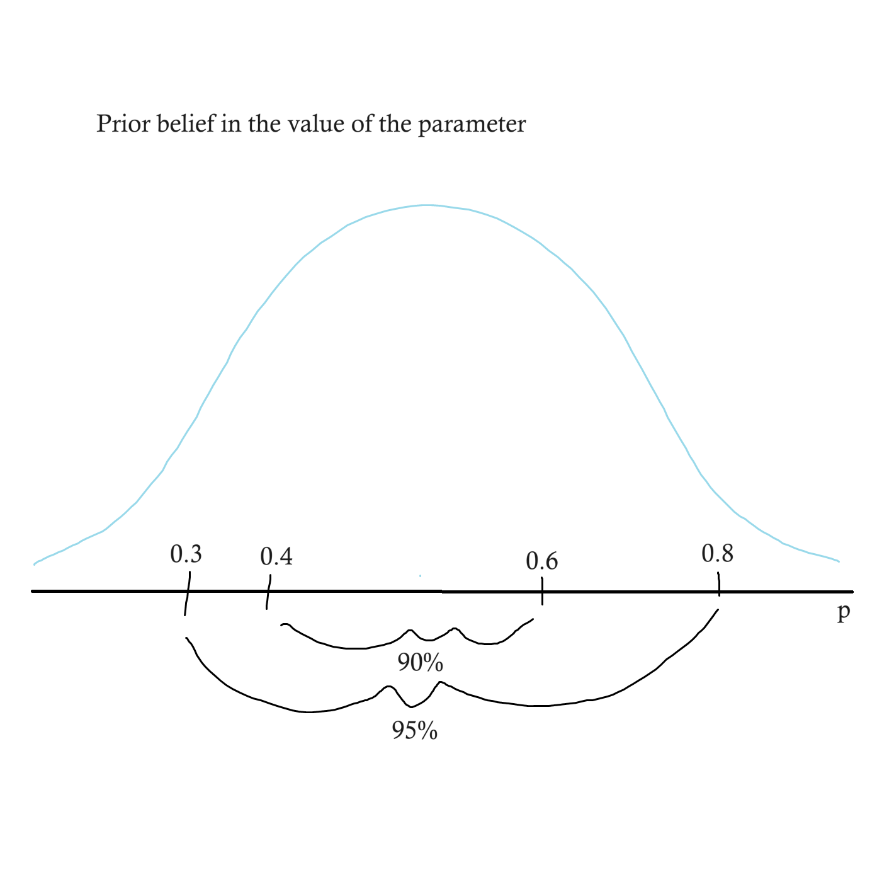
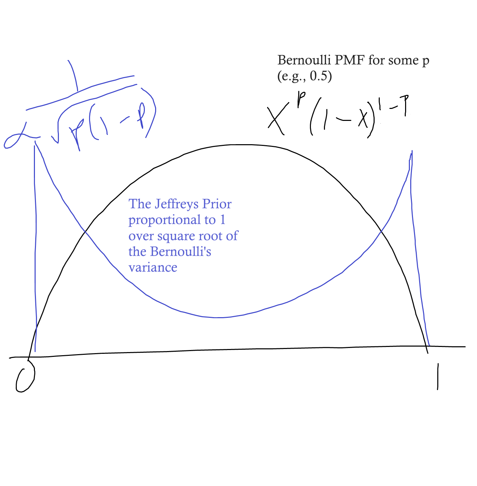
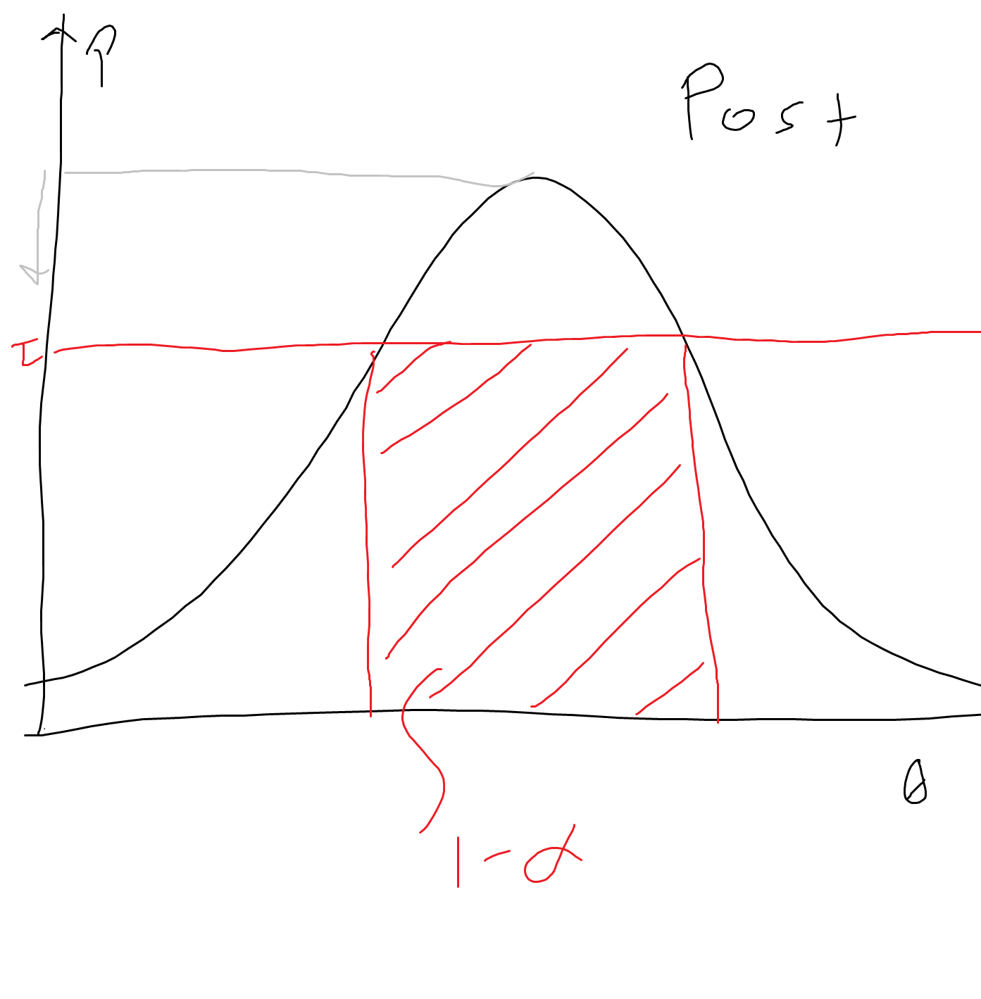
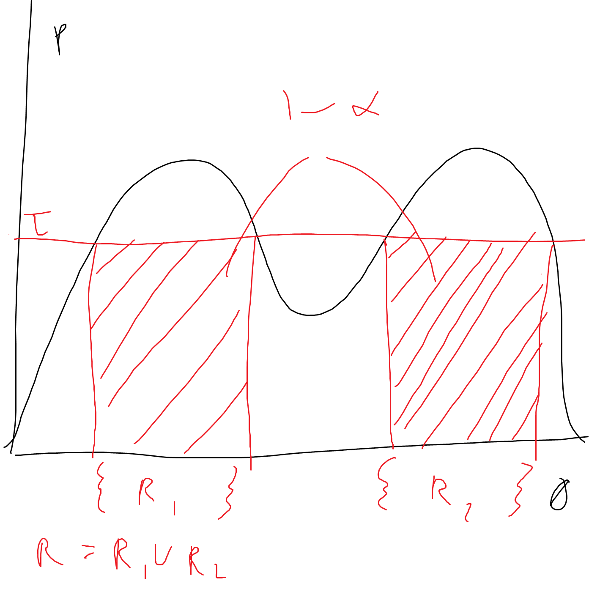
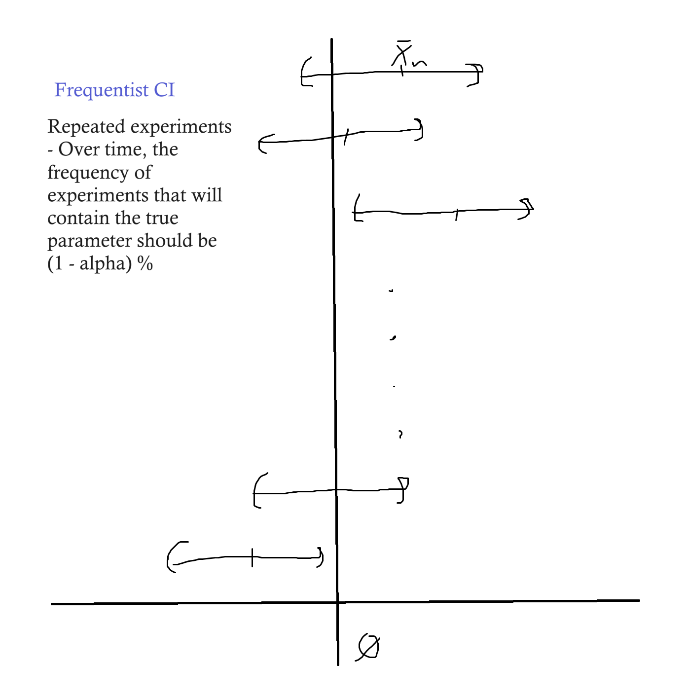

# Lecture 8: Bayesian Statistics

$\newcommand{\ind}{\perp\!\!\!\!\perp}$
$\newcommand{\indicator}{1\!\!1}$

## Introduction
So far we have studied the *frequentist* approach to statistics.  
- Observe data
- Assume data is randomly generated (by Nature, by measurements, by designing a survey, etc.)
    - so we can use tools from probability
- Make assumptions about the data generating process (e.g., i.i.d., Gaussian data, smooth density function, linear regression function, etc.)
    - consider a subset of possible distributions, rather than all possibilities
- The generating process was associated with some object of interest (e.g., a parameter, a density, etc.)
- The object was unkown but fixed and we wanted to find it: we either estimated it directly, or tested a hypothesis about it, or found a confidence interval for it  

The Bayesian approach:  
- We still observe data, which is assumed to be randomly generated by some process.
    - A "multi-layer" process - one process that generates the parameter, and another process that generates the data
    - We do not really believe the population parameter is generated by a random process, but adding this layer allows us to use a prior belief about what the parameter should be
- Under some assumptions (e.g., parameteric distribution), the process is associated with some fixed object.
- We have a **prior belief** about the object.
    - Some knowledge that informs us about what the true value of the parameter should be
- Using the data, we want to update that belief and transform it into a **posterior belief**

## Example 
### Setup
- Let $w$ be the proportion of woman in the population
- Sample $n$ people randomly with replacement in the population and denout $X_1, ..., X_n$ their gender (1 for woman, 0 otherwise)
    - Thus, say (i.i.d.) $X_1, ..., X_n \sim Ber(p)$
- In the frequentist approach, we estimated $p$ (using the MLE, i.e. $\hat{p} = \bar{X}$), we constructed some confidence interval for $p$, we did hypothesis testing (e.g., $H_0: p = 0.5$ vs $H_1: p \ne 0.5$) 
- Before anlayzing the data, we may believe $p$ is likely to be close $1/2$
- The Bayesian approach is a tool to:
    - include mathematically our prior belief in statistical procedures
    - update the prior belief using out data
### Prior
- Our prior belief about $p$ can be quantified:
    - E.g., we are 90% sure that $p$ is between $0.4$ and $0.6$, and 95% sure that $p$ is between $0.3$ and $0.8$.  
    
- Hence, we can model our prior belief using a distribution for $p$, as if $p$ was random
- In reality, the true parameter is not random!  
However, the Bayesian approach is a way of modeling our belief about the parameter **as if** it was random, allowing us to incorporate uncertainty.  
    - E.g., $p \sim Beta(a, a)$ (*Beta distribution*) for some $a > 0$
- This distribution is called the prior distribution

### Posterior
- In our statistical experiment, $X_1, ..., X_n$ are assumed to be i.i.d. Bernoulli r.v. with parameter $p$ **conditionally on** $p$.
    - We can't define the distribution with a random parameter, so we define it conditionally on $p$. Think - first I draw $p$ from its distribution, and then I draw $X_1,...,X_n$ from $Ber(p)$.
- After observing the available sample, $X_1,...,X_n$, we can update our belief about $p$ by taking its distribution conditionally on the data.
- **The distribution of $p$ conditional on the data is called the *posterior distribution*.**
    - Here, the posterior is (and proved later):  
$Beta(a + \Sigma_{i=1}^n X_i, ~~a + n - \Sigma_{i=1}^n X_i)$
    - The posterior distribution on $p$ is still a Beta distribution, so we say Beta is a conjugate prior.
    - Notice that the first parameter becomes $a$ plus the numberof 1s, and the second becomes $a$ plus the number of 0s.

Note: Picking a prior
- In general, we can think of our parameter as being $\theta \in \Theta$, where $\Theta$ might be the real line $\R$, the interval $[0,1]$, or maybe positive numbers $\R^+$ or $\N^+$
- Depending on what the parameter space is, we will tend to use a set of typical (canonical) tools that are useful for modeling that parameter space
    - E.g., for $Ber(p)$ the parameter space is $[0,1]$, which means we want a prior distribution on this interval.
    - We, therefore, don't want to use a Gaussian, since it can take values outside of this interval
    - The main tool used for Bernoulli is the *Beta distribution*:  
    $X \sim Beta(a, b)$ (with $a,b >0$) if it has density  
    $f(x) = \set{\text{constant } x^{a-1} (1 - x)^{b-1} \text{ if } x \in [0,1]; \text{else } 0}$  
    (where the constant normalize so area = 1)
        - this is very useful since it exists exactly on our interval and because we have 2 parameters - the set of shapes we can get by tweaking them is large, but not too many parameters to estimate. Plus, it is conjugate.
        - also, note that if we don't want to make explicit that the constant is there, we can write the proportional - $f(x) \propto x^{a-1}(1-x)^{b-1} ... $
    

## The Bayes Rule and the Posterior Distribution
> Recall Bayes rule:  
$P(A|B) = \frac{P(A \cap B )}{P(B)} = \frac{P(B|A)P(A)}{P(B)}$  
Translating to our context, we are going to let $A$ be the parameter and $B$ be the data so that $P(A|B)$ is the probability we see parameter $\theta$ given the data we have, and $P(B|A)$ is the probability of the data given we know the parameter. This is, in fact, the *likelihood* of the data given the parameter - the same likelihood we wanted to maximize in MLE.    
Further, $P(A)$ is the probability of the parameter - i.e., the *prior*. $P(B)$ is the distribution of the data itself, but since it doesn't depend on the parameter it won't end up mattering to us (why we use "proportional to"). 

**Formally:**  

Notation/setup
- Consider a probability distribution on a parameter space $\Theta$ with some pdf (or pmf) $\pi(.)$: the *prior distribution.*  
- Let $X_1, ..., X_n$ be a sample of $n$ random variables.  
- Denote $p_n(X_1, ..., X_n|\theta)$, the joint pdf (or pmf) of $X_1, ..., X_n$ conditionally on $\theta$, where $\theta \sim \pi$
    - Usually one assumes that $X_1,..,X_n$ are i.i.d. conditionally on $\theta$
    - E.g., if $X_1,..., X_n \sim_{iid} N(\theta, 1)$, then $p_n = \frac{1}{(\sqrt{2\pi})^n} \exp(- \Sigma_{i=1}^n \frac{(X_i - \theta)^2}{2})$
    - This is equivalent to the likelihood function
- The conditional distribution of $\theta$ given $X_1,...X_n$ is called the *posterior distribution*.  
Denote by $\pi(.|X_1, ..., X_n)$

Bayes' formula states that
- $\pi(\theta | X_1, ..., X_n) = \frac{~\pi(\theta)~ p_n(X_1,...,X_n|\theta)}{\int_\Theta p_n(X_1,...,X_n|\theta) \pi(\theta) d\theta}, ~~~ \forall \theta \in \Theta$
    - but the denominator does not depend on $\theta$ because we integrate over all $\theta$ - so becomes a constant

So 
- $\pi(\theta | X_1, ..., X_n) \propto ~\pi(\theta)~ p_n(X_1,...,X_n|\theta), ~~~ \forall \theta \in \Theta$
    - the posterior is proportional to the prior times the likelihood
    - MLE and Bayesian estimation are not that different. The posterior is really just weighted version of the likelihood, where the weights (from the prior) are based on where you think theta should be.
    - Thus, a natural estimator of $\theta$ is the one which maximizes the posterior. This is called Maximum A Posteriori (MAP) Estimation:  
    $\hat{\theta} = \argmax_\theta \pi(\theta | X_1, ..., X_n)$  
    If the prior is uniform (think, equal weights), the MLE $\hat{\theta}$ = the MAP $\hat{\theta}$ 
    - But we don't need to distill the posterior into a single number - a point estimate - since we have a whole distribution. So not used that much.

**In the previous example:**  
- $\pi(p) \propto p^{a-1} (1-p)^{a-1}$
- Given/conditional on $p$, $X_1, ..., X_n \sim_{iid} Ber(p)$, so likelihood is:  
$p_n(X_1,...,X_n | p) = p^{\Sigma_{i=1}^n X_i} (1-p)^{n - \Sigma_{i=1}^n X_i}$
    - recall, the likelihood is equivalent to the joint pdf (conditioning on $p$), which is the product of the densities 
- Hence, the posterior is obtained by multiplying the prior and likelihood:  
$\pi(p | X_1, ..., X_n) \propto  p^{(a-1) + \Sigma_{i=1}^n X_i} (1-p)^{(a-1) + n - \Sigma_{i=1}^n X_i}$
    - Since we know the form of the $Beta(a,b)$ distribution, we know the exponents are $a-1$ and $b-1$, so we need to add 1 to each exponent to get the parameter estimates. Thus the posterior distribution is:  
    - $Beta(a + \Sigma_{i=1}^n X_i, ~~a + n - \Sigma_{i=1}^n X_i)$

## Non informative priors
> So far we have assumed that we have some reasonable knowledge of the prior distribution. But we have made some serious assumptions - first, we had to assume the family of distributions for the prior (in the example, the $Beta(a,b)$ distribution) amongst a bunch of possibilities. Then we had to assume the parameters ($a$ and $b$) for the prior. Our choice of prior can have a major impact on the posterior. So what do we do if we don't know what to see - we want to use Bayesian methods but we don't have good prior knowledge?  
We can use a prior that carries no information, no preference for any $\theta$.  
This should feel obvious after considering that the posterior is really just a (prior-)weighted likelihood - we want to use equal weighting.  

- **Idea:** in case of ignorance, or of lack of prior information, one may want to use a prior that is as minimally informative as possible.  
- Good candidate: $\pi(\theta) \propto 1$, i.e., constant pdf on $\Theta$
- If $\Theta$ is bounded, this is the *uniform prior* on $\Theta$. But if $\Theta$ is unbounded, this does not define a proper pdf on $\Theta$! (there is no density over $\R$ that integrates to 1.)
- An *improper prior* on $\Theta$ is a measurable, nonnegative function $\pi(.)$ defined on $\Theta$ that is *not integrable*
- In general, one can still define a posterior distribution using an improper prior, using Bayes' formula

**Examples**

Bernoulli
- On the interval $[0,1]$,  
if $p \sim Uniform(0,1)$, and given $p$, $X_1, ..., X_n \sim_{iid} Ber(p)$, then the posterior is:  
$\pi(p | X_1, ..., X_n) \propto p^{\Sigma_{i=1}^n X_i} (1-p)^{n - \Sigma_{i=1}^n X_i}$  (the likelhood for a bernoulli... times 1)   
i.e., the posterior distribution is:  
$Beta(1 + \Sigma_{i=1}^n X_i, ~~ 1 + n - \Sigma_{i=1}^n X_i)$
    - Note that the first parameter of the $Beta$ is counting the 1's in the (*Bernoulli*) sample, and the second is counting the 0's - but we add a 1 to each count. This means that even if there are 0 1s in the data, for example, we are going to to have a nonzero first parameter. This is important because we don't want either parameters to be equal to 0. So even with this 'noninformative' prior we get a plausible result, that sort of captures the baseline prior that the parameters are supposed to be greater than 0.

Using Bayesian methods for inference in a Gaussian model:  
- $X_1,...,X_n \sim_{iid} N(\theta, 1)$ conditionally on $\theta$
- Thus, the joint-pdf/likelihood is $p_n(X_1, ..., X_n | \theta) = \frac{1}{(\sqrt{2\pi})^n} \exp(- \frac{1}{2} \Sigma_{i=1}^n (X_i - \theta)^2)$  

- Let prior $\pi(\theta) = 1, ~~ \forall \theta \in \R$
    - This is an improper prior because it puts weight 1 on all values, and thus is clearly not a density (area = $\infty$)

- $\pi(\theta | X_1, ..., X_n) \propto \exp(-\frac{1}{2} \Sigma_{i=1}^n (X_i - \theta)^2)$  
i.e., the posterior distribution is $N(\bar{X}_n, \frac{1}{n})$
    - Proof:  
    So we have the prior and the joint-pdf/likelihood of the $X_i$'s, and we want to write this in terms of a probability distribution over $\theta$. Since our prior is literally $1$, we know from Bayes' formula that the posterior will be $\propto \text{likelihood} \times 1$ 
    - So $\pi(\theta|X_i,...,X_n) \propto \exp(-\frac{1}{2} \Sigma_{i=1}^n (X_i - \theta)^2) \times 1$  
    - Which, expanding the square, is:  
    $= \exp(-\frac{1}{2} \Sigma_{i=1}^n (X_i^2 - 2 X_i \theta + \theta^2))$
    - Which is proportional to:  
    $\propto \exp(-\frac{1}{2} \Sigma_{i=1}^n X_i^2 + \theta \frac{2}{2} \Sigma_{i=1}^n X_i - \frac{1}{2} \Sigma_{i=1}^n \theta^2)$  
    $\propto \exp(\theta \Sigma_{i=1}^n X_i - \frac{1}{2} \Sigma_{i=1}^n \theta^2)$  
    $\propto \exp(\theta \Sigma_{i=1}^n X_i - \frac{n}{2} \theta^2)$
        - remember, any term that does not depend on $\theta$ can be removed thanks to the "proportional to" statement, which is why the first term agyer expanding the square drops
    - To show the posterior distribution over $\theta$ is Gaussian, we know we want to write this in some form proportional to $\frac{(\theta - \mu)^2}{2 \sigma^2}$. We need to do some algebra and then complete the square *inside the exponential*:  
    $- \frac{n}{2} [(\theta^2 - \theta(\frac{2}{n} \Sigma_{i=1}^n X_i))]$  
    $= -\frac{n}{2}[(\theta^2 - 2\theta \bar{X}_n)]$  
    $= -\frac{n}{2}[( \theta - \bar{X_n})^2 - (\bar{X_n})^2]$  
    - $\propto \exp(-\frac{n}{2} (\theta - \bar{X_n})^2)$  
        - so $\mu = \bar{X}_n$ and $\frac{1}{2\sigma^2} = \frac{-n}{2}$, so $\sigma^2 = 1/n$
    - Which implies a posterior distribution of $N(\bar{X_n}, 1/n)$
        - A Gaussian centered at the average of the observations and with variance $1/n$.
    - So the more observations we have, the more concentrated this posterior is around $\bar{X}_n$ (variance shrinks), which reflects how more data is going to give us more certainty in the posterior distribution.

**Jeffreys prior:**  
$\pi_J(\theta) \propto \sqrt{\det I(\theta)}$
- where $I(\theta)$ is the Fisher information matrix of the statistical model associated with $X_1,...,X_n$ as in the frequentist approach (provided it exists).  
    - Recall that the determinant of a matrix is sort of measuring its size (recall, the det of a 1x1 matrix is just the single number)
    - So Jeffreys prior is proportional to the amount of "information" that your data provides the model. It puts more weight on the $\theta$'s which extract *more* information from the data.

- Jeffreys prior satisfies a **reparameterization invariance principle**:  
If $\eta$ is a reparameterization of $\theta$ (i.e., $\eta = \phi(\theta)$ for some one-to-one map $\phi$),  
then the pdf of the new prior $\tilde{\pi}(\eta) \propto \sqrt{\det \tilde{I}(\eta)}$  
where $\tilde{I}(\eta)$ is the Fisher information of the statistical model paramaterized by $\eta$ instead of $\theta$
    - for example, imagine that we find it easier to give a prior for some Bernoulli data using $p^2$ instead of $p$ 
    - we can change the parameterization of the model, and the Jeffreys prior is the same thing - square root of determiniant of Fisher information matrix $I$, but $I$ is with respect to the reparameterized parameter.

In the previous examples:  
- Ex 1 (Bernoulli):  
$\pi_J(p) \propto \frac{1}{\sqrt{p(1-p)}}, ~~ p \in (0,1)$  
(i.e., $\sqrt{1 / var}$, because under certain conditions $I(\theta) = 1/var(\theta)$),  
Thus the prior distribution is $Beta(\frac{1}{2}, \frac{1}{2})$  
    - The $p$'s that are closer to the boundaries (0,1) carry more "information" in some sense, since they may seem like unlikely values, so by using this prior we are sort of pushing/biasing towards these $p$'s that may carry more information:  
    

- Ex 2 (Gaussian):  
$\pi_J(\theta) \propto 1, ~~ \theta \in \R$, is an improper prior ($\sqrt{\det 1} = \sqrt{1} = 1$)

## Bayesian Confidence Regions (Credible Intervals)
> With Bayesian estimation we start with a prior, gather some observations $X_1,...,X_n$, and then rather than just spitting out a $\hat{\theta}$ point estimate we produce a whole posterior distribution $\pi(\theta | X_1, ..., X_n)$, which we can use to perform inference.

- For $\alpha \in (0,1)$, a **Bayesian confidence region with level $\alpha$** is a random subset $R$ of the parameter space $\Theta$ which depends on the sample $X_1, ..., X_n$ such that:  
$P[\theta \in R ~| X_1,...,X_n] = 1 - \alpha$ 
    - $R$'s randomness comes from the posterior distribution (not the random data since we condition on the data)
    - $R$ depends on the prior $\pi(.)$ 

One way to do this is to look at "level sets" (also called *Highest Density Region*):  
- Looking at the posterior distribution, we can pick some threshold $\tau$ such that where it cuts into the posterior creates a region with area equal to $1-\alpha$.
- As $\tau \to +\infty$, the area under the curve $AUC \to 0$. Conversely, $\tau \to -\infty$, $AUC \to 1$.  
So we can start at the top of the posterior, where the AUC is miniscule, and descend until we reach the correct threshold $\tau$ such that $AUC = 1 - \alpha$  
- Imagine we had a bimodal posterior distribution. The "level sets" approach is going to generate two distinct sets of $\theta$, whose union ($R$) will add up to an $AUC$ of $1-\alpha$, which reflects the bimodal probability - with high confidence we are at one peak or the other.  

- computation, see: https://stats.stackexchange.com/questions/148439/what-is-a-highest-density-region-hdr

Bayesian "confidence regions" and (frequentist) "confidence intervals" are two completely distinct notions:  

**Frequentist Confidence Interval**
- E.g.,  
$P_{X_1,...,X_n}(\theta \in [\bar{X}_n - 1.96 \frac{\sigma}{\sqrt{n}}, \bar{X}_n + 1.96 \frac{\sigma}{\sqrt{n}}]) = 95\%$
    - ($1- \alpha = 95\%$ CI of the mean for a Gaussian with known variance, where 1.96 is the quantile $q_{\alpha/2}$ of the standard Gaussian)
    - note the probability is with respect to the randomness in $X_1, ..., X_n$
- Note that we cannot condition on $X_1,...,X_n$, because then this probability is simply $1$ is $\theta$ is in the interval, and $0$ if $\theta$ is not in the interval - we eliminate the randomness and it becomes a deterministic process.
- The core of a frequentist CI is the idea that if we repeat this experiment over and over (getting new $X_1,...,X_n$'s repeatedly), then 95% of the experiments will lead us to build a confidence interval that actually contains the true parameter. Additionally, 5% of the time the CIs are going to be wrong.   

**Bayesian Confidence Regions**  
- As sample sizes grow, Bayesian methods tend to look more like frequentist methods. If we recall that heuristically, a lot of Bayesian estimation looks like 'adding 1 more observation (the prior) to the sample', then it's going to matter less and less as the sample size grows. But Bayesian methods are especially useful in small sample size settings. The effect of the prior is bigger, but more importantly, we will be able to make inference without repeating the experiment over and over again. $P(\theta \in R^{Bayes} | X_1, ..., X_n)$ tells us the confidence region is *conditional* on the very data we have collected, without any assumptions about repetead experiments.
- Thus, the Bayesian confidence region is making a probability statement directly about the (posterior) distribution of the parameter, and which values it is likely to take with high probability.
- When you talk about the probability that your parameter takes values within some region, it is a direct statment about the probability distribution of the parameter, as opposed to the frequentist confidence interval which is a probability statement about the validity of the method over a frequent repetitions.

**Example - How Bayesian and Frequentist Confidence regions can give different results**  
Assume $n=2$ observations:  
$X_1 = \theta + \varepsilon_1$  
$X_2 = \theta + \varepsilon_2$  
where $\varepsilon_1, \varepsilon_2$ are i.i.d. and the  
$P(\varepsilon_i = +1) = P(\varepsilon_i = -1) = 1/2$

Say we want to do some inference on $\theta$ based on $X_1, X_2$.  
There are 4 possible observation pairs of $X_1,X_2$:  
$(\theta + 1, \theta + 1)$  
$(\theta + 1, \theta - 1)$  
$(\theta - 1, \theta + 1)$  
$(\theta - 1, \theta - 1)$  
If they take the *same value*, we know they are either both $+1$ or both $-1$.  
If they take a *different value*, we know one is $+1$ and one is $-1$, so that the average is the true $\theta$.  
Let's build a confidence region $R$:  
- if $X_1 = X_2$, $R = \set{X_1 - 1}$
    - we can never resolve if it is +1 or -1, so just make a choice and assume it's +1
- if $X_1 \ne X_2$, $R = (X_1 + X_2)/2$  

Claim: this is a frequentist confidence region at level $75\%$ (three quarters, because we have 4 cases and we did not account for one of them):  
- $P(\theta \in \set{X_1 - 1} \cap X_1 =  X_2) + P(\theta \in \set{\frac{X_1 + X_2}{2}} \cap X_1 \ne X_2)$   
Note, the first term (plugging in $X$'s):  
$= P(\theta = \theta + \varepsilon_1 -1 ~\cap~ \theta + \varepsilon_1 = \theta + \varepsilon_2 )$  
$= P(\varepsilon_1 = 1 ~\cap~ \varepsilon_1=\varepsilon_2) = P(\varepsilon_1 = 1 ~\cap~ \varepsilon_2=1) = 1/4$  
And the second term:  
$= P(\frac{\varepsilon_1 + \varepsilon_2}{2} = 0 ~\cap~ \varepsilon_1 = \varepsilon_2)$ (removing the $\theta$'s)  
$= P(\varepsilon_1 = 1 \cap \varepsilon_2 = -1) + P(\varepsilon_1 = -1 \cap \varepsilon_2 = 1) = 1/4 + 1/4$  
Which means overall we have:  
$1/4 + 2/4 = 3/4$, because we did not account for the case where $\varepsilon_1 = \varepsilon_2 = -1$

- However, if we observe $X_1 \ne X_2$, we know that $\theta$ is the mean of the two obs. for sure (with $P = 1$), but we can not make this precise with the notion of frequentist CIs, **because** frequentist CIs have to account for the fact that in the future, we might not observe $X_1 \ne X_2$.  

On the other hand, Bayesian confidence regions are conditioned on the data we have, which is what we want in this scenario.  
To build a Bayesian confidence region, we need a prior.
- Let's assume that $\pi$ is a prior on $\theta$ and that $\pi(j) > 0; ~~\forall j \in \Z$ (integers).  

We also need the likelihood, or $P(X_1, X_2 | \theta)$.  
Let's assume that $X_1 = 5$ and $X_2 = 7$, so $\theta = 6$.  
- $P(5,7 | \theta)$ equals the probability we observe 5 and 7 given $\theta$ 
- If $\theta = 6$, $P(\varepsilon_1 = -1 \cap \varepsilon_2 = +1) = 1/4$  
- If $\theta \ne 6$, $P = 0$  

To compute the posterior:  
$\frac{\pi(\theta) p(5,7 | \theta)}{\Sigma_{t \in \Z} \pi(t)p(5,7 |t)}$
- note that when we sum across all integers $t \in \Z$, there is only one that counts - since $p(5,7|t) = 0$ for all $t$ except $t = 6$. Thus the entire sum in the denominator is equal to $\pi(6) p(5,7|6) = \pi(6)/4$
- Likewise, in the numerator the likelihood is also equal to 0 for any $\theta \ne 6$, so the numerator is also $\pi(6)/4$.  
- Thus, the posterior $\pi(\theta | 5,7) = 1$
- So given we observe $5$ and $7$, then $\theta$ has to be $6$ with probability $1$, which captures the reality of the situation. In this sense, the Bayesian confidence region is more meaningful than the frequentist confidence interval.

## Bayesian Estimation
>The main power of Bayesian inference is that it spits out a whole posterior distribution, where as frequentist inference spits out a point estimate (which we can 'decorate' with some confidence interval or testing, but it's not a whole distribution).  
Another advantage of Bayesian methods is we can use this distribution and add some frequentist properties to it, where as we can't really do the opposite (add Bayesian properties to frequentist estimator).

- The Bayesian framework can also be used to estimate the true underlying parameter (as in a fequentist approach) 
    - We spit out some posterior distribution, and now we study it from a frequentist point of view. We know there is a true parameter $\theta$ somewhere, and we wonder if the posterior distribution concentrates around $\theta$ as $n \to \infty$ 
    - The rate of concetration around $\theta$ should decay at about $1 / \sqrt{n}$. This rate of posterior concentration is characterized by the [Bernstein-von Mises theorem](https://en.wikipedia.org/wiki/Bernstein%E2%80%93von_Mises_theorem)
- In this case, the prior distribution does not reflect a prior belief: it is just an artificial tool used in order to define a new class of estimators
- **Back to frequentist approach:** The sample $X_1,...,X_n$ is associated with statistical model $(E, (P_\theta)_{\theta \in \Theta})$
- Define a distribution (that can be improper) with pdf $\pi$ on the parameter space $\Theta$
- Compute the posterior pdf $\pi(.|X_1,...,X_n)$ associated with $\pi$, where $\pi$ is seen as a prior distribution.
- Bayes estimator:  
$\hat{\theta}^{(\pi)} = \int_{\Theta} \theta \pi(\theta | X_1, ..., X_n) d\theta$  
*This is the posterior mean* (the expected value wrt the posterior distribution)
    - Also written $\hat{\theta}^{(\pi)} = \int_{\Theta} \theta d\pi(\theta | X_1, ..., X_n)$  
- We could also calculate posterior medians, modes, or even sample from this distribution.
- The Bayes estimator depends on the choice of the prior distribution $\pi$ (hence the superscript)

In the previous examples:  
Ex. 1 - Bernoulli r.v. with prior $Beta(a,a)$:
- The posterior distribution we computed:  
$\pi(p | X_1,...,X_n) \sim Beta(a + \Sigma_{i=1}^n X_i, a + n - \Sigma_{i=1}^n X_i)$  
    - where $Beta(a,b)$ has pdf $= \frac{1}{C} p^{a-1}(1-p)^{b-1}$ (constant C)
- The expectation of $Beta(a,b)$ (integrate $p$ against the density):  
$\int_0^1 p~\frac{p^{a-1}(1-p)^{b-1}}{C_{a,b}} dp$  
$= \int_0^1 \frac{p^{(a + 1) - 1}(1 - p)^{b-1}}{C_{a,b}}dp$   
$= C_{a+1,b} / C_{a,b} = \frac{a}{a+b}$  
- Plugging in the values of $a$ and $b$ we found for the posterior:  
    - $\frac{a}{a+b}= \frac{a + \Sigma_{i=1}^n X_i}{a + \Sigma_{i=1}^n X_i + a + n - \Sigma_{i=1}^n X_i}$   

    - $\hat{p}^{(\pi)}= \frac{a + \Sigma_{i=1}^n X_i}{2a + n}$
- Dividing by $n$:
    - $\hat{p}^{(\pi)} = \frac{a/n + \bar{X}_n}{2a/n + 1}$
    - notice that as $n \to \infty$, the affect of $a$ gets smaller and smaller and this quantity converges to $\bar{X}_n$, our frequentist estimate.

    - Recall that for Jeffreys prior, we get a posterior $Beta$ with $a = b = 1/2$, so:  
    $\hat{p}^{(\pi_J)} = \frac{\frac{1}{2n} + \bar{X}_n}{1/n + 1}$

Ex. 2 - Gaussian r.v. with Jeffreys prior:
- We saw the posterior distribution was $N(\bar{X}_n, 1/n)$, and we know the expectation of a Gaussian is $\mu$ so:  

- $\hat{\theta}^{(\pi_J)} = \bar{X}_n$

In each of these examples, the Bayes estimator is consistent and asymptotically normal.  
- This is different from the posterior distribution. The posterior does not have to be normal.  

In general, the asymptotic properties of the Bayes estimator do not depend on the choice of prior.  

