$\newcommand{\indicator}{1\!\!1}$

# Lecture 9 - Principal Component Analysis
Consider regression, where we had a bunch of $X$'s and $Y$'s, where the $Y$'s were univariate - 1 real value per observation - and the $X$'s were $d$-dimensional vectors that described attributes of the observation.  
Let's assume know that we are only given the $X$ vectorss ("unsupervised" learning, no supervision from the $Y$'s), and we still want to understand and represent the data in some way. In particular, we are going to want to "reduce the dimensions of $X$", such that it is easier to interpret, visualize, etc., especially if $d$ is large.

## Multivariate statistics and review of linear algebra

Let $X$ be a $d$-dimensional random vector and ${X}_1, ..., {X}_n$ be $n$ independent copies of ${X}$.
- Write ${X}_i = (X_i^1, ..., X_i^d)^\top, ~~ i = 1,...,n$ 
- Denote by $\bold{X}$ the random $n \times d$ matrix with rows the vectors:  
$... X_i^\top ...$  
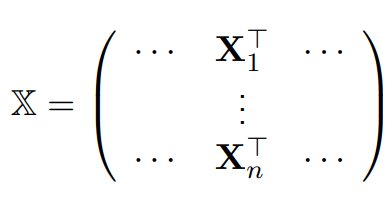
    - "a cloud of points" - e.g. if $d=2$ then we have a $n \times 2$ matrix, each of the $n$ different $X$ vectors can be plotted such that the first coordinate is on the horizontal axis and the second coordinate is on the vertical axis

Assume that $E[||X||_2^2] < \infty$.  
- (The norm is finite, which we need to assume so that the variance exists)

Mean of $X$:  
- $E[X] = (E[X^1], ..., E[X^d])^\top$
- (just taking the expectation entry-wise)
- (the center of the point cloud)

Covariance matrix of $X$: the $d \times d$ matrix $\Sigma = (\sigma_{j,k})_{j,k = 1,...,d}$, where
- $\sigma_{j,k} = cov(X^j, X^k)$
    - $cov(X^j, X^k) = E[X^j X^k] - E[X^j]E[X^k]$
- Thus it is symmetric, and on the diagonals are the variances of $X^{j=k}$
- (the spread in each direction)

Then we see that:
- $\Sigma = E[XX^\top] - E[X]E[X]^\top = E[(X - E[X])(X - E[X])^\top]$
    - (recall for univariate r.v. $x$, we write the variance as $E[(x - E[x])^2]$)
- Note, $E[XX^\top]_{j,k} = E[(XX^\top)_{j,k}] = E[X^j X^k]$  
and, $(E[X]E[X]^\top)_{j,k} = E[X]^jE[X]^k = E[X^j]E[X^k]$,  
thus: $\Sigma_{j,k} = E[X^jX^k] - E[X^j]E[X^k] = cov(X^j, X^k)$ or $var$ if $k = j$

Empirical mean for the vectors $X_1, ..., X_n$:  
- $\bar{X} = \frac{1}{n}\Sigma_{i=1}^n X_i = (\bar{X}^1, ..., \bar{X}^d)^\top$
    - itself a $d$-dimensional vector

Empirical covariance matrix: 
- $S = (s_{j,k})_{j,k=1,...,d}$ where $s_{j,k}$ is the empirical covariance of the $X_i^j, X_i^k$, for $i = 1,...,n$
- $S = \frac{1}{n} \Sigma_{i=1}^n X_i X_i^\top - \bar{X}\bar{X}^\top$  
$~~~~= \frac{1}{n} \Sigma_{i=1}^n (X_i - \bar{X})(X_i - \bar{X})^\top$

### In matrix notation
Note that we can remove the summation term by working with the full matrix $\bold{X}$, so
- $\bar{X} = \frac{1}{n} \bold{X}^\top \it{1}$, where $\it{1} = (1, ..., 1)^\top \in \R^n$
    - $\frac{1}{n} \bold{X}^\top \it{1} = \frac{1}{n} \Sigma_{i=1}^n X_i$

and
- $S = \frac{1}{n} \bold{X}^\top \bold{X} - \frac{1}{n^2} \bold{X}^\top \it{1}\it{1}^\top \bold{X}$  
$~~~~ = \frac{1}{n} \bold{X}^\top \it{H} \bold{X}$,  
where $\it{H} = \it{I}_n - \frac{1}{n} \it{1}\it{1}^\top$
    - $\it{H}$ is an orthogonal projector: $\it{H}^2 = \it{H}$ (squares to itself), $\it{H}^\top = \it{H}$ (symmetric). It takes a vector and projects onto a certain space.
        - Note, $\it{1} \it{1}^\top$ is a $n \times n$ matrix of 1's, so we can write the coordinates of $H$ exactly - An identity matrix (1s on the diagonal and 0s elsewhere) minus a matrix of all $\frac{1}{n}$'s, which yields a matrix that has $1 - \frac{1}{n}$ on the diagonals and $-\frac{1}{n}$ on the off-diagonals:  
        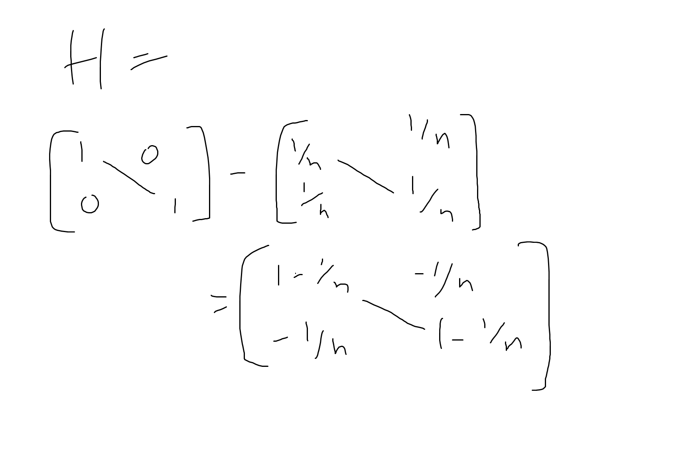
        - What are the vectors onto which this matrix is projecting?  
        Consider $H v = v - \frac{1}{n} \it{1}\it{1}^\top v = v - \frac{1}{n} (v^\top \it{1})\it{1}$,  
        but recall $\frac{1}{n} v^\top \it{1} = \bar{v}$, so we have:  
        $Hv = v - \bar{v} \it{1}$.
        Thus the projector $H$ is removing from $v$ the average of the entries of $v$ - it centers each coordinate. This means $\overline{Hv} = 0$. Thus, $H$ projects onto the subspace of vectors that has mean 0, wich means $v \perp Span(\it{1})$ (projects onto the hyperplane orthogonal to the all-1s vector)
        - Using transposition rules and orthogonal projector properties, (ignoring $1/n$) we can write $S$ as: 
        $\bold{X}^\top H \bold{X} = \bold{X}^\top H^2 \bold{X} = \bold{X} H^\top H \bold{X} = (H \bold{X})^\top (H \bold{X})$, so to get $S$ we first apply the projection matrix to remove the mean from each column, and then calculate the inner-products (and divide by n)
            - (Recall $(AB)^\top = B^\top A^\top$)
    - Proof this matrix version is equal to the non-matrix version given above:
        - For the first term, note $\bold{X}^\top$ can be broken into the sum of $n$ matrices where each matrix $M_i, i = 1, ..., n$ has column $i$ equal to $X_i^\top$ and all other columns equal to $0$.  
        Then we see that $\bold{X}^\top \bold{X}$ actually corresponds to $\Sigma_{i,j = 1}^n M_i M_j^\top$.  
        But when $i \ne j$, this matrix multiplication equals $0$ since the  non-zero elements of one matrix always get multiplied with zero-elements of the other matrix.  
        Thus, $\Sigma_{i,j = 1}^n M_i M_j^\top = \Sigma_{i=1}^n M_i M_i^\top = \Sigma_{i=1}^n X_i^\top X_i$ (since $M_i = X_i^\top$)  
        Thus, we proved the first element of the matrix version of $S$ equals the first element of the non-matrix version of $S$:  
        $\frac{1}{n} \bold{X}^\top \bold{X} = \frac{1}{n} \Sigma_{i=1}^n X_i^\top X_i$
        (see [end for matrix visualization](#proof1) )
        - For the second term, note that $\bar{X}\bar{X}^\top = \frac{1}{n^2} (\bold{X}^\top \it{1}) (\bold{X}^\top \it{1})^\top = \frac{1}{n^2}(\bold{X}^\top \it{1})(\it{1}^\top \bold{X}) = \frac{1}{n^2}\bold{X}^\top \it{1}\it{1}^\top \bold{X}$

### Some important properties of the variance
Take a vector $u \in \R^d$. If $\Sigma$ is the variance matrix of $X$, then:  
$u^\top \Sigma u$ is the variance of $u^\top X$
- $u^\top \Sigma u =  u^\top [E[XX^\top] - E[X]E[X]^\top] u$
- $u$ is deterministic, so we can push it into the expectation:  
$E[(u^\top X)(X^\top u)] - E[u^\top X]E[X^\top u]$  
$= E[(u^\top X)^2] - E[u^\top X]^2 = var(u^\top X)$

$u^\top S u$ is the sample variance of $u^\top X_1, ..., u^\top X_n$
- $u^\top S u = u^\top [\frac{1}{n} \Sigma_{i=1}^n X_i X_i^\top - \bar{X}\bar{X}^\top] u$  
$= \frac{1}{n} \Sigma_{i=1}^n u^\top X_i X_i^\top u - (u^\top \bar{X})(\bar{X} u^\top)$  
$= \frac{1}{n} \Sigma_{i=1}^n (u^\top X_i)^2 - (u^\top \bar{X})^2$,  
and $u^\top \bar{X} = \frac{1}{n} \Sigma_{i=1}^n u^\top X_i = \overline{u^\top X}$, so  
$u^\top S u = \frac{1}{n} \Sigma_{i=1}^n (u^\top X_i)^2 - (\overline{u^\top X}) = S(u^\top X_1, ..., u^\top X_n)$

### Changing the coordinate system
In particular, $u^\top \Sigma u$ measures how spread (i.e., diverse) the points are in direction $u$.  
- If we read the entries of $\Sigma$, what we see is the covariances between the coordinates of the random vector $X$.  
Coordinates, by definition, are attached to a coordinate system.  
So we know what the covariances are of these particular combinations of $X$ coordinates, but not the covariances of other things - such as the covariance between a linear combination of the coordinates - or in other directions.  
If we pre and post multiply $\Sigma$ by $u$, the result is actually telling us what the variance of $X$ is along direction $u$. 
- We are interested in variance when thinking about dimension reductions because we do not want all of our points to collapse into a single point when we project them onto a space of smaller dimensions. We want to maintain the information in our data, while still reducing the dimesnions. Variance is a sound (though not the only) way to measure spread between points. If variance is high, it is likely the points are spread, and less likely they project to the same point.

We will see that Principal Components Analysis will try to identify the directions $u$ where we have a lot of variance, and eliminate the directions on which we do not have a lot of variance.
Why?
- If $u^\top S u = 0$, the empirical variance of $u^\top S$ is 0 (so all the $u^\top X_i, ..., u^\top X_n$ points are the same), meaning all $X_i$'s are in an affine subspace orthogonal to $u$.
    - the inner-product $u^\top X$ is really telling us the distance from the origin of the orthogonal projection of $X$ onto $u$ - i.e., the coordinate of $X$ when $u$ becomes the "x-axis". (note, the coordinate is actually $\frac{u^\top X_1}{||u||}$, but we constrain $||u|| = 1$)  
    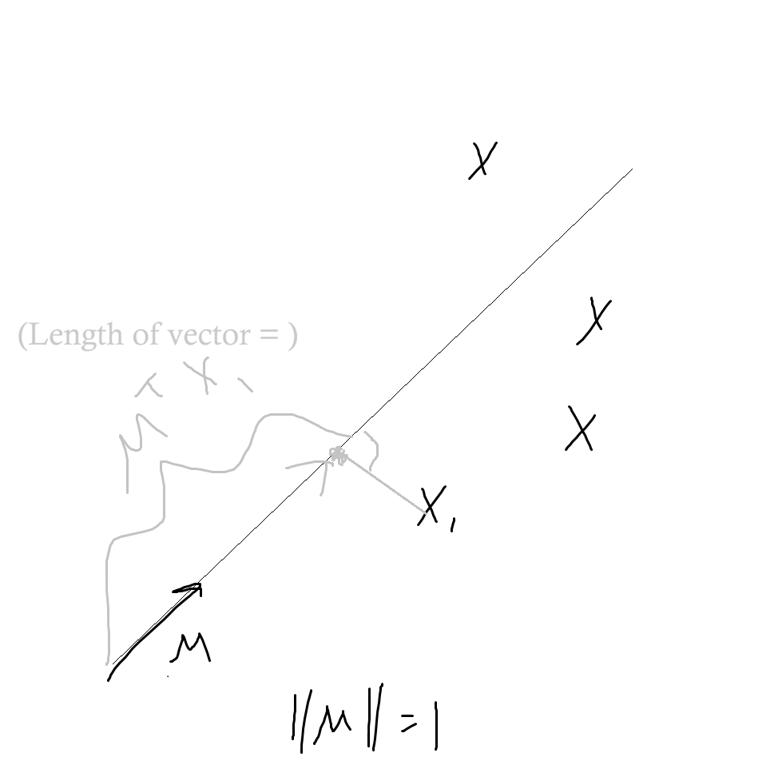
    - If the empirical variance is 0, this would require having points perfectly aligned, so that they all projected to the same point (red dot)  
   
   - In practice, this is not going to happen, but it demonstrates why more variance is better in terms of retaining information
- If $u^\top \Sigma u = 0$, then $X$ is almost surely in an affine subspace orthogonal to $u$.
    - All this says is that in the population case, there is 0 probability the points deviate from their vertical line
- If $u^\top S u$ is large with $||u||_2 = 1$, then the direction of $u$ explains well the spread (i.e., diversity) of the sample.

This implies that to perform dimensions reduction we should look in every direction and find the direction $u$ that maximizes the empirical variance $u^\top S u$. This is the basic motivation for PCA.
- $\max_{u} u^\top S u$, with constraint $||u||_2 = 1$
- Note: we can't look at all $u \in \R^d$, because then the maximum is guaranteed to be $\infty$. We need to constrain $u$, and it is convenient for thinking about coord. systems if its euclidean norm = 1. 

### Simplifying the problem: Spectral Decomposition
> We've framed the problem of dimension reductions as an optimization problem, but it it is actually a very difficult problem to optimize (non-convex optimization is NP hard) - it is a non-convex maximization problem, so it is clear the maximum will be obtained at the boundary.  
But the variance, out of any measure of spread, is chosen as the function to maximize because its properties help us. As a result, the solution to the non-convex maximization problem comes entirely from linear algebra.

In particular, $\Sigma$ and $S$ are symmetric, positive semi-definite.  

Any real symmetric matrix $A \in \R^{d \times d}$ has the decomposition:  
$$
A = PDP^\top
$$  
where:  
- $P$ is a $d \times d$ orthogonal matrix, i.e., $PP^\top = P^\top P = I_d$;
- $D$ is a $d \times d$ diagonal matrix

The diagonal elements of $D$ are the **eigenvalues** of $A$
- The diagonals of $D$ are $\lambda_1, ..., \lambda_d$, the eigenvalues of $A$, which can take any number in $\R$ in general, but if $A$ is positive semi-definite they are nonnegative.
    - Positive semi-definite means that $u^\top A u \ge 0$
    - We know this must be true for $\Sigma$ and $S$ since they are covariance matrixes, and we showed previously that $u^\top \Sigma u$ is the variance of $u^\top \Sigma$, etc., and variances $\ge 0$
    - Additionally, $A$ is a semi-definite positive iff all its eigenvalues are nonnegative.

The columns of $P$ ($v_1, ..., v_d$) are the corresponding **eigenvectors** of $A$.
- $v_i^\top v_j = 0$ if $i \ne j$ and $v_i^\top v_j = 1$ if $i = j$
- $v_1$'s corresponding eigenvalue is $\lambda_1$, etc...

Consider $\Sigma = P D P^\top$
- Imagine looking at the contours of a bivariate normal distribution.  
- It turns out that $\Sigma$ tells us in which direction the ellipes are elongated.  
- In particular, if we look at the major axis and minor axis of the ellipse, this is the new coordinate system that $P$ is transforming $D$ into. The entries on $D$'s diagonal (the eigenvalues) are exactly equal to the lengths of the major and minor axes.
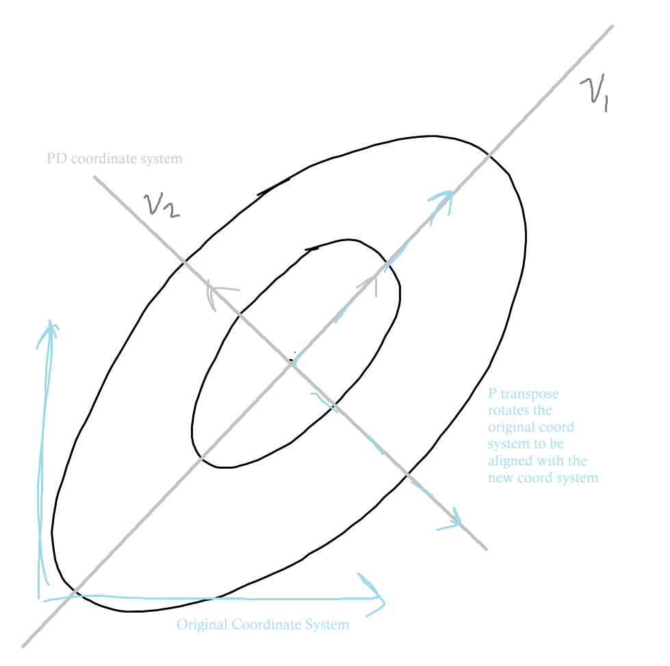
- In general, applying any symmetric matrix to a vector has the effect of transforming it by: rotating it (changing its coordinate system) and dilating it in some way (distorting it) and then rotating it back. This is the **spectral decomposition** from the spectral theorem.

Consider $\Sigma v_1 = P D P^\top v_1$, where $v_1$ is the first eigenvector in $P$.  
Then we can show that $\Sigma v_1 = \lambda_1 v_1$ - i.e., when we multiply some matrix by the eigenvector we get the eigenvector back but scaled by some value (the eigenvalue), which matches the definition of eigenvectors/values. Working backwards:
- the rows of $P^\top$ are the eigenvectors $v_1,...,v_d$,  
so when we multiply $P^\top v_1$,  
we get $v_1^\top v_1 = 1$ as the first coordinate in the output ($i = j$) and 0 for all other coordinates ($i \ne j$), i.e., $(1, 0, ..., 0)^\top$
- then we add in $D$, so we're multiplying $D P^\top v_1$:  
we're multiplying the first coordinate by $\lambda_1$, the second by $\lambda_2$, etc., but only the first coordinate is non-zero so the output becomes $(\lambda_1, 0,...,0)^\top$
- now add in $P$, for the full transformation $P D P^\top v_1$:  
$P$ has columns $v_1, ..., v_d$, the eigenvectors. So we multiply $v_1$ by $\lambda_1$ and the rest of the $v_i$'s by $0$, so we are ultimately computing $v_1 \lambda_1$

In particular, if we consider $v_j^\top \Sigma v_j = \lambda_j v_j^\top v_j = \lambda_j$,  
then we can see that if we look at the variance along (in the direction of) each of the $v_j$, the variance is exactly given by the eigenvalues.
- i.e., the variance in the direction of the eigenvectors is equal to the eigenvalues.

**Key point:**
Recall, we are looking for the direction that maximizes the variance, and we were looking in all directions - in the directions of the eigenvectors and every vector in-between.  
If we were to look only at the eigenvectors, we would end up picking the eigenvector $v_j$ associated with the largest eigenvalue $\lambda_j$.  
It turns out this is also true for *any* vector - the maximum direction is one which is among the eigenvectors, and among the eigenvectors we know that the maximum variance corresponds to the largest eigenvalue.  
This is what PCA will attempt to find for us.

## Principal Components Analysis: Heuristics
> Recall from above that $S$ is the empirical variance and $u^\top S u$ is the empirical variance of $u^\top S$, i.e., the empirical variance of $S$ in the direction $u$.
Thus, if $u^\top S u$ is large with $||u||_2 = 1$, then the direction of $u$ explains well the spread of the sample.
This implies that if we want to reduce dimensions while keeping as much information as possible, we should look in every direction and find the direction $u$ that maximizes the empirical variance $u^\top S u$. This is the basic motivation for PCA.
$\max_{u} u^\top S u$ (with constraint $||u||_2 = 1$).  
But the spectral decomposition shows us that the direction that maximizes the variance will be among the eigenvectors of $S$, which reduces the search space. Further, the variance in the direction of an eigenvector is equal to the corresponding eigenvalue, so this simplifies the problem to finding the largest eigenvalue.

The sample $X_1, ..., X_n$ makes a cloud of points in $\R^d$.  
In practice, if $d$ is large ($d > 3$), it becomes impossible to represent the cloud on a picture.  
**Question:** Is it possible to project the cloud onto a linear subspace of dimension $d' < d$ while keeping as much information as possible (i.e., the points don't all collide)?   
**Answer:** PCA does this by keeping as much covariance structure as possible by keeping orthogonal directions that discriminate well the points of the cloud.  
- In particular, those directions we pick are going to be a subset of the $v_j$'s that are associated with the largest eigenvalues.

**Idea:** write $S = PDP^\top$, where:
- $P = (v_1, ..., v_d)$ is a $d \times d$ orthogonal matrix (i.e., $||v_j||  =1$, $v_j^\top v_k = 0, \forall j \ne k$) whose columns are the eigenvectors of $S$.  
- $D$ is a $d \times d$ diagonal matrix of eigenvalues, i.e., the diagonal $D_{j,j} = \lambda_j, ~~ j = 1,...,d$,  
where $\lambda_1 \ge ... \ge \lambda_d \ge 0$ (without loss of generality)
    - Note that we can assume $\lambda_1 \ge ...$ because the decomposition of $S$ is not unique - we could permute the columns of $P$ and we would still have an orthogonal matrix, but we would also need to permute the eigenvalues in the diagonal of $D$. The set of eigenvalues is unique, but not the ordering, so for convenience we can arrange the decomposition this way.
- Note that $D$ is the empirical covariance matrix of the $P^\top X_i$'s, $i = 1,...,n$. Proof:
    - Say $Y_i = P^\top X_i$, assume that $\bar{X} = 0$,  
    so $\bar{Y}= \overline{P^\top X} = P \bar{X} = 0$  
    ($X$ is already centered so $Y$ is too and we can ignore the means in the covariance formula), 
    - Then $S(Y_1,...,Y_n) = \frac{1}{n}\Sigma_{i=1}^n Y_i Y_i^\top$  
    $\Rightarrow S = \frac{1}{n}\Sigma_{i=1}^n P^\top X_i (P^\top X_i)^\top = \frac{1}{n} \Sigma_{i=1}^n P^\top X_i X_i^\top P$   
    $~~~~~~~~~ = P^\top \frac{1}{n}\Sigma_{i=1}^n  X_i X_i^\top P$  
    $~~~~~~~~~ = P^\top S P$
    - Since $S = P D P^\top$, then $P^\top SP = P(P^\top DP)P^\top = D$
    - Thus $Cov(Y^{(j)}, Y^{(k)}) = 0$ if $j \ne k$ and $= \lambda_j$ if $j=k$

In particular, we showed that $\lambda_1$ is the empirical variance of the $v_1^\top X_i$'s, $\lambda_2$ is the empirical variance of the $v_2^\top X_i$'s, etc...
- $\lambda_1 = \hat{var}((P^\top X_i)^{(1)})$ (the first coordinate of the vector of variances)  
$= \hat{var}(v_1^\top X_i)$  (recall $P = (v_1, ..., v_d)$)
- Recall that if $v_1$ is a unit vector than the inner product between $X_i$ and $v_1$, $v_1^\top X_i$ is the length of $X_i$ when projected onto the direction spanned by $v_1$  
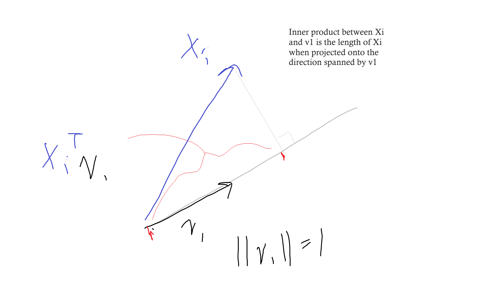
- So if we have some high dimensional problem and decide to look in some direction $v_j$, then if we want to find a low-dimensional projection we have to understand how the $X_i$'s project onto the line spanned by $v_j$ since that is all the information we will be keeping about the $X_i$'s. Thus we look at the variance of the inner product between the $X_i$'s and the direction $v_j$ (and we *want* directions with a lot of variance)

- Also, since $P^\top P = I$ (since $P$ orthogonal), then $v_j^\top v_j = ||v_j||_2^2 = 1$, and $v_j^\top v_k = 0$ if $j \ne k$  
i.e., the eigenvectors are all orthogonal to each other and all of norm 1.

So each $\lambda_j$ measures the spread of the cloud in the direction $v_j$.  

In particular, $v_1$ is the direction of maximal spread (follows from $\lambda_1$ being largest eigenvalue/variance).  

Indeed, $v_1$ maximizes the empirical covariance of $a^\top X_1, ..., a^\top X_n$, over $a \in \R^d$ such that $||a||_2 = 1$.  
Proof - For any unit vector $a$ show that:  
$a^\top \Sigma a = (P^\top a)^\top D (P^\top a) \le \lambda_1$, with equality if $a = v_1$  
(also works for $S$ - expectations are averages):   
- Claim 1: for any direction $u \in \R^d$ ($||u||=1$), the variance of $u^\top X_1, ..., u^\top X_n$ is maximized for $u = v_1$, where $v_1$ is the eigenvector associated with the largest eigenvalue $\lambda_1$ of $X$  
- Claim 2: For any random variable $X$, the variance of $u^\top X$ is maximized for $u = w_1$ where $w_1$ is the eigenvector of $\Sigma$ associated with the largest eigenvalue of $\Sigma$.
- Assume $E[X] = 0$, then $var(u^\top X) = E[(u^\top X)^2] = E[u^\top X X^\top u] = u^\top E[XX^\top] u = u^\top \Sigma u$
- Write $\Sigma = PDP^\top$ (eigen decomposition), then  
$u^\top \Sigma u = (P^\top u)^\top D (P^\top u)$
- Say $P^\top u = b \in \R^d$,  
then $u^\top \Sigma u = b^\top D b = \Sigma_{j=1}^d \lambda_j b_j^2 \le \lambda_1 \Sigma_{j=1}^d b_j^2$ (since the largest $\lambda_j$ is $\lambda_1$ and all $b_j$ are nonnegative) $= \lambda_1 ||b||^2$
- So all we need to check is if the squared norm of $b$ is at most 1:    
$||b||^2 = ||P^\top u ||^2 = u^\top P P^\top u$, but $P$ is orthogonal so $= u^\top u = ||u^2|| = 1$,  
and thus $\lambda_1 ||b||^2 = \lambda_1$.
- This implies that for every $u$ that we pick, $u^\top \Sigma u$ is at most $\lambda_1$ (or $u^\top S u \le \lambda_1$), which implies the variance (or empirical variance) is at most $\lambda_1$
- Further, if $u = v_1$, then for $u^\top \Sigma u = \Sigma_{j=1}^d \lambda_j b_j^2$, $b_1 = 1$ and all other $b_j = 0$ (since $b = P^\top v_1$ and $v_j^\top v_k = 1$ iff $j=k$), so $u^\top \Sigma u = \lambda_1$.  
- Thus, the variance (or empirical variance) is maximized in the direction $v_1$

Recap:  
- We can decompose our empirical covariance matrix into $S = PDP^\top$
- Then if we permute $P$ and $D$ such that $P$'s first column, the eigenvector $v_1$, corresponds to the largest eigenvalue, $\lambda_1$, in $D$'s diagonal, then **$v_1$ is the direction on which if I project my points they are going to carry the most empirical variance.**
- So if we want one principal component, the result of PCA will be $v_1$. If we want 2, the result will be $v_2$, etc.

## Prinicpal Components Analysis: Core Idea

**Idea of the PCA:** find the collection of orthogonal directions in which the point cloud is much spread out.  

**Theorem**  
$$
v_1 \in argmax_{||u||=1} u^\top S u \\
v_2 \in argmax_{||u||=1, u \perp v_1} u^\top S u \\
... \\
v_2 \in argmax_{||u||=1, u \perp v_j ~\forall j} ~~ u^\top S u \\
$$
- start by picking the direction which maximizes the empirical variance
- then pick the direction which maximizes the conditions: maximizes empirical variance while also orthogonal to all of the previously picked directions
- this is exactly equivalent to picking the eigenvectors, descending from highest eigenvalue to lowest eigenvalue

Hence, the $k$ orthogonal directions in which the cloud is the most spread out corresponds exactly to the eigenvectors associated with the $k$ largest values of $S$.  
**These are the $k$ principal components.**

PCA combines three core ideas:
- *Statistics* tells us that if we want to maximize the information kept in our lower dimensional representation, we should be looking at spread - at variance.
- *Optimization* tells us that if we want to maximize spread, we need to maximize variance in a certain direction, which requires maximizing over the sphere of vectors that have unit norm
- *Linear algebra* gives us an easy way to solve the otherwise difficult optimization problem.

## Algorithm
1. Input $X_1, ..., X_n$: cloud of $n$ points in dimension $d$.
1. Compute the empirical covariance matrix $S$ ($d \times d$).
1. Compute the decomposition $S = PDP^\top$, where $D = diag(\lambda_1, ..., \lambda_d)$ with $\lambda_1 \ge \lambda_2, ..., \ge \lambda_d$ and $P = (v_1, ..., v_d)$ is an orthogonal matrix.
    - Diagonalizing the matrix will give us the eigenvectors and eigenvalues. Computing the $k$ largest eigenvalues will take about $kd^2$ operations. This tells us the order we should be taking the columns of $P$, which is what really need to transform the data...
1. Choose $k < d$ and set $P_k = (v_1, ..., v_k) \in \R^{d \times k}$
1. Output $Y_1, ..., Y_n$, where:  
$$
Y_i = P_k^\top X_i ~~ \in R^k, i = 1,...,n
$$
    - This is a simple way to project onto the linear span of the $v_1, ..., v_k$ columns. $P_k^\top$ is the $k \times d$ matrix where the rows are $v_1, ..., v_k$, so when we multiply with $X_i$, we get a $k$-dim vector

**How to choose $k$?**
Relatively arbitrary methods...
- Experimental rule: take $k$ where there is an inflection point in the sequence $\lambda_1, ..., \lambda_d$ (scree plot).  
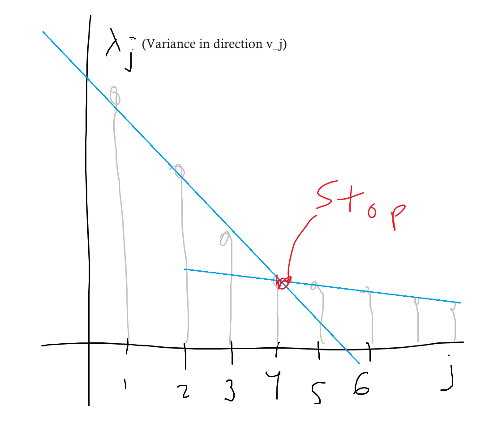
    - Once the marginal increment in explained variance stops decreasing a lot...
- Related: define a criterion: take $k$ such that:  
$\frac{\lambda_1 + ... + \lambda_k}{\lambda_1 + ... + \lambda_d} \ge 1 - \alpha$  
for some $\alpha \in (0,1)$ that determines the approximation error that the practitioner wants to achieve
    - $\lambda_1 + ... + \lambda_k$ corresponds to the variance explained by the PCA and $\lambda_1 + ... + \lambda_d$ is the total variance ($Trace(S)$), so this is the **proportion of explained variance.**  
    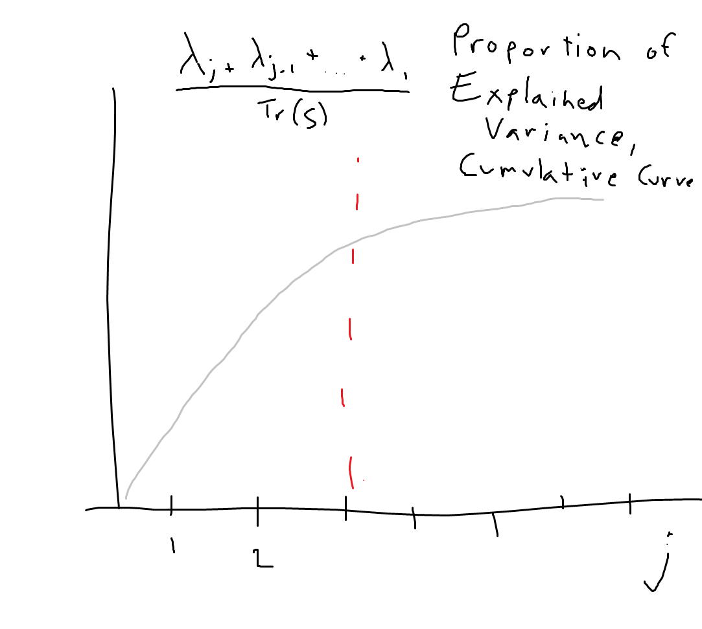

- Data Visualization: take $k = 2$ or $3$

Why use PCA other than visualization?
- Once we have compute the PCA, we have effectively reduced the dimension of our problem while (ideally) maintaining as much information as possible - a summary or compression of our $X_i$'s.
- We could then use these principal components for regression, for example (principal component regression).

## Beyond Computation of PCA
PCA is an algorithm that reduces the dimension of a cloud of points and keeps its covariance structure as much as possible.  

In practice, the algorithm is used for clouds of points that are not necessarily random.  

In statistics, PCA can be used for estimation:  
If $X_1, ..., X_n$ are iid random vectors in $\R^d$, how to estimate their population covariance $\Sigma$ ?
How do the results of PCA on the empirical covariance matrix $S$ relate to those of PCA on the theoretical $\Sigma$?
- For a fixed $d$, as $n \to \infty$ each entry of $S$ converges to the corresponding entry in $\Sigma$ - empirical covariance matrix is a consistent estimator.

But if $d$ is much larger than $n$, it is not clear what happens:
- if $d/n \to constant$: in random matrix theory, they often study the behavior of matrices as $n$ and $d$ go to $\infty$, but looking specifically at $n/d \to constant$ (ratio remains constant). When this happens, one can essentially show that there exists an explicit angle between the largest eigenvector of $\Sigma$ and the largest eigenvector of $S$ (that is a function of the constant). Adjustments are needed to overcome biases.
- Say $\frac{d}{n} \to \gamma$  
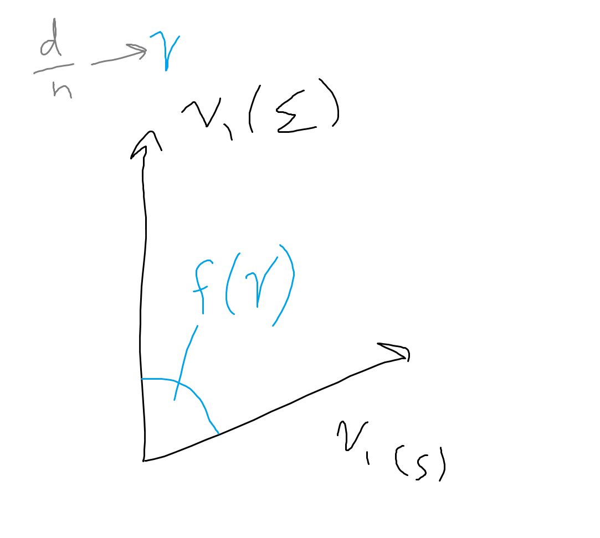  
When $\gamma \to \infty$ (so $d$ much larger than $n$), this angle is 90 degrees - so the estimate of the leading eigenvector is completely incorrect.

To overcome this, we have to make additional assumptions - instead of looking specifically for the leading eigenvector / direction that carries the most variance, looking for some "special" direction:  
Sparse PCA
- Instead of looking for a direction $u$ that carries the most variance, look for a direction that is sparse -a direction with only $s$ nonzero coordinates out of some large $d$.  
- This effectively replaces $d$ by $s$, so $n$ only has to be larger than $s$ for PCA to be unbiased.
- This is a weaker goal, but still valuable because sparse directions are interpretable.  
    - Consider the $d = 2$ principal components. From the coordinates of $v_1$ (recall, eigenvector of $S$ with largest eigenvaleu) we can tell the direction of $v_1$ (although, not up to the sign). If the first coordinate is small and the second is large then $v_1$ is very close to to the basis vector $e_1 = (0, 1)^\top$ of the original coordinate system, which means $e_1$ *is* the variable that is very important ($X^1$). Sort of like feature selection.
    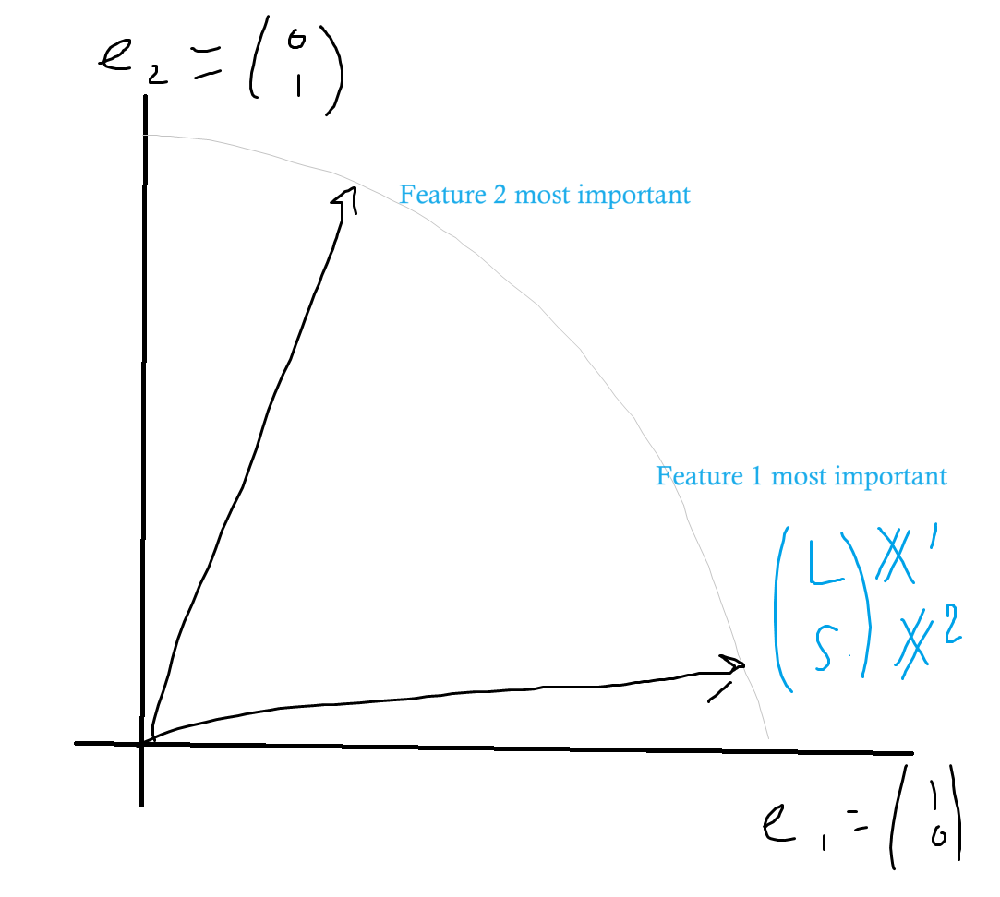
- $max_{||u|| = 1, \Sigma_{j=1}^d 1(u_j \ne 0) \le s}(u^\top S u)$
    - the second constraint - that the number of nonzero elements in $u$ is $s$ - is nonconvex. Now we can't rely on linear algebra to find the optimum and have to rely on other, harder optimization techniques that don't always scale well in high dimensions.

It may be known beforehand that $\Sigma$ has (almost) low rank.  
Then run PCA on $S$: Write $S \approx S'$, where:  
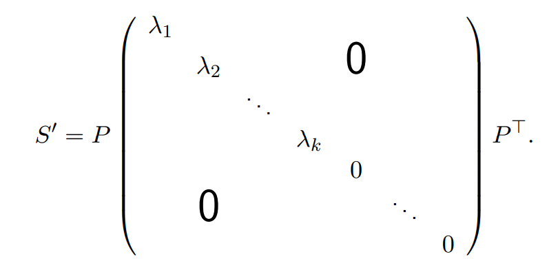

$S'$ will be a better estimator of $S$ under the low-rank assumption.
- common with network data - adjacency matrix may be sparse

---

Proof that $\bold{X}^\top \bold{X} = \Sigma_{i=1}^n X_i X_i^\top$  
([Reference.](#go-proof1))
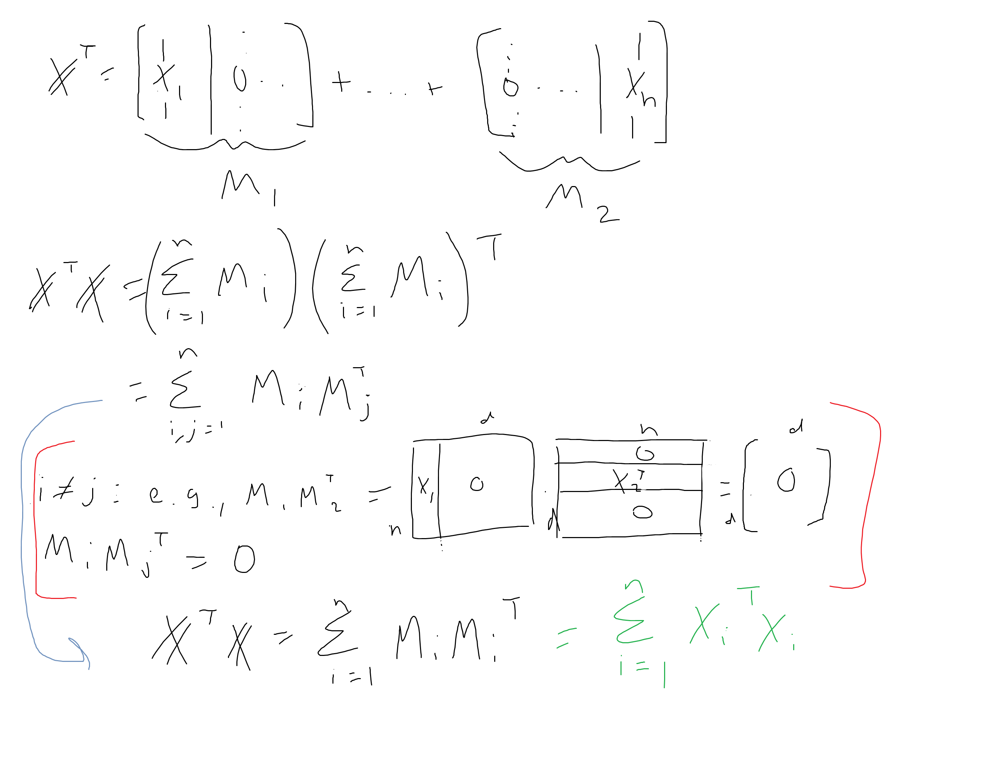